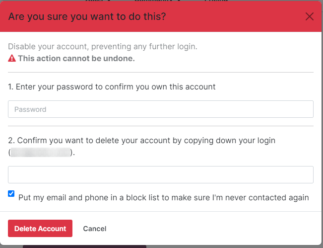

# Tài khoản Odoo.com

Tài liệu này được viết riêng cho các chỉnh sửa được thực hiện trên tài khoản Odoo.com. Các quy trình sau đây mô tả cách xóa tài khoản Odoo.com và cách thay đổi mật khẩu trên tài khoản Odoo.com.

## Xoá tài khoản Odoo.com

Để xóa tài khoản Odoo.com, hãy bắt đầu bằng cách nhấp vào biểu tượng hồ sơ ở góc trên bên phải (được biểu thị bằng tên người dùng và biểu tượng) để hiển thị menu thả xuống. Từ menu thả xuống, chọn Tài khoản Odoo.com của tôi để truy cập cổng thông tin người dùng.

Từ cổng thông tin người dùng, bạn có thể truy cập tùy chọn xóa bằng cách vào Tài khoản của tôi ‣ Chỉnh sửa cài đặt bảo mật ‣ Xoá tài khoản. Bạn cũng có thể truy cập bằng cách vào [https://www.odoo.com/my/home](https://www.odoo.com/my/home).

Khi nhấp vào nút Xóa tài khoản, một cửa sổ bật lên sẽ xuất hiện để yêu cầu xác nhận việc xóa tài khoản.

Để xác nhận xóa tài khoản, hãy nhập Mật khẩu và Thông tin đăng nhập của tài khoản đang bị xóa. Sau đó, nhấp vào nút Xóa tài khoản để xác nhận.

## thay đổi mật khẩu tài khoản Odoo.com

Để thay đổi mật khẩu tài khoản Odoo.com, trước tiên hãy đăng nhập vào tài khoản người dùng Odoo.com từ trang đăng nhập Odoo.com. Sau khi đăng nhập, đi đến góc trên bên phải màn hình và nhấp vào biểu tượng ▼ (mũi tên hướng xuống) cạnh biểu tượng hồ sơ. Sau đó, chọn Tài khoản của tôi và trang chủ cổng thông tin sẽ xuất hiện.

Để thay đổi mật khẩu Odoo.com, nhấp vào liên kết Chỉnh sửa cài đặt bảo mật, dưới phần Bảo mật tài khoản. Tiếp theo, thực hiện các thay đổi cần thiết bằng cách nhập Mật khẩu hiện tại, Mật khẩu mới và xác minh mật khẩu mới. Cuối cùng, nhấp vào Thay đổi mật khẩu để hoàn tất việc thay đổi mật khẩu.

#### NOTE
Nếu khách hàng muốn thay đổi thông tin đăng nhập, hãy liên hệ với bộ phận hỗ trợ của Odoo [tại đây](https://www.odoo.com/help).

#### NOTE
Mật khẩu dùng cho người dùng Odoo.com và người dùng cổng thông tin vẫn khác nhau, ngay cả khi sử dụng cùng một địa chỉ email.

## Thêm xác thực hai yếu tố

Để thêm xác thực hai yếu tố, hãy đăng nhập vào tài khoản người dùng Odoo.com từ trang đăng nhập Odoo.com. Sau khi đăng nhập, đi đến góc trên bên phải màn hình và nhấp vào biểu tượng ▼ (mũi tên hướng xuống) cạnh biểu tượng hồ sơ. Sau đó, chọn Tài khoản của tôi và trang chủ cổng thông tin sẽ xuất hiện.

Nếu người dùng muốn bật xác thực hai yếu tố (2FA) khi truy cập Odoo.com, nhấp vào liên kết Chỉnh sửa cài đặt bảo mật dưới phần Bảo mật tài khoản.

Nhấp vào Bật xác thực hai yếu tố để bật . Sau đó, xác nhận mật khẩu hiện tại trong trường Mật khẩu. Tiếp theo, nhấp vào Xác nhận mật khẩu. Sau đó, kích hoạt  trong ứng dụng  (Google Authenticator, Authy,...), bằng cách quét mã QR hoặc nhập Mã xác minh.

Cuối cùng, nhấp vào Bật xác thực hai yếu tố để hoàn tất thiết lập.

#### NOTE
Trong Tài khoản của tôi, người dùng Odoo.com cũng có thể truy cập các phần sau:

- Trang chủ Đối tác của tôi
- Dịch vụ trong ứng dụng của tôi
- Trang chủ Ứng dụng của tôi
