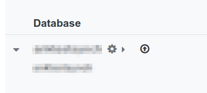
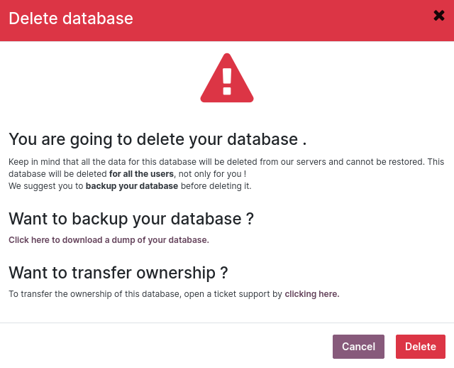
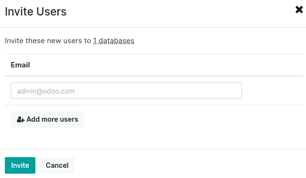

# Odoo Online

[Odoo Online](https://www.odoo.com/trial) cung cấp cơ sở dữ liệu riêng được Odoo quản lý và lưu trữ hoàn toàn. Nó có thể được sử dụng để production lâu dài hoặc để kiểm thử Odoo kỹ lưỡng, bao gồm các tùy chỉnh không yêu cầu mã.

#### NOTE
Odoo Online không tương thích với các phân hệ tùy chỉnh hay Cửa hàng ứng dụng Odoo.

Cơ sở dữ liệu Odoo Online được truy cập bằng bất kỳ trình duyệt web nào và không yêu cầu cài đặt cục bộ.

Để dùng thử Odoo một cách nhanh chóng, Odoo cung cấp các phiên bản [demo](https://demo.odoo.com) được chia sẻ. Bạn không cần đăng ký, nhưng mỗi phiên bản chỉ tồn tại trong vài giờ.

## Quản lý cơ sở dữ liệu

Để quản lý cơ sở dữ liệu, hãy truy cập [trình quản lý cơ sở dữ liệu](https://www.odoo.com/my/databases) và đăng nhập với tư cách quản trị viên cơ sở dữ liệu.

Tất cả tùy chọn quản lý cơ sở dữ liệu chính đều có sẵn khi nhấp vào tên cơ sở dữ liệu, ngoại trừ tùy chọn nâng cấp, có thể truy cập được bằng cách nhấp vào biểu tượng **mũi tên trong vòng tròn** cạnh tên cơ sở dữ liệu. Tuỳ chọn này chỉ được hiển thị nếu có bản nâng cấp.


- [Nâng cấp](#odoo-online-upgrade)
- [Nhân bản](#odoo-online-duplicate)
- [Đổi tên](#odoo-online-rename)
- [Tải xuống](#odoo-online-download)
- [Tên miền](#odoo-online-domains)
- [Thẻ](#odoo-online-tags)
- [Xoá](#odoo-online-delete)
- [Liên hệ](#odoo-online-contact-support)
- [Mời/gỡ bỏ người dùng](#odoo-online-users)
- [Web Services](#odoo-online-web-services)

<a id="odoo-online-upgrade"></a>

## Nâng cấp

Kích hoạt bản nâng cấp cơ sở dữ liệu.

#### SEE ALSO
Để tìm hiểu thêm thông tin về quy trình nâng cấp, hãy tham khảo [Tài liệu nâng cấp Odoo Online](upgrade.md#upgrade-request-test).

<a id="odoo-online-duplicate"></a>

## Nhân bản

Tạo bản sao chính xác của cơ sở dữ liệu, có thể được sử dụng để tiến hành kiểm thử mà không ảnh hưởng đến hoạt động hàng ngày.

#### IMPORTANT
- Khi chọn Để kiểm thử, tất cả các tác vụ bên ngoài (email, thanh toán, lệnh giao hàng,...) đều bị tắt theo mặc định trên bản sao cơ sở dữ liệu.
- Bản sao cơ sở dữ liệu sẽ tự động hết hạn sau 15 ngày.
- Có thể tạo tối đa năm bản sao cho mỗi cơ sở dữ liệu. Trong những trường hợp đặc biệt, hãy liên hệ với [bộ phận hỗ trợ](https://www.odoo.com/help) để tăng giới hạn.

<a id="odoo-online-rename"></a>

## Đổi tên

Đổi tên cơ sở dữ liệu và URL của nó.

<a id="odoo-online-download"></a>

## Tải xuống

Tải xuống tệp ZIP chứa bản sao lưu cơ sở dữ liệu.

#### NOTE
Cơ sở dữ liệu được sao lưu hàng ngày theo [SLA Lưu trữ trên Odoo Đám mây](https://www.odoo.com/cloud-sla).

<a id="odoo-online-domains"></a>

## Tên miền

Sử dụng [tên miền](../applications/websites/website/configuration/domain_names.md) tùy chỉnh để truy cập cơ sở dữ liệu thông qua một URL khác.

<a id="odoo-online-tags"></a>

## Thẻ

Thêm thẻ để dễ dàng xác định và sắp xếp cơ sở dữ liệu của bạn.

<a id="odoo-online-delete"></a>

## Xoá

Xóa cơ sở dữ liệu ngay lập tức.

Đọc kỹ nội dung cảnh báo và chỉ tiếp tục nếu bạn đã hiểu rõ ý nghĩa của việc xóa cơ sở dữ liệu.



#### NOTE
- Chỉ quản trị viên mới có thể xóa cơ sở dữ liệu.
- Tên cơ sở dữ liệu ngay lập tức hiển thị cho mọi người dùng.
- Không thể xóa cơ sở dữ liệu nếu cơ sở dữ liệu này đã hết hạn hoặc được liên kết với một gói đăng ký. Trong trường hợp đó, hãy liên hệ với [Bộ phận Hỗ trợ của Odoo](https://www.odoo.com/help).

<a id="odoo-online-contact-support"></a>

## Liên hệ

Truy cập [trang hỗ trợ Odoo.com](https://www.odoo.com/help) với thông tin cơ sở dữ liệu đã được điền sẵn.

<a id="odoo-online-users"></a>

## Mời/gỡ bỏ người dùng

Để mời người dùng, điền địa chỉ email của người dùng mới và nhấp vào Mời. Để thêm nhiều người dùng, nhấp vào Thêm nhiều người dùng.



Để gỡ bỏ người dùng, chọn họ và nhấp vào Gỡ bỏ.

#### SEE ALSO
- [Người dùng](../applications/general/users/)
- [Tài khoản Odoo.com](odoo_accounts.md)

<a id="odoo-online-web-services"></a>

## Web Services

In order to programmatically retrieve the list of the databases displayed in the
[database manager](https://www.odoo.com/my/databases), call the method `list` of the model
`odoo.database` via a [Web Service](../developer/howtos/web_services.md) call.

Inspired from the examples provided in the [Web Services](../developer/howtos/web_services.md)
section, this is how to retrieve this list with the library `xmlrpc.client`:

```default
import xmlrpc.client

USER = 'user@domain.tld'
APIKEY = 'your_apikey'

root = 'https://www.odoo.com/xmlrpc/'
uid = xmlrpc.client.ServerProxy(root + 'common').login('openerp', USER, APIKEY)
sock = xmlrpc.client.ServerProxy(root + 'object')
databases_list = sock.execute('openerp', uid, APIKEY, 'odoo.database', 'list')
```

And here is the equivalent example with JSON-RPC:

```default
import json
import random
import urllib.request

USER = 'user@domain.tld'
APIKEY = 'your_apikey'

def json_rpc(url, method, params):
    data = {
        'jsonrpc': '2.0',
        'method': method,
        'params': params,
        'id': random.randint(0, 1000000000),
    }
    req = urllib.request.Request(url=url, data=json.dumps(data).encode(), headers={
        "Content-Type": "application/json",
    })
    reply = json.loads(urllib.request.urlopen(req).read().decode('UTF-8'))
    if reply.get('error'):
        raise Exception(reply['error'])
    return reply['result']

def call(url, service, method, *args):
    return json_rpc(url, 'call', {'service': service, 'method': method, 'args': args})

url = 'https://www.odoo.com/jsonrpc'
uid = call(url, 'common', 'login', 'openerp', USER, APIKEY)
databases_list = call(url, 'object', 'execute', 'openerp', uid, APIKEY, 'odoo.database', 'list')
```
