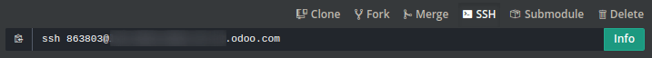

# Nhánh

## Tổng quan

Chế độ xem nhánh cung cấp cho bạn cái nhìn tổng quan về các nhánh khác nhau có trong kho lưu trữ của bạn.


<a id="odoosh-gettingstarted-branches-stages"></a>

## Giai đoạn

Odoo.sh cung cấp ba giai đoạn khác nhau cho nhánh của bạn: production, staging và phát triển.

Bạn có thể thay đổi giai đoạn của một nhánh bằng cách kéo và thả nó vào tiêu đề của phần giai đoạn.


<a id="stage-production"></a>

### Hoạt động thực tế

Đây là nhánh chứa mã mà cơ sở dữ liệu production của bạn chạy. Chỉ có thể có một nhánh production.

Khi bạn triển khai một commit mới trong nhánh này, máy chủ production của bạn sẽ được cập nhật với mã của bản sửa đổi mới và sau đó được khởi động lại.

Nếu các thay đổi của bạn yêu cầu cập nhật phân hệ, chẳng hạn như thay đổi trong chế độ xem biểu mẫu và bạn muốn nó được thực hiện tự động, hãy tăng số phiên bản của phân hệ trong tệp kê khai của nó ( *\_\_manifest_\_.py*). Sau đó, nền tảng sẽ đảm nhiệm việc thực hiện cập nhật, trong thời gian đó phiên bản sẽ tạm thời không khả dụng vì lý do bảo trì.

Phương pháp này giống với việc nâng cấp phân hệ qua menu Ứng dụng hoặc qua `-u` chuyển đổi [dòng lệnh](developer/reference/cli.md).

Trong trường hợp những thay đổi trong commit ngăn máy chủ khởi động lại hoặc nếu cập nhật phân hệ không thành công, máy chủ sẽ tự động được hoàn nguyên về bản sửa đổi mã thành công trước đó và cơ sở dữ liệu sẽ được khôi phục như trước khi cập nhật. Bạn vẫn có quyền truy cập vào nhật ký của bản cập nhật không thành công để có thể khắc phục sự cố.

Dữ liệu demo không được tải vì không được sử dụng trong cơ sở dữ liệu production. Các bản kiểm thử đơn vị không được thực hiện vì chúng sẽ làm tăng thời gian ngừng hoạt động của cơ sở dữ liệu production trong quá trình cập nhật.

Các đối tác sử dụng dự án thử nghiệm cần biết rằng nhánh production cũng như tất cả nhánh staging sẽ tự động được đưa trở lại giai đoạn phát triển sau 30 ngày.

### Staging

Nhánh staging nhằm mục đích kiểm tra các tính năng mới của bạn bằng cách sử dụng dữ liệu production mà không ảnh hưởng đến cơ sở dữ liệu production chứa tập dữ liệu được kiểm thử. Chúng sẽ tạo ra các bản sao bị vô hiệu hoá một phần của cơ sở dữ liệu production.

Việc vô hiệu hoá bao gồm:

* Vô hiệu hóa các tác vụ đã lên lịch. Nếu muốn kiểm thử chúng, bạn có thể kích hoạt tác vụ theo cách thủ công hoặc bật lại. Xin lưu ý rằng nền tảng sẽ giảm tần suất kích hoạt các tác vụ này nếu không có ai sử dụng cơ sở dữ liệu để tiết kiệm tài nguyên.
* Vô hiệu hóa thư đi bằng cách chặn chúng bằng công cụ nhận thư. Một [giao diện để xem](#odoosh-gettingstarted-branches-tabs-mails) các email được cơ sở dữ liệu của bạn gửi đi sẽ được cung cấp. Như vậy, bạn không cần lo lắng về việc gửi email kiểm thử đến các liên hệ của mình.
* Đặt nhà cung cấp dịch vụ thanh toán và nhà cung cấp dịch vụ vận chuyển ở chế độ kiểm thử.
* Vô hiệu hóa dịch vụ IAP

Cơ sở dữ liệu mới nhất sẽ được duy trì vô thời hạn, những cơ sở dữ liệu cũ hơn từ cùng nhánh có thể được đưa vào thùng rác để nhường chỗ cho cơ sở dữ liệu mới. Nó sẽ có hiệu lực trong 3 tháng, sau đó bạn sẽ phải tạo lại nhánh. Nếu bạn thực hiện các thay đổi về cấu hình hoặc chế độ xem trong các cơ sở dữ liệu này, hãy đảm bảo ghi lại chúng hoặc ghi chúng trực tiếp vào các phân hệ của nhánh, sử dụng các tệp dữ liệu XML ghi đè cấu hình hoặc chế độ xem mặc định.

Các bản kiểm thử đơn vị không được thực hiện vì hiện tại trong Odoo, chúng dựa vào dữ liệu demo, mà dữ liệu này không được tải trong cơ sở dữ liệu production. Trong tương lai, nếu Odoo hỗ trợ chạy các bản kiểm thử đơn vị mà không cần dữ liệu demo thì Odoo.sh sẽ xem xét chạy kiểm thử trên cơ sở dữ liệu staging.

### Phát triển

Nhánh phát triển tạo cơ sở dữ liệu mới bằng cách sử dụng dữ liệu demo để chạy các bản kiểm thử đơn vị. Các phân hệ được cài đặt là những phân hệ có trong các nhánh của bạn. Bạn có thể thay đổi danh sách các phân hệ cần cài đặt này trong [Cài đặt dự án](administration/odoo_sh/getting_started/settings.md#odoosh-gettingstarted-settings-modules-installation).

Khi bạn triển khai một commit mới vào một trong các nhánh này, máy chủ mới sẽ được khởi động, với cơ sở dữ liệu được tạo từ đầu và bản sửa đổi mới của nhánh. Dữ liệu demo được tải và các bản kiểm thử đơn vị được thực hiện theo mặc định. Điều này xác minh những thay đổi của bạn không gây sự cố cho bất kỳ tính năng nào được chúng kiểm tra. Nếu muốn, bạn có thể tắt kiểm thử hoặc cho phép chạy các bản kiểm thử cụ thể với các thẻ tùy chỉnh trong [cài đặt nhánh](#odoosh-gettingstarted-branches-tabs-settings).

Tương tự như các nhánh staging, email không được gửi mà bị chặn bởi một công cụ nhận thư và các tác vụ đã lên lịch sẽ không được kích hoạt nếu cơ sở dữ liệu không được sử dụng.

Cơ sở dữ liệu được tạo cho các nhánh phát triển sẽ tồn tại trong khoảng ba ngày. Sau đó, chúng có thể được tự động đưa vào thùng rác để nhường chỗ cho cơ sở dữ liệu mới mà không cần thông báo trước.

<a id="odoosh-gettingstarted-branches-mergingbranches"></a>

### Hợp nhất nhánh

Bạn có thể hợp nhất các nhánh một cách dễ dàng bằng cách kéo và thả chúng vào nhau.


Khi bạn muốn kiểm thử những thay đổi của các nhánh phát triển bằng dữ liệu production, bạn có thể:

* hợp nhất nhánh phát triển vào nhánh staging, bằng cách kéo và thả nó vào nhánh staging  mong muốn,
* kéo và thả nhánh phát triển trên tiêu đề của phần staging để biến nó thành một nhánh staging.

Khi những thay đổi mới nhất của bạn đã sẵn sàng để sử dụng trong production, bạn có thể kéo và thả nhánh staging vào nhánh production để hợp nhất và triển khai các tính năng mới nhất của mình trong production.

Nếu đủ tự tin, bạn cũng có thể hợp nhất các nhánh phát triển vào nhánh production của mình. Điều đó có nghĩa là bỏ qua việc xác nhận các thay đổi về dữ liệu production trên nhánh staging.

Bạn có thể hợp nhất các nhánh phát triển với nhau và các nhánh staging với nhau.

Tất nhiên, bạn cũng có thể trực tiếp sử dụng `hợp nhất git` trên máy trạm của mình để hợp nhất các nhánh. Odoo.sh sẽ được thông báo khi có bản sửa đổi mới được đưa vào nhánh của bạn.

Việc hợp nhất một nhánh staging trong nhánh production chỉ hợp nhất mã nguồn: Mọi thay đổi cấu hình bạn đã thực hiện trong cơ sở dữ liệu staging sẽ không được chuyển đến cơ sở dữ liệu production.

Nếu bạn kiểm thử các thay đổi cấu hình trong nhánh staging và muốn chúng được áp dụng trong production, bạn phải:

* ghi các thay đổi cấu hình trong tệp dữ liệu XML ghi đè cấu hình hoặc chế độ xem mặc định trong các nhánh của bạn, sau đó tăng phiên bản phân hệ trong tệp kê khai của nó ( *\_\_manifest_\_.py*) để kích hoạt cập nhật phân hệ khi bạn hợp nhất nhánh staging vào nhánh production. Đây là giải pháp tối ưu nhất để có khả năng mở rộng tốt hơn cho quá trình phát triển của bạn vì bạn sẽ sử dụng các tính năng lập phiên bản Git cho tất cả thay đổi cấu hình và nhờ đó có khả năng truy nguyên các thay đổi của bạn.
* chuyển chúng theo cách thủ công từ nhánh staging đến cơ sở dữ liệu production của bạn bằng cách sao chép/dán chúng.

<a id="odoosh-gettingstarted-branches-tabs"></a>

## Tab

### Lịch sử

Tổng quan về lịch sử nhánh:

* Nội dung commit và người viết chúng,
* Các sự kiện khác nhau được liên kết với nền tảng, chẳng hạn như thay đổi giai đoạn, nhập cơ sở dữ liệu, khôi phục bản sao lưu.


Đối với mỗi sự kiện, trạng thái được hiển thị ở góc trên cùng bên phải. Nó có thể cung cấp thông tin về hoạt động đang diễn ra trên cơ sở dữ liệu (cài đặt, cập nhật, nhập bản sao lưu, ...) hoặc kết quả của hoạt động đó (kiểm tra phản hồi, nhập bản sao lưu thành công,...). Khi thao tác thành công, bạn có thể truy cập cơ sở dữ liệu nhờ nút *kết nối*.

<a id="odoosh-gettingstarted-branches-tabs-mails"></a>

### Thư

Tab này chứa công cụ nhận thư. Thông tin tổng quan về các email mà cơ sở dữ liệu của bạn gửi đi được hiển thị tại đây. Công cụ nhận thư có sẵn trên các nhánh phát triển và staging vì các email trong cơ sở dữ liệu production của bạn thực sự được gửi thay vì bị chặn.


### Shell

Shell truy cập vào container của bạn. Bạn có thể thực hiện các lệnh linux cơ bản (`ls`, `top`) và mở shell trên cơ sở dữ liệu của mình bằng cách gõ `psql`.


Bạn có thể mở nhiều tab, kéo và thả chúng để sắp xếp bố cục theo ý muốn, chẳng hạn như cạnh nhau.

#### NOTE
Shell chạy dài không được đảm bảo. Các shell không sử dụng có thể bị ngắt kết nối bất cứ lúc nào để giải phóng tài nguyên.

### Trình chỉnh sửa

Môi trường phát triển tích hợp trực (IDE) online để chỉnh sửa mã nguồn. Bạn cũng có thể mở terminal, bảng điều khiển Python và thậm chí cả bảng điều khiển Odoo Shell.


Bạn có thể mở nhiều tab, kéo và thả chúng để sắp xếp bố cục theo ý muốn, chẳng hạn như cạnh nhau.

### Theo dõi

Liên kết này chứa các số liệu theo dõi khác nhau của bản dựng hiện tại.


Bạn có thể thu phóng, thay đổi phạm vi thời gian hoặc chọn số liệu cụ thể trên mỗi biểu đồ. Trên biểu đồ, các chú thích giúp bạn liên hệ với các thay đổi trên bản dựng (nhập cơ sở dữ liệu, git push,...).

<a id="odoosh-logs"></a>

### Nhật ký

Một chế độ xem để xem nhật ký máy chủ của bạn.


Có sẵn các nhật ký khác nhau:

* install.log: Nhật ký cài đặt cơ sở dữ liệu. Trong nhánh phát triển có nhật ký của các bản kiểm thử.
* pip.log: Nhật ký cài đặt phần phụ thuộc Python.
* odoo.log: Nhật ký của máy chủ đang chạy.
* update.log: Nhật ký cập nhật cơ sở dữ liệu.
* pg_long_queries.log: Nhật ký của các truy vấn psql sử dụng một lượng thời gian bất thường.

Nếu các dòng mới được thêm vào nhật ký, chúng sẽ tự động được hiển thị. Nếu bạn cuộn xuống phía dưới, trình duyệt sẽ tự động cuộn mỗi khi thêm một dòng mới.

Bạn có thể tạm dừng tìm nạp nhật ký bằng cách nhấp vào nút tương ứng ở góc trên bên phải của chế độ xem. Quá trình tìm nạp sẽ tự động dừng sau 5 phút. Bạn có thể khởi động lại quá trình này bằng nút phát.

<a id="odoo-sh-branches-backups"></a>

### Bản sao lưu

Danh sách các bản sao lưu có sẵn để tải xuống và khôi phục, khả năng thực hiện sao lưu thủ công và nhập cơ sở dữ liệu.


Odoo.sh sao lưu cơ sở dữ liệu production hàng ngày. Nó lưu giữ 7 bản sao lưu hàng ngày, 4 bản sao lưu hàng tuần và 3 bản sao lưu hàng tháng. Mỗi bản sao lưu bao gồm kết xuất cơ sở dữ liệu, filestore (tệp đính kèm, trường nhị phân), nhật ký và phiên.

Cơ sở dữ liệu staging và phát triển không được sao lưu. Tuy nhiên, bạn vẫn có khả năng khôi phục bản sao lưu của cơ sở dữ liệu production trong các nhánh staging để kiểm thử hoặc khôi phục thủ công dữ liệu đã vô tình bị xóa khỏi cơ sở dữ liệu production.

Danh sách này chứa các bản sao lưu được lưu trên máy chủ mà cơ sở dữ liệu production của bạn được lưu trữ. Máy chủ này chỉ lưu giữ các bản sao lưu trong vòng một tháng: 7 bản sao lưu hàng ngày và 4 bản sao lưu hàng tuần.

Các máy chủ sao lưu chuyên dụng lưu giữ các bản sao lưu tương tự cũng như 3 bản sao lưu bổ sung hàng tháng. Để khôi phục hoặc tải xuống một trong những bản sao lưu hàng tháng này, vui lòng 

```
`liên hệ với chúng tôi<https://www.odoo.com/help>`_
```

.

Nếu bạn hợp nhất một commit cập nhật phiên bản của một hoặc một số phân hệ (trong `__manifest__.py`) hoặc các phần phụ thuộc python được liên kết của chúng (trong `requirements.txt`), thì Odoo.sh sẽ tự động thực hiện sao lưu (được gắn cờ với loại Cập nhật trong danh sách), vì container sẽ bị thay đổi khi cài đặt các gói pip mới, hoặc cơ sở dữ liệu sẽ bị thay đổi khi bản cập nhật phân hệ được kích hoạt sau đó. Trong hai trường hợp này, chúng tôi tiến hành sao lưu vì có thể xảy ra sự cố.

Nếu bạn hợp nhất một commit chỉ thay đổi một số mã mà không có những sửa đổi nêu trên thì Odoo.sh sẽ không thực hiện sao lưu, vì cả container và cơ sở dữ liệu đều không được sửa đổi nên nền tảng coi điều này là đủ an toàn. Tất nhiên, bạn có thể tạo bản sao lưu thủ công trước khi thực hiện những thay đổi lớn đối với dữ liệu production của mình để đề phòng trường hợp có sự cố xảy ra (các bản sao lưu thủ công đó khả dụng trong khoảng một tuần). Để tránh lạm dụng, chúng tôi giới hạn sao lưu thủ công ở mức 5 lần mỗi ngày.

Tính năng *nhập cơ sở dữ liệu* chấp nhận các kho lưu trữ cơ sở dữ liệu ở định dạng được cung cấp bởi:

* trình quản lý cơ sở dữ liệu Odoo tiêu chuẩn, (có sẵn cho các máy chủ Odoo on-premise trong `/web/database/manager`)
* trình quản lý cơ sở dữ liệu Odoo online,
* nút tải xuống bản sao lưu Odoo.sh của tab *Sao lưu* này,
* nút tải xuống kết xuất Odoo.sh trong [chế độ xem Bản dựng](administration/odoo_sh/getting_started/builds.md#odoosh-gettingstarted-builds).

<a id="odoo-sh-upgrade"></a>

### Nâng cấp

Khả dụng cho các nhánh production và staging trong các dự án hợp lệ.

#### SEE ALSO
[Tài liệu nâng cấp](administration/upgrade.md)

<a id="odoosh-gettingstarted-branches-tabs-settings"></a>

### Cài đặt

Tại đây bạn có thể tìm thấy một số cài đặt chỉ áp dụng cho nhánh hiện được chọn.


**Hành vi khi có commit mới**

Đối với các nhánh phát triển và staging, bạn có thể thay đổi hành vi của nhánh khi nhận được một commit mới. Theo mặc định, nhánh phát triển sẽ tạo một bản dựng mới và nhánh staging sẽ cập nhật bản dựng trước đó (xem [Giai đoạn Production](#stage-production)). Điều này đặc biệt hữu ích nếu tính năng bạn đang sử dụng yêu cầu thiết lập hoặc cấu hình cụ thể để tránh phải thiết lập thủ công lại vào mỗi lần commit. Nếu bạn chọn bản dựng mới cho nhánh staging, nó sẽ tạo một bản sao mới từ bản dựng production mỗi khi một commit được triển khai. Một nhánh được đưa từ giai đoạn staging về lại giai đoạn phát triển sẽ tự động được đặt thành 'Không làm gì'.

**Cài đặt phân hệ**

Chọn các phân hệ cần cài đặt tự động cho các bản dựng phát triển của bạn.


* *Chỉ cài đặt các phân hệ của tôi* sẽ chỉ cài đặt các phân hệ của nhánh. Đây là tùy chọn mặc định. Không bao gồm [các phân hệ phụ](administration/odoo_sh/advanced/submodules.md#odoosh-advanced-submodules).
* *Cài đặt toàn bộ (tất cả phân hệ)* sẽ cài đặt các phân hệ của nhánh, những phân hệ có trong phân hệ phụ và tất cả phân hệ tiêu chuẩn của Odoo. Khi chạy cài đặt toàn bộ, bộ kiểm thử sẽ bị tắt.
* *Cài đặt danh sách các phân hệ* sẽ cài đặt các phân hệ được chỉ định trong phần nhập liệu ngay bên dưới tùy chọn này. Tên là tên kỹ thuật của các phân hệ và chúng phải được phân tách bằng dấu phẩy.

Nếu kiểm thử được kích hoạt, bộ phân hệ Odoo tiêu chuẩn có thể mất tới 1 giờ. Cài đặt này chỉ áp dụng cho các bản dựng phát triển. Bản dựng staging sao chép bản dựng production và bản dựng production chỉ cài đặt cơ sở.

**Bộ kiểm thử**

Đối với các nhánh phát triển, bạn có thể chọn bật hoặc tắt bộ kiểm thử. Bộ kiểm thử được bật theo mặc định. Khi bộ kiểm thử được bật, bạn có thể hạn chế chúng bằng cách chỉ định các thẻ kiểm thử [thẻ kiểm thử](developer/reference/backend/testing.md#developer-reference-testing-selection).

**Phiên bản Odoo**

Chỉ dành cho các nhánh phát triển, bạn có thể thay đổi phiên bản Odoo nếu muốn kiểm thử mã nâng cấp hoặc phát triển các tính năng trong khi cơ sở dữ liệu production của bạn đang trong quá trình nâng cấp lên phiên bản mới hơn.

Ngoài ra, đối với mỗi phiên bản, bạn có hai tùy chọn liên quan đến việc cập nhật mã.

* Bạn có thể chọn tự động tận dụng các bản sửa lỗi, bảo mật và hiệu suất mới nhất. Nguồn máy chủ Odoo của bạn sẽ được cập nhật hàng tuần. Đây là tùy chọn 'Mới nhất'.
* Bạn có thể chọn ghim nguồn Odoo vào một bản sửa đổi cụ thể bằng cách chọn chúng từ danh sách ngày. Các bản sửa đổi sẽ hết hạn sau 3 tháng. Bạn sẽ nhận được email thông báo  khi gần đến ngày hết hạn và nếu sau đó bạn không thực hiện tác vụ nào, bạn sẽ được tự động cập nhật lên bản sửa đổi mới nhất.

**Miền tuỳ chỉnh**

Tại đây bạn có thể cấu hình các tên miền bổ sung cho nhánh đã chọn. Bạn có thể thêm các miền  *<name>.odoo.com* khác hoặc các miền tùy chỉnh của riêng bạn. Nếu sử dụng miền tuỳ chỉnh, bạn phải:

* sở hữu hoặc mua tên miền,
* thêm tên miền vào danh sách này,
* trong trình quản lý tên miền của đơn vị đăng ký, hãy cấu hình tên miền với tập dữ liệu `CNAME` được đặt thành tên miền cơ sở dữ liệu production của bạn.

Ví dụ: để liên kết *www.mycompany.com* với cơ sở dữ liệu *mycompany.odoo.com* của bạn:

* trong Odoo.sh, thêm *www.mycompany.com* vào miền tùy chỉnh trong cài đặt dự án của bạn,
* trong trình quản lý tên miền của bạn (VD: *godaddy.com*, *gandi.net*, *ovh.com*), hãy cấu hình *www.mycompany.com* với tập dữ liệu `CNAME` có giá trị là *mycompany.odoo.com*.

Các miền trống (VD: *mycompany.com*) không được chấp nhận:

* chúng chỉ có thể được cấu hình bằng tập dữ liệu `A`,
* Tập dữ liệu `A` chỉ chấp nhận địa chỉ IP làm giá trị,
* địa chỉ IP của cơ sở dữ liệu của bạn có thể thay đổi sau khi nâng cấp, xảy ra lỗi phần cứng hoặc bạn muốn lưu trữ cơ sở dữ liệu của mình ở một quốc gia hoặc lục địa khác.

Do đó, các miền trống có thể ngừng hoạt động đột ngột do sự thay đổi địa chỉ IP này.

Ngoài ra, nếu bạn muốn cả *mycompany.com* và *www.mycompany.com* hoạt động với cơ sở dữ liệu của mình thì việc chuyển hướng từ miền đầu tiên sang miền thứ hai là một trong [các phương pháp tối ưu nhất về SEO](https://support.google.com/webmasters/answer/7451184?hl=en) (Xem *Cung cấp một phiên bản của URL để truy cập tài liệu*) để có một URL chính. Do đó, bạn chỉ cần cấu hình *mycompany.com* để chuyển hướng đến *www.mycompany.com*. Hầu hết các trình quản lý miền đều có tính năng cấu hình chuyển hướng này. Việc này thường được gọi là chuyển hướng web.

**HTTPS/SSL**

Nếu chuyển hướng được thiết lập chính xác, nền tảng sẽ tự động tạo chứng chỉ SSL với [Let's Encrypt](https://letsencrypt.org/about/) trong vòng một giờ và miền của bạn sẽ có thể truy cập được thông qua HTTPS.

Mặc dù hiện tại không thể cấu hình chứng chỉ SSL của riêng bạn trên nền tảng Odoo.sh nhưng chúng tôi đang xem xét tính năng này nếu có đủ nhu cầu.

**Tuân thủ SPF và DKIM**

Trong trường hợp miền của địa chỉ email người dùng của bạn sử dụng SPF (Khung chính sách người gửi) hoặc DKIM (Phương thức xác thực email), đừng quên ủy quyền cho Odoo làm máy chủ gửi trong cài đặt tên miền để tăng khả năng gửi thư đi của bạn. Các bước cấu hình được trình bày trong tài liệu về [SPF](applications/general/email_communication/email_domain.md#email-domain-spf) và [DKIM](applications/general/email_communication/email_domain.md#email-domain-dkim).

#### WARNING
Việc quên cấu hình SPF hoặc DKIM để ủy quyền cho Odoo làm máy chủ gửi có thể dẫn đến việc gửi email dưới dạng thư rác trong hộp thư đến của các liên hệ của bạn.

## Lệnh shell

Ở góc trên bên phải của màn hình, có sẵn các lệnh shell khác nhau.


Mỗi lệnh có thể được sao chép trong bộ nhớ tạm để sử dụng trong thiết bị đầu cuối và một số lệnh có thể được sử dụng trực tiếp từ Odoo.sh bằng cách nhấp vào nút *chạy*, trong trường hợp đó, một cửa sổ bật lên sẽ nhắc người dùng xác định các phần giữ chỗ cuối cùng như `<URL>`, `<PATH>`, ...

### Sao chép

Tải xuống kho Git.

```bash
$ git clone --recurse-submodules --branch master git@github.com:odoo/odoo.git
```

Sao chép kho lưu trữ *odoo/odoo*.

* `--recurse-submodules`: Tải xuống các phân hệ phụ của kho lưu trữ của bạn. Các phân hệ phụ nằm trong các phân hệ phụ cũng được tải xuống.
* `--branch`: kiểm tra một nhánh cụ thể của kho lưu trữ, trong trường hợp này là *master*.

Nút *chạy* không khả dụng cho lệnh này vì nó được sử dụng trên máy của bạn.

### Sao chép

Tạo một nhánh mới dựa trên nhánh hiện tại.

```bash
$ git checkout -b feature-1 master
```

Tạo một nhánh mới có tên *feature-1* dựa trên nhánh *master* và sau đó kiểm tra nó.

```bash
$ git push -u origin feature-1
```

Tải nhánh mới *feature-1* lên kho lưu trữ từ xa của bạn.

### Hợp nhất

Hợp nhất nhánh hiện tại vào một nhánh khác.

```bash
$ git merge staging-1
```

Hợp nhất nhánh *staging-1* vào nhánh hiện tại.

```bash
$ git push -u origin master
```

Tải lên những thay đổi bạn vừa thêm vào nhánh *master* trên kho lưu trữ từ xa của bạn.

### SSH

#### Thiết lập

Để sử dụng SSH, bạn phải thiết lập mã khóa công khai SSH cho hồ sơ của mình (nếu việc này chưa được thực hiện). Để làm điều đó, hãy thực hiện các bước sau:

1. [Tạo mã khóa SSH mới](https://help.github.com/en/github/authenticating-to-github/generating-a-new-ssh-key-and-adding-it-to-the-ssh-agent#generating-a-new-ssh-key)
2. [Sao chép mã khóa SSH vào bộ nhớ tạm của bạn](https://help.github.com/en/github/authenticating-to-github/adding-a-new-ssh-key-to-your-github-account) (chỉ áp dụng bước 1)
3. Dán nội dung đã sao chép vào mã khóa SSH hồ sơ của bạn và nhấn "Thêm"
   
4. Mã khóa sẽ xuất hiện bên dưới
   

#### Kết nối

Để kết nối với các bản dựng của bạn bằng ssh, hãy sử dụng lệnh sau trong terminal:

```bash
$ ssh <build_id>@<domain>
```

Bạn sẽ tìm thấy lối tắt cho lệnh này trong tab SSH ở góc trên bên phải.



Miễn là bạn có [đúng quyền truy cập](administration/odoo_sh/getting_started/settings.md#odoosh-gettingstarted-settings-collaborators) trên dự án, bạn sẽ được cấp quyền truy cập ssh vào bản dựng.

#### NOTE
Kết nối ssh chạy trong thời gian dài không được đảm bảo. Các kết nối không được sử dụng sẽ bị ngắt kết nối để giải phóng tài nguyên.

### Phân hệ phụ

Thêm một nhánh từ một kho lưu trữ khác trong nhánh hiện tại của bạn dưới dạng *phân hệ phụ*.

*Phân hệ phụ* cho phép bạn sử dụng các phân hệ từ những kho lưu trữ khác trong dự án của mình.

Tính năng phân hệ phụ được trình bày chi tiết trong chương [Phân hệ phụ](administration/odoo_sh/advanced/submodules.md#odoosh-advanced-submodules) của tài liệu này.

```bash
$ git submodule add -b master <URL> <PATH>
```

Thêm nhánh *master* của kho lưu trữ  *<URL>* dưới dạng phân hệ phụ theo đường dẫn  *<PATH>* trong nhánh hiện tại của bạn.

```bash
$ git commit -a
```

Commit tất cả các thay đổi hiện tại.

```bash
$ git push -u origin master
```

Tải lên những thay đổi bạn vừa thêm vào nhánh *master* trên kho lưu trữ từ xa của bạn.

### Xoá

Xóa một nhánh khỏi kho lưu trữ của bạn.

```bash
$ git push origin :master
```

Xóa nhánh trong kho lưu trữ từ xa của bạn.

```bash
$ git branch -D master
```

Xóa nhánh trong bản sao cục bộ của kho lưu trữ.
