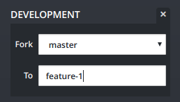
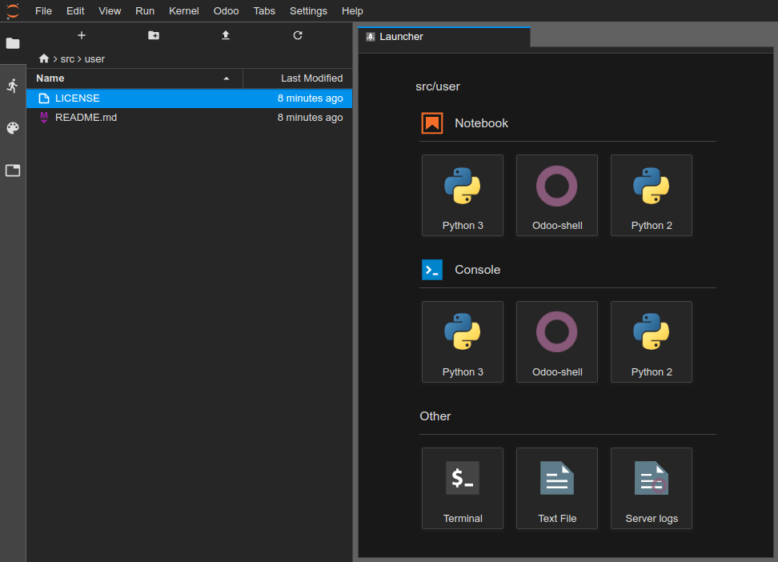
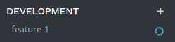
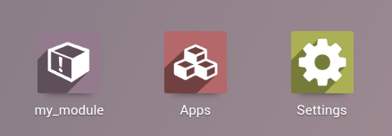
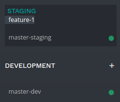
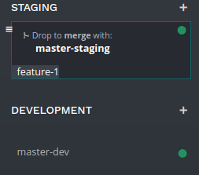
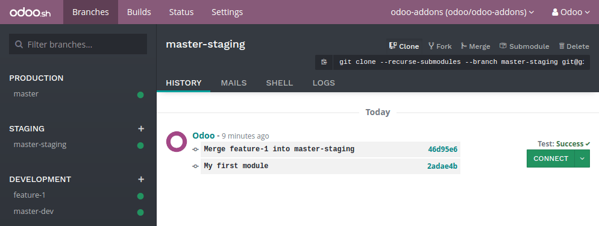
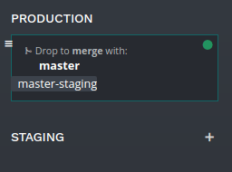
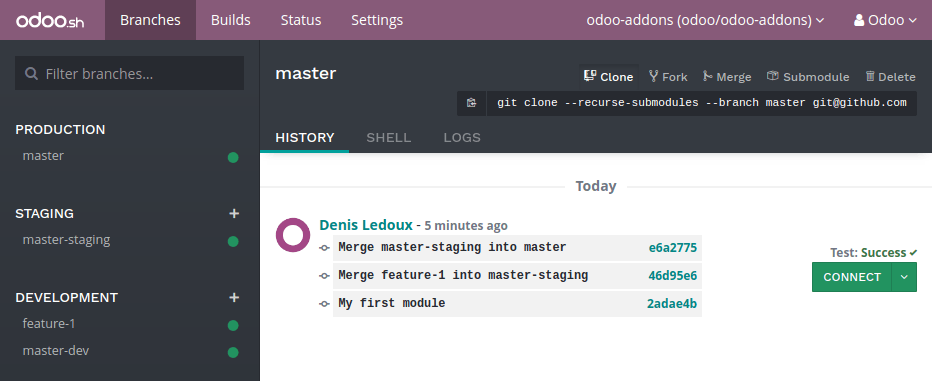
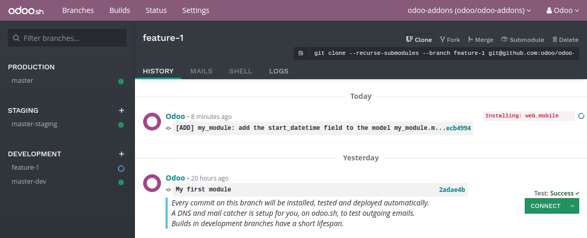

# Phân hệ đầu tiên của bạn

## Tổng quan

Chương này giúp bạn tạo phân hệ Odoo đầu tiên và triển khai phân hệ đó trong dự án Odoo.sh của bạn.

Hướng dẫn này yêu cầu [bạn tạo một dự án trên Odoo.sh](create.md#odoosh-gettingstarted-create) và biết URL kho lưu trữ Github của mình.

Giải thích cách sử dụng cơ bản của Git và Github.

Các giả định sau đây sẽ được đưa ra:

*  *~/src* là thư mục chứa kho lưu trữ Git liên quan đến các dự án Odoo của bạn,
* *odoo* là người dùng Github,
* *odoo-addons* là kho lưu trữ Github,
* *feature-1* là tên của nhánh phát triển,
* *master* là tên của nhánh production,
* *my_module* là tên của phân hệ.

Thay thế các giá trị này bằng giá trị mà bạn chọn.

## Tạo nhánh phát triển

### Từ Odoo.sh

Trong chế độ xem nhánh:

* nhấn nút `+` bên cạnh giai đoạn phát triển,
* chọn nhánh *master* trong tuỳ chọn *Sao chép*,
* nhập *feature-1* vào mục *Thành*.

    

Sau khi bản dựng được tạo, bạn có thể truy cập trình soạn thảo và đi đến thư mục  *~/src/user* để truy cập vào mã nhánh phát triển của bạn.



### Từ máy tính của bạn

Sao chép kho lưu trữ Github trên máy tính của bạn:

```bash
$ mkdir ~/src
$ cd ~/src
$ git clone https://github.com/odoo/odoo-addons.git
$ cd ~/src/odoo-addons
```

Tạo nhánh mới

```bash
$ git checkout -b feature-1 master
```

## Tạo cấu trúc phân hệ

### Tạo khung cho phân hệ

Mặc dù không cần thiết, việc tạo khung giúp tránh sự nhàm chán khi thiết lập cấu trúc phân hệ Odoo cơ bản. Bạn có thể tạo khung cho một phân hệ mới bằng cách sử dụng *odoo-bin* có thể thực thi.

Từ trình soạn thảo Odoo.sh, trong terminal:

```bash
$ odoo-bin scaffold my_module ~/src/user/
```

Hoặc từ máy tính của bạn, nếu bạn có một [bản cài đặt Odoo](../../on_premise/source.md):

```bash
$ ./odoo-bin scaffold my_module ~/src/odoo-addons/
```

Nếu không muốn mất công cài đặt Odoo trên máy tính, bạn cũng có thể [`tải xuống mẫu cấu trúc phân hệ này`](first_module/my_module.zip), trong đó bạn thay thế toàn bộ *my_module* bằng tên bạn chọn.

Cấu trúc dưới đây sẽ được tạo ra:

```default
my_module
├── __init__.py
├── __manifest__.py
├── controllers
│   ├── __init__.py
│   └── controllers.py
├── demo
│   └── demo.xml
├── models
│   ├── __init__.py
│   └── models.py
├── security
│   └── ir.model.access.csv
└── views
    ├── templates.xml
    └── views.xml
```

#### WARNING
Không sử dụng các ký tự đặc biệt khác ngoài dấu gạch dưới (_) cho tên phân hệ của bạn, kể cả dấu gạch nối (-). Tên này được sử dụng cho các lớp Python trong phân hệ của bạn và việc đặt tên lớp bằng các ký tự đặc biệt khác ngoài dấu gạch dưới là không hợp lệ trong Python.

Bỏ chú thích nội dung của các tệp:

* *models/models.py*, ví dụ về mô hình với các trường của mô hình đó,
* *views/views.xml*, một chế độ xem biểu mẫu và cây, với các menu mở chúng,
* *demo/demo.xml*, bản ghi demo cho mô hình ví dụ ở trên,
* *controllers/controllers.py*, ví dụ về bộ điều khiển triển khai một số tuyến,
* *views/templates.xml*, hai ví dụ về chế độ xem qweb được sử dụng bởi các tuyến bộ điều khiển ở trên,
*  *\_\_manifest_\_.py*, tệp kê khai phân hệ của bạn, ví dụ bao gồm tiêu đề, mô tả và các tệp dữ liệu cần tải. Bạn chỉ cần bỏ chú thích tệp dữ liệu danh sách kiểm soát truy cập:
  ```python
  # 'security/ir.model.access.csv',
  ```

### Thủ công

Nếu muốn tự tạo cấu trúc phân hệ, bạn có thể làm theo hướng dẫn [Server framework 101](../../../developer/tutorials/server_framework_101.md) để hiểu cấu trúc của phân hệ và nội dung của từng tệp.

## Push nhánh phát triển

Chọn thay đổi cần được commit

```bash
$ git add my_module
```

Commit thay đổi của bạn

```bash
$ git commit -m "My first module"
```

Push thay đổi của bạn vào kho lưu trữ từ xa

Từ terminal soạn thảo Odoo.sh:

```bash
$ git push https HEAD:feature-1
```

Lệnh trên được giải thích trong phần [Commit & push thay đổi của bạn](online-editor.md#odoosh-gettingstarted-online-editor-push) trong chương [Trình soạn thảo online](online-editor.md#odoosh-gettingstarted-online-editor). Phần này bao gồm giải thích về việc bạn sẽ được nhắc nhập tên người dùng và mật khẩu, và những việc cần làm nếu bạn sử dụng xác thực hai yếu tố.

Hoặc, từ terminal máy tính của bạn:

```bash
$ git push -u origin feature-1
```

Bạn chỉ cần xác định  *-u origin feature-1* cho lần push đầu tiên. Sau đó, để push các thay đổi trong tương lai từ máy tính của bạn, bạn chỉ cần sử dụng

```bash
$ git push
```

## Kiểm thử phân hệ của bạn

Nhánh của bạn sẽ xuất hiện trong nhánh phát triển của dự án.



Trong chế độ xem nhánh của dự án, bạn có thể nhấp vào tên nhánh ở bảng điều hướng bên trái để truy cập lịch sử của nhánh đó.


Ở đây, bạn có thể thấy được những thay đổi bạn vừa push, bao gồm cả chú thích bạn đã thiết lập. Khi cơ sở dữ liệu đã sẵn sàng, bạn có thể truy cập bằng cách nhấp vào nút *Kết nối*.



Nếu bạn cấu hình dự án Odoo.sh để tự động cài đặt phân hệ, bạn sẽ thấy ngay phân hệ đó trong số các ứng dụng của cơ sở dữ liệu. Nếu không, nó sẽ có trong các ứng dụng cần cài đặt.

Sau đó, bạn có thể dùng thử phân hệ của mình, tạo bản ghi mới và kiểm thử các tính năng và nút.

## Kiểm thử bằng dữ liệu production

Bạn cần có cơ sở dữ liệu production cho bước này. Bạn có thể tạo mới nếu chưa có.

Sau khi đã kiểm thử phân hệ trong bản dựng phát triển bằng dữ liệu demo và tin rằng mọi thứ đã sẵn sàng, bạn có thể kiểm thử với dữ liệu production bằng cách sử dụng nhánh staging.

Bạn có thể:

* Biến nhánh phát triển thành nhánh staging bằng cách kéo và thả nó vào tiêu đề phần *staging*.
  
* Hợp nhất nhánh này vào nhánh staging hiện có bằng cách kéo và thả nó vào nhánh staging đã cho.
  

Bạn cũng có thể sử dụng lệnh `git merge` để hợp nhất các nhánh của mình.

Thao tác này sẽ tạo ra bản dựng staging mới, bản dựng này sẽ sao chép cơ sở dữ liệu production và chạy nó bằng máy chủ đã cập nhật những thay đổi mới nhất cho nhánh của bạn.



Khi cơ sở dữ liệu đã sẵn sàng, bạn có thể truy cập bằng nút *Kết nối*.

<a id="odoosh-gettingstarted-firstmodule-productiondata-install"></a>

### Cài đặt phân hệ của bạn

Phân hệ của bạn sẽ không được cài đặt tự động, mà bạn phải cài đặt từ menu ứng dụng. Trong thực tế, mục đích của bản dựng staging là để kiểm thử hành vi các thay đổi của bạn như sẽ diễn ra trong production. Và trên production, bạn sẽ không muốn phân hệ được cài đặt tự động mà cài theo yêu cầu.

Phân hệ có thể không xuất hiện trực tiếp trong ứng dụng để bạn cài đặt, mà trước tiên bạn cần cập nhật danh sách ứng dụng:

* Kích hoạt chế độ [lập trình viên](../../../applications/general/developer_mode.md#developer-mode)
* trong menu ứng dụng, nhấp vào nút *Cập nhật danh sách ứng dụng*,
* trong hộp thoại xuất hiện, nhấp vào nút *Cập nhật*.
  

Sau đó, phân hệ của bạn sẽ xuất hiện trong danh sách các ứng dụng có sẵn.


## Triển khai trong production

Sau khi bạn đã kiểm thử phân hệ trong nhánh staging bằng dữ liệu production và tin rằng mọi thứ đã sẵn sàng cho production, bạn có thể hợp nhất nhánh của mình vào nhánh production.

Kéo và thả nhánh staging của bạn vào nhánh production.



Bạn cũng có thể sử dụng lệnh `git merge` để hợp nhất các nhánh của mình.

Thao tác này sẽ hợp nhất những thay đổi mới nhất của nhánh staging vào nhánh production và cập nhật những thay đổi mới nhất này cho máy chủ production của bạn.



Khi cơ sở dữ liệu đã sẵn sàng, bạn có thể truy cập bằng nút *Kết nối*.

### Cài đặt phân hệ của bạn

Phân hệ của bạn sẽ không được cài đặt tự động, mà bạn phải cài đặt thủ công như đã giải thích trong [phần ở trên về cài đặt phân hệ trong cơ sở dữ liệu staging](#odoosh-gettingstarted-firstmodule-productiondata-install).

## Thêm một thay đổi

Phần này giải thích cách thêm thay đổi vào phân hệ của bạn bằng cách thêm trường mới vào mô hình và triển khai trường đó.

Từ trình soạn thảo Odoo.sh,
: * đi đến thư mục phân hệ của bạn  *~/src/user/my_module*,
  * sau đó, mở tệp *models/models.py*.

Hoặc, từ máy tính của bạn,
: * sử dụng trình duyệt tệp bạn chọn để đi đến thư mục phân hệ của bạn  *~/src/odoo-addons/my_module*,
  * sau đó, mở tệp *models/models.py* bằng trình soạn thảo bạn chọn, chẳng hạn như *Atom*, *Sublime Text*, *PyCharm*, *vim*, ...

Sau đó, sau trường mô tả

```python
description = fields.Text()
```

Thêm trường ngày giờ

```python
start_datetime = fields.Datetime('Start time', default=lambda self: fields.Datetime.now())
```

Sau đó, mở tệp *views/views.xml*.

Sau

```xml
<field name="value2"/>
```

Thêm

```xml
<field name="start_datetime"/>
```

Những thay đổi này làm thay đổi cấu trúc cơ sở dữ liệu bằng cách thêm một cột vào bảng và sửa đổi chế độ xem được lưu trữ trong cơ sở dữ liệu.

Để áp dụng được vào các cơ sở dữ liệu hiện có, chẳng hạn như cơ sở dữ liệu production, những thay đổi này yêu cầu phải cập nhật phân hệ.

Nếu bạn muốn nền tảng Odoo.sh tự động cập nhật khi bạn push các thay đổi, hãy tăng phiên bản phân hệ trong tệp kê khai.

Mở tệp kê khai phân hệ  *\_\_manifest_\_.py*.

Thay thế

```python
'version': '0.1',
```

bằng

```python
'version': '0.2',
```

Nền tảng sẽ phát hiện sự thay đổi phiên bản và kích hoạt cập nhật phân hệ khi triển khai bản sửa đổi mới.

Đi đến thư mục Git của bạn.

Sau đó, từ terminal Odoo.sh:

```bash
$ cd ~/src/user/
```

Hoặc, từ terminal máy tính của bạn:

```bash
$ cd ~/src/odoo-addons/
```

Khi đó, chọn thay đổi cần được commit

```bash
$ git add my_module
```

Commit thay đổi của bạn

```bash
$ git commit -m "[ADD] my_module: add the start_datetime field to the model my_module.my_module"
```

Push thay đổi của bạn:

Từ terminal Odoo.sh:

```bash
$ git push https HEAD:feature-1
```

Hoặc, từ terminal máy tính của bạn:

```bash
$ git push
```

Sau đó, nền tảng sẽ tạo bản dựng mới cho nhánh *feature-1*.



Sau khi đã kiểm thử các thay đổi, bạn có thể hợp nhất chúng vào nhánh production, ví dụ bằng cách kéo và thả nhánh này trên nhánh production trong giao diện Odoo.sh. Khi bạn tăng phiên bản phân hệ trong tệp kê khai, nền tảng sẽ tự động cập nhật phân hệ và trường mới của bạn sẽ có ngay. Nếu không, bạn có thể cập nhật phân hệ trong danh sách ứng dụng theo cách thủ công.

## Sử dụng thư viện Python bên ngoài

Nếu bạn muốn sử dụng thư viện Python bên ngoài không được cài đặt theo mặc định, bạn có thể xác định tệp *requirements.txt* liệt kê các thư viện bên ngoài mà phân hệ của bạn phụ thuộc vào.

#### NOTE
- Không thể cài đặt hoặc nâng cấp các gói hệ thống trên cơ sở dữ liệu Odoo.sh (VD: các gói apt). Tuy nhiên, trong những trường hợp cụ thể, các gói có thể được cân nhắc cài đặt. Điều này cũng áp dụng cho **các phân hệ Python** cần gói hệ thống để biên dịch và **các phân hệ Odoo của bên thứ ba**.
- **Các tiện ích mở rộng PostgreSQL** không được hỗ trợ trên Odoo.sh.
- Để tìm hiểu thêm thông tin, vui lòng tham khảo [FAQ](https://www.odoo.sh/faq#install_dependencies).

Nền tảng sẽ sử dụng tệp này để tự động cài đặt các thư viện Python mà dự án của bạn cần.

Tính năng này được giải thích trong phần này bằng cách sử dụng [thư viện Unidecode](https://pypi.python.org/pypi/Unidecode) trong phân hệ của bạn.

Tạo một tệp *requirements.txt* trong thư mục gốc của kho lưu trữ của bạn

Từ trình soạn thảo Odoo.sh, tạo và mở tệp ~/src/user/requirements.txt.

Hoặc từ máy tính của bạn, tạo và mở tệp ~/src/odoo-addons/requirements.txt.

Thêm

```text
unidecode
```

Sau đó, sử dụng thư viện trong phân hệ của bạn, ví dụ để xóa dấu khỏi các ký tự trong trường tên của mô hình.

Mở tệp *models/models.py*.

Trước

```python
from odoo import models, fields, api
```

Thêm

```python
from unidecode import unidecode
```

Sau

```python
start_datetime = fields.Datetime('Start time', default=lambda self: fields.Datetime.now())
```

Thêm

```python
@api.model
def create(self, values):
    if 'name' in values:
        values['name'] = unidecode(values['name'])
    return super(my_module, self).create(values)

def write(self, values):
    if 'name' in values:
        values['name'] = unidecode(values['name'])
    return super(my_module, self).write(values)
```

Việc thêm phụ thuộc Python yêu cầu tăng phiên bản phân hệ để nền tảng có thể cài đặt phụ thuộc đó.

Chỉnh sửa tệp kê khai phân hệ  *\_\_manifest_\_.py*

Thay thế

```python
'version': '0.2',
```

bằng

```python
'version': '0.3',
```

Chọn và commit thay đổi của bạn:

```bash
$ git add requirements.txt
$ git add my_module
$ git commit -m "[IMP] my_module: automatically remove special chars in my_module.my_module name field"
```

Sau đó, push thay đổi của bạn:

Trong terminal Odoo.sh:

```bash
$ git push https HEAD:feature-1
```

Trong terminal máy tính của bạn:

```bash
$ git push
```
