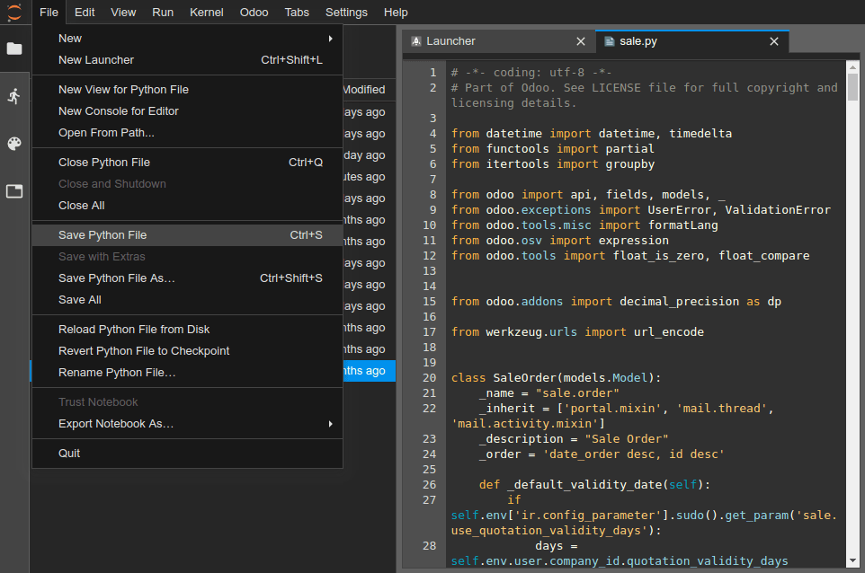
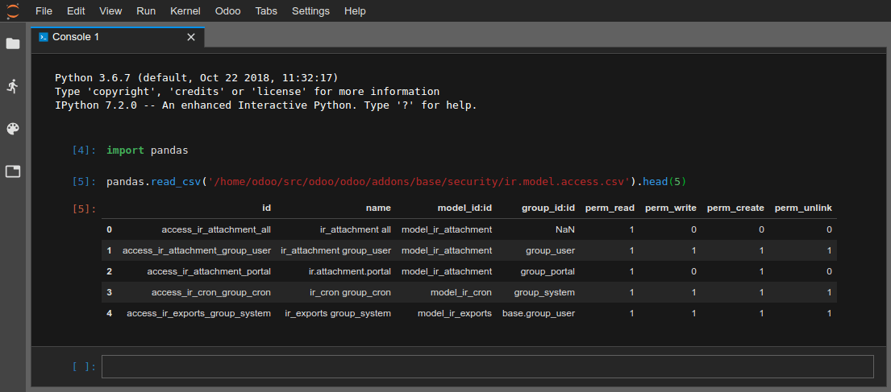
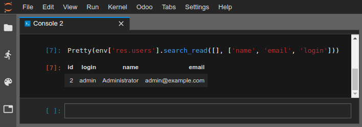

<a id="odoosh-gettingstarted-online-editor"></a>

# Trình soạn thảo online

## Tổng quan

Trình soạn thảo online cho phép bạn chỉnh sửa mã nguồn của bản dựng từ trình duyệt web. Nhờ nó, bạn cũng khả năng mở terminal, bảng điều khiển Python, bảng điều khiển Odoo Shell và [Notebooks](https://jupyterlab.readthedocs.io/en/stable/user/notebook.html).


Bạn có thể truy cập trình soạn thảo của bản dựng thông qua [các tab nhánh](branches.md#odoosh-gettingstarted-branches-tabs), [menu thả xuống của bản dựng](builds.md#odoosh-gettingstarted-builds-dropdown-menu) hoặc bằng cách thêm  */odoo-sh/editor* vào tên miền bản dựng của bạn (VD: *https://odoo-addons-master-1.dev.odoo.com/odoo-sh/editor*).

## Chỉnh sửa mã nguồn

Thư mục làm việc bao gồm các thư mục sau:

```default
.
├── home
│    └── odoo
│         ├── src
│         │    ├── odoo                Odoo Community source code
│         │    │    └── odoo-bin       Odoo server executable
│         │    ├── enterprise          Odoo Enterprise source code
│         │    ├── themes              Odoo Themes source code
│         │    └── user                Your repository branch source code
│         ├── data
│         │    ├── filestore           database attachments, as well as the files of binary fields
│         │    └── sessions            visitors and users sessions
│         └── logs
│              ├── install.log         Database installation logs
│              ├── odoo.log            Running server logs
│              ├── update.log          Database updates logs
│              └── pip.log             Python packages installation logs
```

Bạn có thể chỉnh sửa mã nguồn (các tệp trong thư mục  */src*) trong bản dựng phát triển và bản dựng staging.

#### NOTE
Những thay đổi của bạn sẽ không được chuyển sang bản dựng mới, bạn phải commit chúng vào mã nguồn nếu muốn chúng được lưu lại.

Đối với bản dựng production, mã nguồn ở chế độ chỉ đọc vì không nên áp dụng các thay đổi cục bộ trên máy chủ production.

* Mã nguồn của kho lưu trữ Github của bạn nằm trong  */src/user*,
* Mã nguồn của Odoo nằm trong
  *  */src/odoo* ([odoo/odoo](https://github.com/odoo/odoo)),
  *  */src/enterprise* ([odoo/enterprise](https://github.com/odoo/enterprise)),
  *  */src/themes* ([odoo/design-themes](https://github.com/odoo/design-themes)).

Để mở một tệp trong trình soạn thảo, chỉ cần nhấp đúp vào tệp đó trong bảng duyệt tệp ở bên trái.


Sau đó, bạn có thể bắt đầu thực hiện các thay đổi. Bạn có thể lưu thay đổi của mình bằng menu Tệp ‣ Lưu .. Tệp hoặc bằng cách nhấn phím tắt `Ctrl+S`.



Nếu bạn lưu tệp Python nằm trong đường dẫn addon máy chủ Odoo, thì Odoo sẽ phát hiện tệp đó và tự động tải lại để các thay đổi của bạn có hiệu lực ngay lập tức mà không cần phải khởi động lại máy chủ theo cách thủ công.


Tuy nhiên, nếu thay đổi là dữ liệu được lưu trữ trong cơ sở dữ liệu, chẳng hạn như nhãn của trường hoặc chế độ xem, bạn phải cập nhật phân hệ tương ứng để áp dụng thay đổi. Bạn có thể cập nhật phân hệ của tệp hiện đang mở bằng cách sử dụng menu :menuselection: `Odoo --> Cập nhật phân hệ hiện tại`. Lưu ý rằng tệp được coi là đang mở là tệp được tập trung trong trình soạn thảo văn bản, không phải tệp được tô sáng trong trình duyệt tệp.


Bạn cũng có thể mở terminal và thực hiện lệnh:

```bash
$ odoo-bin -u <comma-separated module names> --stop-after-init
```

<a id="odoosh-gettingstarted-online-editor-push"></a>

## Commit & Push thay đổi của bạn

Bạn có thể commit và push những thay đổi của mình lên kho lưu trữ Github.

* Mở terminal (Tệp ‣ Mới ‣ Terminal),
* Thay đổi thư mục thành  *~/src/user* bằng `cd ~/src/user`,
* Chọn thay đổi của bạn bằng `git add`,
* Commit thay đổi của bạn bằng `git commit`,
* Push thay đổi của bạn bằng `git push https HEAD:<branch>`.

Trong lệnh cuối cùng này,

* *https* là tên kho lưu trữ *HTTPS* Github từ xa của bạn (VD: [https://github.com/username/repository.git](https://github.com/username/repository.git)),
* HEAD là tham chiếu đến bản sửa đổi mới nhất mà bạn đã commit,
* <branch> phải được thay thế bằng tên nhánh mà bạn muốn push các thay đổi tới, thường là nhánh hiện tại nếu bạn làm việc trong bản dựng phát triển.


#### NOTE
SSH Github từ xa không được sử dụng vì mã khóa riêng tư SSH của bạn không được lưu trữ trong container bản dựng (vì những lo ngại hợp lý về bảo mật) và không được chuyển tiếp qua SSH Agent (vì bạn truy cập trình soạn thảo này thông qua trình duyệt web) và do đó bạn không thể xác thực chính mình với Github bằng SSH. Bạn phải sử dụng HTTPS từ xa của kho lưu trữ Github để push các thay đổi của mình, được tự động thêm vào với tên là *https* trong Git từ xa của bạn. Bạn sẽ được nhắc nhập tên người dùng và mật khẩu Github. Nếu đã kích hoạt xác thực hai yếu tố trên Github, bạn có thể tạo [token truy cập cá nhân](https://help.github.com/articles/creating-a-personal-access-token-for-the-command-line/) và sử dụng nó làm mật khẩu. Chỉ cần cấp quyền `repo` là đủ.

#### NOTE
Thư mục nguồn Git  *~/src/user* không được checkout trên một nhánh mà trong một bản sửa đổi tách biệt: Điều này là do các bản dựng hoạt động trong những bản sửa đổi cụ thể mà không phải các nhánh. Nói cách khác, điều này có nghĩa là bạn có thể có nhiều bản dựng trên cùng một nhánh, nhưng nằm trong các bản sửa đổi khác nhau.

Sau khi các thay đổi được push, theo [hành vi push nhánh](branches.md#odoosh-gettingstarted-branches-tabs-settings) của bạn, một bản dựng mới có thể được tạo. Bạn có thể tiếp tục làm việc trong trình soạn thảo mà bạn đã push, vì nó sẽ có cùng bản sửa đổi với bản dựng mới được tạo, nhưng hãy luôn đảm bảo rằng bạn làm việc trong trình soạn thảo của bản dựng sử dụng bản sửa đổi mới nhất của nhánh.

## Bảng điều khiển

Bạn có thể mở bảng điều khiển Python, là [các shell tương tác IPython](https://ipython.readthedocs.io/en/stable/interactive/tutorial.html). Một trong những bổ sung thú vị nhất khi sử dụng bảng điều khiển Python thay cho IPython shell trong terminal là khả năng [hiển thị phong phú](https://ipython.readthedocs.io/en/stable/config/integrating.html#rich-display). Nhờ đó, bạn có thể hiển thị các đối tượng trong HTML.

Ví dụ, bạn có thể hiển thị các ô của tệp CSV bằng cách sử dụng [pandas](https://pandas.pydata.org/pandas-docs/stable/tutorials.html).



Bạn cũng có thể mở bảng điều khiển Odoo Shell để dùng thử Odoo registry và các phương pháp mô hình của cơ sở dữ liệu. Bạn cũng có thể trực tiếp đọc hoặc ghi vào bản ghi của mình.

#### WARNING
Trong Bảng điều khiển Odoo, các giao dịch được tự động commit. Ví dự, điều này có nghĩa là các thay đổi trong bản ghi được áp dụng hiệu quả trong cơ sở dữ liệu. Nếu bạn thay đổi tên người dùng, thì tên người dùng cũng sẽ được thay đổi trong cơ sở dữ liệu của bạn. Do đó, bạn nên sử dụng bảng điều khiển Odoo thật cẩn thận trên cơ sở dữ liệu production.

Bạn có thể sử dụng *env* để gọi các mô hình của registry cơ sở dữ liệu. VD: `env['res.users']`.

```python
env['res.users'].search_read([], ['name', 'email', 'login'])
[{'id': 2,
'login': 'admin',
'name': 'Administrator',
'email': 'admin@example.com'}]
```

Lớp `Pretty` cho phép bạn dễ dàng hiển thị các danh sách và từ điển một cách đẹp mắt, bằng cách sử dụng [hiển thị phong phú](https://ipython.readthedocs.io/en/stable/config/integrating.html#rich-display) đã đề cập ở trên.



Bạn cũng có thể sử dụng [pandas](https://pandas.pydata.org/pandas-docs/stable/tutorials.html) để hiển thị biểu đồ.


