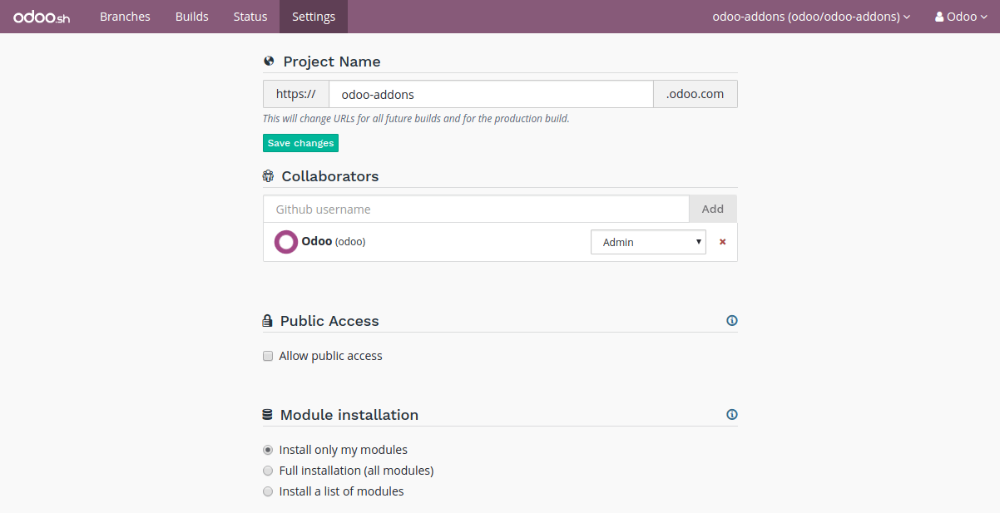
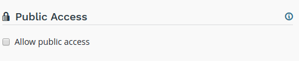
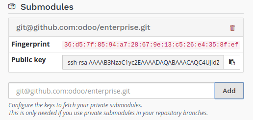
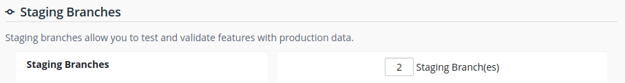
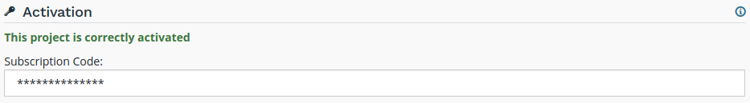

# Cài đặt

## Tổng quan

Các cài đặt cho phép bạn quản lý cấu hình của dự án.



## Tên dự án

Tên dự án của bạn.


Thông tin này xác định địa chỉ sẽ được sử dụng để truy cập vào cơ sở dữ liệu production của bạn.

Địa chỉ của bản dựng staging và phát triển của bạn được lấy từ tên này và được gán tự động. Tuy nhiên, nếu bạn thay đổi tên dự án, thì chỉ các bản dựng trong tương lai mới sử dụng tên mới.

<a id="odoosh-gettingstarted-settings-collaborators"></a>

## Cộng tác viên

Quản lý người dùng Github có thể truy cập vào dự án của bạn.


Có ba cấp độ người dùng:

- Quản trị viên: có quyền truy cập vào tất cả tính năng của dự án Odoo.sh.
- Chuyên viên kiểm thử: có quyền truy cập vào cơ sở dữ liệu *Staging* và *Phát triển* cùng với công cụ của chúng. Vai trò này dành cho người dùng thực hiện Kiểm thử chấp nhận của người dùng. Chuyên viên kiểm thử có thể làm việc với các bản sao dữ liệu production nhưng không thể truy cập cơ sở dữ liệu production thông qua công cụ Odoo.sh.
- Lập trình viên: chỉ có quyền truy cập vào cơ sở dữ liệu *Phát triển* và công cụ của chúng. Vai trò này dành cho các lập trình viên đề xuất sửa đổi mã nhưng không được phép truy cập vào cơ sở dữ liệu production và staging thông qua công cụ Odoo.sh.

|                   |                    | Nhà phát triển                                                                | Người kiểm tra                                                                | Quản trị viên                                                                 |
|-------------------|--------------------|-------------------------------------------------------------------------------|-------------------------------------------------------------------------------|-------------------------------------------------------------------------------|
| Phát triển        | Lịch sử            | <span class="text-success" style="font-size: 32px; line-height: 0.5">●</span> | <span class="text-success" style="font-size: 32px; line-height: 0.5">●</span> | <span class="text-success" style="font-size: 32px; line-height: 0.5">●</span> |
|                   | Kết nối 1 lần nhấp | <span class="text-success" style="font-size: 32px; line-height: 0.5">●</span> | <span class="text-success" style="font-size: 32px; line-height: 0.5">●</span> | <span class="text-success" style="font-size: 32px; line-height: 0.5">●</span> |
|                   | Nhật ký            | <span class="text-success" style="font-size: 32px; line-height: 0.5">●</span> | <span class="text-success" style="font-size: 32px; line-height: 0.5">●</span> | <span class="text-success" style="font-size: 32px; line-height: 0.5">●</span> |
|                   | Shell/SSH          | <span class="text-success" style="font-size: 32px; line-height: 0.5">●</span> | <span class="text-success" style="font-size: 32px; line-height: 0.5">●</span> | <span class="text-success" style="font-size: 32px; line-height: 0.5">●</span> |
|                   | Thư                | <span class="text-success" style="font-size: 32px; line-height: 0.5">●</span> | <span class="text-success" style="font-size: 32px; line-height: 0.5">●</span> | <span class="text-success" style="font-size: 32px; line-height: 0.5">●</span> |
|                   | Cài đặt            | <span class="text-success" style="font-size: 32px; line-height: 0.5">●</span> | <span class="text-success" style="font-size: 32px; line-height: 0.5">●</span> | <span class="text-success" style="font-size: 32px; line-height: 0.5">●</span> |
| Staging           | Lịch sử            | <span class="text-success" style="font-size: 32px; line-height: 0.5">●</span> | <span class="text-success" style="font-size: 32px; line-height: 0.5">●</span> | <span class="text-success" style="font-size: 32px; line-height: 0.5">●</span> |
|                   | Kết nối 1 lần nhấp |                                                                               | <span class="text-success" style="font-size: 32px; line-height: 0.5">●</span> | <span class="text-success" style="font-size: 32px; line-height: 0.5">●</span> |
|                   | Nhật ký            |                                                                               | <span class="text-success" style="font-size: 32px; line-height: 0.5">●</span> | <span class="text-success" style="font-size: 32px; line-height: 0.5">●</span> |
|                   | Shell/SSH          |                                                                               | <span class="text-success" style="font-size: 32px; line-height: 0.5">●</span> | <span class="text-success" style="font-size: 32px; line-height: 0.5">●</span> |
|                   | Thư                |                                                                               | <span class="text-success" style="font-size: 32px; line-height: 0.5">●</span> | <span class="text-success" style="font-size: 32px; line-height: 0.5">●</span> |
|                   | Theo dõi           |                                                                               | <span class="text-success" style="font-size: 32px; line-height: 0.5">●</span> | <span class="text-success" style="font-size: 32px; line-height: 0.5">●</span> |
|                   | Bản sao lưu        |                                                                               |                                                                               | <span class="text-success" style="font-size: 32px; line-height: 0.5">●</span> |
|                   | Nâng cấp           |                                                                               | <span class="text-success" style="font-size: 32px; line-height: 0.5">●</span> | <span class="text-success" style="font-size: 32px; line-height: 0.5">●</span> |
|                   | Cài đặt            |                                                                               | <span class="text-success" style="font-size: 32px; line-height: 0.5">●</span> | <span class="text-success" style="font-size: 32px; line-height: 0.5">●</span> |
| Hoạt động thực tế | Lịch sử            | <span class="text-success" style="font-size: 32px; line-height: 0.5">●</span> | <span class="text-success" style="font-size: 32px; line-height: 0.5">●</span> | <span class="text-success" style="font-size: 32px; line-height: 0.5">●</span> |
|                   | Kết nối 1 lần nhấp |                                                                               |                                                                               | <span class="text-success" style="font-size: 32px; line-height: 0.5">●</span> |
|                   | Nhật ký            |                                                                               |                                                                               | <span class="text-success" style="font-size: 32px; line-height: 0.5">●</span> |
|                   | Shell/SSH          |                                                                               |                                                                               | <span class="text-success" style="font-size: 32px; line-height: 0.5">●</span> |
|                   | Thư                |                                                                               |                                                                               | <span class="text-success" style="font-size: 32px; line-height: 0.5">●</span> |
|                   | Theo dõi           |                                                                               |                                                                               | <span class="text-success" style="font-size: 32px; line-height: 0.5">●</span> |
|                   | Bản sao lưu        |                                                                               |                                                                               | <span class="text-success" style="font-size: 32px; line-height: 0.5">●</span> |
|                   | Nâng cấp           |                                                                               |                                                                               | <span class="text-success" style="font-size: 32px; line-height: 0.5">●</span> |
|                   | Cài đặt            |                                                                               |                                                                               | <span class="text-success" style="font-size: 32px; line-height: 0.5">●</span> |
| Trạng thái        |                    | <span class="text-success" style="font-size: 32px; line-height: 0.5">●</span> | <span class="text-success" style="font-size: 32px; line-height: 0.5">●</span> | <span class="text-success" style="font-size: 32px; line-height: 0.5">●</span> |
| Cài đặt           |                    |                                                                               |                                                                               | <span class="text-success" style="font-size: 32px; line-height: 0.5">●</span> |

#### WARNING
Những vai trò đó chỉ áp dụng cho việc sử dụng Odoo.sh. Điều quan trọng là phải phản ánh sự phân bổ vai trò của người dùng trong kho lưu trữ trên GitHub. Vui lòng tham khảo phần tài liệu GitHub về [Quản lý quy tắc bảo vệ nhánh](https://docs.github.com/en/repositories/configuring-branches-and-merges-in-your-repository/managing-protected-branches/managing-a-branch-protection-rule) để biết hướng dẫn chi tiết.

## Truy cập công khai

Cấp quyền truy cập công khai vào bản dựng phát triển của bạn.



Nếu được kích hoạt, tùy chọn này sẽ hiển thị công khai trang Bản dựng, cho phép khách truy cập xem lịch sử bản dựng phát triển của bạn.

Quyền này không bao gồm bản dựng production và staging, khách truy cập chỉ có thể xem trạng thái của chúng.

<a id="odoosh-gettingstarted-settings-modules-installation"></a>

## Trạng thái commit GitHub

Tùy chọn này cho phép Odoo.sh đẩy trạng thái commit lên kho lưu trữ GitHub của bạn khi bản dựng được tạo hoặc cập nhật. Nó yêu cầu một token GitHub có quyền để push trạng thái commit lên kho lưu trữ. Tham khảo [Tài liệu của GitHub về token truy cập cá nhân](https://docs.github.com/en/authentication/keeping-your-account-and-data-secure/managing-your-personal-access-tokens) để tìm hiểu hướng dẫn tạo token của bạn.

#### NOTE
**Token cá nhân chi tiết** của GitHub có ngày hết hạn và sẽ bị vô hiệu hóa nếu không cập nhật trạng thái commit. Bạn có thể thay thế token bất kỳ lúc nào trên Odoo.sh.

Trạng thái commit được push lên GitHub có thể có các bối cảnh sau:

- ci/odoo.sh (phát triển): trạng thái của một bản dựng phát triển
- ci/odoo.sh (staging): trạng thái của một bản dựng staging
- ci/odoo.sh (production): trạng thái của một bản dựng production
- ci/odoo.sh (test_ci): việc kiểm thử token từ trang Cài đặt sẽ push trạng thái kiểm thử lên lần commit cuối cùng của kho lưu trữ của bạn

## Miền tuỳ chỉnh

Để cấu hình các miền bổ sung, vui lòng tham khảo [phần cài đặt](branches.md#odoosh-gettingstarted-branches-tabs-settings) của nhánh.

<a id="odoosh-gettingstarted-settings-submodules"></a>

## Phân hệ phụ

Cấu hình mã khóa triển khai cho các kho lưu trữ riêng tư mà bạn sử dụng làm phân hệ phụ trong nhánh của mình để cho phép Odoo.sh tải chúng xuống.

#### WARNING
Các cài đặt này chỉ bắt buộc đối với **kho lưu trữ riêng tư**. Nếu đang tìm hiểu cách thiết lập các phân hệ phụ, bạn có thể tham khảo hướng dẫn trong chương :ref:

```
`
```

Phân hệ phụ <odoosh-advanced-submodules> của tài liệu này.



Khi một kho lưu trữ được đặt là riêng tư, thì sẽ không thể công khai tải xuống các nhánh và bản sửa đổi của nó. Do đó, bạn cần cấu hình mã khóa triển khai cho Odoo.sh, để máy chủ Git từ xa cho phép nền tảng của chúng tôi tải xuống các bản sửa đổi của kho lưu trữ riêng tư này.

Để cấu hình mã khóa triển khai cho kho lưu trữ riêng tư, hãy thực hiện như sau:

* trong phần nhập thông tin, dán URL SSH của kho lưu trữ riêng tư phụ của bạn và nhấp vào *Thêm*,
  * VD: *git@github.com:USERNAME/REPOSITORY.git*
  * nó có thể là một máy chủ Git khác Github, chẳng hạn như Bitbucket, Gitlab hoặc thậm chí là máy chủ tự lưu trữ của bạn
* sao chép mã khóa công khai,
  * nó phải có định dạng *ssh-rsa một số...ký tự...ngẫu nhiên...ở đây...==*
* trong phần cài đặt của kho lưu trữ riêng tư phụ, thêm mã khóa công khai vào trong số các mã khóa triển khai.
  * Github.com: Cài đặt ‣ Mã khoá triển khai ‣ Thêm mã khoá triển khai
  * Bitbucket.com: Cài đặt ‣ Mã khoá triển khai ‣ Thêm mã khoá
  * Gitlab.com: Cài đặt ‣ Kho lưu trữ ‣ Mã khoá triển khai
  * Tự lưu trữ: thêm mã khóa vào tệp authorized_keys của người dùng git trong thư mục .ssh của người dùng đó

## Kích thước Lưu trữ

Phần này hiển thị kích thước lưu trữ mà dự án của bạn sử dụng.


Kích thước lưu trữ được tính như sau:

* kích thước của cơ sở dữ liệu PostgreSQL
* kích thước của các tệp đĩa có sẵn trong container của bạn: filestore của cơ sở dữ liệu, thư mục lưu trữ phiên...

#### WARNING
Nếu muốn phân tích mức sử dụng đĩa, bạn có thể chạy công cụ [ncdu](https://dev.yorhel.nl/ncdu/man) trong Web Shell của mình.

Nếu kích thước cơ sở dữ liệu production của bạn tăng quá mức được cung cấp trong gói đăng ký, chúng sẽ tự động được đồng bộ hóa với nhau.

## Worker Cơ sở Dữ liệu

Bạn có thể cấu hình thêm các worker cơ sở dữ liệu tại đây. Việc có nhiều worker hơn giúp tăng tải lượng mà cơ sở dữ liệu production của bạn có thể xử lý. Nếu bạn thêm nhiều worker hơn, nó sẽ tự động được đồng bộ hóa với gói đăng ký của bạn.


#### WARNING
Việc tăng worker sẽ không hoàn toàn giải quyết được mọi vấn đề về hiệu suất, mà điều này chỉ cho phép máy chủ xử lý nhiều kết nối hơn cùng một lúc. Nếu một số thao tác chậm bất thường, thì rất có thể là do vấn đề về mã. Trong trường hợp không phải do tùy chỉnh của bạn, bạn có thể mở phiếu hỗ trợ [tại đây](https://www.odoo.com/help).

## Nhánh Staging

Các nhánh staging bổ sung cho phép bạn phát triển và kiểm thử nhiều tính năng hơn cùng lúc. Nếu bạn tăng nhánh staging, nó sẽ tự động được đồng bộ hóa với gói đăng ký của bạn.



## Kích hoạt

Hiển thị trạng thái kích hoạt của dự án. Bạn có thể thay đổi mã kích hoạt của dự án nếu cần.


