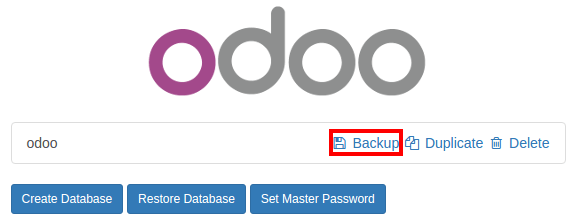
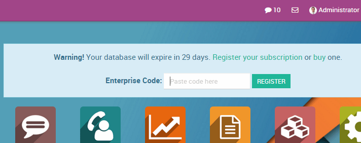
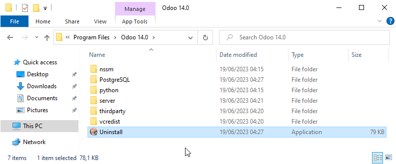
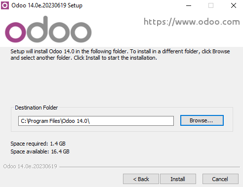

<a id="setup-enterprise"></a>

# Chuyển từ Community sang Enterprise

Có nhiều cách để nâng cấp phiên bản community tuỳ vào cài đặt hiện tại của bạn. Trong mọi trường hợp, các hướng dẫn cơ bản như sau:

* Sao lưu cơ sở dữ liệu community
  
* Tắt máy chủ của bạn
* Cài đặt phân hệ web_enterprise
* Khởi động lại máy chủ
* Nhập mã đăng ký Odoo Enterprise của bạn



## Trên Linux, sử dụng trình cài đặt

* Sao lưu cơ sở dữ liệu community
* Ngừng máy chủ Odoo
  ```console
  $ sudo service odoo stop
  ```
* Cài đặt enterprise .deb (nó sẽ cài đặt đè lên gói community)
  ```console
  $ sudo dpkg -i <path_to_enterprise_deb>
  ```
* Cập nhật cơ sở dữ liệu của bạn lên gói enterprise bằng cách sử dụng
  ```console
  $ python3 /usr/bin/odoo-bin -d <database_name> -i web_enterprise --stop-after-init
  ```
* Bạn sẽ có thể kết nối với phiên bản Odoo Enterprise của mình bằng cách định danh thông thường. Sau đó, bạn có thể liên kết cơ sở dữ liệu với Đăng ký Odoo Enterprise bằng cách nhập mã bạn nhận được qua email vào biểu mẫu

## Trên Linux, sử dụng mã nguồn

Có nhiều cách để khởi chạy máy chủ khi sử dụng nguồn và có thể bạn có cách yêu thích riêng. Bạn có thể cần điều chỉnh các phần cho phù hợp với quy trình làm việc thông thường của mình.

* Tắt máy chủ của bạn
* Sao lưu cơ sở dữ liệu community
* Cập nhật tham số `--addons-path` của lệnh khởi chạy của bạn (tham khảo [Cài đặt nguồn](administration/on_premise/source.md))
* Cài đặt phân hệ web_enterprise bằng cách sử dụng
  ```console
  $ -d <database_name> -i web_enterprise --stop-after-init
  ```

  Tùy thuộc vào kích thước cơ sở dữ liệu của bạn, việc này có thể mất một thời gian.
* Khởi động lại máy chủ của bạn với đường dẫn addon đã cập nhật ở mục 3. Bạn sẽ có thể kết nối với phiên bản của mình. Sau đó, bạn có thể liên kết cơ sở dữ liệu với Đăng ký Odoo Enterprise bằng cách nhập mã bạn nhận được qua email vào biểu mẫu

## Trên Windows

* Sao lưu cơ sở dữ liệu community
* Gỡ cài đặt Odoo Community (sử dụng tệp thực thi Uninstall trong thư mục cài đặt) - PostgreSQL sẽ vẫn được cài đặt
  
* Khởi chạy Trình cài đặt Odoo Enterprise và làm theo các bước như bình thường. Khi chọn đường dẫn cài đặt, bạn có thể thiết lập thư mục cài đặt Community (thư mục này vẫn chứa cài đặt PostgreSQL). Bỏ chọn `khởi động Odoo` ở cuối quá trình cài đặt
  
* Sử dụng cửa sổ lệnh, cập nhật Cơ sở dữ liệu Odoo của bạn bằng lệnh này (từ đường dẫn cài đặt Odoo, trong thư mục phụ của máy chủ)
  ```console
  $ ..\python\python.exe odoo-bin -d <database_name> -i web_enterprise --stop-after-init
  ```
* Không cần khởi chạy máy chủ theo cách thủ công, dịch vụ vẫn đang chạy. Bạn sẽ có thể kết nối với phiên bản Odoo Enterprise của mình bằng cách định danh thông thường. Sau đó, bạn có thể liên kết cơ sở dữ liệu với Đăng ký Odoo Enterprise bằng cách nhập mã bạn nhận được qua email vào biểu mẫu
