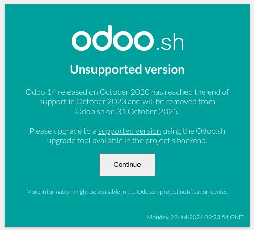
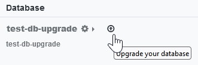
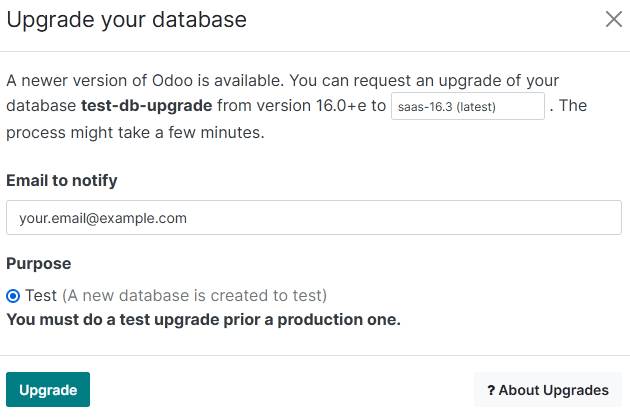
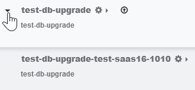
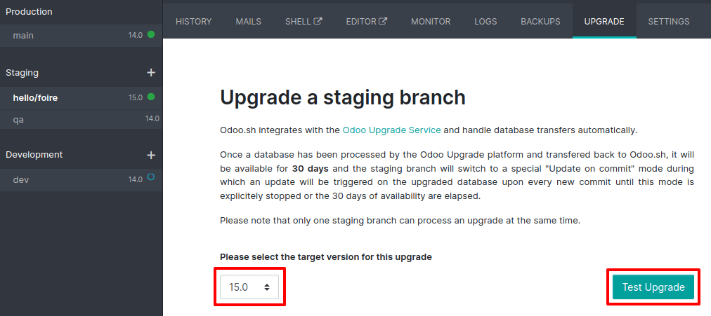
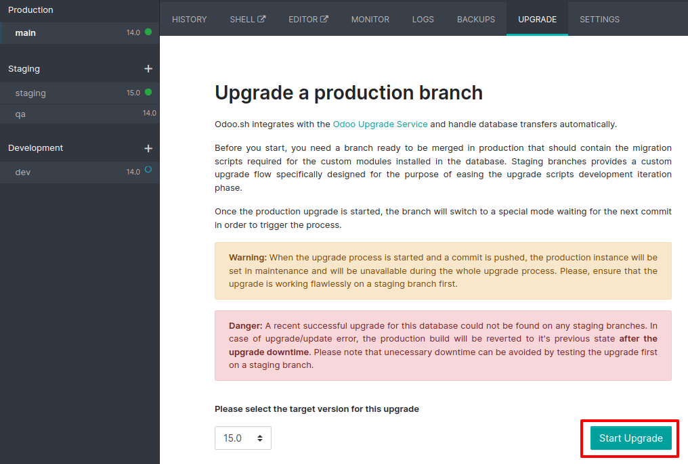

# Nâng cấp

Nâng cấp bao gồm việc di chuyển cơ sở dữ liệu từ phiên bản cũ hơn sang phiên bản được hỗ trợ mới hơn (VD: từ Odoo 16.0 lên Odoo 18.0). Việc nâng cấp thường xuyên là rất quan trọng vì mỗi phiên bản đều cung cấp các tính năng mới, bản sửa lỗi và bản vá bảo mật. Khuyến khích sử dụng [phiên bản được hỗ trợ](administration/supported_versions.md). Mỗi phiên bản chính được hỗ trợ trong ba năm.

Tùy vào loại lưu trữ và phiên bản Odoo được sử dụng, việc nâng cấp cơ sở dữ liệu có thể là **bắt buộc**.

Odoo Online

- Nếu cơ sở dữ liệu đang sử dụng **phiên bản chính** (VD: 16.0, 17.0, 18.0), thì việc nâng cấp là bắt buộc sau mỗi hai năm.
- Nếu cơ sở dữ liệu đang sử dụng phiên bản **phụ** (VD: 17.1, 17.2, 17.4), thì việc nâng cấp là bắt buộc sau vài tuần kể từ khi phiên bản tiếp theo được phát hành. Các phiên bản phụ thường được phát hành hai tháng một lần.

Odoo.sh

Sau ba năm hỗ trợ ban đầu, bạn sẽ có thêm hai năm để hoàn tất nâng cấp. Bạn sẽ được thông báo khi cần nâng cấp.



On-premise

Bạn có thể sử dụng cùng một phiên bản vĩnh viễn, ngay cả khi phiên bản đó không được khuyên dùng. Lưu ý rằng khoảng cách giữa các phiên bản càng nhỏ thì việc nâng cấp càng dễ dàng.

Một bản nâng cấp không bao gồm:

> - Hạ cấp xuống phiên bản Odoo trước đó
> - [Chuyển phiên bản](administration/on_premise/community_to_enterprise.md) (VD: từ Community thành Enterprise)
> - [Thay đổi loại hình lưu trữ](administration/hosting.md#hosting-change-solution) (VD: từ on-premise thành Odoo Online)
> - Di chuyển từ ERP khác sang Odoo

#### WARNING
Nếu cơ sở dữ liệu của bạn chứa các phân hệ tùy chỉnh, bạn không thể nâng cấp cho đến khi có phiên bản phân hệ tùy chỉnh cho phiên bản Odoo mục tiêu. Đối với khách hàng duy trì các phân hệ tùy chỉnh của riêng họ, Odoo khuyến khích song song hóa quy trình bằng cách [yêu cầu cơ sở dữ liệu đã nâng cấp](#upgrade-request-test) đồng thời [nâng cấp mã nguồn của các phân hệ tùy chỉnh](developer/howtos/upgrade_custom_db.md).

<a id="upgrade-nutshell"></a>

## Tóm lược về nâng cấp

1. Yêu cầu một cơ sở dữ liệu kiểm thử đã nâng cấp (xem [nhận cơ sở dữ liệu kiểm thử đã nâng cấp](#upgrade-request-test)).
2. Nếu có thể, hãy nâng cấp mã nguồn của phân hệ tùy chỉnh cho tương thích với phiên bản Odoo mới (tham khảo [Upgrade a customized database](developer/howtos/upgrade_custom_db.md)).
3. Kiểm thử kỹ lưỡng cơ sở dữ liệu đã nâng cấp (tham khảo [kiểm thử phiên bản mới của cơ sở dữ liệu](#upgrade-testing)).
4. Báo cáo bất kỳ vấn đề nào gặp phải trong quá trình kiểm thử cho Odoo bằng cách vào [Trang hỗ trợ và chọn "Sự cố liên quan đến bản nâng cấp trong tương lai của tôi (Tôi đang kiểm thử bản nâng cấp)"](https://www.odoo.com/help?stage=migration).
5. Khi mọi vấn đề đã được xử lý và bạn tự tin rằng cơ sở dữ liệu đã nâng cấp có thể được sử dụng làm cơ sở dữ liệu chính mà không gặp sự cố nào, hãy lên kế hoạch nâng cấp cơ sở dữ liệu production.
6. Yêu cầu nâng cấp cơ sở dữ liệu production, khiến cơ sở dữ liệu này không khả dụng trong thời gian cần để hoàn tất quy trình (xem [nâng cấp cơ sở dữ liệu production](#upgrade-production)).
7. Báo cáo mọi sự cố bạn gặp phải trong quá trình nâng cấp cho Odoo bằng cách truy cập [Trang hỗ trợ và chọn "Sự cố liên quan đến bản nâng cấp của tôi (production)"](https://www.odoo.com/help?stage=post_upgrade).

<a id="upgrade-request-test"></a>

## Nhận cơ sở dữ liệu kiểm thử đã nâng cấp

[Trang Nâng cấp](https://upgrade.odoo.com/) là nền tảng chính để yêu cầu một cơ sở dữ liệu đã nâng cấp. Tuy nhiên, tùy thuộc vào loại hình lưu trữ, bạn có thể nâng cấp từ dòng lệnh (on-premise), [trình quản lý cơ sở dữ liệu Odoo Online](https://odoo.com/my/databases) hoặc [dự án Odoo.sh](https://odoo.sh/project).

#### NOTE
Nền tảng Nâng cấp tuân thủ cùng [Chính sách Bảo mật](https://www.odoo.com/privacy) như các dịch vụ Odoo.com khác. Truy cập [Quy định Chung về Bảo vệ Dữ liệu](https://www.odoo.com/gdpr) để tìm hiểu thêm về cách Odoo xử lý dữ liệu và quyền riêng tư của bạn.

Odoo Online

Cơ sở dữ liệu Odoo Online có thể được nâng cấp thủ công thông qua [trình quản lý cơ sở dữ liệu](https://www.odoo.com/my/databases).

Trình quản lý cơ sở dữ liệu hiển thị tất cả các cơ sở dữ liệu được liên kết với tài khoản của người dùng. Các cơ sở dữ liệu không có trên phiên bản Odoo mới nhất sẽ hiển thị một mũi tên trong biểu tượng hình tròn bên cạnh tên của chúng, cho biết chúng có thể được nâng cấp.



Nhấp vào biểu tượng **mũi tên trong vòng tròn** để bắt đầu quá trình nâng cấp. Trong cửa sổ pop-up, hãy điền:

- **Phiên bản** Odoo mà bạn muốn nâng cấp lên, thường là phiên bản mới nhất
- Địa chỉ **email** sẽ nhận được liên kết đến cơ sở dữ liệu đã nâng cấp
- Mục đích của bản nâng cấp, được tự động đặt thành Kiểm thử cho yêu cầu nâng cấp đầu tiên của bạn



Thẻ Đang nâng cấp được hiển thị bên cạnh tên cơ sở dữ liệu cho đến khi nâng cấp hoàn tất. Khi quá trình này thành công, một email có chứa liên kết đến cơ sở dữ liệu kiểm thử đã nâng cấp sẽ được gửi đến địa chỉ mà bạn đã cung cấp. Bạn cũng có thể truy cập cơ sở dữ liệu này từ trình quản lý cơ sở dữ liệu bằng cách nhấp vào mũi tên thả xuống trước tên cơ sở dữ liệu.



Odoo.sh

Odoo.sh được tích hợp với nền tảng nâng cấp để đơn giản hóa quá trình nâng cấp.



Sau đó, **bản sao lưu tự động hàng ngày mới nhất** sẽ được gửi đến 

```
`
```

nền tảng nâng cấp.

Sau khi nền tảng nâng cấp hoàn tất việc nâng cấp bản sao lưu và tải nó lên nhánh, nó sẽ được đưa vào **chế độ đặc biệt**: mỗi lần **commit được đẩy** lên nhánh, một **hoạt động khôi phục** của bản sao lưu đã nâng cấp và một **bản cập nhật của tất cả phân hệ tùy chỉnh** sẽ diễn ra. Điều này cho phép bạn kiểm thử các phân hệ tùy chỉnh của mình trên một bản sao nguyên sơ của cơ sở dữ liệu đã nâng cấp. Bạn có thể tìm thấy tệp nhật ký của quá trình nâng cấp trong bản dựng staging mới nâng cấp bằng cách truy cập `~/logs/upgrade.log`.

#### IMPORTANT
Trong những cơ sở dữ liệu có cài đặt các phân hệ tùy chỉnh, mã nguồn của chúng phải được cập nhật tương ứng với phiên bản Odoo mục tiêu trước khi có thể tiến hành nâng cấp. Nếu không có, chế độ "cập nhật khi commit" sẽ bị bỏ qua, cơ sở dữ liệu đã nâng cấp sẽ được xây dựng ngay khi được chuyển từ nền tảng nâng cấp, và sẽ thoát chế độ nâng cấp.

Tham khảo trang [Upgrade a customized database](developer/howtos/upgrade_custom_db.md) để tìm hiểu thêm thông tin.

On-premise

Quá trình nâng cấp tiêu chuẩn có thể được bắt đầu bằng cách nhập dòng lệnh sau vào máy lưu trữ cơ sở dữ liệu:

```console
$ python <(curl -s https://upgrade.odoo.com/upgrade) test -d <your db name> -t <target version>
```

#### NOTE
Lệnh này có một số yêu cầu về môi trường mà nó chạy trong đó:

- Một số lệnh bên ngoài phải được hệ điều hành cung cấp, thường có trong bất kỳ bản phân phối Linux nào (bao gồm WSL). Một lỗi sẽ được hiển thị nếu thiếu một hoặc nhiều lệnh trong số đó.
- Người dùng hệ thống thực thi lệnh cần được cấu hình để có quyền truy cập vào cơ sở dữ liệu. Vui lòng tham khảo tài liệu PostgreSQL về [môi trường máy khách](https://www.postgresql.org/docs/current/libpq-envars.html) hoặc [tệp mật khẩu máy khách](https://www.postgresql.org/docs/current/libpq-pgpass.html) để tìm hiểu yêu cầu này.
- Tập lệnh cần có khả năng tiếp cận một hoặc nhiều máy chủ của nền tảng nâng cấp trên cả cổng TCP 443 và bất kỳ cổng TCP ngẫu nhiên nào trong phạm vi từ 32768 đến 60999. Điều này có thể xung đột với tường lửa hạn chế của bạn và có thể cần thêm ngoại lệ vào cấu hình tường lửa.

Có thể sử dụng lệnh sau để hiển thị trợ giúp chung và các lệnh chính:

```console
$ python <(curl -s https://upgrade.odoo.com/upgrade) --help
```

Bạn cũng có thể yêu cầu cơ sở dữ liệu kiểm thử đã nâng cấp qua [Trang nâng cấp](https://upgrade.odoo.com).

#### IMPORTANT
Trong những cơ sở dữ liệu có cài đặt các phân hệ tùy chỉnh, mã nguồn của chúng phải được cập nhật tương ứng với phiên bản Odoo mục tiêu trước khi có thể tiến hành nâng cấp. Tham khảo trang [Upgrade a customized database](developer/howtos/upgrade_custom_db.md) để tìm hiểu thêm thông tin.

#### NOTE
- Vì lý do bảo mật, chỉ người gửi yêu cầu nâng cấp mới có thể tải xuống.
- Vì lý do lưu trữ, bản sao của cơ sở dữ liệu sẽ được gửi mà không có filestore đến máy chủ nâng cấp. Do đó, cơ sở dữ liệu đã nâng cấp không chứa filestore production.
- Trước khi khôi phục cơ sở dữ liệu đã nâng cấp, kho lưu trữ tệp của cơ sở dữ liệu đó phải được hợp nhất với kho lưu trữ tệp production để có thể thực hiện các kiểm thử trong cùng điều kiện như trong phiên bản mới.
- Cơ sở dữ liệu đã nâng cấp bao gồm:
  - Tệp `dump.sql` chứa cơ sở dữ liệu đã nâng cấp
  - Thư mục `filestore` chứa các tệp được trích xuất từ ​​các bản ghi trong cơ sở dữ liệu thành tệp đính kèm (nếu có) và các tệp Odoo tiêu chuẩn mới từ phiên bản Odoo mục tiêu (ví dụ: hình ảnh, biểu tượng, logo mới của nhà cung cấp dịch vụ thanh toán,...). Đây là thư mục cần được hợp nhất với filestore production để có được filestore đã nâng cấp đầy đủ.

#### NOTE
Bạn có thể yêu cầu nhiều cơ sở dữ liệu kiểm thử nếu muốn kiểm thử một bản nâng cấp nhiều lần.

#### NOTE
Khi yêu cầu nâng cấp hoàn tất, báo cáo nâng cấp sẽ được đính kèm vào email nâng cấp thành công và có sẵn trong ứng dụng Thảo luận của những người dùng thuộc nhóm "Quản trị/Cài đặt". Báo cáo này cung cấp thông tin quan trọng về các thay đổi được giới thiệu trong phiên bản mới.

<a id="upgrade-testing"></a>

## Kiểm thử phiên bản mới của cơ sở dữ liệu

Bạn cần kiểm thử cơ sở dữ liệu kiểm thử đã nâng cấp để đảm bảo không gặp sự cố trong các hoạt động hàng ngày do thay đổi về chế độ xem, hành vi hoặc thông báo lỗi sau khi nâng cấp.

#### NOTE
Cơ sở dữ liệu kiểm thử sẽ bị vô hiệu hóa một phần và một số tính năng được tắt đi để ngăn chúng ảnh hưởng đến cơ sở dữ liệu production:

1. Tác vụ đã lên lịch đang bị tắt.
2. Máy chủ thư đi bị vô hiệu hóa bằng cách lưu trữ máy chủ hiện có và thêm máy chủ giả.
3. Nhà cung cấp dịch vụ thanh toán và đơn vị vận chuyển được đặt lại về môi trường kiểm thử.
4. Đồng bộ hóa ngân hàng bị vô hiệu hóa. Nếu muốn kiểm thử đồng bộ hóa, hãy liên hệ với nhà cung cấp dịch vụ đồng bộ hóa ngân hàng của bạn để lấy thông tin đăng nhập sandbox.

Bạn nên kiểm thử càng nhiều tính năng càng tốt để đảm bảo chúng hoạt động chính xác và để làm quen hơn với phiên bản mới.

Nếu bạn gặp sự cố khi kiểm thử cơ sở dữ liệu kiểm thử đã nâng cấp, bạn có thể yêu cầu hỗ trợ từ Odoo bằng cách đi đến [trang Hỗ trợ và chọn "Sự cố liên quan đến bản nâng cấp trong tương lai của tôi (Tôi đang kiểm thử bản nâng cấp)"](https://www.odoo.com/help?stage=migration). Bất cứ lúc nào bạn cũng cần báo cáo sự cố đã gặp trong quá trình kiểm thử để khắc phục trước khi nâng cấp cơ sở dữ liệu production.

Bạn có thể gặp những thay đổi đáng kể về các chế độ xem, tính năng, trường và mô hình tiêu chuẩn trong quá trình kiểm thử. Tuỳ từng trường hợp, những thay đổi đó không thể được hoàn nguyên. Tuy nhiên, nếu một thay đổi ở phiên bản mới làm hỏng tùy chỉnh, thì bên bảo trì phân hệ tùy chỉnh của bạn phải chịu trách nhiệm đảm bảo phân hệ này tương thích với phiên bản Odoo mới.

<a id="upgrade-production"></a>

## Nâng cấp cơ sở dữ liệu production

Sau khi [các bản kiểm thử](#upgrade-testing) hoàn tất và bạn tự tin rằng cơ sở dữ liệu đã nâng cấp có thể được sử dụng làm cơ sở dữ liệu chính mà không có bất kỳ sự cố nào, thì đây là lúc lên kế hoạch cho ngày go-live.

Cơ sở dữ liệu production của bạn sẽ không khả dụng trong quá trình nâng cấp. Do đó, chúng tôi khuyên bạn nên lên kế hoạch nâng cấp vào thời điểm ít sử dụng cơ sở dữ liệu nhất.

Vì các tập lệnh nâng cấp tiêu chuẩn và cơ sở dữ liệu của bạn liên tục phát triển, nên bạn cũng nên thường xuyên yêu cầu một cơ sở dữ liệu kiểm thử đã nâng cấp khác để đảm bảo rằng quá trình nâng cấp vẫn thành công, đặc biệt là nếu mất nhiều thời gian để hoàn tất. **Bạn cũng nên tập dượt toàn bộ các bước nâng cấp vào ngày trước khi nâng cấp cơ sở dữ liệu production.**

#### IMPORTANT
Việc đưa vào production mà không kiểm thử trước có thể dẫn đến:

- Người dùng không thích nghi với những thay đổi và tính năng mới
- Gián đoạn kinh doanh (ví dụ: không còn khả năng xác thực tác vụ)
- Trải nghiệm khách hàng kém (VD: trang web Thương mại điện tử không hoạt động chính xác)

Quá trình nâng cấp cơ sở dữ liệu production cũng tương tự như quá trình nâng cấp cơ sở dữ liệu kiểm thử, nhưng có một vài ngoại lệ.

Odoo Online

Quá trình này tương tự như [nhận cơ sở dữ liệu kiểm thử đã nâng cấp](#upgrade-request-test), ngoại trừ tùy chọn mục đích phải được đặt thành Production thay vì Kiểm thử.

#### WARNING
Sau khi yêu cầu nâng cấp, cơ sở dữ liệu sẽ không khả dụng cho đến khi quá trình nâng cấp hoàn tất. Sau khi hoàn tất, không thể quay lại phiên bản trước đó.

Odoo.sh

Quá trình này tương tự như [nhận cơ sở dữ liệu kiểm thử đã nâng cấp](#upgrade-request-test) trên nhánh Production.



Quá trình này được **kích hoạt ngay khi có commit mới** trên nhánh. Điều này cho phép quá trình nâng cấp được đồng bộ hóa với việc triển khai mã nguồn đã nâng cấp của các phân hệ tùy chỉnh. Nếu không có phân hệ tùy chỉnh nào, quá trình nâng cấp sẽ được kích hoạt ngay lập tức.

#### IMPORTANT
Cơ sở dữ liệu không khả dụng trong suốt quá trình này. Nếu có bất kỳ sự cố nào xảy ra, nền tảng sẽ tự động hoàn nguyên bản nâng cấp, giống như đối với bản cập nhật thường xuyên. Trong trường hợp thành công, bản sao lưu cơ sở dữ liệu sẽ được tạo trước khi nâng cấp.

Bạn phải cập nhật thành công các phân hệ tùy chỉnh để hoàn tất toàn bộ quá trình nâng cấp. Đảm bảo trạng thái nâng cấp staging của bạn là thành công trước khi thử trong production. Bạn có thể tìm hiểu thêm thông tin về cách nâng cấp các phân hệ tùy chỉnh tại [Upgrade a customized database](developer/howtos/upgrade_custom_db.md).

On-premise

Lệnh nâng cấp cơ sở dữ liệu lên production tương tự như lệnh nâng cấp cơ sở dữ liệu kiểm thử ngoại trừ đối số `test`, phải được thay thế bằng `production`:

```console
$ python <(curl -s https://upgrade.odoo.com/upgrade) production -d <your db name> -t <target version>
```

Bạn cũng có thể yêu cầu cơ sở dữ liệu production đã nâng cấp qua [Trang nâng cấp](https://upgrade.odoo.com).

Sau khi cơ sở dữ liệu được tải lên, bất kỳ sửa đổi nào trên cơ sở dữ liệu production sẽ **không** xuất hiện trên cơ sở dữ liệu đã nâng cấp. Đây là lý do chúng tôi khuyên bạn không nên sử dụng cơ sở dữ liệu này trong quá trình nâng cấp.

#### IMPORTANT
Khi yêu cầu cơ sở dữ liệu đã nâng cấp cho mục đích production, bản sao sẽ được gửi mà không có filestore. Do đó, filestore cơ sở dữ liệu đã nâng cấp phải được hợp nhất với filestore production trước khi triển khai phiên bản mới.

In case of an issue with your production database, you can request the assistance of Odoo by going
to the [Support page and selecting "An issue related to my upgrade (production)"](https://www.odoo.com/help?stage=post_upgrade).

<a id="upgrade-sla"></a>

## Thỏa thuận mức dịch vụ (SLA)

Với Odoo Enterprise, việc nâng cấp cơ sở dữ liệu lên phiên bản Odoo mới nhất được thực hiện **miễn phí**, bao gồm mọi hỗ trợ cần thiết để khắc phục những sự cố tiềm ẩn trong cơ sở dữ liệu đã nâng cấp.

Thông tin về các dịch vụ nâng cấp có trong Giấy phép Enterprise trong [Hợp đồng Đăng ký Odoo Enterprise](legal/terms/enterprise.md#upgrade). Dù vậy, phần này làm rõ các dịch vụ nâng cấp mà bạn có thể mong đợi.

<a id="upgrade-sla-covered"></a>

### Dịch vụ nâng cấp được bao gồm trong SLA

Cơ sở dữ liệu được lưu trữ trên nền tảng đám mây của Odoo (Odoo Online và Odoo.sh) hoặc tự lưu trữ (On-Premise) luôn được hưởng lợi từ các dịch vụ nâng cấp đối với:

- nâng cấp tất cả **ứng dụng tiêu chuẩn**;
- việc nâng cấp tất cả **tùy chỉnh được tạo bằng ứng dụng Studio**, nếu Studio vẫn được cài đặt và gói đăng ký tương ứng vẫn còn hiệu lực; và
- nâng cấp tất cả **các phát triển và tùy chỉnh được bao gồm trong bảo trì tùy chỉnh của gói đăng ký**.

Dịch vụ nâng cấp giới hạn ở chuyển đổi và điều chỉnh kỹ thuật cơ sở dữ liệu (các phân hệ và dữ liệu tiêu chuẩn) để làm cho nó tương thích với phiên bản mục tiêu của bản nâng cấp.

<a id="upgrade-sla-not-covered"></a>

### Dịch vụ nâng cấp không được bao gồm trong SLA

Các dịch vụ nâng cấp sau đây **không** được bao gồm:

- **làm sạch** dữ liệu và cấu hình đã có trong khi nâng cấp;
- việc nâng cấp **các phân hệ bổ sung không được bao gồm trong hợp đồng bảo trì** được tạo nội bộ hoặc bởi các bên thứ ba, bao gồm cả các đối tác của Odoo; và
- **đào tạo** về cách sử dụng các tính năng và quy trình hoạt động của phiên bản đã nâng cấp.

#### SEE ALSO
- [Tài liệu Odoo.sh](administration/odoo_sh.md)
- [Phiên bản Odoo được hỗ trợ](administration/supported_versions.md)
