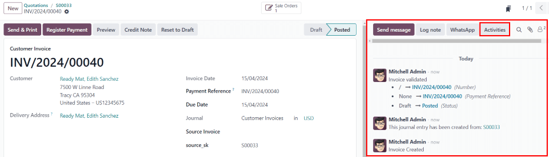
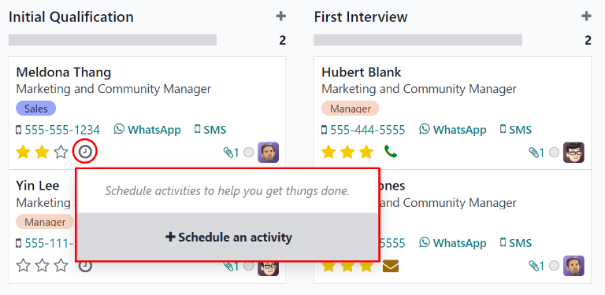
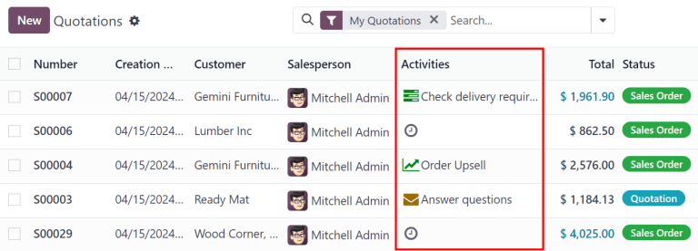
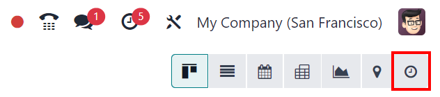
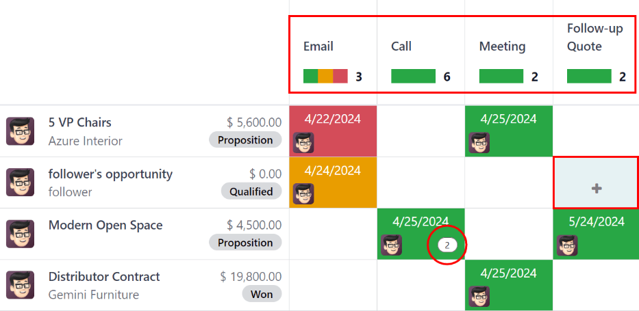
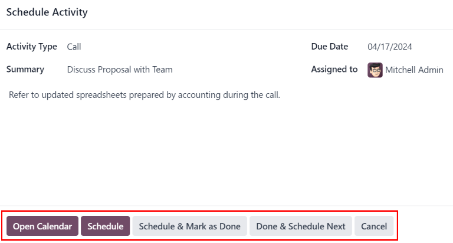
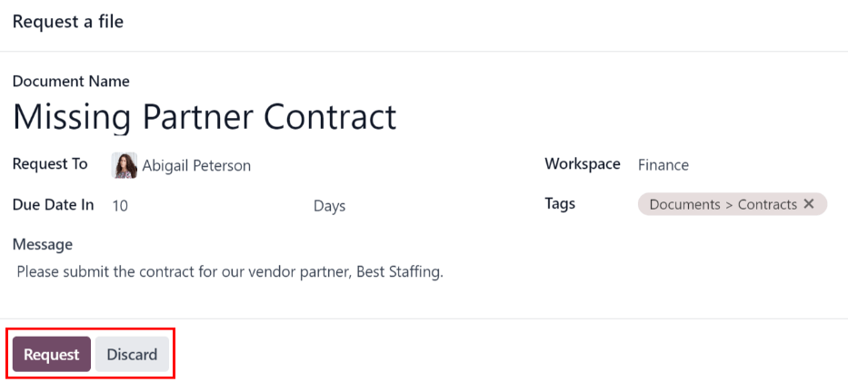
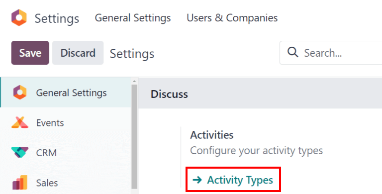
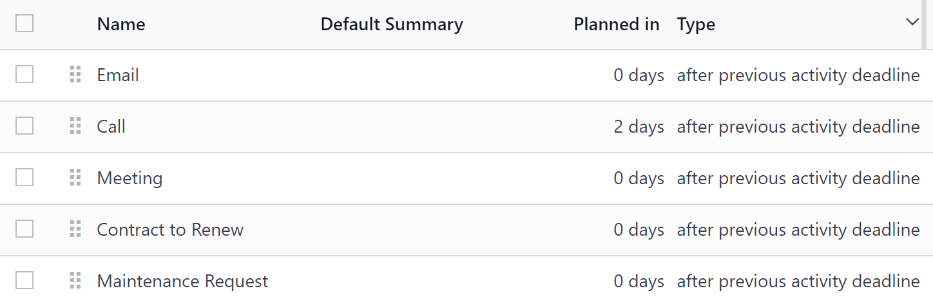
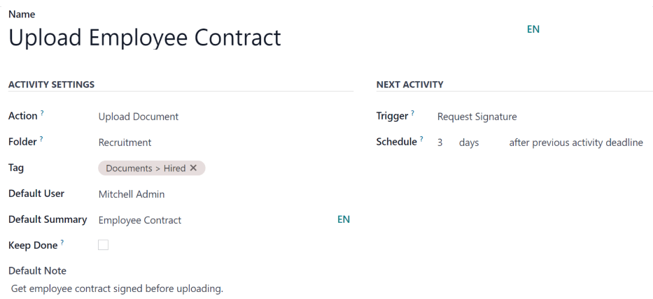

# Hoạt động

*Hoạt động* là các nhiệm vụ follow-up liên quan đến một bản ghi trong cơ sở dữ liệu Odoo.

<a id="activities-important"></a>

Biểu tượng được sử dụng để hiển thị các hoạt động sẽ khác nhau tùy thuộc vào [loại hoạt động](#activities-types):

- Biểu tượng <i class="fa fa-clock-o"></i> (đồng hồ): biểu tượng hoạt động mặc định.
- Biểu tượng <i class="fa fa-phone"></i> (điện thoại): cuộc gọi điện thoại đã được lên lịch.
- Biểu tượng <i class="fa fa-envelope"></i> (phong bì): email đã được lên lịch.
- Biểu tượng <i class="fa fa-check"></i> (dấu tích): việc cần làm đã được lên lịch.
- Biểu tượng <i class="fa fa-users"></i> (người): cuộc họp đã được lên lịch.
- Biểu tượng <i class="fa fa-upload"></i> (tải lên): tài liệu đã được lên lịch tải lên.
- Biểu tượng <i class="fa fa-pencil-square-o"></i> (yêu cầu chữ ký): yêu cầu chữ ký đã được lên lịch

## Lên lịch hoạt động

Có thể lên lịch các hoạt động trên bất kỳ trang nào của cơ sở dữ liệu có chứa [cửa sổ trò chuyện](#activities-chatter), [chế độ xem Kanban](#activities-kanban), [chế độ xem danh sách](#activities-list) hoặc [chế độ xem hoạt động](#activities-activity) của ứng dụng.

<a id="activities-chatter"></a>

### Cửa sổ trò chuyện

Có thể tạo hoạt động từ nội dung trò chuyện trên bất kỳ bản ghi nào.

Để lên lịch cho một hoạt động mới, nhấp nút Hoạt động, nằm ở đầu cửa sổ trò chuyện. Trong cửa sổ pop-up Lên lịch hoạt động xuất hiện, [điền vào biểu mẫu Lên lịch hoạt động](#activities-form).



<a id="activities-kanban"></a>

### Chế độ xem kanban

Bạn có thể tạo hoạt động từ chế độ xem <i class="oi oi-view-kanban"></i> (Kanban).

Để tiến hành, nhấp vào biểu tượng 

```
|đồng hồ|
```

 nằm ở cuối mỗi bản ghi.

Nhấp + Lên lịch một hoạt động, sau đó [điền vào biểu mẫu Lên lịch hoạt động](#activities-form).



#### NOTE
Nếu một bản ghi đã có hoạt động được lên lịch, biểu tượng 

```
|đồng hồ|
```

 sẽ được thay thế bằng biểu tượng đại diện cho hoạt động được lên lịch có sẵn. Nhấp vào biểu tượng của loại hoạt động để lên lịch hoạt động khác.

<a id="activities-list"></a>

### Chế độ xem danh sách

Bạn cũng có thể tạo hoạt động từ chế độ xem <i class="oi oi-view-list"></i> (danh sách).

Nếu cột Hoạt động bị ẩn, hãy hiển thị cột này bằng cách sử dụng biểu tượng <i class="oi oi-settings-adjust"></i> (điều chỉnh cài đặt) ở phía bên phải của hàng trên cùng.

Sau đó, nhấp vào biểu tượng 

```
|đồng hồ|
```

 cho bản ghi mà hoạt động đang được thêm vào và nhấp + Lên lịch một hoạt động. [Điền vào biểu mẫu Lên lịch hoạt động](#activities-form) xuất hiện.

#### NOTE
Nếu một bản ghi đã có hoạt động được lên lịch, biểu tượng 

```
|đồng hồ|
```

 sẽ được thay thế bằng biểu tượng đại diện cho hoạt động được lên lịch có sẵn. Nhấp vào biểu tượng của loại hoạt động để lên lịch hoạt động khác.



<a id="activities-activity"></a>

### Chế độ xem hoạt động

Hầu hết các ứng dụng trong Odoo đều có chế độ xem *Hoạt động*. Nếu có, một biểu tượng 

```
|đồng hồ|
```

 sẽ hiển thị ở góc trên bên phải của thanh menu chính, trong số các biểu tượng tùy chọn chế độ xem khác.

Để mở chế độ xem hoạt động, nhấp biểu tượng 

```
|đồng hồ|
```

.



Ở chế độ xem này, mọi hoạt động có sẵn sẽ được liệt kê trong các cột, trong khi các dòng theo chiều ngang thể hiện tất cả bản ghi riêng lẻ.

Các hoạt động hiển thị màu xanh lá cây có thời hạn trong tương lai, các hoạt động hiển thị màu cam đến hạn vào hôm nay, trong khi các hoạt động hiển thị màu đỏ là đã quá hạn.

Thanh màu trong mỗi cột biểu thị các bản ghi cho những loại hoạt động cụ thể và hiển thị số cho biết có bao nhiêu hoạt động được lên lịch cho loại hoạt động đó.

Nếu có nhiều loại hoạt động được lên lịch cho một bản ghi, một con số tương ứng với tổng số hoạt động đã lên lịch sẽ xuất hiện.

#### NOTE
Màu sắc của hoạt động và mối quan hệ của chúng với ngày hết hạn của hoạt động thống nhất trong Odoo, bất kể loại hoạt động hay chế độ xem.

Để lên lịch hoạt động cho một bản ghi, hãy di chuột qua trường tương ứng. Nhấp vào biểu tượng <i class="fa fa-plus"></i> (dấu cộng), sau đó  [điền vào biểu mẫu Lên lịch hoạt động](#activities-form).



<a id="activities-form"></a>

### Biểu mẫu Lên lịch hoạt động

Có thể lên lịch hoạt động từ nhiều nơi khác nhau, chẳng hạn như từ [cửa sổ trò chuyện](#activities-chatter) của bản ghi hoặc từ một trong nhiều chế độ xem của ứng dụng, nếu có: [chế độ xem Kanban](#activities-kanban), [chế độ xem danh sách](#activities-list) hoặc [chế độ xem hoạt động](#activities-activity).

Nhập thông tin sau đây trên biểu mẫu:

- Loại hoạt động: chọn loại hoạt động từ menu thả xuống. Các tùy chọn mặc định là: Email, Cuộc gọi, Cuộc họp hoặc Việc cần làm. Tùy vào những ứng dụng khác được cài đặt, có thể có các tùy chọn bổ sung.
- Tóm tắt: nhập tiêu đề ngắn gọn cho hoạt động, ví dụ như `Thảo luận báo giá`.
- Ngày đến hạn: sử dụng cửa sổ bật lên trên lịch để chọn ngày đến hạn của hoạt động.
- Phân công cho: theo mặc định, người dùng hiện tại sẽ được điền vào trường này. Để phân công một người dùng khác cho hoạt động, hãy chọn người dùng đó từ menu thả xuống.
- Ghi chú: thêm bất kỳ thông tin bổ sung nào cho hoạt động trong trường này.

Khi cửa sổ bật lên Lên lịch hoạt động hoàn tất, hãy nhấp vào một trong các nút sau:

- Mở lịch: mở lịch của người dùng để thêm và lên lịch hoạt động.

  Nhấp vào ngày và giờ mong muốn cho hoạt động, và cửa sổ bật lên Sự kiện mới sẽ xuất hiện. Tóm tắt từ cửa sổ bật lên *Lên lịch hoạt động* sẽ được điền vào trường Tiêu đề.

  Nhập thông tin vào cửa sổ bật lên Sự kiện mới, sau đó nhấp vào Lưu & Đóng để lên lịch. Sau khi lên lịch, hoạt động sẽ được thêm vào phần Hoạt động đã lên kế hoạch của cửa sổ trò chuyện.

  #### IMPORTANT
  Nút Mở lịch chỉ xuất hiện nếu Loại hoạt động được đặt thành Cuộc gọi hoặc Cuộc họp.
- Lên lịch: lên lịch hoạt động, và thêm hoạt động vào phần Hoạt động theo kế hoạch trong cửa sổ trò chuyện.
- Lên lịch & Đánh dấu là hoàn tất: thêm chi tiết của hoạt động vào phần Hôm nay trong cửa sổ trò chuyện. Hoạt động không được lên lịch mà sẽ tự động được đánh dấu là đã hoàn tất.
- Hoàn tất & Lên lịch tiếp theo: thêm chi tiết về hoạt động vào phần Hôm nay trong cửa sổ trò chuyện. Hoạt động không được lên lịch, được tự động đánh dấu là hoàn tất và cửa sổ bật lên Lên lịch hoạt động mới sẽ xuất hiện.
- Huỷ bỏ: huỷ mọi thay đổi được thực hiện trên cửa sổ bật lên Lên lịch hoạt động.



<a id="activities-all"></a>

## Tất cả hoạt động đã lên lịch

Để xem danh sách tất cả hoạt động được sắp xếp theo ứng dụng, hãy nhấp vào biểu tượng 

```
|đồng hồ|
```

 trong menu header, nằm ở góc trên bên phải.

Nếu có hoạt động được lên lịch, số lượng hoạt động sẽ xuất hiện trong bong bóng màu đỏ trên biểu tượng 

```
|đồng hồ|
```

.

Tất cả hoạt động cho mỗi ứng dụng được chia thành các tiểu mục, cho biết vị trí trong ứng dụng mà hoạt động sẽ được hoàn thành. Mỗi tiểu mục liệt kê số lượng các hoạt động đã lên lịch là Trễ, đến hạn Hôm nay và được lên lịch trong Tương lai.

### Yêu cầu tài liệu

Tùy chọn Yêu cầu tài liệu có sẵn ở cuối danh sách [tất cả hoạt động đã lên lịch](#activities-all). Nhấp vào Yêu cầu tài liệu và cửa sổ bật lên Yêu cầu tệp sẽ xuất hiện.

Nhập thông tin sau đây trên biểu mẫu:

- Tên tài liệu: nhập tên cho tài liệu được yêu cầu.
- Yêu cầu từ: chọn người dùng mà tài liệu được yêu cầu từ họ bằng cách sử dụng menu thả xuống.
- Ngày đến hạn vào: nhập giá trị số cho biết thời điểm tài liệu đến hạn. Bên cạnh trường này, trường Ngày sẽ hiển thị. Nhấp vào tùy chọn mặc định Ngày để hiển thị menu thả xuống. Chọn tùy chọn khung thời gian mong muốn từ danh sách. Các tùy chọn là Ngày, Tuần hoặc Tháng.
- Không gian làm việc: sử dụng menu thả xuống, chọn [Không gian làm việc](../productivity/documents.md#documents-workspaces) cụ thể mà tài liệu đang được tải lên.
- Thẻ: chọn bất kỳ thẻ mong muốn nào từ menu thả xuống. Các thẻ khả dụng được hiển thị dựa trên thẻ được cấu hình cho Không gian làm việc đã chọn.
- Nội dung: nhập một lời nhắn để giải thích về yêu cầu tài liệu trong trường này.

Khi đã hoàn thành tất cả các trường, hãy nhấp vào Yêu cầu để gửi yêu cầu tài liệu.



<a id="activities-types"></a>

## Loại hoạt động

Để xem các loại hoạt động hiện được cấu hình trong cơ sở dữ liệu, hãy đi đến Cài đặt ứng dụng ‣ Phần Thảo luận ‣ Cài đặt hoạt động ‣ Loại hoạt động.



Thao tác này sẽ hiển thị trang Loại hoạt động, nơi chứa các loại hoạt động hiện có.



### Chỉnh sửa loại hoạt động

Để chỉnh sửa [loại hoạt động](#activities-types) có sẵn, nhấp vào loại hoạt động và biểu mẫu loại hoạt động sẽ hiển thị.

Thực hiện bất kỳ thay đổi nào trên biểu mẫu loại hoạt động. Biểu mẫu sẽ tự động lưu, nhưng có thể lưu thủ công bất kỳ lúc nào bằng cách nhấp vào tùy chọn Lưu thủ công, được biểu thị bằng biểu tượng <i class="fa fa-cloud-upload"></i> (tải lên đám mây), nằm ở góc trên bên trái của trang.

### Tạo loại hoạt động mới

Để tạo [loại hoạt động](#activities-types) mới, hãy nhấp vào Mới từ trang Loại hoạt động và biểu mẫu loại hoạt động trống sẽ hiển thị.

Nhập Tên cho loại hoạt động ở đầu biểu mẫu, sau đó nhập thông tin sau vào biểu mẫu.

#### Phần cài đặt hoạt động

- Tác vụ: sử dụng menu thả xuống, chọn một tác vụ liên quan đến loại hoạt động mới này. Một số tác vụ kích hoạt các hành vi cụ thể sau khi một hoạt động được lên lịch, chẳng hạn như:
  - Tải tài liệu lên: Nếu được chọn, một liên kết để tải tài liệu lên sẽ được tự động thêm vào hoạt động theo kế hoạch trong cửa sổ trò chuyện.
  - Cuộc gọi hoặc Cuộc họp: nếu được chọn, người dùng có thể mở lịch để chọn ngày và giờ cho hoạt động.
  - Yêu cầu chữ ký: nếu được chọn, một liên kết để mở cửa sổ pop-up yêu cầu chữ ký sẽ tự động được thêm vào hoạt động theo kế hoạch trong cửa sổ trò chuyện. Tính năng này yêu cầu có ứng dụng Odoo *Ký tên*.

  #### NOTE
  Các loại hoạt động khả dụng khác nhau tùy theo ứng dụng được cài đặt trong cơ sở dữ liệu.
- Thư mục: chọn một thư mục [không gian làm việc](../productivity/documents.md#documents-workspaces) cụ thể để lưu tài liệu. Trường này **chỉ** xuất hiện nếu Tải lên tài liệu được chọn cho Tác vụ.

  Sử dụng menu thả xuống, chọn Thư mục mà tài liệu được lưu vào.
- Người dùng mặc định: chọn một người dùng từ menu thả xuống để tự động phân công hoạt động này cho người dùng đã chọn khi loại hoạt động này được lên lịch. Nếu trường này trống, hoạt động sẽ được phân công cho người dùng tạo hoạt động.
- Tóm tắt mặc định: nhập ghi chú được đưa vào bất cứ khi nào loại hoạt động này được tạo.

  #### NOTE
  Thông tin trong các trường Người dùng mặc định và Tóm tắt mặc định có sẵn khi một hoạt động được tạo. Tuy nhiên, bạn có thể thay đổi chúng trước khi lên lịch hoặc lưu hoạt động.
- Giữ hoạt động hoàn tất: đánh dấu vào hộp kiểm này để hiển thị các hoạt động đã được đánh dấu là `Hoàn tất` trong [chế độ xem hoạt động](#activities-activity).
- Ghi chú mặc định: nhập bất kỳ ghi chú nào sẽ xuất hiện cùng hoạt động.

#### Phần hoạt động tiếp theo

Bạn có thể kích hoạt hoặc đề xuất một hoạt động khác. Để thực hiện, cấu hình phần Hoạt động tiếp theo.

- Loại chuỗi: chọn Đề xuất hoạt động tiếp theo hoặc Kích hoạt hoạt động tiếp theo từ menu thả xuống. Tùy vào tùy chọn đã chọn, trường Đề xuất hoặc Kích hoạt sẽ được hiển thị.

  #### NOTE
  Trường Loại chuỗi **không** xuất hiện nếu Tải lên tài liệu được chọn cho Tác vụ.
- Đề xuất/Kích hoạt: tùy thuộc vào những gì được chọn cho Loại chuỗi, trường này sẽ hiển thị Đề xuất hoặc Kích hoạt. Sử dụng menu thả xuống, chọn hoạt động để đề xuất hoặc lên lịch nhiệm vụ follow-up cho loại hoạt động.
- Lên lịch: cấu hình thời điểm hoạt động tiếp theo được đề xuất hoặc kích hoạt.

  Đầu tiên, nhập giá trị số cho biết thời điểm hoạt động được đề xuất hoặc kích hoạt.

  Bên cạnh trường này, trường Ngày sẽ hiển thị. Nhấp vào tùy chọn mặc định Ngày để hiển thị menu thả xuống. Chọn tùy chọn khung thời gian mong muốn từ danh sách. Các tùy chọn là Ngày, Tuần hoặc Tháng.

  Cuối cùng, sử dụng menu thả xuống, chọn xem hoạt động được lên lịch hay kích hoạt sau thời hạn hoạt động trước đó hay sau ngày hoàn thành.



#### SEE ALSO
- [Thảo luận](../productivity/discuss.md)
- [Use channels for team communication](../productivity/discuss/team_communication.md)
- [Utilize activities for sales teams](../sales/crm/optimize/utilize_activities.md)
