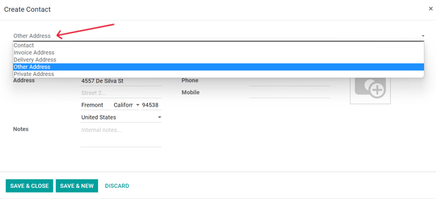

# Liên hệ

The *Contacts* application comes installed on all Odoo databases. Contacts are created for customers
the company does business with through Odoo. A contact is a repository of vital business
information, facilitating communication and business transactions.

## Biểu mẫu liên hệ

Để tạo một liên hệ mới, đi đến ứng dụng Liên hệ và nhấp vào Tạo. Một biểu mẫu mới sẽ xuất hiện, tại đó bạn có thể thêm nhiều thông tin liên hệ khác nhau.

### Loại liên hệ

Odoo hỗ trợ cả liên hệ Cá nhân và Công tay. Chọn Cá nhân hoặc Công ty, tùy vào loại liên hệ đang được thêm.

### Tên

Đầu tiên, hãy điền tên của Cá nhân hoặc Công ty. Đây là tên sẽ xuất hiện trong toàn bộ cơ sở dữ liệu. Trường này **bắt buộc**.

### Địa chỉ

Tiếp theo, nhập Địa chỉ của Công ty hoặc Cá nhân.

### Trường bổ sung

Thông tin bổ sung được bao gồm trong biểu mẫu ban đầu. Gồm có các trường sau đây:

- Thuế GTGT: Mã số thuế giá trị gia tăng.
- Định danh cá nhân: số định danh cá nhân hoặc căn cước công dân (chỉ có trên Cá nhân).
- Chức vụ: điền chức vụ của Cá nhân (chỉ có trên Cá nhân).
- Điện thoại: điền số điện thoại (gồm mã quốc gia). Gọi điện, gửi tin nhắn SMS hoặc tin nhắn WhatsApp bằng cách di chuột qua trường trên biểu mẫu đã lưu và nhấp vào tùy chọn mong muốn.
- Di động: điền số điện thoại di động (gồm mã quốc gia). Gọi điện, gửi tin nhắn SMS hoặc tin nhắn WhatsApp bằng cách di chuột qua trường trên biểu mẫu đã lưu và nhấp vào tùy chọn mong muốn.
- Email: nhập địa chỉ email có chứa tên miền.
- Trang web: nhập địa chỉ trang web đầy đủ, bắt đầu bằng `http` hoặc `https`.
- Danh xưng: chọn Tiến sĩ, Bà, Cô, Ông, Giáo sư, hoặc tạo một mục mới ngay từ trường này.
- Thẻ: thêm các thẻ cấu hình sẵn bằng cách nhập chúng vào trường hoặc nhấp vào menu thả xuống và chọn một thẻ. Để tạo một thẻ mới, hãy nhập thẻ mới vào trường và nhấp Tạo từ menu thả xuống.

### Tab Liên hệ & Địa chỉ

Ở cuối biểu mẫu liên hệ có một số tab. Trên tab Liên hệ & Địa chỉ, có thể thêm các liên hệ được liên kết với Công ty và các địa chỉ liên quan. Ví dụ, một người liên hệ cụ thể của công ty có thể được liệt kê ở đây.

Có thể thêm nhiều địa chỉ vào cả liên hệ Cá nhân và Công ty. Để thực hiện, nhấp vào Thêm trong tab Liên hệ & Địa chỉ. Sau đó, một biểu mẫu pop-up Tạo liên hệ sẽ hiển thị và bạn có thể cấu hình thêm các địa chỉ trong đó.

Trên biểu mẫu pop-up Tạo liên hệ, bắt đầu bằng cách nhấp vào trường mặc định Địa chỉ khác ở trên cùng để hiển thị menu thả xuống gồm các tùy chọn liên quan đến địa chỉ.

Chọn bất kỳ tùy chọn nào sau đây:

- Liên hệ: thêm một liên hệ khác vào biểu mẫu liên hệ hiện có.
- Địa chỉ lập hóa đơn: thêm địa chỉ lập hóa đơn cụ thể vào biểu mẫu liên hệ hiện có.
- Địa chỉ giao hàng: thêm địa chỉ giao hàng cụ thể vào biểu mẫu liên hệ hiện có.
- Địa chỉ khác: thêm địa chỉ thay thế vào biểu mẫu liên hệ hiện có.
- Địa chỉ riêng tư: thêm địa chỉ riêng tư vào biểu mẫu liên hệ hiện có.

Sau khi chọn một tùy chọn, hãy nhập thông tin liên hệ tương ứng cần sử dụng cho loại địa chỉ đã chỉ định.

Thêm Tên liên hệ, Địa chỉ, Email, cùng với Điện thoại và/hoặc Di động bên dưới.

Điền Chức vụ, trường này xuất hiện nếu loại địa chỉ Liên hệ đã được chọn. Điều này tương tự như liên hệ Cá nhân.

Để thêm ghi chú, hãy nhấp vào trường văn bản bên cạnh Ghi chú và viết bất kỳ thông tin nào áp dụng cho khách hàng hoặc liên hệ.

Sau đó, nhấp vào Lưu & Đóng để lưu địa chỉ và đóng cửa sổ Tạo liên hệ. Hoặc, nhấp vào Lưu & Mới để lưu địa chỉ và tạo địa chỉ khác.

### Tab Bán hàng & Mua hàng

Tiếp theo là tab Bán hàng & Mua hàng, chỉ xuất hiện khi các ứng dụng *Bán hàng*, *Mua hàng*, **hoặc**  *Điểm bán hàng* được cài đặt.

Vị trí tài chính có thể được thiết lập trên tab Bán hàng & Mua hàng. Chọn Vị trí tài chính từ menu thả xuống.

#### Phần bán hàng

Trong tiêu đề Bán hàng, bạn có thể chỉ định một Chuyên viên sales cụ thể cho một liên hệ. Để thực hiện, hãy nhấp vào trường thả xuống Chuyên viên sales và chọn một liên hệ. Tạo một Chuyên viên sales mới bằng cách nhập tên người dùng và thực hiện lựa chọn phù hợp.

Một số Điều khoản thanh toán hoặc Bảng giá nhất định cũng có thể được thiết lập, nếu cần. Nhấp vào menu thả xuống bên cạnh Điều khoản thanh toán và thay đổi thành một trong các Điều khoản thanh toán đã chọn trước hoặc Tạo một điều khoản mới. Chọn menu thả xuống Bảng giá để chọn Bảng giá phù hợp.

Nhấp vào trường Phương thức giao hàng để chọn một tùy chọn từ menu thả xuống.

#### Phần Điểm bán hàng

Trong tiêu đề Điểm bán hàng, hãy nhập Mã vạch có thể được sử dụng để xác định liên hệ. Sử dụng trường Điểm thưởng để theo dõi điểm mà người dùng đã thu thập được khi tham gia *Chương trình khách hàng thân thiết*.

#### Phần mua hàng

Chỉ định Điều khoản thanh toán, thông tin Hộp 1099 và Phương thức thanh toán ưa thích tại đây. Bạn cũng có thể thiết lập Nhắc nhở nhận hàng tại đây.

#### Phần thông tin khác

Trong tiêu đề Thông tin khác, sử dụng trường Tham chiếu để thêm bất kỳ thông tin bổ sung nào cho liên hệ này. Nếu chỉ một công ty trong cơ sở dữ liệu đa công ty mới có thể truy cập liên hệ này, hãy chọn liên hệ đó từ danh sách thả xuống của trường Công ty. Sử dụng menu thả xuống Trang web để giới hạn việc đăng liên hệ này chỉ cho trang web đó (nếu làm việc trên cơ sở dữ liệu có nhiều trang web). Chọn một hoặc nhiều Thẻ trang web để hỗ trợ lọc khách hàng đã đăng trên trang web `/customers`. Chọn Ngành cho liên hệ này từ menu thả xuống. Sử dụng trường Chính sách SLA để chỉ định chính sách SLA *Hỗ trợ* cho liên hệ này.

### Tab kế toán

Tab Kế toán xuất hiện khi ứng dụng *Kế toán* được cài đặt. Tại đây, người dùng có thể thêm bất kỳ Tài khoản ngân hàng nào có liên quan hoặc đặt Bút toán kế toán mặc định.

Trong tiêu đề Thông tin khác, hãy sử dụng trường LEI để nhập Mã định danh pháp nhân nếu cần.

### Tab ghi chú nội bộ

Kế tiếp tab Kế toán là tab Ghi chú nội bộ, nơi bạn có thể ghi chú vào biểu mẫu liên hệ này, giống như biểu mẫu liên hệ đã ghi chú ở trên.

### Tab phân công đối tác

Tiếp theo là tab Phân công đối tác. Theo mặc định, tab này bao gồm phần Vị trí địa lý và các tùy chọn đối tác khác, bao gồm Kích hoạt đối tác và Đánh giá đối tác. Những tùy chọn này **chỉ** có khi phân hệ  *Đối tác* được cài đặt.

#### SEE ALSO
Tìm hiểu [Tài liệu về đối tác](../../sales/crm/track_leads/resellers.md) để biết thêm thông tin về việc đăng đối tác lên trang web.

### Tab chương trình thành viên

Cuối cùng, có tab Tư cách thành viên trên biểu mẫu liên hệ, có thể giúp người dùng quản lý bất kỳ tư cách thành viên nào được cung cấp cho liên hệ này. Cần lưu ý rằng tab này **chỉ** xuất hiện khi ứng dụng *Thành viên* được cài đặt.

#### Kích hoạt chương trình thành viên

Để kích hoạt tư cách thành viên của một liên hệ, hãy nhấp vào Mua tư cách thành viên trong tab Tư cách thành viên của biểu mẫu liên hệ. Trên cửa sổ bật lên xuất hiện, hãy chọn Tư cách thành viên từ menu thả xuống. Sau đó, cấu hình Giá thành viên. Nhấp vào Lập hóa đơn tư cách thành viên khi cả hai trường đã được điền đầy đủ.

Ngoài ra, để cung cấp tư cách thành viên miễn phí, hãy đánh dấu vào ô Thành viên miễn phí trong tab Thành viên của biểu mẫu liên hệ.

#### SEE ALSO
Tham khảo [Tài liệu về thành viên](../../sales/members/) để biết thêm thông tin về việc đăng thành viên trên trang web.

## Nút thông minh

Ở đầu biểu mẫu liên hệ, có một số tùy chọn bổ sung, được gọi là *nút thông minh*.

Tại đây, Odoo hiển thị nhiều bản ghi liên quan đến liên hệ này, được tạo trên các ứng dụng khác. Odoo tích hợp thông tin từ mọi ứng dụng, nên sẽ có nhiều nút thông minh.

Người dùng có thể xem mọi Cuộc họp, Bán hàng, Đơn hàng POS, Đăng ký, Nhiệm vụ dự án và nút thông minh Thêm hiển thị các tùy chọn bổ sung thông qua menu thả xuống. Người dùng thậm chí có thể nhanh chóng truy cập Mua hàng, nhiệm vụ Hỗ trợ, Tỷ lệ đúng hạn cho các lần giao hàng, thông tin Đã lập hóa đơn, Hóa đơn mua hàng và Sổ cái đối tác được kết nối với liên hệ này.

Tương tự, các lệnh giao hàng, tài liệu, thẻ khách hàng thân thiết và lệnh ghi nợ trực tiếp *cũng* được liên kết với các nút thông minh, phòng trường hợp có bất kỳ khoản nợ nào chưa thanh toán/có trong hồ sơ của liên hệ này.

Nếu liên hệ là đối tác, người dùng có thể truy cập trang đối tác của họ trên trang web tạo bằng Odoo bằng cách nhấp vào nút thông minh Đi đến trang web.

### Lưu trữ liên hệ

Nếu quyết định không muốn liên hệ này hoạt động nữa, thì bạn có thể lưu trữ nó. Để thực hiện, hãy vào menu <i class="fa fa-cog"></i> Tác vụ ở đầu biểu mẫu liên hệ và nhấp vào Lưu trữ.

Sau đó, nhấp vào OK từ cửa sổ bật lên Xác nhận.

Sau khi lưu trữ thành công liên hệ, nhận biết qua banner thông báo trên đầu màn hình, thì liên hệ này sẽ không hiển thị trên trang liên hệ chính, nhưng vẫn có thể tìm kiếm bằng bộ lọc Đã lưu trữ.

#### SEE ALSO
- [Thêm các địa chỉ khác trong CRM](../../sales/sales/send_quotations/different_addresses.md)
- [Hướng dẫn tự học về Odoo Liên hệ](https://www.odoo.com/slides/slide/contacts-2527?fullscreen=1)

* [Gộp liên hệ](merge.md)
