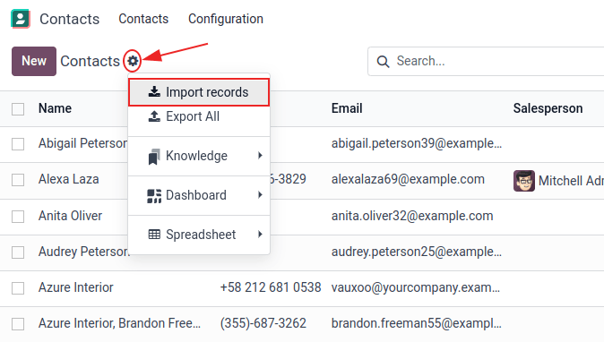
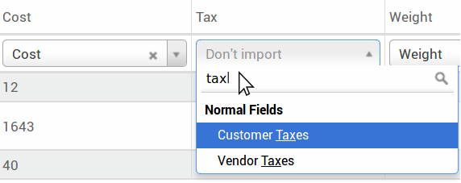

# Xuất và nhập dữ liệu

Trong Odoo, đôi khi cần phải xuất hoặc nhập dữ liệu để chạy báo cáo hoặc để sửa đổi dữ liệu. Tài liệu này đề cập đến việc xuất và nhập dữ liệu vào và ra khỏi Odoo.

#### IMPORTANT
Thỉnh thoảng, người dùng gặp phải lỗi 'hết thời gian' hoặc bản ghi không xử lý được do vấn đề kích thước. Điều này có thể xảy ra trong trường hợp các tệp xuất hoặc nhập quá lớn. Để tránh giới hạn về kích thước bản ghi này, hãy tiến hành xuất hoặc nhập theo nhiều lần với kích thước nhỏ hơn.

<a id="export-data"></a>

## Xuất dữ liệu từ Odoo

Khi làm việc với cơ sở dữ liệu, đôi khi cần phải xuất dữ liệu trong một tệp riêng biệt. Việc này có thể hỗ trợ báo cáo về các hoạt động, dù Odoo vốn đã cung cấp một công cụ báo cáo chính xác và dễ dàng trong từng ứng dụng.

Với Odoo, giá trị có thể được xuất từ ​​bất kỳ trường nào trong bất kỳ bản ghi nào. Để thực hiện, hãy kích hoạt chế độ xem danh sách (<i class="oi oi-view-list"></i> (list) icon), trên các mục cần xuất, sau đó chọn những bản ghi cần xuất. Để chọn một bản ghi, đánh dấu vào hộp kiểm bên cạnh bản ghi tương ứng. Cuối cùng, nhấp vào <i class="fa fa-cog"></i> Actions, sau đó Xuất.


Khi nhấp vào Xuất, một cửa sổ Xuất dữ liệu sẽ bật lên với một số tùy chọn để xuất dữ liệu:


1. Khi tùy chọn Tôi muốn cập nhật dữ liệu (xuất tương ứng nhập) được chọn, hệ thống chỉ hiển thị các trường có thể nhập. Tính năng này hữu ích trong trường hợp [các bản ghi hiện có cần được cập nhật](#essentials-update-data) và sẽ hoạt động giống như một bộ lọc. Nếu không chọn, bạn sẽ có nhiều tùy chọn trường hơn vì tất cả các trường sẽ hiển thị mà không chỉ các trường có thể nhập.
2. Khi xuất, có tùy chọn xuất theo hai định dạng: `.csv` và `.xls`. Với `.csv`, các mục được phân tách bằng dấu phẩy, trong khi `.xls` chứa thông tin về tất cả bảng tính trong một tệp, bao gồm cả nội dung và định dạng.
3. Đây là các mục có thể xuất. Sử dụng biểu tượng > (mũi tên hướng sang phải) để hiển thị thêm nhiều tùy chọn trường con. Sử dụng thanh Tìm kiếm để tìm các trường cụ thể. Để sử dụng tùy chọn Tìm kiếm hiệu quả hơn, hãy nhấp vào tất cả > (mũi tên hướng sang phải) để hiển thị tất cả các trường.
4. Nút biểu tượng + (dấu cộng) có tác dụng thêm các trường vào danh sách Trường cần xuất.
5. Biểu tượng ↕️ (mũi tên lên-xuống) ở bên trái các trường đã chọn có thể được sử dụng để di chuyển các trường lên và xuống, để thay đổi thứ tự hiển thị của chúng trong tệp đã xuất. Kéo và thả bằng biểu tượng ↕️ (mũi tên lên-xuống).
6. Biểu tượng 🗑️ (thùng rác) được sử dụng để xóa các trường. Nhấp vào biểu tượng 🗑️ (thùng rác) để xóa trường.
7. Đối với báo cáo định kỳ, việc lưu sẵn các cài đặt xuất dữ liệu sẽ rất hữu ích. Chọn tất cả trường cần thiết và nhấp vào menu mẫu thả xuống. Khi vào đó, nhấp vào Mẫu mới và đặt tên duy nhất cho tệp xuất vừa tạo. Nhấp vào biểu tượng 💾 (ổ đĩa mềm) để lưu cấu hình. Lần tới khi cần xuất cùng một danh sách, hãy chọn mẫu liên quan đã lưu trước đó từ menu thả xuống.

<a id="import-data"></a>

## Nhập dữ liệu từ Odoo

Việc nhập dữ liệu vào Odoo cực kỳ hữu ích trong quá trình triển khai hoặc trong những thời điểm dữ liệu cần được [cập nhật hàng loạt](#essentials-update-data). Tài liệu sau đây trình bày cách nhập dữ liệu vào cơ sở dữ liệu Odoo.

#### WARNING
Việc nhập dữ liệu là một hành động là vĩnh viễn và **không thể** hoàn tác. Tuy nhiên, có thể sử dụng bộ lọc (`được tạo vào` hoặc `được sửa đổi lần cuối`) để xác định các bản ghi đã thay đổi hoặc được tạo bởi lần nhập dữ liệu.

### Bắt đầu

Dữ liệu có thể được nhập vào bất kỳ đối tượng kinh doanh nào trên Odoo bằng định dạng Excel (`.xlsx`) hoặc  (`.csv`). Bao gồm: liên hệ, sản phẩm, sao kê ngân hàng, bút toán và đơn hàng.

Mở chế độ xem của đối tượng mà dữ liệu cần được nhập/điền vào và nhấp :menuselection: `⚙️ (Tác vụ) --> Nhập bản ghi`.



Sau khi nhấp vào Nhập bản ghi, Odoo sẽ hiển thị một trang riêng chứa các mẫu có thể tải xuống và điền vào bằng dữ liệu của công ty. Bạn có thể nhập các mẫu đó chỉ bằng một cú nhấp chuột, vì quá trình mapping dữ liệu đã được thực hiện. Để tải xuống một mẫu, hãy nhấp vào Mẫu nhập cho khách hàng ở giữa trang.

#### IMPORTANT
Khi nhập tệp , Odoo cung cấp tùy chọn Định dạng. Các tùy chọn này **không** xuất hiện khi nhập loại tệp Excel riêng (`.xls`, `.xlsx`).


Thực hiện những điều chỉnh cần thiết cho các tùy chọn  *Định dạng* và đảm bảo tất cả các cột trong Trường Odoo và Cột tệp không có lỗi. Cuối cùng, nhấp vào Nhập để nhập dữ liệu.

### Điều chỉnh mẫu

Các mẫu nhập được cung cấp trong công cụ nhập của những loại dữ liệu cần nhập phổ biến nhất (liên hệ, sản phẩm, sao kê ngân hàng,...). Mở chúng bằng bất kỳ phần mềm bảng tính nào (*Microsoft Office*, *OpenOffice*, *Google Drive*,...).

Sau khi tải mẫu xuống, hãy làm theo các bước sau:

- Thêm, xóa và sắp xếp các cột sao cho phù hợp nhất với cấu trúc dữ liệu.
- Chúng tôi khuyên bạn **không** nên xóa cột ID ngoài (ID) (xem lý do trong phần tiếp theo).
- Đặt ID duy nhất cho mỗi bản ghi bằng cách kéo trình tự ID xuống trong cột ID ngoài (ID).


#### NOTE
Khi thêm một cột mới, Odoo có thể không tự động map được cột đó nếu nhãn của cột đó không phù hợp với bất kỳ trường nào trong Odoo. Tuy nhiên, bạn có thể map thủ công các cột mới khi kiểm thử quá trình nhập. Tìm kiếm trong menu thả xuống để tìm trường tương ứng.



Sau đó, sử dụng nhãn của trường này trong tệp nhập để đảm bảo các lần nhập trong tương lai thành công.

<a id="essentials-external-id"></a>

### Nhập từ một ứng dụng khác

ID ngoài (ID) là mã định danh duy nhất cho mục hàng. Bạn có thể sử dụng mã định danh từ phần mềm trước đó để dễ dàng chuyển sang Odoo.

Việc thiết lập ID không bắt buộc khi nhập, nhưng sẽ hữu ích trong nhiều trường hợp:

- [Cập nhật tệp nhập](#essentials-update-data): nhập cùng một tệp nhiều lần mà không tạo bản sao.
- [Nhập trường quan hệ](#export-import-data-relation-fields).

Để tạo lại mối quan hệ giữa các bản ghi khác nhau, cần sử dụng ID duy nhất từ ​​ứng dụng gốc để map tới cột ID ngoài (ID) trong Odoo.

Khi một bản ghi khác được nhập và liên kết đến bản ghi đầu tiên, hãy sử dụng **XXX/ID** (XXX/ID ngoài) cho ID duy nhất ban đầu. Bản ghi này cũng có thể được tìm bằng tên.

#### WARNING
Cần lưu ý rằng xung đột sẽ xảy ra nếu hai (hoặc nhiều) bản ghi có cùng *ID ngoài*.

### Thiếu trường để map cột

Odoo sẽ cố gắng tìm loại trường cho mỗi cột bên trong tệp được nhập dựa trên mười dòng đầu tiên của tệp.

Ví dụ, nếu có một cột chỉ chứa số, thì chỉ những trường thuộc loại *số nguyên* mới được hiển thị dưới dạng tùy chọn.

Mặc dù hành vi này có thể hữu ích trong hầu hết các trường hợp, nhưng cũng có khả năng nó sẽ không thành công hoặc cột có thể được map tới một trường không được đề xuất theo mặc định.

Nếu điều này xảy ra, hãy kiểm tra tùy chọn Hiển thị các trường của trường quan hệ (nâng cao), sau đó danh sách đầy đủ các trường sẽ hiển thị cho mỗi cột.


### Thay đổi định dạng nhập dữ liệu

#### NOTE
Odoo có thể tự động phát hiện xem một cột có phải là ngày hay không và cố gắng đoán định dạng ngày từ một tập hợp các định dạng ngày được sử dụng phổ biến nhất. Mặc dù quy trình này có thể khả dụng với nhiều định dạng ngày, nhưng vẫn có một số định dạng ngày không thể nhận dạng được. Điều này có thể gây nhầm lẫn do đảo ngược ngày-tháng, nên sẽ rất khó để đoán phần nào của định dạng ngày là ngày và phần nào là tháng trong một ngày, chẳng hạn như `01-03-2016`.

Khi nhập tệp , Odoo cung cấp tùy chọn Định dạng.

Để xem định dạng ngày nào Odoo tìm thấy từ tệp, hãy kiểm tra Định dạng ngày được hiển thị khi nhấp vào tùy chọn bên dưới trình chọn tệp. Nếu định dạng này không đúng, hãy thay đổi thành định dạng ưa thích bằng cách sử dụng *ISO 8601* để xác định định dạng.

#### IMPORTANT
*ISO 8601* là một tiêu chuẩn quốc tế quy định việc trao đổi thông tin cùng với việc truyền đạt dữ liệu liên quan đến ngày và giờ trên toàn thế giới. Ví dụ, khi định dạng ngày tháng là `YYYY-MM-DD; trong trường hợp ngày 24 tháng 7 năm 1981, nó phải được viết là `1981-07-24`.

### Nhập số kèm ký hiệu tiền tệ

Odoo hỗ trợ đầy đủ các số có dấu ngoặc đơn để biểu thị dấu âm, cũng như các số có dấu tiền tệ đi kèm. Odoo cũng tự động phát hiện dấu phân cách hàng nghìn/dấu thập phân nào được sử dụng. Nếu sử dụng ký hiệu tiền tệ mà Odoo không thể xác định, thì ký hiệu đó có thể không được nhận dạng là số và quá trình nhập sẽ bị lỗi.

#### NOTE
Khi nhập tệp , menu Định dạng sẽ xuất hiện ở cột bên trái. Trong các tùy chọn này, có thể thay đổi Dấu phân cách hàng nghìn.

Ví dụ về các số được hỗ trợ (sử dụng 'ba mươi hai nghìn' làm con số):

- 32.000,00
- 32000,00
- 32,000.00
- -32000.00
- (32000.00)
- $ 32.000,00
- (32000.00 €)

Ví dụ về dữ liệu không được hỗ trợ

- ABC 32.000,00
- $ (32.000,00)

#### IMPORTANT
Dấu () (dấu ngoặc đơn) xung quanh số cho biết số đó là giá trị âm. Ký hiệu tiền tệ **phải** được đặt trong dấu ngoặc đơn để Odoo nhận dạng đó là giá trị tiền tệ âm.

### Bảng xem trước nhập dữ liệu không hiển thị đúng

Theo mặc định, bản xem trước nhập dữ liệu có dấu phẩy làm dấu phân cách trường và dấu ngoặc kép làm dấu phân cách văn bản. Nếu tệp  không có những thiết lập này, hãy sửa đổi các tùy chọn Định dạng (hiển thị bên dưới thanh tệp  Nhập sau khi chọn tệp ).

#### IMPORTANT
Nếu tệp  có bảng phân cách, Odoo sẽ **không** phát hiện ra các phần phân cách. Các tùy chọn định dạng tệp cần được sửa đổi trong ứng dụng bảng tính. Xem phần [Thay đổi định dạng tệp CSV](#export-import-data-change-csv) sau.

<a id="export-import-data-change-csv"></a>

### Thay đổi định dạng tệp CSV trong ứng dụng bảng tính

Khi chỉnh sửa và lưu tệp  trong các ứng dụng bảng tính, cài đặt khu vực của máy tính được áp dụng cho các dấu phân cách. Odoo đề xuất sử dụng *OpenOffice* hoặc *LibreOffice*, vì cả hai ứng dụng đều cho phép sửa đổi cả ba tùy chọn (từ ứng dụng *LibreOffice*, đi đến hộp thoại 'Lưu dưới dạng' ‣ Chọn ô 'Chỉnh sửa cài đặt bộ lọc' ‣ Lưu).

Microsoft Excel có thể sửa đổi mã hóa khi lưu (hộp thoại 'Lưu dưới dạng' ‣ menu 'Công cụ' thả xuống ‣ tab Mã hóa).

### Sự khác biệt giữa ID cơ sở dữ liệu và ID ngoài

Một số trường xác định mối quan hệ với một đối tượng khác. Ví dụ, quốc gia của một liên hệ là liên kết đến bản ghi của đối tượng 'Quốc gia'. Khi các trường này được nhập, Odoo phải tạo lại liên kết giữa các bản ghi khác nhau. Để hỗ trợ nhập các trường như vậy, Odoo cung cấp ba cơ chế.

#### IMPORTANT
Chỉ nên sử dụng **một** cơ chế cho mỗi trường được nhập.

Ví dụ, để tham chiếu quốc gia của một liên hệ, Odoo đề xuất ba trường khác nhau để nhập:

- Quốc gia: tên hoặc mã của quốc gia
- ID quốc gia/cơ sở dữ liệu: ID Odoo duy nhất cho một bản ghi, được xác định bởi cột ID PostgreSQL
- ID quốc gia/ngoài: ID của bản ghi này được tham chiếu trong ứng dụng khác (hoặc tệp `.XML` đã nhập nó)

Ví dụ, khi quốc gia là Bỉ, hãy sử dụng một trong ba cách sau để nhập:

- Quốc gia: `Bỉ`
- ID quốc gia/cơ sở dữ liệu: `21`
- ID quốc gia/ngoài: `base.be`

Theo nhu cầu của công ty, hãy sử dụng một trong ba cách sau để tham chiếu hồ sơ trong quan hệ. Sau đây là ví dụ khi nào nên sử dụng cách nào, tùy theo nhu cầu:

- Sử dụng Quốc gia: đây là cách dễ nhất khi dữ liệu đến từ các tệp  được tạo thủ công.
- Sử dụng ID quốc gia/cơ sở dữ liệu: cách này hiếm khi được sử dụng. Nó chủ yếu được các lập trình viên sử dụng vì lợi thế chính là không bao giờ có xung đột (có thể có một số bản ghi có cùng tên, nhưng chúng luôn có một ID cơ sở dữ liệu duy nhất)
- Sử dụng ID quốc gia/ngoài: sử dụng *ID ngoài* khi nhập dữ liệu từ ứng dụng của bên thứ ba.

Khi sử dụng *ID ngoài*, hãy nhập các tệp  với cột ID ngoài (ID) xác định *ID ngoài* của mỗi bản ghi được nhập. Sau đó, có thể tham chiếu đến bản ghi đó bằng các cột, như `Trường/ID ngoài`. Hai tệp  sau đây cung cấp ví dụ về các sản phẩm và danh mục của chúng.

- [`Tệp CSV cho danh mục`](export_import_data/External_id_3rd_party_application_product_categories.csv)
- [`Tệp CSV cho Sản phẩm`](export_import_data/External_id_3rd_party_application_products.csv)

<a id="export-import-data-relation-fields"></a>

### Nhập trường quan hệ

Một đối tượng Odoo luôn liên quan đến nhiều đối tượng khác (VD: một sản phẩm được liên kết với danh mục sản phẩm, thuộc tính, nhà cung cấp,...). Để nhập các mối quan hệ đó, trước tiên cần nhập các bản ghi của đối tượng liên quan từ menu danh sách của riêng chúng.

Điều này có thể đạt được bằng cách sử dụng tên của bản ghi liên quan hoặc ID của bản ghi đó, tùy từng trường hợp. ID được sử dụng khi hai bản ghi có cùng tên. Khi đó, hãy thêm `/ID` vào cuối tiêu đề cột (VD: đối với thuộc tính sản phẩm: `Thuộc tính sản phẩm/Thuộc tính/ID`).

#### Tùy chọn cho nhiều kết quả khớp trên các trường

Ví dụ, nếu có hai danh mục sản phẩm có tên thành phần là `Có thể bán` (ví dụ: `Sản phẩm hỗn hợp/Có thể bán` & `Sản phẩm khác/Có thể bán`), thì quá trình xác thực sẽ dừng lại, nhưng dữ liệu vẫn có thể được nhập. Tuy nhiên, Odoo khuyến nghị không nhập dữ liệu vì tất cả sẽ được liên kết với danh mục `Có thể bán` đầu tiên được tìm thấy trong danh sách *Danh mục sản phẩm* (`Sản phẩm hỗn hợp/Có thể bán`). Thay vào đó, bạn nên sửa đổi một trong các giá trị trùng lặp hoặc phân cấp danh mục sản phẩm.

Tuy nhiên, nếu công ty không muốn thay đổi cấu hình danh mục sản phẩm, Odoo khuyên bạn nên sử dụng *ID ngoài* cho trường 'Danh mục' này.

#### Nhập trường quan hệ many2many

Các thẻ phải được phân tách bằng dấu phẩy, không có khoảng cách. Ví dụ, nếu khách hàng cần được liên kết đến cả hai thẻ: `Nhà sản xuất` và `Nhà bán lẻ` thì `Nhà sản xuất,Nhà bán lẻ' cần được mã hóa trong cùng một cột của tệp :abbr:`CSV (Giá trị phân tách bằng dấy phẩy)`.

- [`Tệp CSV cho Nhà sản xuất, Nhà bán lẻ`](export_import_data/m2m_customers_tags.csv)

#### Nhập quan hệ one2many

Nếu một công ty muốn nhập đơn bán hàng có nhiều dòng, thì **phải** dành riêng một hàng cụ thể trong tệp  cho mỗi dòng đơn hàng. Dòng đầu tiên được nhập vào cùng một hàng với thông tin liên quan đến đơn hàng. Mọi dòng bổ sung cũng cần một hàng bổ sung không chứa bất kỳ thông tin nào trong các trường liên quan đến đơn hàng.

Ví dụ, đây là tệp  chứa một số báo giá có thể được nhập dựa trên dữ liệu demo:

- [`Tệp cho một số Báo giá`](export_import_data/purchase.order_functional_error_line_cant_adpat.csv)

Tệp  sau đây hiển thị cách nhập đơn mua hàng với các dòng đơn mua hàng tương ứng:

- [`Đơn mua hàng với các dòng đơn mua hàng tương ứng`](export_import_data/o2m_purchase_order_lines.csv)

Tệp  sau đây hiển thị cách nhập khách hàng và thông tin liên hệ tương ứng của họ:

- [`Khách hàng và các liên hệ tương ứng của họ`](export_import_data/o2m_customers_contacts.csv)

### Nhập bản ghi nhiều lần

Nếu tệp được nhập có chứa một trong các cột: ID ngoài hoặc ID cơ sở dữ liệu, thì các bản ghi đã được nhập sẽ được sửa đổi, thay vì được tạo. Điều này cực kỳ hữu ích vì nó cho phép người dùng nhập cùng một tệp  nhiều lần, trong khi đã thực hiện một số thay đổi giữa hai lần nhập.

Odoo sẽ xử lý việc tạo hoặc sửa đổi từng bản ghi, tùy thuộc vào việc bản ghi đó có mới hay không.

Tính năng này cho phép công ty sử dụng *Công cụ nhập/xuất* trong Odoo để sửa đổi hàng loạt bản ghi trong ứng dụng bảng tính.

### Giá trị không được cung cấp cho một trường cụ thể

Nếu tất cả các trường không được thiết lập trong tệp CSV, Odoo sẽ gán giá trị mặc định cho mọi trường không được xác định. Nhưng nếu các trường được thiết lập với giá trị trống trong tệp , Odoo sẽ thiết lập giá trị trống trong trường, thay vì gán giá trị mặc định.

### Xuất/nhập các bảng khác nhau từ ứng dụng SQL vào Odoo

Nếu dữ liệu cần được nhập từ các bảng khác nhau, cần phải tạo lại các mối quan hệ giữa những bản ghi thuộc về các bảng khác nhau. Ví dụ, nếu cần nhập công ty và người, thì bạn cần phải tạo lại liên kết giữa mỗi người và công ty mà họ làm việc.

Để quản lý mối quan hệ giữa các bảng, hãy sử dụng tiện ích `ID ngoài` của Odoo. `ID ngoài` của một bản ghi là mã định danh duy nhất của bản ghi này trong một ứng dụng khác. `ID ngoài` không được trùng lặp trên tất cả bản ghi của mọi đối tượng. Một phương pháp hữu ích là thêm tiền tố `ID ngoài` này bằng tên của ứng dụng hoặc bảng (như, 'company_1', 'person_1' - thay vì '1').

Ví dụ, giả sử có một cơ sở dữ liệu SQL với hai bảng cần nhập: công ty và người. Mỗi người thuộc về một công ty, thì liên kết giữa một người và công ty mà họ làm việc phải được tạo lại.

Hãy kiểm thử ví dụ này bằng [`mẫu cơ sở dữ liệu PostgreSQL`](export_import_data/database_import_test.sql).

Đầu tiên, xuất tất cả công ty và *ID ngoài* của chúng. Trong PSQL, hãy viết lệnh sau:

```sh
> copy (select 'company_'||id as "External ID",company_name as "Name",'True' as "Is a Company" from companies) TO '/tmp/company.csv' with CSV HEADER;
```

Lệnh SQL này tạo ra tệp  sau:

```text
External ID,Name,Is a Company
company_1,Bigees,True
company_2,Organi,True
company_3,Boum,True
```

Để tạo tệp  cho những người được liên kết với công ty, hãy sử dụng lệnh SQL sau trong PSQL:

```sh
> copy (select 'person_'||id as "External ID",person_name as "Name",'False' as "Is a Company",'company_'||company_id as "Related Company/External ID" from persons) TO '/tmp/person.csv' with CSV
```

Nó tạo ra tệp  sau:

```text
External ID,Name,Is a Company,Related Company/External ID
person_1,Fabien,False,company_1
person_2,Laurence,False,company_1
person_3,Eric,False,company_2
person_4,Ramsy,False,company_3
```

Trong tệp này, Fabien và Laurence đang làm việc cho công ty Bigees (`company_1`), và Eric đang làm việc cho công ty Organi. Mối quan hệ giữa mọi người và công ty được thực hiện bằng cách sử dụng *ID ngoài* của các công ty. *ID ngoài* được thêm tiền tố là tên của bảng để tránh xung đột ID giữa người và công ty (`person_1` và `company_1`, những người có cùng một ID 1 trong cơ sở dữ liệu gốc).

Hai tệp được tạo ra đã sẵn sàng để nhập vào Odoo mà không cần bất kỳ sửa đổi nào. Sau khi nhập hai tệp  này, có bốn liên hệ và ba công ty (hai liên hệ đầu tiên được liên kết với công ty đầu tiên). Hãy nhớ nhập công ty trước, sau đó đến người.

<a id="essentials-update-data"></a>

## Cập nhật dữ liệu trong Odoo

Dữ liệu hiện có có thể được cập nhật hàng loạt thông qua quá trình nhập dữ liệu, miễn là [ID ngoài](#essentials-external-id) vẫn nhất quán.

### Chuẩn bị xuất dữ liệu

Để cập nhật dữ liệu thông qua quá trình nhập, trước tiên hãy điều hướng đến dữ liệu cần cập nhật và chọn <i class="oi oi-view-list"></i> (list) icon để kích hoạt chế độ xem danh sách. Ở phía bên trái của danh sách, đánh dấu vào hộp kiểm cho bản ghi cần cập nhật. Sau đó, nhấp vào <i class="fa fa-cog"></i> Actions và chọn <i class="fa fa-upload"></i> Xuất từ menu thả xuống.

Trên cửa sổ Xuất dữ liệu bật lên, đánh dấu vào hộp kiểm có nhãn, Tôi muốn cập nhật dữ liệu (xuất tương thích nhập). Thao tác này tự động bao gồm *ID ngoài* trong quá trình xuất. Ngoài ra, nó giới hạn danh sách Trường cần xuất thành **chỉ** bao gồm các trường có thể nhập.

#### NOTE
Trường ID ngoài **không** xuất hiện trong danh sách Trường cần xuất trừ khi được thêm thủ công, nhưng trường này vẫn có trong tệp xuất. Tuy nhiên, nếu chọn hộp kiểm Tôi muốn cập nhật dữ liệu (xuất tương thích nhập), thì trường này sẽ tự động có trong tệp xuất.

Chọn các trường bắt buộc để đưa vào tệp xuất bằng cách sử dụng [tuỳ chọn](#export-data) trên cửa sổ bật lên, sau đó nhấp vào Xuất.

### Nhập dữ liệu được cập nhật

Sau khi xuất, thực hiện mọi thay đổi cần thiết trên tệp dữ liệu. Khi sẵn sàng, bạn có thể [nhập](#import-data) tệp bằng cách làm theo quy trình tương tự như nhập dữ liệu thông thường.
