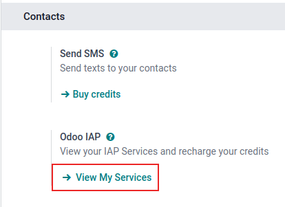

# Mua hàng trong ứng dụng (IAP)

Mua hàng trong ứng dụng (IAP) là các dịch vụ tùy chọn giúp nâng cao cơ sở dữ liệu Odoo. Mỗi dịch vụ cung cấp những tính năng và chức năng riêng. Danh sách đầy đủ các dịch vụ có trên [Danh mục IAP của Odoo](https://iap.odoo.com/iap/all-in-app-services).

**Không** cần cấu hình hoặc thiết lập dịch vụ  trước khi sử dụng. Người dùng Odoo chỉ cần nhấp vào dịch vụ trong ứng dụng để kích hoạt. Tuy nhiên, mỗi dịch vụ yêu cầu tín dụng trả trước riêng và khi hết, người dùng **phải** [mua thêm](#iap-buying-credits) để tiếp tục sử dụng.

#### NOTE
Người dùng Odoo Enterprise có đăng ký hợp lệ sẽ nhận được tín dụng miễn phí để kiểm thử các tính năng IAP trước khi quyết định mua thêm tín dụng cho cơ sở dữ liệu; bao gồm cơ sở dữ liệu demo/đào tạo, cơ sở dữ liệu giáo dục và cơ sở dữ liệu có một ứng dụng miễn phí.

## Dịch vụ IAP

Các dịch vụ  được cung cấp bởi Odoo cũng như các bên thứ ba và có nhiều mục đích sử dụng khác nhau.

Odoo cung cấp các dịch vụ  sau đây:

- Số hóa tài liệu: số hóa các tệp được quét hoặc tệp PDF của hóa đơn mua hàng, chi phí và sơ yếu lý lịch bằng OCR và AI.
- Tự động điền thông tin đối tác: tự động điền dữ liệu công ty vào hồ sơ liên hệ.
- SMS: gửi tin nhắn văn bản SMS đến liên hệ ngay từ cơ sở dữ liệu.
- Tạo lead: tạo lead dựa trên một bộ tiêu chí và chuyển đổi khách truy cập trang web thành lead và cơ hội chất lượng.
- Thư bưu điện: gửi hóa đơn bán hàng và báo cáo follow-up qua đường bưu điện trên toàn thế giới.
- Định danh người ký tên bằng itsme®️: yêu cầu người ký tài liệu trong Odoo *Ký tên* cung cấp thông tin danh tính của họ bằng nền tảng định danh *itsme®*, khả dụng tại Bỉ và Hà Lan.

Để tìm hiểu thêm thông tin về mọi dịch vụ hiện có (do các lập trình viên ngoài Odoo cung cấp), hãy truy cập [Danh mục IAP của Odoo](https://iap.odoo.com/iap/all-in-app-services).

### Sử dụng dịch vụ IAP

Dịch vụ  được tích hợp tự động với Odoo và **không** yêu cầu người dùng cấu hình bất kỳ cài đặt nào. Để sử dụng dịch vụ, chỉ cần tương tác với dịch vụ đó bất cứ khi nào nó xuất hiện trong cơ sở dữ liệu.

#### SEE ALSO
Để biết thêm thông tin về cách sử dụng nhiều dịch vụ  khác nhau và hướng dẫn chi tiết hơn liên quan đến chức năng SMS trong Odoo, hãy xem tài liệu dưới đây:

- [Khai thác lead](../sales/crm/acquire_leads/lead_mining.md)
- [Làm giàu kho liên hệ của bạn với Tự động điền thông tin đối tác](../sales/crm/optimize/partner_autocomplete.md)
- [Marketing qua SMS](../marketing/sms_marketing.md)

## Tín dụng IAP

Mỗi lần sử dụng dịch vụ , các khoản tín dụng trả trước cho dịch vụ đó sẽ được chi tiêu. Odoo nhắc mua thêm tín dụng khi không còn đủ tín dụng để tiếp tục sử dụng dịch vụ. Cảnh báo qua email cũng có thể được thiết lập khi [tín dụng thấp](#in-app-purchase-low-credits).

Tín dụng được mua theo *Gói* từ [Danh mục IAP của Odoo](https://iap.odoo.com/iap/all-in-app-services) và giá cả sẽ được áp dụng riêng cho từng dịch vụ.

### Mua tín dụng

Nếu không có đủ tín dụng để thực hiện nhiệm vụ, cơ sở dữ liệu sẽ tự động nhắc mua thêm tín dụng.

Người dùng có thể kiểm tra số dư tín dụng hiện tại của từng dịch vụ và mua thêm tín dụng theo cách thủ công bằng cách đi đến ứng dụng Cài đặt ‣ phần Liên hệ và bên dưới phần cài đặt Odoo IAP, nhấp vào Xem dịch vụ của tôi.

Sau đó, trang Dịch vụ IAP sẽ hiển thị và liệt kê các dịch vụ  khác nhau trong cơ sở dữ liệu. Từ đây, nhấp vào một dịch vụ  để mở trang Thông tin tài khoản của dịch vụ đó, nơi bạn có thể mua thêm tín dụng.

#### Mua tín dụng theo cách thủ công

Để mua tín dụng thủ công trong Odoo, hãy làm theo các bước sau:

Đầu tiên, hãy đi đến ứng dụng Cài đặt và nhập `IAP` vào thanh Tìm kiếm.... Ngoài ra, người dùng có thể cuộn xuống phần Liên hệ. Trong phần Liên hệ, nơi có ghi Odoo IAP, hãy nhấp vào Xem dịch vụ của tôi.

Sau đó, trang Tài khoản IAP sẽ hiển thị và liệt kê các dịch vụ  khác nhau trong cơ sở dữ liệu. Từ đây, nhấp vào một dịch vụ  để mở trang Thông tin tài khoản của dịch vụ đó, nơi bạn có thể mua thêm tín dụng.

Trên trang Thông tin tài khoản, nhấp vào nút Mua tín dụng. Thao tác này sẽ tải trang Mua tín dụng cho (Tài khoản IAP) trong một tab mới. Từ đây, nhấp vào Mua trên gói tín dụng mong muốn. Sau đó, làm theo chỉ dẫn để nhập thông tin thanh toán và xác nhận đơn hàng.

Sau khi giao dịch hoàn tất, số tín dụng sẽ có sẵn để sử dụng trong cơ sở dữ liệu.

#### Thông báo tín dụng thấp

Để tránh trường hợp hết tín dụng khi sử dụng dịch vụ , bạn có thể được thông báo trước nếu tín dụng sắp hết. Để thực hiện, hãy làm theo quy trình sau:

Đi đến ứng dụng Cài đặt và nhập `IAP` vào thanh Tìm kiếm.... Trong phần Liên hệ, nơi có ghi Odoo IAP, hãy nhấp vào Xem dịch vụ của tôi.

Các tài khoản  khả dụng sẽ xuất hiện trong chế độ xem danh sách trên trang Tài khoản IAP. Từ đây, hãy nhấp vào tài khoản  mong muốn để xem trang Thông tin tài khoản của dịch vụ đó.

Trên trang Thông tin tài khoản, hãy tích vào hộp kiểm Cảnh báo tôi. Thao tác này sẽ hiển thị hai trường trên biểu mẫu: Ngưỡng và Email cảnh báo.

Trong trường Ngưỡng, nhập số tín dụng mà Odoo nên sử dụng làm ngưỡng tối thiểu cho dịch vụ này. Trong trường Email cảnh báo, nhập địa chỉ email nhận thông báo.

Odoo sẽ gửi cảnh báo tín dụng thấp đến Email cảnh báo khi số dư tín dụng giảm xuống dưới số tiền được đặt làm Ngưỡng.
