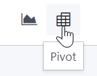
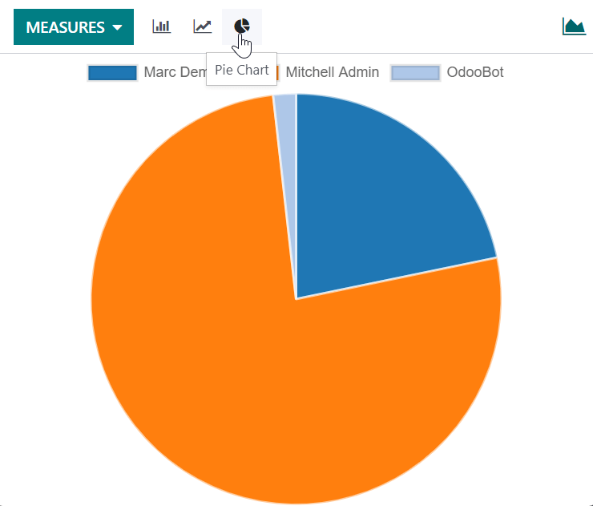

# Báo cáo

Bạn có thể tìm thấy một số báo cáo trong menu Báo cáo của hầu hết ứng dụng cho phép bạn phân tích và trực quan hóa dữ liệu bản ghi của mình.

## Chọn một chế độ xem

Tùy vào báo cáo, Odoo có thể hiển thị dữ liệu theo nhiều cách khác nhau. Đôi khi, có một chế độ xem đặc biệt được thiết kế riêng hoàn toàn cho một báo cáo, trong khi một số chế độ xem khác sẽ khả dụng cho các báo cáo khác. Tuy nhiên, có hai chế độ xem chung dành riêng cho báo cáo: chế độ xem biểu đồ và chế độ xem pivot.

### Chế độ xem biểu đồ

[Chế độ xem biểu đồ](#reporting-using-graph) được sử dụng để trực quan hóa dữ liệu bản ghi của bạn, giúp bạn xác định các xu hướng. Chế độ xem này thường nằm trong menu Báo cáo của ứng dụng nhưng cũng có thể nằm ở nơi khác. Nhấp vào **nút chế độ xem biểu đồ** nằm ở phía trên cùng bên phải để truy cập.

### Chế độ xem pivot

[Chế độ xem pivot](#reporting-using-pivot) được sử dụng để tổng hợp dữ liệu trên các bản ghi của bạn và chia nhỏ chúng để phân tích. Chế độ xem này thường nằm trong menu Báo cáo của ứng dụng nhưng cũng có thể nằm ở nơi khác. Nhấp vào **nút chế độ xem pivot** nằm ở phía trên cùng bên phải để truy cập.

## Chọn thước đo

Sau khi chọn chế độ xem, bạn nên đảm bảo chỉ có các bản ghi liên quan được lọc. Tiếp theo, bạn nên chọn những gì được đo lường. Theo mặc định, một thước đo luôn được chọn. Nếu bạn muốn chỉnh sửa, hãy nhấp vào Thước đo và chọn một hoặc nhiều (chỉ áp dụng cho pivot) thước đo.

#### NOTE
When you select a measure, Odoo aggregates the values recorded on that field for the filtered
records. Only numerical fields ([integer](../studio/fields.md#studio-fields-simple-fields-integer),
[decimal](../studio/fields.md#studio-fields-simple-fields-decimal), [monetary](../studio/fields.md#studio-fields-simple-fields-monetary)) can be measured. In addition, the Count
option is used to count the total number of filtered records.

Sau khi chọn những gì bạn muốn đo lường, bạn có thể xác định cách dữ liệu sẽ được [nhóm](search.md#search-group) tùy thuộc vào hướng mà bạn muốn phân tích. Theo mặc định, dữ liệu thường được nhóm theo *Ngày > Tháng*, được sử dụng để phân tích sự tiến triển của một thước đo theo tháng.

## Sử dụng chế độ xem pivot

Nhóm dữ liệu là điều cốt yếu đối với chế độ xem pivot. Tính năng này cho phép phân tích dữ liệu sâu hơn để có được thông tin chi tiết hơn. Trong khi bạn có thể sử dụng tùy chọn Nhóm theo để nhanh chóng thêm một nhóm ở cấp độ hàng, như trong ví dụ trên, bạn cũng có thể nhấp vào nút dấu cộng (➕) bên cạnh header Tổng ở cấp độ hàng *và* cột, sau đó chọn một trong các **nhóm cấu hình sẵn**. Để xóa một nhóm, hãy nhấp vào nút dấu trừ (➖).

Sau khi đã thêm một nhóm, bạn có thể thêm nhóm mới vào trục đối diện hoặc các tiểu nhóm mới tạo.

## Sử dụng chế độ xem biểu đồ

Có ba loại biểu đồ: biểu đồ cột, đường, và tròn.

**Biểu đồ cột** được sử dụng để biểu thị phân phối hoặc so sánh nhiều danh mục. Chúng đặc biệt hữu ích vì có thể xử lý các tập dữ liệu lớn.

**Biểu đồ đường** hữu ích khi biểu thị sự thay đổi của xu hướng dữ liệu theo thời gian.

**Biểu đồ tròn** được sử dụng để biểu thị phân phối hoặc so sánh một số lượng danh mục nhỏ khi chúng tạo thành một tổng thể lớn hơn.

Biểu đồ cột

Biểu đồ đường

Biểu đồ tròn

