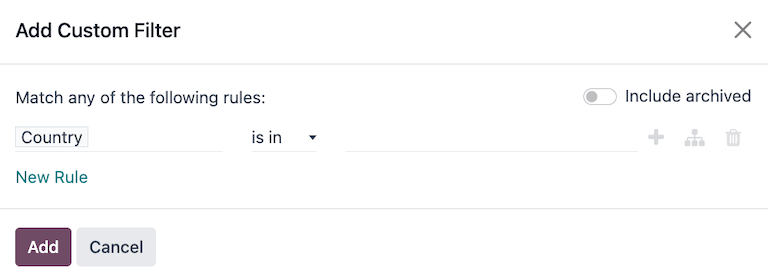

# Tìm kiếm, lọc, và nhóm bản ghi

Odoo cho phép tìm kiếm, lọc, và nhóm các bản ghi trong một chế độ xem để chỉ hiển thị các bản ghi liên quan. Thanh tìm kiếm nằm ở đầu chế độ xem, bắt đầu nhập để [tìm kiếm giá trị](#search-values), hoặc nhấp vào biểu tượng :guilabel:🔽 (mũi tên hướng xuống)\` để truy cập menu thả xuống [Bộ lọc](#search-filters), [Nhóm theo](#search-group), và [Yêu thích](#search-favorites).

## Tìm kiếm giá trị

Sử dụng trường tìm kiếm để nhanh chóng tìm kiếm các giá trị cụ thể và thêm chúng làm bộ lọc. Nhập giá trị cần tìm và chọn tùy chọn mong muốn từ menu thả xuống để áp dụng bộ lọc tìm kiếm.

#### NOTE
Việc sử dụng trường tìm kiếm cũng tương đương với sử dụng toán tử *contains* (bao hàm) khi thêm [bộ lọc tùy chỉnh](#search-custom-filters). Nếu bạn nhập giá trị một phần và trực tiếp chọn trường mong muốn (không chọn ⏵ (mũi tên hướng sang phải)), thì *tất cả* bản ghi chứa các ký tự đã nhập cho trường đã chọn đều được bao gồm.

## Bộ lọc

Bộ lọc được sử dụng để chọn các bản ghi đáp ứng những tiêu chí cụ thể. Lựa chọn bản ghi mặc định dành riêng cho từng chế độ xem, nhưng có thể được sửa đổi bằng cách chọn một (hoặc nhiều) [bộ lọc cấu hình sẵn](#search-preconfigured-filters), hoặc bằng cách thêm [bộ lọc tùy chỉnh](#search-custom-filters).

### Bộ lọc cấu hình sẵn

Sửa đổi lựa chọn bản ghi mặc định bằng cách nhấp vào biểu tượng 🔽 (mũi tên hướng xuống) từ thanh tìm kiếm và chọn một (hoặc nhiều) *bộ lọc cấu hình sẵn* từ menu Bộ lọc thả xuống.

#### NOTE
Các Bộ lọc cấu hình sẵn được nhóm và mỗi nhóm được phân cách bằng một dòng. Việc chọn các bộ lọc cấu hình sẵn từ cùng một nhóm cho phép bản ghi khớp với *bất kỳ* điều kiện nào được áp dụng. Tuy nhiên, việc chọn các bộ lọc từ những nhóm khác nhau yêu cầu bản ghi khớp với *tất cả* điều kiện được áp dụng.

### Bộ lọc tuỳ chỉnh

Nếu [bộ lọc cấu hình sẵn](#search-preconfigured-filters) không đủ cụ thể, hãy thêm bộ lọc tùy chỉnh. Để thực hiện, nhấp vào biểu tượng 🔽 (mũi tên hướng xuống) trong thanh tìm kiếm, sau đó chọn Bộ lọc ‣ Thêm bộ lọc tuỳ chỉnh.

Cửa sổ pop-up Thêm bộ lọc tùy chỉnh hiển thị tùy chọn phù hợp, quy tắc lọc và nút bật/tắt Bao gồm dữ liệu đã lưu trữ để hiển thị cả các bản ghi đã lưu trữ.

Cấu hình so khớp mặc định là Khớp bất kỳ quy tắc sau, cho biết rằng mỗi quy tắc lọc được áp dụng độc lập. Để thay đổi cấu hình so khớp thành Khớp tất cả quy tắc sau, thì ít nhất hai quy tắc lọc phải được thêm vào bộ lọc tùy chỉnh.

- Khớp tất cả 🔽 quy tắc sau: **tất cả** quy tắc lọc phải được đáp ứng. Về mặt logic, đây là phép toán *AND* (`&`).
- Khớp bất kỳ 🔽 quy tắc sau: **bất kỳ** quy tắc nào trong số các quy tắc lọc phải được đáp ứng. Về mặt logic, đây là phép toán *OR* (`|`).

Theo mặc định, một quy tắc lọc duy nhất được thêm vào bộ lọc tùy chỉnh. Thông tin sau mô tả cấu trúc của một quy tắc lọc:

1. Trường nội tuyến đầu tiên là *tên trường* để lọc theo. Một số trường có các tham số tinh chỉnh được lồng vào trong một trường khác. Các trường này có biểu tượng > (mũi tên) bên cạnh, có thể được chọn để hiển thị các trường lồng nhau.
2. Trường nội tuyến thứ hai là *toán tử* có điều kiện được sử dụng để so sánh tên trường với giá trị. [Các toán tử có điều kiện khả dụng](../../developer/reference/backend/orm.md#reference-orm-domains) được áp dụng riêng theo kiểu dữ liệu của trường.
3. Trường nội tuyến thứ ba là biến *giá trị* của tên trường. Giá trị đầu vào có thể xuất hiện dưới dạng menu thả xuống, đầu vào dạng văn bản, đầu vào dạng số, đầu vào dạng ngày/giờ, bộ chọn boolean hoặc có thể được để trống, tùy thuộc vào toán tử được sử dụng và kiểu dữ liệu của trường.

Ba nút nội tuyến cũng có ở bên phải tiêu chí lọc của quy tắc:

1. ➕ (biểu tượng dấu cộng): thêm một quy tắc mới dưới quy tắc hiện có.
2. (Thêm nhánh): thêm một nhóm quy tắc mới bên dưới quy tắc hiện tại, đồng thời chứa các tùy chọn so khớp bất kỳ và tất cả để xác định cách áp dụng từng quy tắc trong nhánh này cho bộ lọc. Nếu tùy chọn so khớp được đặt giống như nhóm chính, các trường sẽ được di chuyển vào nhóm chính.
3. 🗑️ (thùng rác): xóa nút. Nếu một nút nhánh bị xóa, tất cả các nút phụ của nút đó cũng bị xóa.

Có thể thêm quy tắc lọc mới vào bộ lọc tùy chỉnh bằng cách nhấp vào nút Quy tắc mới.

Sau khi tiêu chí lọc được xác định, hãy nhấp vào Thêm để thêm bộ lọc tùy chỉnh vào chế độ xem.

## Nhóm bản ghi

Có thể nhóm các bản ghi được hiển thị trong chế độ xem lại với nhau theo một trong các *nhóm cấu hình sẵn*. Để thực hiện, hãy nhấp vào biểu tượng 🔽 (mũi tên hướng xuống) trong thanh tìm kiếm, sau đó chọn một trong các tùy chọn Nhóm theo từ menu thả xuống.

Có thể *tùy chỉnh nhóm* bằng cách sử dụng trường có trên mô hình. Để thực hiện, hãy nhấp vào Thêm nhóm tuỳ chỉnh và chọn một trường từ menu thả xuống.

#### NOTE
Bạn có thể sử dụng nhiều nhóm cùng lúc. Nhóm đầu tiên được chọn là nhóm chính, nhóm tiếp theo được thêm vào sẽ chia nhỏ các danh mục của nhóm chính,... Ngoài ra, có thể sử dụng bộ lọc và nhóm cùng nhau để tinh chỉnh chế độ xem hơn nữa.

## So sánh

Một số trang chủ báo cáo có chứa phần So sánh trong menu thả xuống của thanh Tìm kiếm.... Trong số đó có báo cáo [Hiệu suất thiết bị tổng thể](../inventory_and_mrp/manufacturing/reporting/oee.md) cho ứng dụng *Sản xuất* và báo cáo [Mua hàng](../inventory_and_mrp/purchase/advanced/analyze.md) cho ứng dụng *Mua hàng*, cũng như các báo cáo khác.

Các tùy chọn trong phần <i class="fa fa-adjust"></i> So sánh được sử dụng để so sánh dữ liệu từ hai khoảng thời gian khác nhau. Có hai tùy chọn so sánh để lựa chọn: (Bộ lọc thời gian): Giai đoạn trước và (Bộ lọc thời gian): Năm trước.

#### IMPORTANT
Đối với một số báo cáo, phần So sánh **chỉ** xuất hiện trong menu thả xuống của thanh Tìm kiếm... nếu một (hoặc nhiều) khoảng thời gian đã được chọn trong cột Bộ lọc. Lý do là vì nếu không xác định khoảng thời gian nào thì không có gì để so sánh.

Ngoài ra, một số báo cáo chỉ cho phép sử dụng tính năng So sánh khi chọn loại biểu đồ <i class="fa fa-pie-chart"></i> (biểu đồ tròn) hoặc chế độ xem <i class="oi oi-view-pivot"></i> (pivot). Dù bạn có thể chọn tùy chọn So sánh ngay cả khi chế độ xem khác được bật, nhưng việc này **không** thay đổi cách hiển thị dữ liệu trên báo cáo.

Để xem dữ liệu bằng một trong hai phép so sánh, hãy bắt đầu bằng cách chọn một giai đoạn trong cột Bộ lọc trên menu thả xuống của thanh Tìm kiếm.... Sau đó, chọn (Bộ lọc thời gian): Giai đoạn trước hoặc (Bộ lọc thời gian): Năm trước trong phần So sánh.

Nếu bạn bật một trong các tùy chọn So sánh, thì báo cáo sẽ so sánh dữ liệu cho giai đoạn đã chọn với dữ liệu cho cùng một đơn vị thời gian (tháng, quý, năm) thuộc về một giai đoạn hoặc năm trước đó. Cách dữ liệu được hiển thị phụ thuộc vào chế độ xem đã chọn:

- <i class="fa fa-bar-chart"></i> (Biểu đồ cột) hiển thị hai cột, cạnh nhau, cho mỗi đơn vị thời gian trong giai đoạn đã chọn. Cột bên trái biểu thị giai đoạn đã chọn, trong khi cột bên phải biểu thị giai đoạn trước đó.
- <i class="fa fa-line-chart"></i> (Biểu đồ đường) được hiển thị với hai đường, một đường biểu thị giai đoạn đã chọn và đường còn lại biểu thị giai đoạn trước đó.
- <i class="fa fa-pie-chart"></i> (Biểu đồ tròn) xuất hiện dưới dạng một vòng tròn lớn và một vòng tròn nhỏ hơn bên trong. Vòng tròn lớn biểu thị giai đoạn đã chọn, trong khi vòng tròn nhỏ biểu thị giai đoạn trước đó.
- <i class="oi oi-view-pivot"></i> (Bảng pivot) được hiển thị dưới dạng mỗi cột được chia thành hai cột nhỏ hơn. Cột bên phải biểu thị giai đoạn đã chọn, trong khi cột bên trái biểu thị giai đoạn trước đó.

## Yêu thích

Mục Yêu thích là cách lưu một tìm kiếm cụ thể để sử dụng sau này hoặc làm bộ lọc mặc định mới cho chế độ xem.

Để lưu chế độ xem hiện tại làm chế độ xem yêu thích, nhấp vào biểu tượng :guilabel:🔽 (mũi tên hướng xuống)\` trong thanh tìm kiếm, sau đó chọn menu thả xuống Lưu tìm kiếm hiện tại để hiển thị các tuỳ chọn sau:

- Tên bộ lọc: Tên của tìm kiếm yêu thích.
- Bộ lọc mặc định: đặt tìm kiếm yêu thích làm bộ lọc mặc định cho chế độ xem.
- Đã chia sẻ: cho phép tìm kiếm yêu thích khả dụng với tất cả người dùng. Theo mặc định, tìm kiếm yêu thích chỉ khả dụng với người dùng đã tạo tìm kiếm đó.

Sau khi thiết lập xong các tùy chọn, hãy nhấp vào Lưu để lưu tìm kiếm yêu thích.

Bạn có thể truy cập danh sách yêu thích đã lưu bằng cách nhấp vào biểu tượng 🔽 (mũi tên hướng xuống) trên thanh tìm kiếm, sau đó chọn bộ lọc đã lưu trong menu thả xuống Danh sách yêu thích. Để xóa mục yêu thích đã lưu, hãy nhấp vào biểu tượng 🗑️ (thùng rác) bên cạnh tìm kiếm đã đánh dấu là mục yêu thích.
