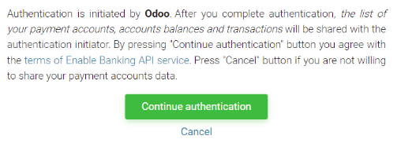

# Enable Banking

**Enable Banking** is a third-party provider aggregating banking information from bank accounts all
in one place. It offers non-intrusive connectivity to ASPSPs' official APIs across Europe without
storing data.

**Odoo** synchronizes directly with banks to get access to all bank transactions and automatically
import them into your database.

#### SEE ALSO
- [Đồng bộ hoá ngân hàng](../bank_synchronization.md)
- [Enable Banking website](https://enablebanking.com/)

## Cấu hình

### Link bank accounts with Odoo

1. Start synchronization by clicking on Accounting ‣ Configuration ‣
   Add a Bank Account;
2. Chọn ngân hàng của bạn;
3. Make sure you give your consent to share your account information with Odoo by clicking
   Continue authentication;
   
4. Finally, you are redirected to your bank's login page.
