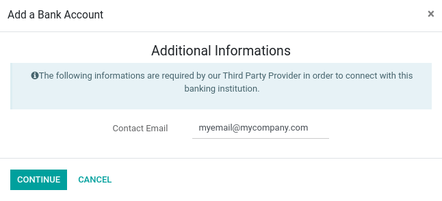
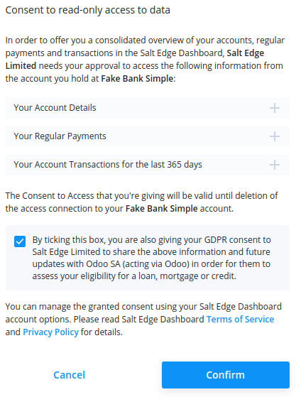

# Salt Edge

**Salt Edge** is a third-party provider that aggregates banking information
from your bank accounts. It supports ~5000 institutions in more than 50
countries.

Odoo can synchronize directly with your bank to get all bank statements imported
automatically into your database.

#### SEE ALSO
- [Đồng bộ hoá ngân hàng](applications/finance/accounting/bank/bank_synchronization.md)
- [Giao dịch](applications/finance/accounting/bank/transactions.md)

## Cấu hình

### Link your bank accounts with Odoo

1. Start synchronization by clicking on Accounting ‣ Configuration
   ‣ Add a Bank Account.
2. Select the institution you want to synchronize. You can see if Salt Edge is the
   third party provider of the institution by selecting it.
3. After giving your phone number, you are asked for an email address. This email
   address is used to create your Salt Edge account. Please make sure you enter a
   valid email address, as otherwise, you will not be able to access your Salt Edge
   account.
   
4. After entering your email address, you are redirected to Salt Edge to continue
   the synchronization process.
   
5. Make sure you give your consent by checking the consent checkbox.
   
6. Complete the synchronization by following the steps.

### Update your credentials

To update your Salt Edge credentials or modify the synchronization settings, activate the
[developer mode](applications/general/developer_mode.md#developer-mode), go to Accounting ‣ Configuration ‣
Online Synchronization, and select the institution you want to update credentials. Click
Update Credentials to start the flow and follow the steps.

Don't forget to check the consent checkbox. Otherwise, Odoo may not be able to access
your information.

### Fetch new accounts

To add new online accounts to your connection, activate the [developer mode](applications/general/developer_mode.md#developer-mode),
go to Accounting ‣ Configuration ‣ Online Synchronization, and select the
institution to fetch the new accounts. Click Fetch Accounts to start the flow and
follow the steps.

#### NOTE
Don't forget to check the consent checkbox. Otherwise, Odoo may not be able to access your
information.

## Câu hỏi thường gặp

### I have an error when I try to delete my synchronization within Odoo

Odoo không thể xóa vĩnh viễn kết nối bạn đã tạo với tổ chức ngân hàng. Tuy nhiên, Odoo có thể thu hồi sự chấp thuận mà bạn đã cung cấp để Odoo không thể truy cập vào tài khoản của bạn nữa. Lỗi bạn đang thấy có thể là thông báo cho bạn biết rằng sự chấp thuận đã bị thu hồi, nhưng không thể xóa bản ghi vì nó vẫn tồn tại trong Salt Edge. Nếu muốn xóa hoàn toàn kết nối, vui lòng kết nối với [tài khoản Salt Edge](https://www.saltedge.com/dashboard) của bạn và xóa thủ công quá trình đồng bộ. Sau khi thực hiện xong, bạn có thể quay lại Odoo để xóa bản ghi.

### I have an error saying that I have already synchronized this account

You have probably already synchronized your bank account with Salt Edge, please check on your
[dashboard](https://www.saltedge.com/dashboard) that you don't already have a connection with the
same credentials.

If you already have a synchronization with the same credentials present on your Salt Edge
dashboard and this synchronization has not been created with Odoo, delete it and create it from your
Odoo database.

If you already have a connection with the same credentials present on your Salt Edge dashboard
and this synchronization was created with Odoo, activate the [developer
mode](applications/general/developer_mode.md#developer-mode), go to Accounting ‣ Configuration ‣ Online
Synchronization, and click Update Credentials to reactivate the connection.
