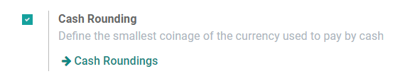

# Làm tròn tiền

**Cash rounding** is required when the lowest physical denomination
of currency, or the smallest coin, is higher than the minimum unit
of account.

For example, some countries require their companies to round up or
down the total amount of an invoice to the nearest five cents, when
the payment is made in cash.

## Cấu hình

Go to Accounting ‣ Configuration ‣ Settings
and enable *Cash Rounding*, then click on *Save*.

Go to Accounting ‣ Configuration ‣ Cash Roundings,
and click on *Create*.

Define here your *Rounding Precision*, *Rounding Strategy*, and
*Rounding Method*.

Odoo supports two **rounding strategies**:

1. **Add a rounding line**: a *rounding* line is added on the invoice.
   You have to define which account records the cash roundings.
2. **Modify tax amount**: the rounding is applied in the taxes section.

## Áp dụng làm tròn

When editing a draft invoice, open the *Other Info* tab, go to the
*Accounting Information* section, and select the appropriate *Cash
Rounding Method*.
