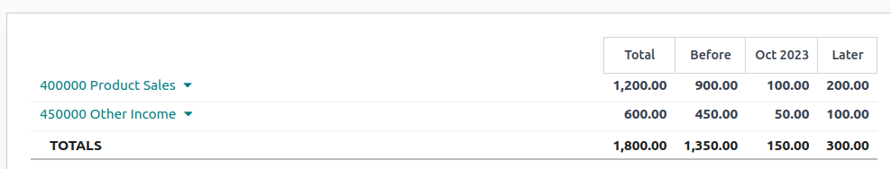

# Doanh thu chưa thực hiện

**Deferred revenues**, or **unearned revenues**, are invoices addressed to customers\
for goods yet to be delivered or services yet to be rendered.

The company cannot report them on the current **profit and loss statement**, or _income statement_,\
since the goods and services will be effectively delivered/rendered in the future.

These future revenues must be deferred on the company's balance sheet among the current liabilities\
until they can be **recognized**, at once or over a defined period, on the profit and loss\
statement.

Ví dụ, giả sử một doanh nghiệp bán giấy phép phần mềm trị giá $1200 cho 1 năm. Họ lập hóa đơn ngay cho khách hàng nhưng chưa thể ghi nhận toàn bộ số tiền này là doanh thu, vì các tháng sử dụng trong tương lai vẫn chưa được cung cấp. Do đó, doanh nghiệp hạch toán khoản doanh thu này vào tài khoản doanh thu chưa thực hiện và ghi nhận dần theo từng tháng. Mỗi tháng, trong vòng 12 tháng tiếp theo, $100 sẽ được ghi nhận là doanh thu.

Odoo Accounting handles deferred revenues by spreading them in multiple entries that are posted\
periodically.

#### NOTE

The server checks once a day if an entry must be posted. It might then take up to 24 hours before\
you see a change from Draft to Posted.

## Cấu hình

Make sure the default settings are correctly configured for your business. To do so, go to\
Accounting ‣ Configuration ‣ Settings. The following options are available:

Sổ nhật ký\
: The deferral entries are posted in this journal.

Tài khoản chi phí trả trước\
: Expenses are deferred on this Current Asset account until they are recognized.

Tài khoản doanh thu hoãn lại\
: Revenues are deferred on this Current Liability account until they are recognized.

Tạo bút toán\
: By default, Odoo [automatically generates](deferred_revenues.md#customer-invoices-deferred-generate-on-validation)\
the deferral entries when you post a customer invoice. However, you can also choose to[generate them manually](deferred_revenues.md#customer-invoices-deferred-generate-manually) by selecting the\
Manually & Grouped option instead.

Tính toán số tiền\
: Suppose an invoice of $1200 must be deferred over 12 months.\

* The Months option accounts for $100 each month prorated to the number of days in\
  that month (e.g., $50 for the first month if the Start Date is set to the 15th of\
  the month).
* Tùy chọn Tháng đầy đủ coi mỗi tháng bắt đầu là tháng đầy đủ, (VD: $100 cho tháng đầu tiên ngay cả khi Ngày bắt đầu được đặt vào ngày 15 của tháng.) Điều này có nghĩa là với tùy chọn Tháng đầy đủ, toàn bộ $100 được ghi nhận trong tháng đầu tiên dù chỉ là một phần tháng, loại bỏ nhu cầu tháng thứ 13 để ghi nhận phần còn lại như khi sử dụng tùy chọn Tháng.
* The Days option accounts for different amounts depending on the number of days in\
  each month (e.g., \~$102 for January and \~$92 for February).

## Generate deferral entries on validation

For each line of the invoice that should be deferred, specify the start and end dates of the\
deferral period.

If the Generate Entries field in the **Settings** is set to On invoice/bill\
validation, Odoo automatically generates the deferral entries when the invoice is validated. Click\
the Deferred Entries smart button to see them.

One entry, dated on the same day as the invoice's accounting date, moves the invoice amounts from\
the income account to the deferred account. The other entries are deferral entries which, month\
after month, move the invoice amounts from the deferred account to the income account to recognize\
the revenue.

## Báo cáo

The deferred revenue report computes an overview of the necessary deferral entries for each account.\
To access it, go to Accounting ‣ Reporting ‣ Deferred Revenue.

To view the journal items of each account, click on the account name and then Journal\
Items.

#### NOTE

Only invoices whose accounting date is before the end of the period of the report\
are taken into account.

## Generate grouped deferral entries manually

If you have a lot of deferred revenues and wish to reduce the number of journal entries created, you\
can generate deferral entries manually. To do so, set the Generate Entries field in the**Settings** to Manually & Grouped. Odoo then aggregates the deferred amounts in a\
single entry.

At the end of each month, go to Accounting ‣ Reporting ‣ Deferred Revenue and\
click the Generate Entries button. This generates two deferral entries:

* One dated at the end of the month which aggregates, for each account, all the deferred amounts\
  of that month. This means that a part of the deferred revenue is recognized at the end of that\
  period.
* The reversal of this created entry, dated on the following day (i.e., the first day of the\
  next month) to cancel the previous entry.
