# Electronic invoicing ()

EDI, or electronic data interchange, is the inter-company communication of business documents, such
as purchase orders and invoices, in a standard format. Sending documents according to an EDI
standard ensures that the machine receiving the message can interpret the information correctly.
Various EDI file formats exist and are available depending on your company's country.

EDI feature enables automating the administration between companies and might also be required by
some governments for fiscal control or to facilitate the administration.

Electronic invoicing of your documents such as customer invoices, credit notes or vendor bills is
one of the application of EDI.

Odoo supports, among others, the following formats.

| Định dạng tên                            | Khả năng áp dụng    |
|------------------------------------------|---------------------|
| Factur-X (CII)                           | Tất cả khách hàng   |
| Peppol BIS Billing 3.0                   | Tất cả khách hàng   |
| XRechnung (UBL)                          | Tất cả khách hàng   |
| Fattura PA (IT)                          | Công ty Ý           |
| CFDI (4.0)                               | Công ty Mexico      |
| Peru UBL 2.1                             | Công ty Peru        |
| SII IVA Llevanza de libros registro (ES) | Công ty Tây Ban Nha |
| UBL 2.1 (Columbia)                       | Công ty Colombia    |
| Egyptian Tax Authority                   | Công ty Ai Cập      |
| Hóa đơn điện tử (IN)                     | Công ty Ấn Độ       |
| NLCIUS (Hà Lan)                          | Công ty Hà Lan      |
| EHF 3.0                                  | Công ty Na Uy       |
| SG BIS Billing 3.0                       | Công ty Singapore   |
| A-NZ BIS Billing 3.0                     | Tất cả khách hàng   |

#### NOTE
- The **Factur-X (CII)** format enables validation checks on the invoice and generates PDF/A-3
  compliant files.
- Every PDF generated by Odoo includes an integrated **Factur-X** XML file.

#### SEE ALSO
[Fiscal localizations](../../fiscal_localizations.md)

## Cấu hình

By default, the format available in the [send window](#e-invoicing-generation) depends on your
customer's country.

You can define a specific e-invoicing format for each customer. To do so, go to
Accounting ‣ Customers ‣ Customers, open the customer form, go to the
Accounting tab and select the appropriate format.

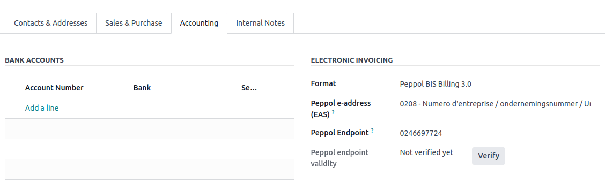

### National electronic invoicing

Depending on your company's country (e.g., [Italy](../../fiscal_localizations/italy.md),
[Spain](../../fiscal_localizations/spain.md), [Mexico](../../fiscal_localizations/mexico.md), etc.), you may be required to issue e-invoicing documents in
a specific format for all your invoices. In this case, you can define a default e-invoicing format
for your sales journal.

To do so, go to Accounting ‣ Configuration ‣ Journals, open your sales journal,
go to the Advanced Settings tab, and enable the formats you need for this journal.

## Tạo hoá đơn điện tử

From a confirmed invoice, click Send & Print to open the send window. Check the
e-invoicing option to generate and attach the e-invoice file.

## Peppol

The [Peppol](https://peppol.org/about/) network ensures the exchange of documents and information
between enterprises and governmental authorities. It is primarily used for electronic invoicing, and
its access points (connectors to the Peppol network) allow enterprises to exchange electronic
documents.

Odoo is an **access point** and an , enabling electronic
invoicing transactions without the need to send invoices and bills by email or post.

If not done yet, [install](../../../general/apps_modules.md#general-install) the Peppol module (`account_peppol`).

#### IMPORTANT
- Peppol registration is **free** and available in Odoo Community
- You can send **Customer Invoices** and **Credit Notes** and receive **Vendor Bills** and
  **Refunds** via Peppol.
- You can send in one of the following supported document formats: **BIS Billing 3.0, XRechnung
  CIUS, NLCIUS**.
- The following **countries** are eligible for **Peppol registration in Odoo**:
   
  Andorra, Albania, Austria, Bosnia and Herzegovina, Belgium, Bulgaria, Switzerland, Cyprus,
  Czech Republic, Germany, Denmark, Estonia, Spain, Finland, France, United Kingdom, Greece,
  Croatia, Hungary, Ireland, Iceland, Italy, Liechtenstein, Lithuania, Luxembourg, Latvia,
  Monaco, Montenegro, North Macedonia, Malta, Netherlands, Norway, Poland, Portugal, Romania,
  Serbia, Sweden, Slovenia, Slovakia, San Marino, Turkey, Holy See (Vatican City State)
   

### Đăng ký

Go to Accounting ‣ Configuration ‣ Settings. If you do not have the
Peppol module installed, first tick the Enable PEPPOL checkbox and then **manually
save**.

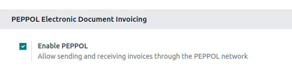

Fill in the following information:

- Peppol EAS. This is the Peppol Electronic Address Scheme and usually depends on your
  company's country. Odoo often prefills this with the most commonly used EAS code in your country.
  For example, the preferred EAS code for most companies in Belgium is 0208.
- Peppol Endpoint. This is usually a Company Registry number or a VAT number.
- Phone Number, including the country code (e.g., `+32` in Belgium)
- Primary contact email

#### SEE ALSO
- [Peppol EAS - European Commision](https://ec.europa.eu/digital-building-blocks/wikis/display/DIGITAL/Code+lists/)
- [Peppol Endpoint - OpenPeppol eDEC Code Lists](https://docs.peppol.eu/edelivery/codelists/)
  (open the "Participant Identifier Schemes" as HTML page)

If you are migrating from another access point, insert the Migration key from the
previous provider.

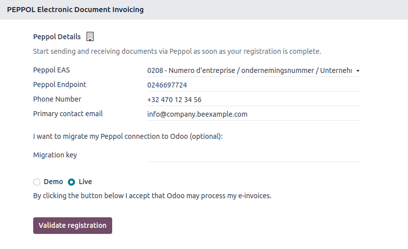

Finally, click Validate registration. If you want to explore or demo Peppol, you can
choose to register in Demo mode. Otherwise, select Live.

> 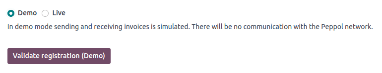

#### NOTE
When testing Peppol, the system parameter `account_peppol.edi.mode` can be changed to `test`.
Then, a radio button appears with the option to register on the test server.

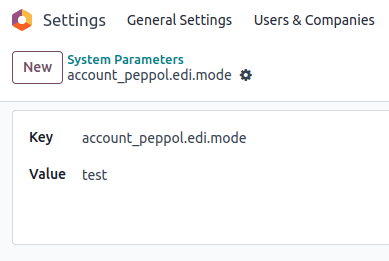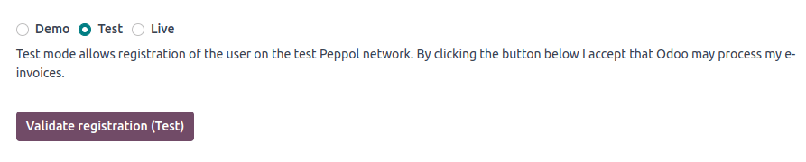

Now, you can request a verification code to be sent to you by clicking Verify phone
number.

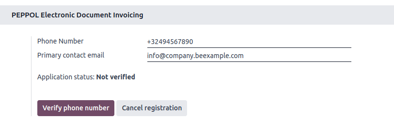

A text message containing a code is sent to the phone number provided to finalize the verification
process.

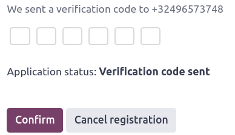

Once you enter the code and click Confirm, you can see that your registration is pending
activation. From this point onwards, the default journal for receiving Vendor Bills can be set.

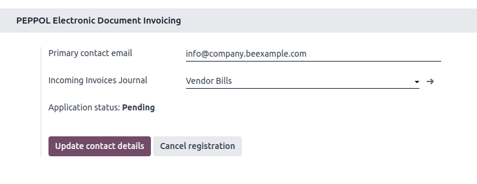

It should be automatically activated within a day.

Your application status should be updated soon after you are registered on the Peppol network.

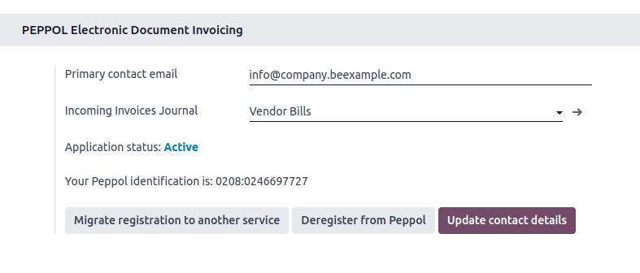

All invoices and vendor bills can now be sent directly using the Peppol network.

### Contact verification

Before sending an invoice to a contact using the Peppol network, it is necessary to verify that they
are also registered as a Peppol participant.

Để thực hiện, hãy truy cập Kế toán ‣ Khách hàng ‣ Khách hàng và mở biểu mẫu khách hàng. Sau đó, đi đến Tab Kế toán ‣ Hóa đơn điện tử, chọn định dạng chính xác và đảm bảo Mã Peppol EAS cùng Endpoint đã được điền đầy đủ. Tiếp theo, nhấp Xác minh. Nếu liên hệ tồn tại trên mạng, tính hợp lệ của endpoint Peppol sẽ được đặt thành Hợp lệ.

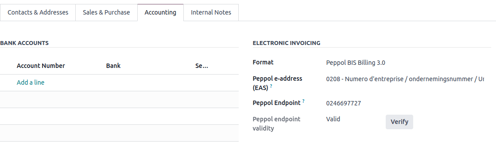

#### IMPORTANT
While Odoo prefills both the EAS code and the Endpoint number based on the information available
for a contact, it is better to confirm these details directly with the contact.

It is possible to verify the Peppol participant status of several customers at once.
To do so, go to Accounting ‣ Customers ‣ Customers and switch to the list view.
Select the customers you want to verify and then click Actions ‣ Verify Peppol.

### Gửi hoá đơn

Khi đã sẵn sàng gửi hóa đơn qua mạng Peppol, chỉ cần nhấp vào Gửi & in trên biểu mẫu hóa đơn. Để gửi nhiều hóa đơn, hãy chọn chúng trong chế độ xem danh sách và nhấp vào Tác vụ ‣ Gửi & in; các hóa đơn này sẽ được gửi theo lô sau đó. Cần đánh dấu cả hai ô BIS Billing 3.0 và Gửi qua PEPPOL.

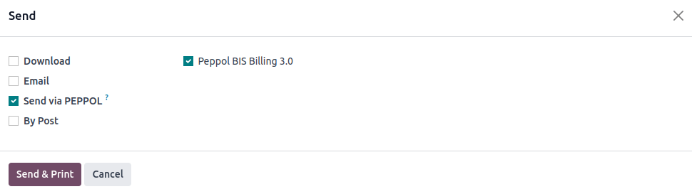

Posted invoices that can be sent via Peppol are marked as Peppol Ready.
To display them, use the Peppol Ready filter or access the Accounting dashboard and
click Peppol ready invoices on the corresponding sales journal.

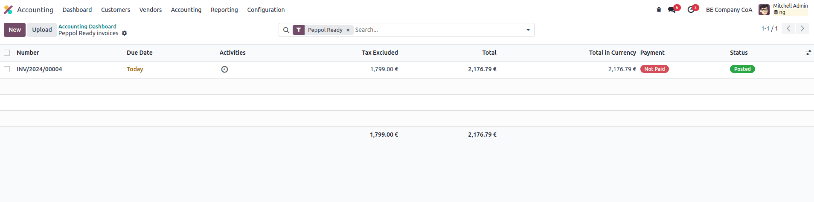

Once the invoices are sent via Peppol, the status is changed to Processing. The
status is changed to `Done` after they have been successfully delivered to the contact's Access
Point.

A cron runs regularly to check the status of these invoices. It is possible to check the status
before the cron runs by clicking Fetch Peppol invoice status in the corresponding
sales journal on the Accounting dashboard.

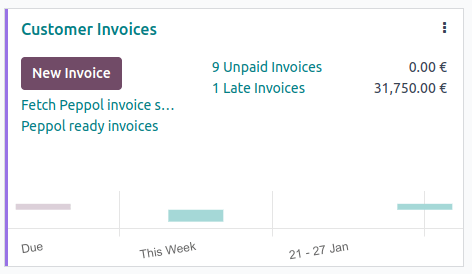

### Receive vendor bills

Once a day, a cron checks whether any new documents have been sent to you via the Peppol network.
These documents are imported, and the corresponding vendor bills are created automatically as
drafts.

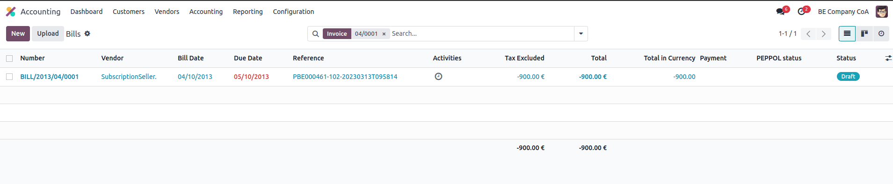

If you want to retrieve incoming Peppol documents before the cron runs, you can do so from the
Accounting dashboard on the main Peppol purchase journal that you set up in the settings. Just click
Fetch from Peppol.

