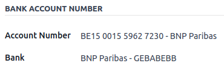

# EPC QR codes

European Payments Council quick response codes, or **EPC QR codes**, are two-dimensional barcodes
that customers can scan with their **mobile banking applications** to initiate a **SEPA credit
transfer (SCT)** and pay their invoices instantly.

In addition to bringing ease of use and speed, it greatly reduces typing errors that would
potentially make for payment issues.

#### NOTE
This feature is only available for companies in several European countries such as Austria,
Belgium, Finland, Germany, and the Netherlands.

#### SEE ALSO
- [Bank and cash accounts](applications/finance/accounting/bank.md)
- [Odoo Academy: QR Code on Invoices for European Customers](https://www.odoo.com/r/VuU)

## Cấu hình

Go to Accounting ‣ Configuration ‣ Settings and activate the QR
Codes feature in the Customer Payments section.

### Configure your bank account's journal

Make sure that your Bank Account is correctly configured in Odoo with your IBAN and BIC.

To do so, go to Accounting ‣ Configuration ‣ Journals, open your bank journal,
then fill out the Account Number and Bank under the Bank Account
Number column.

## Issue invoices with EPC QR codes

EPC QR codes are added automatically to your invoices. Customers whose bank supports making payments
via EPC QR codes will be able to scan the code and pay the invoice.

Go to Accounting ‣ Customers ‣ Invoices, and create a new invoice.

Before posting it, open the Other Info tab. Odoo automatically fills out the
Recipient Bank field with your IBAN.

#### NOTE
In the Other Info tab, the account indicated in the Recipient Bank field
is used to receive your customer's payment. Odoo automatically populates this field with your
IBAN by default and uses it to generate the EPC QR code.

When the invoice is printed or previewed, the QR code is included at the bottom.

