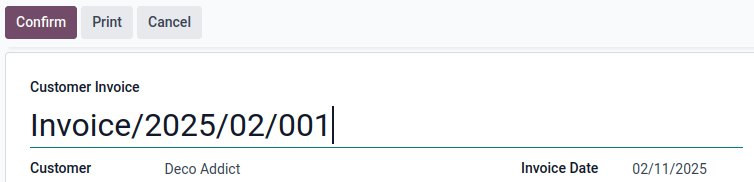

# Invoice sequence

When confirming an invoice, Odoo generates a unique invoice reference number. By default, Odoo uses
the following sequence format `INV/year/incrementing-number` (e.g., `INV/2025/00001`), which
restarts from `00001` each year.

However, it is possible to [change the sequence format](#accounting-invoice-resequencing) and
its periodicity, and to [mass-resequence invoices](#accounting-invoice-mass-resequencing).

#### NOTE
Changes made to reference numbers are logged in the chatter.

## Changing the default sequence

To customize the default sequence, open the last confirmed invoice, click Reset to
Draft, and edit the invoice's reference number.

Odoo then explains how the detected format will be applied to all future invoices. For example, if
the current invoice's month is added, the sequence's periodicity will change to every month instead
of every year.

## Mass-resequencing invoices

It can be helpful to resequence multiple invoice numbers. For example, when importing invoices from
another invoicing or accounting system and the reference originates from the previous software,
continuity for the current year must be maintained without restarting from the beginning.

#### NOTE
This feature is only available to users with administrator or advisor access.

Follow these steps to resequence invoice numbers:

1. Activate the [developer mode](../../../general/developer_mode.md#developer-mode).
2. From the Accounting Dashboard, open the Customer Invoices journal.
3. Select the invoices that need a new sequence.
4. Click the <i class="fa fa-cog"></i> Actions menu and select Resequence.
5. In the Ordering field, choose to
   - Keep current order: The order of the numbers remains the same.
   - Reorder by accounting date: The number is reordered by accounting date.
6. Set the First New Sequence.
7. Preview Modifications and click Confirm.

The first invoice using the new sequence appears in red in the Customer Invoices list.

