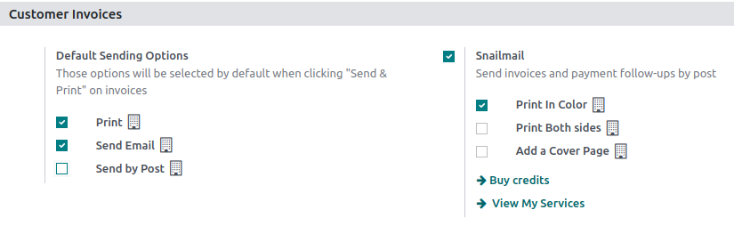

# Snailmail

Sending direct mail can be an effective strategy for grabbing people's attention, especially when
their email inboxes are overflowing. With Odoo, you have the ability to send invoices and follow-up
reports through postal mail worldwide, all from within your database.

## Cấu hình

Go to Accounting ‣ Configuration ‣ Settings ‣ Customer invoices section to
activate Snailmail.

To make it a by-default feature, select Send by Post in the Default Sending
Options section.

## Send invoices by post

Open your invoice, click on Send & Print and select Send by Post. Make sure
your customer’s address is set correctly, including the country, before sending the letter.

#### IMPORTANT
Your document must respect the following rules to pass the validation before being sent:

- Lề phải có kích thước **5 mm** ở tất cả các cạnh. Do Odoo tự động áp dụng lề ngoài bằng cách lấp đầy khoảng trắng trước khi gửi thư bưu điện, nội dung tùy chỉnh của người dùng có thể bị cắt nếu vượt quá phần lề quy định. Để kiểm tra lề, hãy kích hoạt [chế độ lập trình viên](../../../general/developer_mode.md#developer-mode), sau đó truy cập Cài đặt chung ‣ Kỹ thuật ‣ Phần Báo cáo: Định dạng giấy.
- A square of **15mm by 15mm** on the bottom left corner has to stay clear.
- The postage area has to stay clear ([`download the snailmail PDF template`](snailmail/snailmail-template.pdf) for more details).
- Pingen (Odoo Snailmail service provider) scans the area to process the address, so if something
  gets written outside the area, it is not counted as part of the address.

## Định giá

Snailmail is an [Mua hàng trong ứng dụng (IAP)](../../../essentials/in_app_purchase.md) service that requires prepaid stamps
(=credits) to work. Sending one document consumes one stamp.

To buy stamps, go to Accounting ‣ Configuration ‣ Settings ‣ Customer
invoices: Snailmail, click on Buy credits, or go to Settings ‣ In-App
Purchases: Odoo IAP, and click on View my Services.

#### SEE ALSO
[Odoo's IAP Privacy Policy](https://iap.odoo.com/privacy#header_4)
