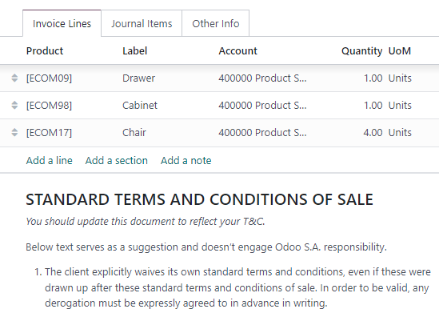
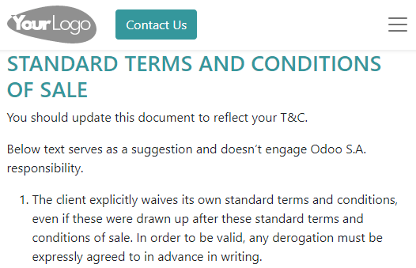

# Default terms and conditions (T&C)

Specifying terms and conditions is essential to establish important contractual points, such as
return and refunds, warranty, and after-sale services.

You can add default terms and conditions at the bottom of all customer invoices, sales orders, and
quotations, either as text or a link to a web page.

#### SEE ALSO
[Odoo Tutorial: Terms & Conditions](https://www.odoo.com/slides/slide/terms-conditions-1680)

## Cấu hình

Go to Accounting ‣ Configuration ‣ Settings. Under the Customer
Invoices, enable Default Terms & Conditions. By default, the Add a Note
option is selected, and the terms and conditions are displayed at the bottom of the document. Enter
the terms and conditions in the text box below.

Alternatively, to display the terms and conditions on a web page, select the Add a link
to a Web Page option and click Save. Click Update Terms, edit the
content, and click Save. The link to that page is then added as a note in your document.

#### NOTE
You can edit the layout and content of the page using the [Website](../../../websites/website/) app. If the Website app is activated, the Edit in
Website Builder option then replaces Update Terms.

