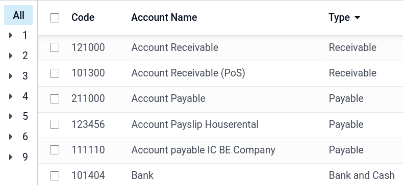
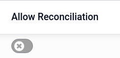

# Hệ thống tài khoản

The **chart of accounts (COA)** is the list of all the accounts used to record financial
transactions in the general ledger of an organization. The chart of accounts can be found under
Accounting ‣ Configuration ‣ Chart of Accounts.

When browsing your chart of accounts, you can sort the accounts by Code,
Account Name, or Type, but other options are available in the drop-down menu

## Configuration of an account

The country you select during the creation of your database (or additional company in your database)
determines which [fiscal localization package](../../fiscal_localizations/) is installed by
default. This package includes a standard chart of accounts already configured according to the
country's regulations. You can use it directly or set it according to your company's needs.

To create a new account, go to Accounting ‣ Configuration ‣ Chart of Accounts,
click Create, and fill in (at the minimum) the required fields
(Code, Account Name, Type).

#### WARNING
It is not possible to modify the **fiscal localization** of a company once a journal entry has
been posted.

### Code and name

Each account is identified by its Code and Name, which also indicate the
account's purpose.

### Loại

Correctly configuring the **account type** is critical as it serves multiple purposes:

- Information on the account's purpose and behavior
- Generate country-specific legal and financial reports
- Set the rules to close a fiscal year
- Generate opening entries

To configure an account type, open the Type field's drop-down selector and select the
corresponding type from the following list:

| Báo cáo               | Danh mục       | Loại tài khoản     |
|-----------------------|----------------|--------------------|
| Bảng cân đối kế toán  | Tài sản        | Khoản phải thu     |
| Ngân hàng và tiền mặt |                |                    |
| Tài sản lưu động      |                |                    |
| Tài sản dài hạn       |                |                    |
| Khoản trả trước       |                |                    |
| Tài sản cố định       |                |                    |
| Nợ                    | Phải trả       |                    |
| Thẻ                   |                |                    |
| Nợ ngắn hạn           |                |                    |
| Nợ dài hạn            |                |                    |
| Vốn chủ sở hữu        | Vốn chủ sở hữu |                    |
| Thu nhập năm hiện tại |                |                    |
| Lãi & lỗ              | Doanh thu      | Doanh thu          |
| Thu nhập khác         |                |                    |
| Chi phí               | Chi phí        |                    |
| Khấu hao              |                |                    |
| Chi phí doanh thu     |                |                    |
| Khác                  | Khác           | Ngoài bảng cân đối |

#### Tài sản

Some **account types** can **automate** the creation of [asset](../vendor_bills/assets.md#assets-automation) entries.
To **automate** entries, click View on an account line and go to the
Automation tab.

You have three choices for the Automation tab:

1. No: this is the default value. Nothing happens.
2. Create in draft: whenever a transaction is posted on the account, a draft entry is
   created but not validated. You must first fill out the corresponding form.
3. Create and validate: you must also select a Deferred Expense Model.
   Whenever a transaction is posted on the account, an entry is created and immediately validated.

### Thuế mặc định

In the View menu of an account, select a **default tax** to be applied when this
account is chosen for a product sale or purchase.

### Thẻ

Some accounting reports require **tags** to be set on the relevant accounts. To add a tag, under
View, click the Tags field and select an existing tag or Create
a new one.

### Nhóm tài khoản

**Nhóm tài khoản** hữu ích để liệt kê nhiều tài khoản như *tài khoản phụ* của một tài khoản lớn hơn và từ đó hợp nhất các báo cáo như **Bảng cân đối thử**. Theo mặc định, các nhóm được xử lý tự động dựa trên mã của nhóm. Ví dụ: tài khoản mới `131200` sẽ là một phần của nhóm `131000`. Bạn có thể chỉ định nhóm cụ thể cho tài khoản trong trường Nhóm dưới mục Xem.

#### Create account groups manually

#### NOTE
Regular users should not need to create account groups manually. The following section is only
intended for rare and advanced use cases.

To create a new account group, activate [developer mode](../../../general/developer_mode.md#developer-mode) and head to
Accounting ‣ Configuration ‣ Account Groups. Here, create a new group and enter
the name, code prefix, and company to which that group account should be available. Note
that you must enter the same code prefix in both From and to fields.

To display your **Trial Balance** report with your account groups, go to
Accounting ‣ Reporting ‣ Trial Balance, then open the Options menu
and select Hierarchy and Subtotals.

### Allow reconciliation

Some accounts, such as accounts made to record the transactions of a payment method, can be used for
the reconciliation of journal entries.

For example, an invoice paid with a credit card can be marked as paid if reconciled with
its payment. Therefore, the account used to record credit card payments needs to be configured as
**allowing reconciliation**.

To do so, check the Allow Reconciliation box in the account's settings, and
Save; or enable the button from the chart of accounts view.

### Ngừng sử dụng

It is not possible to delete an account once a transaction has been recorded on it. You can make
them unusable by using the **Deprecated** feature: check the Deprecated box in the
account's settings, and Save.

#### SEE ALSO
* [Accounting cheat sheet](cheat_sheet.md)
* [Non-current assets and fixed assets](../vendor_bills/assets.md)
* [Deferred expenses](../vendor_bills/deferred_expenses.md)
* [Doanh thu chưa thực hiện](../customer_invoices/deferred_revenues.md)
* [Fiscal localizations](../../fiscal_localizations/)
* [Odoo Tutorials: Chart of accounts](https://www.odoo.com/slides/slide/chart-of-accounts-1630)
* [Odoo Tutorials: Update your chart of accounts](https://www.odoo.com/slides/slide/update-your-chart-of-accounts-1658)
