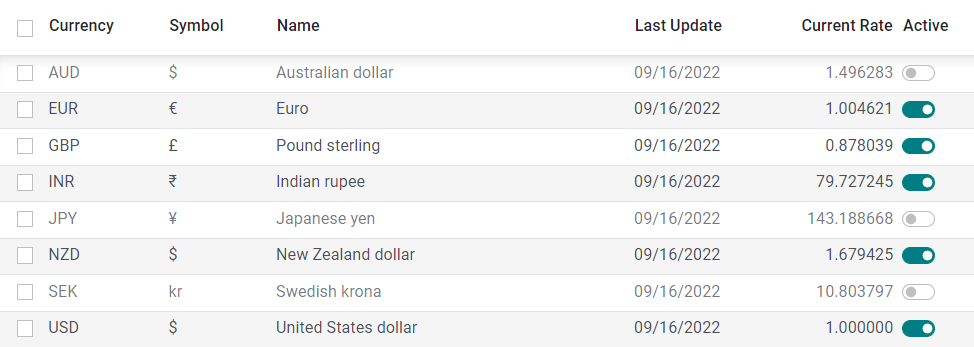
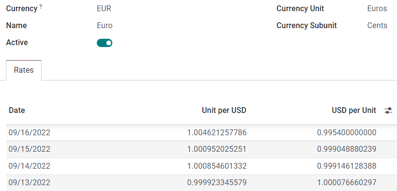
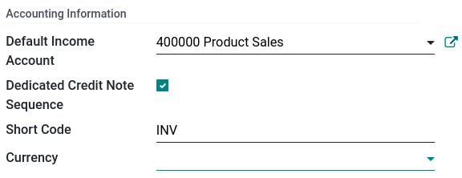
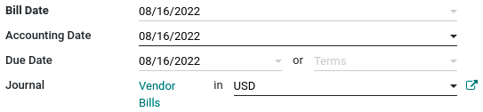
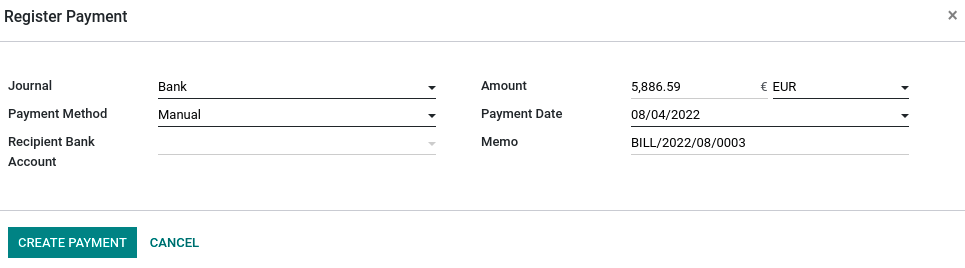
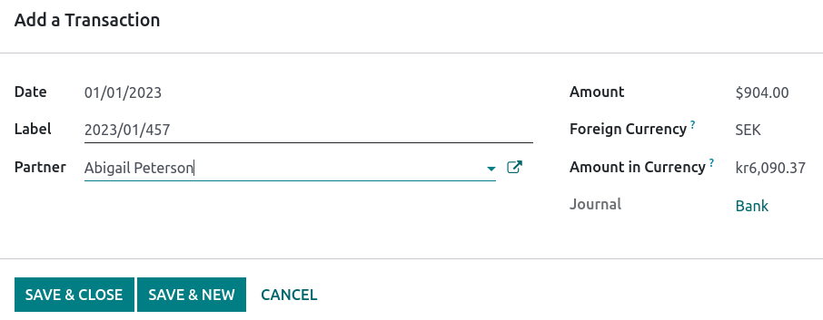

# Hệ thống đa tiền tệ

Odoo allows you to issue invoices, receive bills, and record transactions in currencies other than
the main currency configured for your company. You can also set up bank accounts in other currencies
and run reports on your foreign currency activities.

#### SEE ALSO
- [Manage a bank account in a foreign currency](../bank/foreign_currency.md)

## Cấu hình

### Tiền tệ chính

The **main currency** is defined by default according to the company's country. You can change it by
going to Accounting ‣ Configuration ‣ Settings ‣ Currencies and changing the
currency in the Main Currency setting.

### Enable foreign currencies

Go to Accounting ‣ Configuration ‣ Currencies, and enable the currencies you
wish to use by toggling the Active button.

### Tỷ giá

#### Cập nhật thủ công

To manually create and set a currency rate, go to Accounting ‣ Configuration ‣
Currencies, click on the currency you wish to change the rate of, and under the Rates
tab, click Add a line to create a new rate.

#### Cập nhật tự động

When you activate a second currency for the first time, Automatic Currency Rates appears
under Accounting Dashboard ‣ Configuration ‣ Settings ‣ Currencies. By
default, you have to click on the **Update now** button (🗘) to update the rates.

Odoo can update the rates at regular intervals. To do so, change the Interval from
Manually to Daily, Weekly, or Monthly. You can also
select the web service from which you want to retrieve the latest currency rates by clicking on the
Service field.

### Exchange difference entries

Odoo automatically records exchange differences entries on dedicated accounts, in a dedicated
journal.

You can define which journal and accounts to use to **post exchange difference entries** by
going to Accounting ‣ Configuration ‣ Settings ‣ Default Accounts and editing
the Journal, Gain Account, and Loss Account.

### Hệ thống tài khoản

Each account can have a set currency. By doing so, all moves relevant to the account are forced to
have that account's currency.

To do so, go to Accounting ‣ Configuration ‣ Charts of Accounts and select a
currency in the field Account Currency. If left empty, all active currencies are handled
instead of just one.

### Sổ nhật ký

If a currency is set on a **journal**, that journal only handles transactions in that currency.

To do so, go to Accounting ‣ Configuration ‣ Journals, open the journal you
want to edit, and select a currency in the field Currency.

## Kế toán đa tiền tệ

### Invoices, bills, and other documents

For all documents, you can select the currency and journal to use for the transaction on the
document itself.

### Payment registration

To register a payment in a currency other than your company's main currency, click on the
Register Payment payment button of your document and, in the pop-up window, select a
**currency** in the Amount field.

### Giao dịch ngân hàng

When creating or importing bank transactions, the amount is in the company's main currency. To input
a **foreign currency**, select a currency in the Foreign Currency. Once selected, enter
the Amount in your main currency for it to automatically get converted in the foreign
currency in the Amount in Currency field.

When reconciling, Odoo displays both the foreign currency amount and the equivalent amount in your
company's main currency.

### Exchange rate journal entries

To see **exchange difference journal entries**, go to Accounting Dashboard ‣
Accounting ‣ Journals: Miscellaneous.

