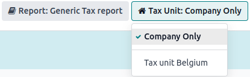

# Tax units

#### IMPORTANT
This is only applicable to multi-company environments.

**Đơn vị thuế** là một nhóm các doanh nghiệp chịu thuế GTGT độc lập về mặt pháp lý với nhau nhưng có liên kết chặt chẽ về mặt tài chính, tổ chức và kinh tế và do đó được coi là cùng một doanh nghiệp chịu thuế GTGT. **Đơn vị thuế** không phải yêu cầu bắt buộc; nhưng nếu được tạo, thì các công ty thành viên của đơn vị phải thuộc cùng một **quốc gia**, sử dụng cùng một **tiền tệ** và một công ty phải được chỉ định là công ty **đại diện** của **đơn vị thuế**. **Đơn vị thuế** nhận được một **Mã số thuế** cụ thể chỉ dành cho **tờ khai thuế**. Các công ty **thành viên** giữ **Mã số thuế** được sử dụng cho **mục đích thương mại**.

## Cấu hình

To create a **tax unit**, go to Accounting ‣ Configuration ‣ Tax Units, and
click New. Enter a **name** for the unit, select a Country, the
Companies to incorporate in the unit, the Main Company, and the
Tax ID of the **constituent** company of that tax unit.

### Vị trí tài chính

As transactions between constituents of the same **tax unit** are not subject to VAT, it is possible
to create a [tax mapping (fiscal position)](applications/finance/accounting/taxes/fiscal_positions.md) to avoid the
application of VAT on inter-constituent transactions.

Be sure a constituent company has been selected before, then go to Accounting ‣
Configuration ‣ Fiscal Positions, and Create a new **fiscal position**. Click the
Tax Mapping tab, select the Tax on Product usually applied for
**non-constituent** transactions, and in Tax to Apply, select the 0% tax to apply for
**constituent** transactions.

Do the same for the Account Mapping tab if required, and repeat this process for
**each** constituent company on your database.

Then, assign the fiscal position by opening the **Contacts** app. Search for a **constituent**
company, and open the contact's **card**. Click the Sales & Purchase tab, and in the
Fiscal Position field, input the **fiscal position** created for the **tax unit**.
Repeat the process for each **constituent** company card form, on each company database.

#### SEE ALSO
[Fiscal positions (tax and account mapping)](applications/finance/accounting/taxes/fiscal_positions.md).

## Báo cáo thuế

The **representative** company can access the aggregated tax report of the **tax unit** by going to
Accounting ‣ Reporting ‣ Tax Report, and selecting the **tax unit** in
Tax Unit. This report contains the aggregated transactions of all **constituents** and
the .XML export contains the name and VAT number of the **main** company.

