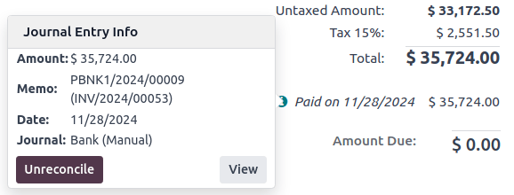
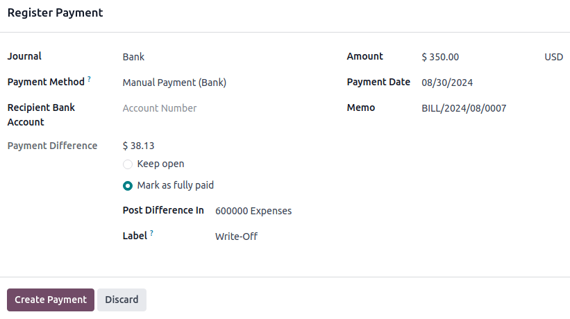

# Thanh toán

In Odoo, payments can either be automatically linked to an invoice or bill or be stand-alone records
for use at a later date:

- If a payment is **linked to an invoice or bill**, it reduces/settles the amount due on the
  invoice. Multiple payments on the same invoice are possible.
- If a payment is **not linked to an invoice or bill**, the customer has an outstanding credit with
  the company, or the company has an outstanding debit with a vendor. Those outstanding amounts
  reduce/settle unpaid invoices/bills.

#### SEE ALSO
- [Internal transfers](payments/internal_transfers.md)
- [Đối chiếu ngân hàng](bank/reconciliation.md)
- [Odoo Tutorials: Bank Configuration](https://www.odoo.com/slides/slide/bank-configuration-6832)

## Registering payment from an invoice or bill

Clicking Register payment in a customer invoice or vendor bill generates a new journal
entry and sets the amount due according to the payment amount. The counterpart is reflected in an
[outstanding](bank.md#bank-outstanding-accounts) **receipts** or **payments** account. At this point,
the customer invoice or vendor bill is marked as In payment or [Partially paid](#accounting-payments-partial-payment). Then, when the outstanding account is reconciled with a bank
transaction, the invoice or vendor bill changes to the Paid status.

To open the Journal Entry Info window and display more information about the payment,
click the <i class="fa fa-info-circle"></i> (information) icon in the footer of the
Invoice Lines tab. To access additional information, such as the related journal entry,
click View.

#### NOTE
- The customer invoice or vendor bill must be in the Posted status to register the
  payment.
- If a payment is unreconciled, it still appears in the books but is no longer linked to the
  invoice.
- If a payment is (un)reconciled in a different currency, a journal entry is automatically
  created to post the currency exchange gains/losses (reversal) amount.
- If a payment is (un)reconciled on an invoice with cash-basis taxes, a journal entry is
  automatically created to post the cash-basis tax (reversal) amount.

## Registering payments not tied to an invoice or bill

When a new payment is registered via Customers / Vendors ‣ Payments, it is not
directly linked to an invoice or bill. Instead, the account receivable or the account payable is
matched with the **outstanding account** until it is manually matched with its related invoice or
bill. Then, [reconciling](bank/reconciliation.md) the payment with the bank transaction completes
the payment workflow.

### Payments matching

#### NOTE
During the [bank reconciliation](bank/reconciliation.md) process, a remaining balance is
identified if the total debits and credits do not match when records are compared with bank
transactions. This balance must either be reconciled later or written off immediately.

#### For a single invoice or bill

A blue banner appears when validating a new invoice/bill and an **outstanding payment** exists for
this specific customer or vendor. To match it with the invoice or bill, click Add
under Outstanding Credits or Outstanding Debits.

The invoice or bill is then marked as In payment until the payment is [reconciled](bank/reconciliation.md) with its corresponding [bank transaction(s)](bank/transactions.md).

#### Matching payments

The Payments matching or Auto-reconcile tool allows reconciling journal
items with each other (i.e., payments with customer invoices or vendor bills) either individually or
in batches. Access the Accounting Dashboard, click the <i class="fa fa-ellipsis-v"></i>
(dropdown menu) button from the Customer Invoices or Vendor
Bills journals, and select Payments Matching. Alternatively, go to
Accounting ‣ Accounting ‣ Reconcile.

To manually Reconcile journal items, select the individual items from the list view and
click Reconcile.

##### Auto-Reconcile Feature

To use the Auto-Reconcile feature, follow these steps:

1. In the Journal Items to reconcile list view, click Auto-Reconcile next to
   the receivable or payable account (or a specific contact's journal item in that account).
2. In the Find Entries to Reconcile Automatically window, set the Reconcile
   field depending on how you want to match journal items:
   - Opposite balances one by one: Each debit journal item will be matched with the
     corresponding credit journal item of the same value.
   - Accounts with zero balances: All reconciled journal items will have the same
     matching number.
3. Click Launch.

Invoices and bills are automatically matched to their corresponding payments and marked as
In payment until they are [reconciled](bank/reconciliation.md) with their
corresponding [bank transactions](bank/transactions.md).

## Registering payments on multiple invoices or bills (group payments)

To register payments on multiple invoices/bills, follow these steps:

1. Go to Accounting ‣ Customers ‣ Invoices/Credit Notes or
   Accounting ‣ Vendors ‣ Bills/Refunds.
2. In the list view, select the relevant invoices/credit notes or bills/refunds.
3. Click <i class="fa fa-cog"></i> Actions and select Register Payment.
4. In the Register Payment window, select the Journal, the
   Payment Method, and the Payment Date.
5. To combine all payments from the same contact into a single payment, enable the Group
   Payments option, or leave it unchecked to create separate payments.
6. Click Create payment.

The invoices or bills are then marked as In payment until the bank transactions are
[reconciled](bank/reconciliation.md) with the payments.

## Registering a single payment for multiple customers or vendors (batch payments)

Thanh toán theo lô cho phép nhóm các khoản thanh toán từ nhiều liên hệ để đơn giản hóa việc [đối chiếu](bank/reconciliation.md). Tính năng này cũng hữu ích khi nộp [séc](payments/checks.md) vào ngân hàng hoặc tạo tệp thanh toán ngân hàng như [SEPA](payments/pay_sepa.md) hoặc [NACHA](../fiscal_localizations/united_states.md#l10n-us-nacha). Để sử dụng, hãy truy cập Kế toán ‣ Khách hàng ‣ Thanh toán hoặc Kế toán ‣ Nhà cung cấp ‣ Thanh toán. Trong chế độ xem danh sách thanh toán, chọn các khoản cần nhóm vào lô, nhấp <i class="fa fa-cog"></i> Hành động, rồi chọn Tạo thanh toán theo lô.

#### SEE ALSO
- [Batch payments by bank deposit](payments/batch.md)
- [Batch payments: SEPA Direct Debit (SDD)](payments/batch_sdd.md)

## Registering a partial payment

To register a partial payment, click on Register Payment from the related invoice or
bill. In the case of a partial payment (when the Amount paid is less than the total
remaining amount on the invoice or the bill), the Payment Difference field displays the
outstanding balance. There are two options:

- Keep open: Keep the invoice or the bill open and mark it with a Partial
  banner;
- Mark as fully paid: Select an account in the Post Difference In field and
  change the Label if needed. A journal entry will be created to balance the accounts
  payable or receivable with the selected account.

## Reconciling payments with bank transactions

Once a payment has been registered, the status of the invoice or bill is In payment. The
next step is [reconciling](bank/reconciliation.md) the payment with the related [bank
transaction](bank/transactions.md) line to finalize the payment workflow and mark the invoice or bill
as Paid.

* [Thanh toán online](payments/online.md)
  * [Install the patch to disable online invoice payment](payments/online/install_portal_patch.md)
* [Séc](payments/checks.md)
* [Batch payments by bank deposit](payments/batch.md)
* [Batch payments: SEPA Direct Debit (SDD)](payments/batch_sdd.md)
* [Follow up hoá đơn](payments/follow_up.md)
* [Internal transfers](payments/internal_transfers.md)
* [Thanh toán bằng SEPA](payments/pay_sepa.md)
* [Pay by checks](payments/pay_checks.md)
* [Forecast future bills to pay](payments/forecast.md)
* [Trusted accounts (send money)](payments/trusted_accounts.md)
