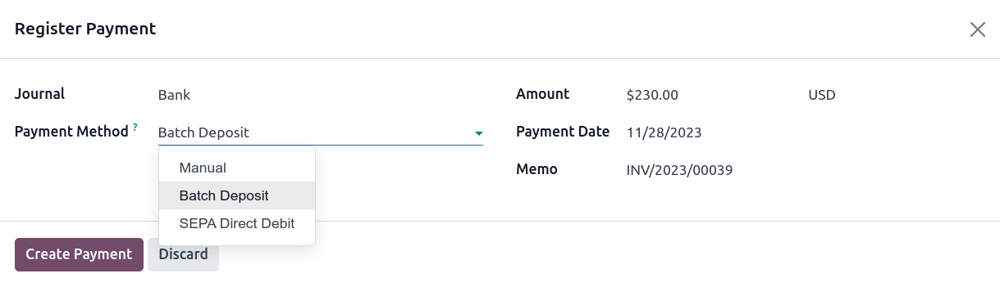
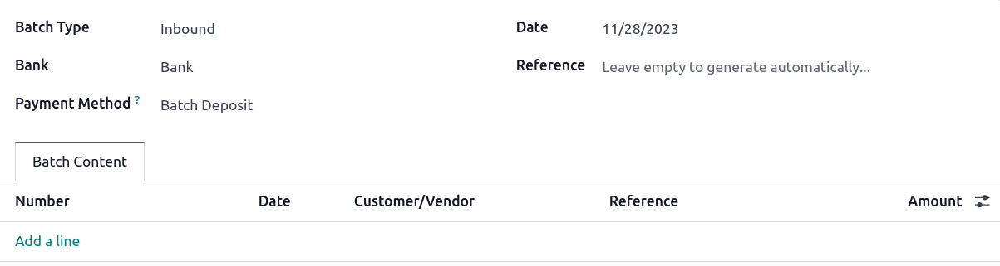
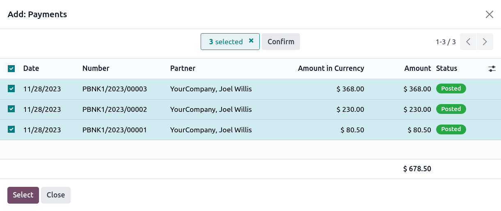
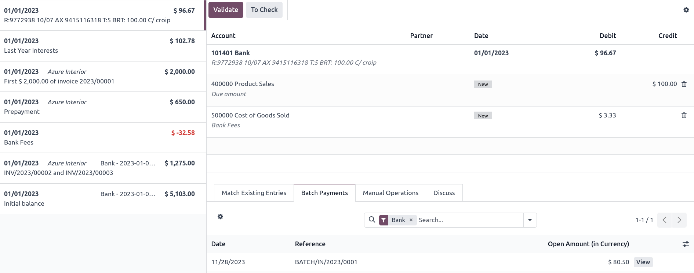

# Batch payments by bank deposit

A **batch deposit** is a convenient way to group customer payments and deposit them into your bank
account. The feature lets you list multiple payments and generate a detailed deposit slip with a
batch reference. This reference can be used when reconciling to match bank statement lines with
transactions in the batch deposit.

## Cấu hình

Go to Accounting ‣ Configuration ‣ Settings ‣ Customer Payments and tick
Batch Payments to activate the feature.

## Deposit multiple payments in batch

### Register payments

Before performing a batch deposit, it is necessary to register each transaction's payment. To do so,
open the corresponding customer invoice and click Register Payment. In the pop-up
window, select the Journal linked to your bank account and Batch Deposit as
the Payment Method, and click Create Payment.

### Add payments to a batch deposit

To add payments to a batch deposit, go to Accounting ‣ Customers ‣ Batch
Payments, and click New. Next, select the Bank and choose Batch
Deposit as the Payment Method.

Click Add a line. In the pop-up window, tick all payments to include in the batch
deposit, then click Select.

Once done, click Validate to finalize the batch deposit.

### Đối chiếu ngân hàng

Once the bank transactions are on your database, you can reconcile bank statement lines with the
batch payment. To do so, go to the Accounting Dashboard and click Reconcile
Items on the related bank account. Go to the Batch Payments tab to select a specific
batch and click Validate to finalize the process.

#### NOTE
If a specific payment could not be processed by the bank or is missing, remove the related
payment before reconciling.

#### SEE ALSO
- [Thanh toán](applications/finance/accounting/payments.md)
- [Batch payments: SEPA Direct Debit (SDD)](applications/finance/accounting/payments/batch_sdd.md)
