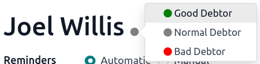

# Follow up hoá đơn

A follow-up message can be sent to customers when a payment is overdue. Odoo helps you identify late
payments and allows you to schedule and send the appropriate reminders using **follow-up actions**
that automatically trigger one or more actions according to the number of overdue days. You can send
your follow-ups via different means, such as email, post, or SMS.

#### SEE ALSO
- [Odoo Tutorials: Payment Follow-up](https://www.odoo.com/slides/slide/payment-follow-up-1682)

## Cấu hình

To configure a Follow-Up Action, go to Accounting ‣ Configuration ‣
Follow-up Levels, and select or create (a) new follow-up level(s). Several follow-up actions are
available by default under the Notification tab, and the **name** as well as the
**number of days** can be changed. The follow-up Actions available are:

- Gửi email;
- [Send a Letter](../customer_invoices/snailmail.md#customer-invoices-snailmail);
- [Send an SMS message](../../../marketing/sms_marketing/pricing_and_faq.md#pricing-pricing-and-faq).

You can use a pre-filled template for your messages by selecting a Content Template. To
change the template used, hover over the field and click the -->. If enabled, SMS
messages have a specific Sms Template field.

It is possible to automatically send a reminder by enabling the Automatic option, and
attaching the *open* invoice(s) by enabling Attach Invoices, within a specific follow-up
action.

By clicking on the Activity tab, scheduling activities (tasks) is possible. That way,
an activity is automatically scheduled when the follow-up is triggered. To do so, enable
Schedule Activity, and select a Responsible person for the task. Choose an
Activity Type, and enter a Summary on how to handle the activity, if
desired.

## Báo cáo follow-up

Overdue invoices you need to follow up on are available in Accounting ‣ Customers
‣ Follow-up Reports. By default, Odoo filters by Overdue Invoices, but you can also
filter by In need of action in the Filters menu.

When selecting an invoice, you can see all of the customer's unpaid invoices (overdue or not), with
the due dates of late invoices appearing in red. You can exclude invoices from a reminder by
clicking Exclude from Follow-ups. You can set either Automatic or
Manual reminders as well as a Responsible person for that customer.

To send reminders, click on Follow up, and select the action(s) you want to perform
from:

- In;
- Email;
- Sms;
- Qua bưu điện.

You can Attach Invoices and change the content templates from this view. When done,
click Send or Send & Print.

#### NOTE
- The contact information on the invoice or the contact form is used to send the reminder.
- When the reminder is sent, it is documented in the chatter of the invoice.
- If it is not the right time for a reminder, you can specify the Next Reminder date.
  You will get the next report according to the next reminder date set.

### Debtor's trust level

To know whether a customer usually pays late or not, you can set a trust level by marking them as
Good Debtor, Normal Debtor, or Bad Debtor on their follow-up
report. To do so, click on the bullet next to the customer's name and select a trust level.

### Send reminders in batches

You can send reminder emails in batches from the Follow-up Reports page. To do so,
select all the reports you would like to process, click on the Action gear icon, and
select Process follow-ups.

#### SEE ALSO
- [Mua hàng trong ứng dụng (IAP)](../../../essentials/in_app_purchase.md)
- [SMS Pricing and FAQ](../../../marketing/sms_marketing/pricing_and_faq.md)
- [Snailmail](../customer_invoices/snailmail.md)
