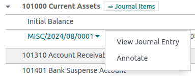

# Báo cáo

Odoo includes **generic** and **dynamic** reports available for all countries, regardless of the
[localization package](../fiscal_localizations.md) installed:

- [Bảng cân đối kế toán](#accounting-reporting-balance-sheet)
- [Lãi và lỗ](#accounting-reporting-profit-and-loss)
- [Bảng tóm tắt hoạt động](#accounting-reporting-executive-summary)
- [Sổ cái chung](#accounting-reporting-general-ledger)
- [Tuổi nợ phải thu](#accounting-reporting-aged-receivable)
- [Tuổi nợ phải trả](#accounting-reporting-aged-payable)
- [Báo cáo lưu chuyển tiền tệ](#accounting-reporting-cash-flow-statement)
- [Báo cáo thuế](#accounting-reporting-tax-report)

To expand the lines of a report and view its details, click the <i class="fa fa-caret-right"></i>
(right arrow) on the left. Then click the <i class="fa fa-caret-down"></i> (down arrow)
to the right of the account, journal entry, payment, invoice, etc. to Annotate and view
the details.

To export reports in PDF or XLSX format, click PDF at the top or click the
<i class="fa fa-caret-down"></i> (down arrow) icon next to the PDF button and
select XLSX.

To compare values across periods, click the Comparison menu and select the periods you
want to compare.

## Bảng cân đối kế toán

The Balance Sheet shows a snapshot of your organization's assets, liabilities, and
equity at a particular date.

## Lãi và lỗ

The Profit and Loss report (or **Income Statement**) shows your company's net income by
deducting expenses from revenue for the reporting period.

## Bảng tóm tắt hoạt động

The Executive Summary provides an overview of all the important figures for overseeing
your company's performance.

It includes the following items:

- Performance:
  : - Gross profit margin:
      : The contribution of all sales your business makes **minus** any direct costs needed to
        make those sales (labor, materials, etc.).
    - Net profit margin:
      : The contribution of all sales made by your business **minus** any direct costs needed to
        make those sales *and* fixed overheads your company has (electricity, rent, taxes
        to be paid as a result of those sales, etc.).
    - Return on investment (per annum):
      : The ratio of the net profit to the amount of assets the company used to make those profits.
- Position:
  : - Average debtors days:
      : The average number of days it takes your customers to (fully) pay you across all your
        customer invoices.
    - Average creditors days:
      : The average number of days it takes you to (fully) pay your suppliers across all your bills.
    - Short-term cash forecast:
      : How much cash is expected in or out of your business in the next month, i.e., the balance of
        your **Sales account** for the month **minus** the balance of your **Purchases account** for
        the month.
    - Current assets to liabilities:
      : Also referred to as the **current ratio**, this is the ratio of current assets () to the current liabilities (). It is typically used to measure a company's ability to
        service its debt.

## Sổ cái chung

The General Ledger report shows all transactions from all accounts for a selected date
range. The initial summary report shows the totals for each account. To expand an account and view
its details, click the <i class="fa fa-caret-right"></i> (right arrow) on the left.
This report is useful for reviewing each transaction that occurred during a specific period.

## Tuổi nợ phải thu

The Aged Receivable report shows the sales invoices awaiting payment during a selected
month and several months prior.

## Tuổi nợ phải trả

The Aged Payable report displays information on individual bills, credit notes, and
overpayments you owe and how long these have gone unpaid.

## Báo cáo lưu chuyển tiền tệ

The Cash Flow Statement shows how changes in balance sheet accounts and income affect
cash and cash equivalents and breaks the analysis down to operating, investing, and financing
activities.

## Báo cáo thuế

The Tax Report shows the NET and TAX amounts for all the
taxes grouped by type (Sales/Purchases).

* [Tax return (VAT declaration)](reporting/tax_returns.md)
* [Tax carryover](reporting/tax_carryover.md)
* [Analytic accounting](reporting/analytic_accounting.md)
* [Analytic budgets](reporting/budget.md)
* [Intrastat](reporting/intrastat.md)
* [Data inalterability check report](reporting/data_inalterability.md)
* [Tích hợp Silverfin](reporting/silverfin.md)
* [Custom reports](reporting/customize.md)
* [Year-end closing](reporting/year_end.md)
