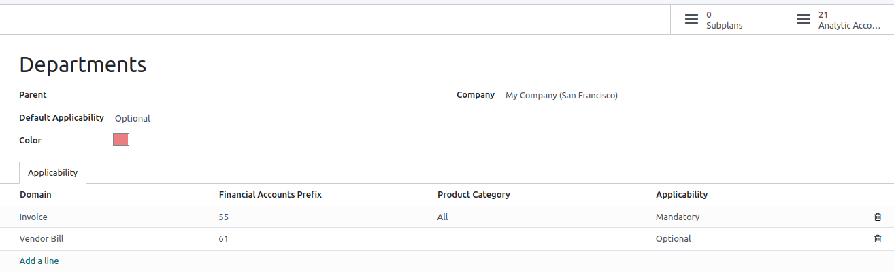

# Analytic accounting

Analytic accounting helps you track costs and revenues, as well as analyze the profitability of a
project or service. When creating your journal entries, the analytic widget allows the distribution
of costs in one or more analytic accounts.

## Cấu hình

Enable the Analytic Accounting feature by going to Accounting ‣
Configuration ‣ Settings ‣ Analytics.

## Tài khoản phân tích

The analytic accounts give an overview of your costs and revenue.

Access your existing analytic accounts by going to Accounting ‣ Configuration ‣
Analytic Accounting: Analytic Accounts. To create a new analytic account, click New,
and fill in the required information:

- Analytic Account: add the name of your analytic account;
- Customer: select the customer related to your project;
- Reference: add a reference to make it easier to find the account when you are on your
  bill;
- Plan: add an [analytic plan](#analytic-accounting-analytic-plans);
- Company: if you are managing multiple companies, select the company for which the
  analytic account will be used;
- Currency: select the currency of the analytic account;

Then, fill in your [budget](applications/finance/accounting/reporting/budget.md) information.

## Kế hoạch phân tích

The analytic plans allow you to analyze your accounting. For example, to track costs and revenues by
project or department.

You can access the analytic plans by going to Accounting ‣ Configuration ‣
Analytic Accounting: Analytic Plans. Click New to create a new plan.

The following information must be completed:

- Parent: link your plan to another Analytic Plan to build a hierarchy
  between your plans;
- Default Applicability: decide how your plan behaves in the widget when creating a new
  journal entry:
  > - Optional: if selected, it is not mandatory to add the analytic plan in the widget;
  > - Mandatory: if selected, an orange bullet is visible in the widget next to the plan
  >   until the analytic distribution is done (the bullet then turns to green); it is not possible to
  >   confirm the entry if no analytic account is selected;
  > - Unavailable: if selected, the plan is not available in the widget.
- Color: select the color of the tag related to this specific plan;
- Company: add the company to which the plan applies;

You can also fine-tune your plans' applicability by filling in the Applicability tab:

- Domain: choose to which accounting document your plan applies;
- Financial Accounts Prefix: select the prefix of the account(s) to which this plan
  should be applied;
- Product Category: decide to which product category the plan applies;
- Applicability: decide how your plan behaves in the widget when creating a new journal
  : entry. The applicability you set here always overrides the default applicability.

Two smart buttons are available in the top-right corner:

> - Subplans: can be created to have a more complex analytic structure. Click the
>   Subplans smart button, and then New to add a subplan;
> - Analytic Accounts: to reach the analytic accounts related to the plan.

#### NOTE
- The analytic widget is prefilled based on the applicability, and the
  [Analytic Distribution Models](#analytic-distribution-models);
- Each analytic plan must have at least one analytic account.

## Phân bổ phân tích

Thêm một kế hoạch vào cột Phân tích khi tạo hóa đơn hoặc hóa đơn mua hàng. Trường này chỉ bắt buộc nếu bạn đã liên kết kế hoạch phân tích của mình với ít nhất một tài khoản phân tích trước đó. Sau khi thêm kế hoạch, một **tiện ích** sẽ mở ra, nơi bạn có thể điền các thông tin khác nhau. Bạn có thể thêm **thẻ** để phản ánh các tài khoản phân tích liên quan và quyết định cách phân bổ chi phí giữa các tài khoản bằng cách thay đổi tỷ lệ phần trăm.

### Analytic distribution models

The analytic distribution models automatically apply a specific distribution based on defined
criteria.

To create a new analytic distribution model, go to Accounting ‣ Configuration ‣
Analytic Distribution Models, click New and set the conditions your model has to meet
to automatically apply:

- Accounts Prefix: this analytic distribution will apply to all financial accounts
  sharing the prefix specified;
- Partner: select a partner for which the analytic distribution will be used;
- Partner Category: this field is not visible by default: add it by clicking on the
  columns selection button, and tick the Partner Category box. Add the partner category
  for which the analytic distribution will be used;
- Product: select a product for which the analytic distribution will be used;
- Product Category: this field is not visible by default: add it by clicking on the
  columns selection button, and tick the Product Category box. Select a product category
  for which the analytic distribution will be used;
- Analytic: add the analytic accounts and their distribution;
- Company: select a company for which the analytic distribution will be used;
- Analytic Distribution: if the above conditions are met, the Analytic plan
  defined in this field as well as the distribution to be applied between the different analytic
  accounts is selected automatically on the entry.
