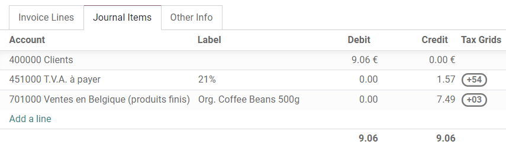

# Tax return (VAT declaration)

Các công ty có mã số đăng ký  phải nộp **tờ khai thuế** hàng tháng hoặc hàng quý, tùy thuộc vào doanh thu và quy định đăng ký của họ. Tờ khai thuế - hay tờ khai thuế GTGT - cung cấp cho cơ quan thuế thông tin về các giao dịch chịu thuế do công ty thực hiện. **Thuế đầu ra** được tính trên số lượng hàng hóa và dịch vụ mà một doanh nghiệp bán ra, trong khi **thuế đầu vào** là thuế được cộng vào giá khi mua hàng hóa hoặc dịch vụ. Dựa trên các giá trị này, công ty có thể tính toán số tiền thuế mà họ phải trả hoặc được hoàn lại.

#### NOTE
You can find additional information about VAT and its mechanism on this page from the European
Commission: ["What is VAT?"](https://ec.europa.eu/taxation_customs/business/vat/what-is-vat_en).

## Khoá học tiên quyết

### Định kỳ khai thuế

The configuration of the **Tax Return Periodicity** allows Odoo to compute your tax return correctly
and also to send you a reminder to never miss a tax return deadline.

To do so, go to Accounting ‣ Configuration ‣ Settings. Under the
Tax Return Periodicity, you can set:

- Periodicity: define here whether you submit your tax return on a monthly or quarterly
  basis;
- Reminder: define when Odoo should remind you to submit your tax return;
- Journal: select the journal in which to record the tax return.

#### NOTE
This is usually configured during the [app's initial set up](../get_started.md).

### Lưới thuế

Odoo generates tax reports based on the Tax Grids settings that are configured on your
taxes. Therefore, it is crucial to make sure that all recorded transactions use the right taxes.
You can see the Tax Grids by opening the Journal Items tab of any
invoice and bill.

To configure your tax grids, go to Accounting ‣ Configuration ‣ Taxes,
and open the tax you want to modify. There, you can edit your tax settings, along with the tax
grids that are used to record invoices or credit notes.

#### NOTE
Taxes and reports are usually already pre-configured in Odoo: a [fiscal localization package](../../fiscal_localizations.md#fiscal-localizations-packages) is installed according to the country you select at the creation
of your database.

## Close a tax period

### Ngày chốt thuế

Any new transaction whose accounting date prior to the Tax Lock Date has its tax values
moved to the next open tax period. This is useful to make sure that no change can be made to a
report once its period is closed.

Therefore, we recommend locking your tax date before working on your
Closing Journal Entry.
This way, other users cannot modify or add transactions that would have an impact on the
Closing Journal Entry, which can help you avoid some tax declaration errors.

To check the current Tax Lock Date, or to edit it, go to
Accounting ‣ Accounting ‣ Actions: Lock Dates.

### Báo cáo thuế

Once all the transactions involving taxes have been posted for the period you want to report, open
the Tax Report by going to Accounting ‣ Reporting ‣ Tax Report.
Select the period you want to declare using the date filter to have an overview of the tax report.
From the report, click PDF or XLSX to download the desired format of the tax
report. To save the report to the Documents app, click the <i class="fa fa-caret-down"></i> (down
arrow) icon, then click Save. Select the format to Export to, the
Documents Name, the Folder to store it in, and add any Tags.

The report includes all the values to report to the tax authorities, along with the amount to be
paid or refunded.

#### NOTE
If you forgot to lock your tax date before clicking on Closing Journal Entry, then
Odoo automatically locks your fiscal period on the same date as the accounting date of your
entry. This safety mechanism can prevent some fiscal errors, but it is advised to lock your tax
date manually before, as described above.

#### SEE ALSO
* [Thuế](../taxes.md)
* [Bắt đầu](../get_started.md)
* [Fiscal localizations](../../fiscal_localizations.md)
