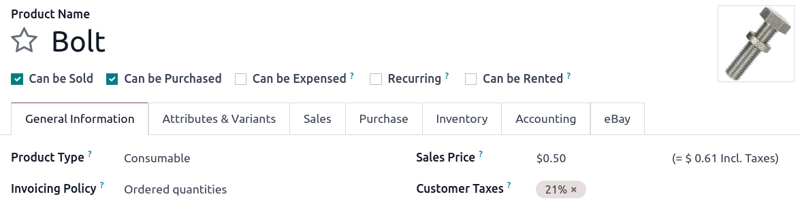
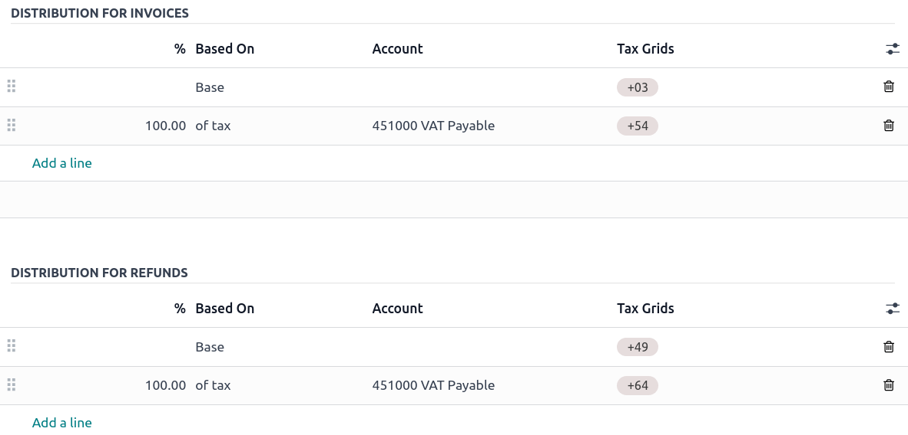
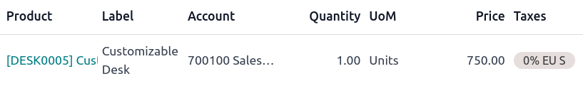
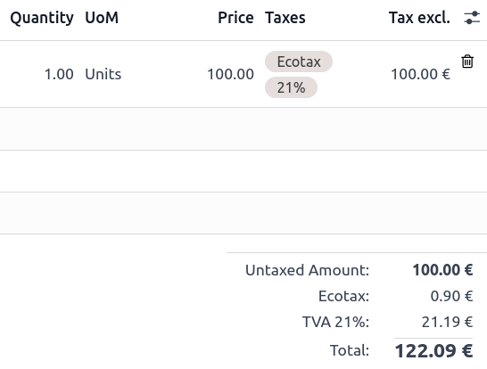
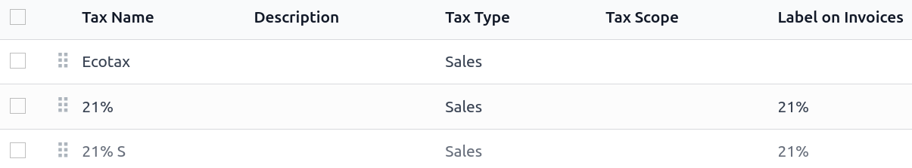

# Thuế

There are numerous types of **taxes**, and their application varies greatly, depending mostly on
your company's localization. To make sure they are recorded with accuracy, Odoo's tax engine
supports all kinds of uses and computations.

## Thuế mặc định

**Default taxes** define which taxes are automatically selected when creating a new product. They
are also used to prefill the Taxes field when adding a new line on an invoice in
[Accounting Firms](../accounting.md#fiduciaries) mode.

To change your **default taxes**, go to Accounting ‣ Configuration ‣ Settings
‣ Taxes ‣ Default Taxes, select the appropriate taxes for your default sales tax and purchase
tax, and click on Save.

#### NOTE
**Default taxes** are automatically set up according to the country selected at the creation of
your database, or when you set up a [fiscal localization package](../fiscal_localizations.md#fiscal-localizations-packages) for your company.

## Activate sales taxes from the list view

As part of your [fiscal localization package](../fiscal_localizations.md#fiscal-localizations-packages), most of your
country's sales taxes are already preconfigured on your database. However, only a few taxes are
activated by default. To activate taxes relevant to your business, go to Accounting
‣ Configuration ‣ Taxes and enable the toggle button under the Active column.

## Cấu hình

To edit or create a **tax**, go to Accounting ‣ Configuration ‣ Taxes and open
a tax or click on New.

### Basic options

#### Tax name

The **tax name** is displayed for backend users in the Taxes field in
[sales orders](../../sales/sales.md), [invoices](customer_invoices.md), product forms, etc.

#### Tax computation

- **Nhóm thuế**

  The tax is a combination of multiple sub-taxes. You can add as many taxes as you want, in the
  order you want them to be applied.

  #### IMPORTANT
  Make sure that the tax sequence is correct, as the order in which they are may impact the
  taxes' amounts computation, especially if one of the taxes [affects the base of the
  subsequent ones](#taxes-base-subsequent).
- **Cố định**

  The tax has a fixed amount in the default currency. The amount remains the same, regardless of the
  sales price.

- **Phần trăm giá**

  The *sales price* is the taxable basis: the tax amount is computed by multiplying the sales price
  by the tax percentage.

- **Percentage of Price Tax Included**

  The **total** is the taxable basis: the tax amount is a percentage of the total.

- **Mã Python**

  Một loại thuế được xác định bằng **mã Python** bao gồm hai đoạn mã Python được thực thi trong môi trường cục bộ chứa dữ liệu như giá đơn vị, sản phẩm hoặc đối tác. Mã Python xác định số tiền thuế, còn mã áp dụng xác định liệu thuế có được áp dụng hay không. Công thức này được hiển thị ở cuối tab Định nghĩa.

#### Đang hoạt động

Only **active** taxes can be added to new documents.

#### IMPORTANT
It is not possible to delete taxes that have already been used. Instead, you can deactivate them
to prevent future use.

#### NOTE
This field can be modified from the [list view](#taxes-list-activation).

#### Tax type

The Tax Type determines the tax application, which also restricts where it is displayed.

- **Sales**: Customer invoices, product customer taxes, etc.
- **Purchase**: Vendor bills, product vendor taxes, etc.
- **Không**

#### Tax scope

The Tax Scope restricts the use of taxes to a type of product, either **goods** or
**services**.

### Definition tab

Allocate with precision the amount of the taxable basis or percentages of the computed tax to
multiple accounts and tax grids.

- **Based On**:
  - Base: the price on the invoice line
  - % of tax: a percentage of the computed tax.
- **Account**: if defined, an additional journal item is recorded.
- **Tax Grids**:  used to generate [tax reports](reporting/tax_returns.md)
  automatically, according to your country's regulations.

### Tab Tùy chọn nâng cao

#### Label on invoices

The tax label is displayed on each invoice line in the Taxes column. This is visible to
*front-end* users on exported invoices, in customer portals, etc.

#### Tax group

Select which **tax group** the tax belongs to. The tax group name is the displayed above the
**total** line on exported invoices and in customer portals.

Tax groups include different iterations of the same tax. This can be useful when you must record
the same tax differently according to [fiscal positions](taxes/fiscal_positions.md).

#### IMPORTANT
Taxes have three different labels, each one having a specific use. Refer to the following table
to see where they are displayed.

| [Tên thuế](#taxes-name)   | [Label on Invoice](#taxes-label-invoices)   | [Nhóm thuế](#taxes-tax-group)                     |
|---------------------------|---------------------------------------------|---------------------------------------------------|
| Back-end                  | Taxes column on exported invoices       | Above the Total line on exported invoices |

#### Include in analytic cost

With this option activated, the tax amount is assigned to the same **analytic account** as the
invoice line.

#### Bao gồm trong giá

With this option activated, the total (including the tax) equals the **sales price**.

`Total = Sales Price = Computed Tax-Excluded price + Tax`

#### NOTE
If you need to define prices accurately, both tax-included and tax-excluded, please refer to the
following documentation: [B2B (tax excluded) and B2C (tax included) pricing](taxes/B2B_B2C.md).

#### NOTE
By default, only the Tax excluded column is displayed on invoices. To display the
Tax included column, click the **dropdown toggle** button and check
Tax incl..

#### Affect base of subsequent taxes

With this option, the total tax-included becomes the taxable basis for the other taxes applied to
the same product.

You can configure a new [group of taxes](#taxes-computation) to include this tax or add it
directly to a product line.

#### WARNING
The order in which you add the taxes on a product line has no effect on how amounts are computed.
If you add taxes directly on a product line, only the tax sequence determines the order in which
they are applied.

To reorder the sequence, go to Accounting ‣ Configuration ‣ Taxes, and drag
and drop the lines with the handles next to the tax names.

## Extra taxes

"Extra taxes" is a broad term referring to additional taxes beyond the standard or basic taxes
imposed by governments. These extra taxes can be **luxury** taxes, **environmental** taxes,
**import** or **export duties** taxes, etc.

#### NOTE
The method to compute these taxes varies across different countries. We recommend consulting your
country's regulations to understand how to calculate them for your business.

To compute an extra tax in Odoo, [create a tax](#taxes-configuration), enter a tax name, select
a [Tax Computation](#taxes-configuration), set an Amount, and in the
Advanced Options tab, check Affect Base of Subsequent Taxes. Then, drag and
drop the taxes in the [order they should be computed](#taxes-base-subsequent).

#### SEE ALSO
- [Fiscal positions (tax and account mapping)](taxes/fiscal_positions.md)
- [B2B (tax excluded) and B2C (tax included) pricing](taxes/B2B_B2C.md)
- [TaxCloud integration](taxes/taxcloud.md)
- [Tax return (VAT declaration)](reporting/tax_returns.md)

* [Cash basis taxes](taxes/cash_basis.md)
* [Withholding taxes](taxes/retention.md)
* [VAT numbers verification (VIES)](taxes/vat_verification.md)
* [Fiscal positions (tax and account mapping)](taxes/fiscal_positions.md)
* [AvaTax integration](taxes/avatax.md)
  * [AvaTax use](taxes/avatax/avatax_use.md)
  * [Cổng thông tin Avalara (Avatax)](taxes/avatax/avalara_portal.md)
* [TaxCloud integration](taxes/taxcloud.md)
* [EU intra-community distance selling](taxes/eu_distance_selling.md)
* [B2B (tax excluded) and B2C (tax included) pricing](taxes/B2B_B2C.md)
