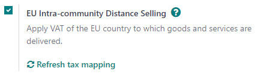

# EU intra-community distance selling

EU intra-community distance selling involves the cross-border trade of goods and services from
vendors registered for VAT purposes to individuals (B2C) located in a European Union member state.
The transaction is conducted remotely, typically through online platforms, mail orders, telephone,
or other means of communication.

EU intra-community distance selling is subject to specific VAT rules and regulations. The vendor
must charge VAT per the VAT rate applicable in the buyer's country.

#### NOTE
This remains applicable even if the vendor is located outside of the European Union.

## Cấu hình

The **EU Intra-community Distance Selling** feature helps you comply with this regulation by
creating and configuring new **fiscal positions** and **taxes** based on your company's country. To
enable it, go to Accounting ‣ Configuration ‣ Settings ‣ Taxes, tick
EU Intra-community Distance Selling, and Save.

#### NOTE
We highly recommend checking that the proposed mapping is suitable for the products and services
you sell before using it.

#### SEE ALSO
- [Thuế](../taxes.md)
- [Fiscal localizations](../../fiscal_localizations.md)
- [Fiscal positions (tax and account mapping)](fiscal_positions.md)

## One-Stop Shop (OSS)

Hệ thống  do Liên minh Châu Âu giới thiệu giúp đơn giản hóa việc thu thuế GTGT đối với các giao dịch bán hàng hóa và dịch vụ **xuyên biên giới**. Hệ thống này chủ yếu áp dụng cho các trường hợp **(B2C)** giữa doanh nghiệp với người tiêu dùng. Với OSS, doanh nghiệp có thể đăng ký thuế GTGT tại quốc gia của mình và sử dụng một cổng thông tin online duy nhất để xử lý các nghĩa vụ thuế GTGT đối với giao dịch bán hàng của họ trong EU. Có **hai cơ chế chính**: cơ chế **Union OSS** dành cho các dịch vụ xuyên biên giới và cơ chế **Import OSS** dành cho hàng hóa có giá trị bằng hoặc dưới €150.

### Báo cáo

Để tạo báo cáo **doanh số OSS** hoặc **nhập khẩu OSS** và gửi chúng lên cổng thông tin OSS, hãy vào Kế toán ‣ Báo cáo ‣ Báo cáo thuế, nhấp vào Báo cáo: Báo cáo thuế chung và chọn Doanh số OSS hoặc Nhập khẩu OSS. Sau khi chọn, hãy nhấp vào PDF, XLSX hoặc XML ở góc trên bên trái. Thao tác này sẽ tạo báo cáo hiện đang mở theo định dạng đã chọn. Sau khi tạo, hãy đăng nhập vào nền tảng của cơ quan liên bang có thẩm quyền của bạn để gửi báo cáo lên cổng thông tin OSS.

#### SEE ALSO
- [European Commission: OSS | Taxation and Customs Union](https://ec.europa.eu/taxation_customs/business/vat/oss_en)
