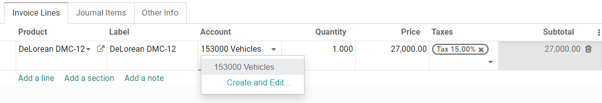
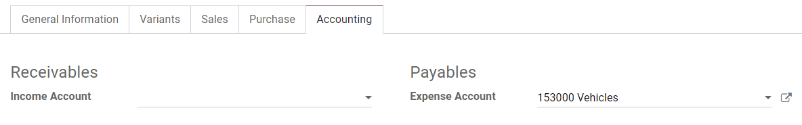
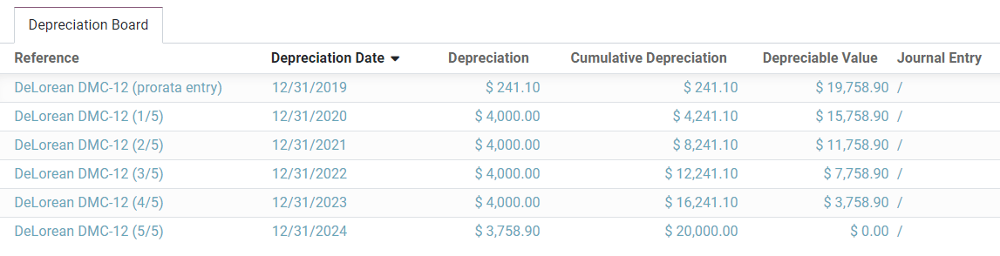
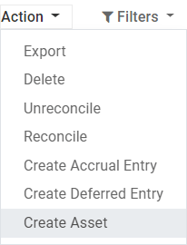
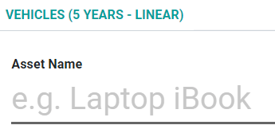
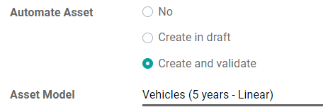

# Non-current assets and fixed assets

**Non-current Assets**, also known as **long-term assets**, are investments that are expected to be\
realized after one year. They are capitalized rather than being expensed and appear on the company's\
balance sheet. Depending on their nature, they may undergo **depreciation**.

**Fixed Assets** are a type of Non-current Assets and include the properties bought for their\
productive aspects, such as buildings, vehicles, equipment, land, and software.

Ví dụ, giả sử chúng ta mua một chiếc xe hơi với giá $27.000. Chúng ta dự định phân bổ chi phí khấu hao trong vòng năm năm, và sau đó sẽ bán nó với giá $7.000. Sử dụng phương pháp khấu hao đường thẳng, mỗi năm sẽ phân bổ $4.000 làm **chi phí khấu hao**. Sau năm năm, giá trị **Khấu hao lũy kế** được báo cáo trên bảng cân đối kế toán sẽ là $20.000 và chúng ta còn $7.000 **Giá trị không khấu hao**, hay còn gọi là Giá trị thanh lý.

Odoo Accounting handles depreciation by creating all depreciation entries automatically in _draft_\
_mode_. They are then posted periodically.

Odoo supports the following **Depreciation Methods**:

* Đường thẳng
* Số dư giảm dần
* Declining Then Straight Line

#### NOTE

The server checks once a day if an entry must be posted. It might then take up to 24 hours before\
you see a change from _draft_ to _posted_.

## Khoá học tiên quyết

Such transactions must be posted on an **Assets Account** rather than on the default\
expense account.

### Configure an Assets Account

To configure your account in the **Chart of Accounts**, go to Accounting ‣\
Configuration ‣ Chart of Accounts, click on _Create_, and fill out the form.

#### NOTE

This account's type must be either _Fixed Assets_ or _Non-current Assets_.

### Post an expense to the right account

#### Select the account on a draft bill

On a draft bill, select the right account for all the assets you are buying.

#### Choose a different Expense Account for specific products

Start editing the product, go to the _Accounting_ tab, select the right **Expense Account**, and\
save.

#### Change the account of a posted journal item

To do so, open your Purchases Journal by going to Accounting ‣ Accounting ‣\
Purchases, select the journal item you want to modify, click on the account, and select the right\
one.

## Assets entries

### Tạo mới

An **Asset entry** automatically generates all journal entries in _draft mode_. They are then posted\
one by one at the right time.

To create a new entry, go to Accounting ‣ Accounting ‣ Assets, click o&#x6E;_&#x43;reate_, and fill out the form.

Click on **select related purchases** to link an existing journal item to this new entry. Some\
fields are then automatically filled out, and the journal item is now listed under the **Related**\
**Purchase** tab.

Once done, you can click on _Compute Depreciation_ (next to the _Confirm_ button) to generate all\
the values of the **Depreciation Board**. This board shows you all the entries that Odoo will post\
to depreciate your asset, and at which date.

#### What does "Prorata Temporis" mean?

The **Prorata Temporis** feature is useful to depreciate your assets the most accurately possible.

With this feature, the first entry on the Depreciation Board is computed based on the time left\
between the _Prorata Date_ and the _First Depreciation Date_ rather than the default amount of time\
between depreciations.

For example, the Depreciation Board above has its first depreciation with an amount of $ 241.10\
rather than $ 4,000.00. Consequently, the last entry is also lower and has an amount of $ 3758.90.

#### What are the different Depreciation Methods

The **Straight Line Depreciation Method** divides the initial Depreciable Value by the number of\
depreciations planned. All depreciation entries have the same amount.

**Phương pháp khấu hao theo số dư giảm dần** nhân Giá trị khấu hao với **hệ số giảm dần** cho mỗi lần ghi nhận. Mỗi khoản khấu hao sau sẽ nhỏ hơn khoản trước đó. Khoản khấu hao cuối cùng không sử dụng hệ số giảm dần, mà có giá trị bằng phần còn lại của giá trị khấu hao, để đảm bảo tổng giá trị khấu hao bằng $0 vào cuối thời gian quy định.

The **Declining Then Straight Line Depreciation Method** uses the Declining Method, but with a\
minimum Depreciation equal to the Straight Line Method. This method ensures a fast depreciation\
at the beginning, followed by a constant one afterward.

### Assets from the Purchases Journal

You can create an asset entry from a specific journal item in your **Purchases Journal**.

To do so, open your Purchases Journal by going to Accounting ‣ Accounting ‣\
Purchases, and select the journal item you want to record as an asset. Make sure that it is posted\
in the right account (see: [Change the account of a posted journal item](assets.md#journal-assets-account)).

Then, click on _Action_, select **Create Asset**, and fill out the form the same way you would do to[create a new entry](assets.md#create-assets-entry).

## Modification of an Asset

You can modify the values of an asset to increase or decrease its value.

To do so, open the asset you want to modify, and click on _Modify Depreciation_. Then, fill out the\
form with the new depreciation values and click on _Modify_.

A **decrease in value** posts a new Journal Entry for the **Value Decrease** and modifies all the\
future _unposted_ Journal Entries listed in the Depreciation Board.

An **increase in value** requires you to fill out additional fields related to the account movements\
and creates a new Asset entry with the **Value Increase**. The Gross Increase Asset Entry can be\
accessed with a Smart Button.

## Disposal of Fixed Assets

To **sell** an asset or **dispose** of it implies that it must be removed from the Balance Sheet.

To do so, open the asset you want to dispose of, click on _Sell or Dispose_, and fill out the form.

Odoo Accounting then generates all the journal entries necessary to dispose of the asset, including\
the gain or loss on sale, which is based on the difference between the asset's book value at the\
time of the sale and the amount it is sold for.

#### NOTE

To record the sale of an asset, you must first post the related Customer Invoice so you can link\
the sale of the asset with it.

## Assets Models

You can create **Assets Models** to create your Asset entries faster. It is particularly useful if\
you recurrently buy the same kind of assets.

To create a model, go to Accounting ‣ Configuration ‣ Assets Models, click o&#x6E;_&#x43;reate_, and fill out the form the same way you would do to create a new entry.

### Apply an Asset Model to a new entry

When you create a new Asset entry, fill out the **Fixed Asset Account** with the right asset\
account.

New buttons with all the models linked to that account appear at the top of the form. Clicking on a\
model button fills out the form according to that model.

## Automate the Assets

When you create or edit an account of which the type is either _Non-current Assets_ or _Fixed_\
_Assets_, you can configure it to create assets for the expenses that are credited on it\
automatically.

You have three choices for the **Automate Assets** field:

1. **No:** this is the default value. Nothing happens.
2. **Create in draft:** whenever a transaction is posted on the account, a draft _Assets entry_ is\
   created, but not validated. You must first fill out the form in Accounting ‣\
   Accounting ‣ Assets.
3. **Create and validate:** you must also select an Asset Model (see: [Assets Models](assets.md)). Whenever a\
   transaction is posted on the account, an _Assets entry_ is created and immediately validated.

#### SEE ALSO
* [Hệ thống tài khoản](../get_started/chart_of_accounts.md)
