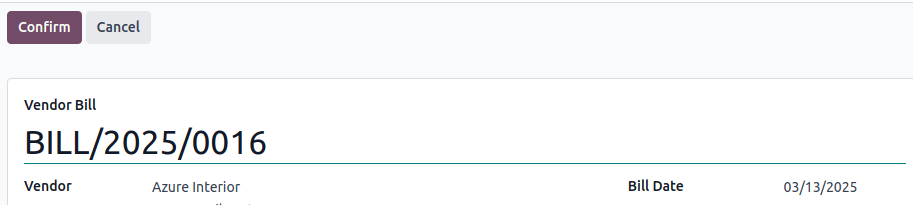
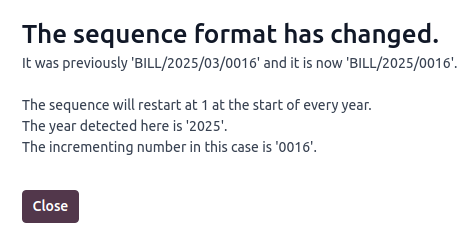
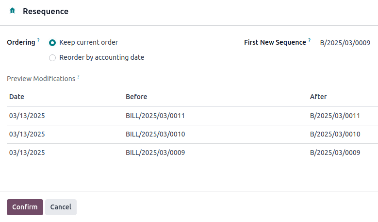

# Vendor bill sequence

When confirming a vendor bill, Odoo generates a unique vendor bill reference number. By default, it
uses the following sequence format `BILL/year/month/incrementing-number` (e.g.,
`BILL/2025/01/00001`), which restarts from `00001` each year.

However, it is possible to [change the sequence format](#accounting-vendor-bills-resequencing)
and its periodicity, and to [mass-resequence vendor bills](#accounting-vendor-bills-mass-resequencing).

#### NOTE
Changes made to reference numbers are logged in the chatter.

## Changing the default sequence

To customize the default sequence, open the last confirmed vendor bill, click Reset to
Draft, and edit the vendor bill's reference number.

Odoo then explains how the detected format will be applied to all future vendor bills. For example,
if the current vendor bill's month is withdrawn, the sequence's periodicity will change to every
year instead of every month.

## Mass-resequencing vendor bills

It can be helpful to resequence multiple vendor bill numbers. For example, when importing vendor
bills from another accounting system and the reference originates from the previous software,
continuity for the current year must be maintained without restarting from the beginning.

#### NOTE
This feature is only available to users with administrator or advisor access.

Follow these steps to resequence vendor bill numbers:

1. Activate the [developer mode](../../../general/developer_mode.md#developer-mode).
2. In the vendor bills list view, select the vendor bills that need a new sequence.
3. Click the <i class="fa fa-cog"></i> Actions menu and select Resequence.
4. In the Ordering field, choose to
   - Keep current order: The order of the numbers remains the same.
   - Reorder by accounting date: The number is reordered by accounting date.
5. Set the First New Sequence.
6. Preview Modifications and click Confirm.

The first vendor bill using the new sequence appears in red in the Bills list view.

