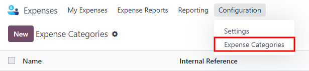
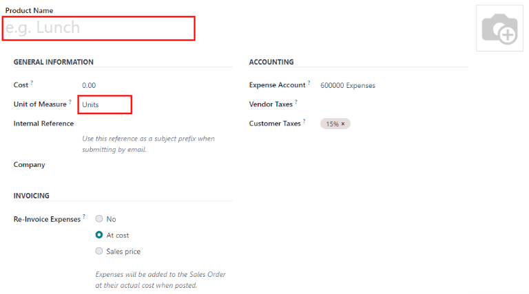

# Chi phí

Odoo **Expenses** streamlines the management of expenses. After an employee submits their expenses
in Odoo, they are reviewed by management and accounting teams. Once approved, payments can then be
processed, and disbursed back to the employee for reimbursement.

#### SEE ALSO
[Odoo Expenses: product page](https://www.odoo.com/app/expenses)

## Set expense categories

The first step to track expenses is to configure the different types of expenses for the company
(managed as *expense categories* in Odoo). Each category can be as specific or generalized as
needed. Go to Expenses app ‣ Configuration ‣ Expense Categories to view the
current expensable categories in a default list view.

To create a new expense category, click New. A product form will appear, with the
description field labeled Product Name.

#### NOTE
Expense categories are managed like products in Odoo. The expense category form follows the
standard product form in Odoo, and the information entered is similar. Expense products will be
referred to as expense categories throughout this document since the main menu refers to these as
Expense Categories.

Only two fields are required, the Product Name and the Unit of Measure.
Enter the Product Name in the field, and select the Unit of Measure from the
drop-down menu (most products will be set to Units).

The Cost field on the product form is populated with a value of `0.00` by default. When
a specific expense should always be reimbursed for a particular price, enter that amount in the
Cost field. Otherwise, leave the Cost set to `0.00`, and employees will
report the actual cost when submitting an expense report.

#### NOTE
The Cost field is always visible on the expense category form, but the
Sales Price field is *only* visible if the Sales Price is selected under
the Re-Invoice Expenses section. Otherwise, the Sales Price field is
hidden.

Select an Expense Account if using the Odoo *Accounting* app. It is recommended to check
with the accounting department to determine the correct account to reference in this field as it
will affect reports.

Set a tax on each product in the Vendor Taxes and Customer Taxes fields, if
applicable. It is considered good practice to use a tax that is configured with [Tax Included
in Price](accounting/taxes.md#taxes-included-in-price). Taxes will be automatically configured if this is set.

#### SEE ALSO
- [Log expenses](expenses/log_expenses.md)
- [Expense reports](expenses/expense_reports.md)
- [Ghi sổ chi phí](expenses/post_expenses.md)
- [Reimburse employees](expenses/reimburse.md)
- [Re-invoice expenses](expenses/reinvoice_expenses.md)

* [Approve expenses](expenses/approve_expenses.md)
* [Log expenses](expenses/log_expenses.md)
* [Expense reports](expenses/expense_reports.md)
* [Ghi sổ chi phí](expenses/post_expenses.md)
* [Reimburse employees](expenses/reimburse.md)
* [Re-invoice expenses](expenses/reinvoice_expenses.md)
