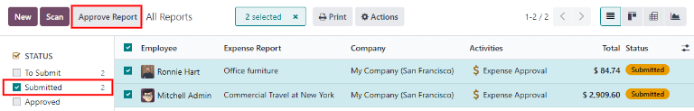
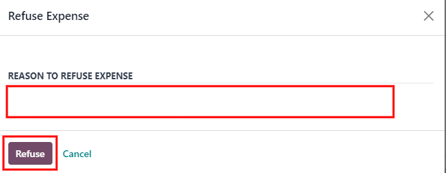

# Approve expenses

In Odoo, not just anyone can approve expense reports, only users with the necessary rights (or
permissions) can. This means that a user **must** have at least *Team Approver* rights for the
*Expenses* app. Employees with the necessary rights can review expense reports, approve or reject
them, and provide feedback thanks to the integrated communication tool.

Please refer to the [access rights documentation](../../general/users/) to learn more
about managing users and their access rights.

## Xem báo cáo chi phí

Users who are able to approve expense reports, typically managers, can easily view all expense
reports they have access rights to. Go to Expenses app ‣ Expense Reports, to view
the All Reports dashboard.

A list of all expense reports with a status of either To Submit, Submitted,
Approved, Posted, or Done appears. Expense reports with a status
of Refused are hidden, by default.

## Phê duyệt báo cáo chi phí

Expense reports can be approved in two ways: [individually](#expenses-individual) or [in
bulk](#expenses-multiple).

#### IMPORTANT
Only reports with a status of Submitted can be approved.

It is recommended to display only Submitted reports by ticking the checkbox beside
the Submitted filter, in the left column, under the Status section.

If a report is **not** able to be approved, the Approve Report button **does not**
appear on the All Reports page.

### Approve individual reports

To approve an individual report, navigate to Expenses app ‣ Expense Reports, and
click on an individual report to view the report form.

From here, several options are presented: Approve,  Refuse, and
Reset to draft.

Click Approve to approve the report.

### Approve multiple reports

To approve multiple expense reports at once, first navigate to Expenses app ‣
Expense Reports to view a list of expense reports. Next, select the reports to approve by ticking
the checkbox next to each report being approved, or tick the checkbox next to the
Employee column title to select all the reports in the list.

Next, click the Approve Report button.

## Từ chối báo cáo chi phí

Expense reports can **only** be refused on the individual expense report, and **not** from the
All Reports dashboard. To open an individual expense report, navigate to
Expenses app ‣ Expense Reports, then click on an individual expense report to
view the report form.

If more information is needed, such as a missing receipt, communicate any necessary information
requests in the *chatter* of the report form. On the individual expense report, click
Send message to open a message text box.

Type in a message, tagging the proper people, and post it to the *chatter* by clicking
Send. The message is posted in the chatter, and the tagged people are notified, via
email.

#### NOTE
The only people that can be tagged in a message are *followers* of the specific report. To see
who is a follower, click the <i class="fa fa-user-o"></i> (user) icon to display the followers
of the expense report.

To refuse an expense report, click Refuse, and a Refuse Expense pop-up
window appears. Enter a brief explanation for the refusal beneath the REASON TO REFUSE
EXPENSE field, then click Refuse.

Once the expense report is refused, the status changes to Refused, and the only button
that appears in the top-left is Reset to Draft.
