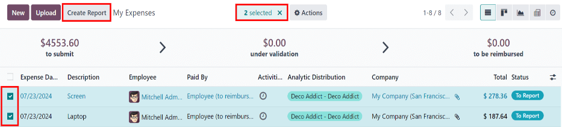
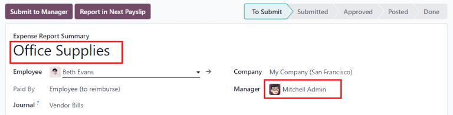
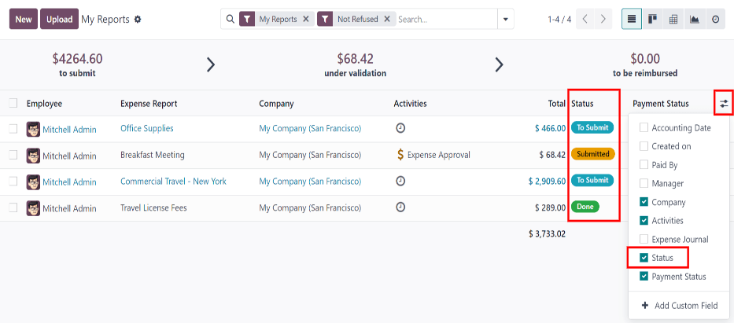

# Expense reports

When expenses are ready to submit (such as, at the end of a business trip, or once a month), an
*expense report* needs to be created. Open the main Expenses app dashboard, which
displays the My Expenses dashboard, by default. Alternatively, navigate to
Expenses app ‣ My Expenses ‣ My Expenses.

Expenses are color-coded by status. Any expense with a status of To Report (expenses
that still need to be added to an expense report) is shown in blue text. All other statuses
(To Submit, Submitted, and Approved) the text appears in black.

## Tạo báo cáo chi phí

First, select each desired expense to be added to the report on the My Expenses
dashboard, by ticking the checkbox next to each entry, or quickly select all the expenses in the
list by ticking the checkbox next to the Expense Date column title, if needed.

Another way to quickly add all expenses that are not on a expense report, is to click the
Create Report button, *without* selecting any expenses, and Odoo automatically selects
all expenses with a status of To Submit that are not already on a report.

#### NOTE
Any expense can be selected from the My Expenses list, except for expenses with a
status of Approved.

The Create Report button is visible as long as there is a minimum of one expense on
the list with a status of either To Report or To Submit.

When the Create Report button is clicked, all expenses with a status of To
Submit that are *not* currently on another expense report appears in the newly-created expense
report.

If all expenses on the My Expenses report are already associated with another expense
report, an Invalid Operation pop-up window appears, stating You have no
expenses to report.

Once the expenses have been selected, click the Create Report button. The new report
appears with all the expenses listed in the Expense tab. If there is a receipt attached
to an individual expense, a <i class="fa fa-paperclip"></i> (paperclip) icon appears between the
Customer to Reinvoice and Analytic Distribution columns.

Khi báo cáo được tạo, phạm vi ngày cho các khoản chi phí sẽ xuất hiện trong trường Tóm tắt báo cáo chi phí theo mặc định. Bạn nên chỉnh sửa trường này với một bản tóm tắt ngắn cho mỗi báo cáo để giúp sắp xếp chi phí một cách hợp lý. Nhập mô tả cho báo cáo chi phí, chẳng hạn như `Chuyến gặp mặt khách hàng tại NYC` hoặc `Văn phòng phẩm cho buổi thuyết trình`, vào trường Tóm tắt báo cáo chi phí.

The Employee, Paid By, and Company fields autopoulate with the
information listed on the individual expenses.

Next, select a Manager from the drop-down menu to assign a manager to review the report.
If needed, update the Journal field, using the drop-down menu.

If some expenses are missing from the report, they can still be added from this report form. To do
so, click Add a line at the bottom of the Expense tab.

An Add: Expense Lines pop-up window appears, displaying all the available expenses (with
a To Submit status) that can be added to the report.

If a new expense needs to be added that does **not** appear on the list, click New to
[create a new expense](log_expenses.md) and add it to the report.

Tick the checkbox next to each expense being added, then click Select.

Doing so removes the pop-up window, and the items now appear on the report.

#### NOTE
Expense reports can be created in one of three places:

1. Navigate to the main Expenses app dashboard (also accessible, via
   Expenses app ‣ My Expenses ‣ My Expenses)
2. Navigate to Expenses app ‣ My Expenses ‣ My Reports
3. Navigate to Expenses app ‣ Expense Reports

In any of these views, click New to create a new expense report.

## Nộp báo cáo chi phí

When an expense report is completed, the next step is to submit the report to a manager for
approval. To view all expense reports, navigate to Expenses app ‣ My Expenses ‣
My Reports. Open the specific report from the list of expense reports.

#### NOTE
Reports must be individually submitted, and **cannot** be submitted in batches.

If the list is large, grouping the results by status may be helpful, since only reports with a
To Submit status need to be submitted; reports with an Approved or
Submitted status do not.

The To Submit expenses are identifiable by the To Submit status, and by the
blue text, while all other expense text appears in black.

#### NOTE
The status of each report is shown in the Status column. If the Status
column is not visible, click the <i class="oi oi-settings-adjust"></i> (additional options) icon
at the end of the row, and tick the checkbox beside Status from the resulting
drop-down menu.

Click on a report to open it, then click Submit To Manager. After submitting a report,
the next step is to wait for the manager to approve it.

#### IMPORTANT
[Approving](approve_expenses.md) expenses, [posting](post_expenses.md) expenses, and [reimbursing](reimburse.md) expenses
are **only** for users with the appropriate [access rights documentation](../../general/users.md).
