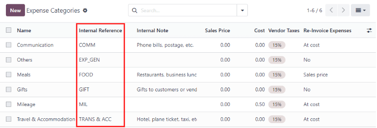
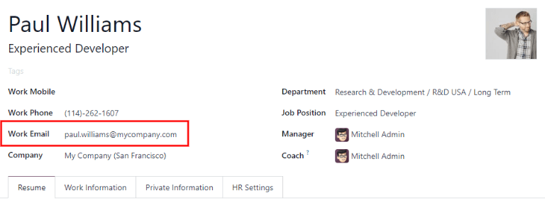

# Log expenses

Before expenses can be reimbursed, each individual expense needs to be logged in the database.
Expense records can be created in three different ways: [manually enter an expense record](#expenses-manual-expense), [upload a receipt](#expenses-upload-receipt), or [email a
receipt](#expenses-email-expense) to a preconfigured email address.

## Nhập chi phí theo cách thủ công

To record a new expense, open the Expenses app, which displays the My
Expenses page, by default.

Then, click New, and then fill out the following fields on the form that appears:

- Description: Enter a short description for the expense. This should be concise and
  informative, such as `lunch with client` or `hotel for conference`.
- Category: Select the expense category from the drop-down menu that most closely
  corresponds to the expense.
- Total: Enter the total amount paid for the expense in one of two ways:
  1. If the expense is for a single item/expense, and the category selected was for a single item,
     enter the cost in the Total field (the Quantity field is hidden).
  2. If the expense is for multiples of the same item/expense with a fixed price, the
     Unit Price is displayed. Enter the quantity in the Quantity field, and
     the total cost is automatically updated with the correct total. The total cost appears below
     the Quantity.
- Included Taxes: If taxes were configured on the expense category, the tax percentage
  and amount appear automatically after entering either the Total or the
  Quantity.

  #### NOTE
  When a tax is configured on an expense category, the Included Taxes value updates
  in real time, as the Total or Quantity is updated.
- Employee: Using the drop-down menu, select the employee this expense is for.
- Paid By: Click the radio button to indicate who paid for the expense, and should be
  reimbursed. Select either Employee (to reimburse) or Company. Depending on
  the expense category selected, this field may not appear.
- Expense Date: Using the calendar popover window that appears when this field is
  clicked, enter the date the expense was incurred.
- Account: Using the drop-down menu, select the expense account the expense should be
  logged in.
- Khách hàng cần xuất lại hóa đơn: Nếu chi phí là khoản mà khách hàng phải trả, hãy chọn  và khách hàng cần được xuất hóa đơn cho khoản chi phí này từ menu thả xuống. Tất cả đơn bán hàng trong menu thả xuống đều liệt kê cả  cũng như công ty tương ứng với đơn bán hàng đó. Sau khi chi phí được lưu, tên khách hàng sẽ biến mất và chỉ có  hiển thị trên chi phí.
- Analytic Distribution: Select the account the expense should be written against from
  the drop-down menu for either Projects, Departments, or both. Multiple
  accounts can be listed for each category, if needed. Adjust the percentage for each analytic
  account by typing in the percentage value next to each account.
- Company: If multiple companies are set up, select the company the expense should be
  filed for from the drop-down menu. The current company automatically populates this field.
- Notes...: If any notes are needed to clarify the expense, enter them in the notes
  field.

### Attach receipts

After the expense record is created, the next step is to attach a receipt. Click the
Attach Receipt button, and a file explorer appears. Navigate to the receipt to be
attached, and click Open.

The new receipt is recorded in the *chatter*, and the number of receipts appears next to the
<i class="fa fa-paperclip"></i> (paperclip) icon. Multiple receipts can be attached to an
individual expense record, as needed.

## Upload expenses

It is possible to have expense records created automatically, by uploading a PDF receipt. This
feature requires the enabling of a setting, and the purchasing of 
credits.

### Digitalization settings

To enable receipt scanning, navigate to Expenses app ‣ Configuration ‣
Settings, and tick the checkbox beside the Expense Digitization (OCR) option. Then,
click Save. When enabled, additional options appear. Click on the corresponding radio
button to select one of the following options:

- Do not digitize: turns off receipt digitization.
- Digitize on demand only: only digitizes receipts when requested. A
  Digitize document button appears on expense records. When clicked, the receipt is
  scanned and the expense record is updated.
- Digitize automatically: automatically digitizes all receipts when they are uploaded.

Beneath these options are two additional links. Click the <i class="fa fa-arrow-right"></i> Buy
credits link to purchase credits for receipt digitization. Click the <i class="fa fa-arrow-right"></i>
View My Services link to view a list of all current services, and their remaining credit
balances.

For more information on document digitization and , refer to the
[In-app purchase (IAP)](../../essentials/in_app_purchase.md) documentation.

#### NOTE
When the Expense Digitization (OCR) option is enabled, a necessary module is
installed, so receipts can be scanned. Disabling this option uninstalls the module.

If, at some point, there is a desire to temporarily stop digitizing receipts, select the
Do not digitize option. The reason this option is available is so the module is not
uninstalled, allowing for digitization to be enabled in the future by selecting one of the other
two options.

### Upload receipts

Open the Expenses app, and from the My Expenses dashboard, click
Upload, and a file explorer appears. Navigate to the desired receipt, select it, then
click Open.

The receipt is scanned, and a new expense record is created. The Expense Date field is
populated with today's date, along with any other fields based on the scanned data, such as the
Total.

Click on the new entry to open the individual expense form, and make any changes, if needed. The
scanned receipt appears in the *chatter*.

## Email expenses

Instead of individually creating each expense in the **Expenses** app, expenses can be automatically
created by sending an email to an email alias.

To do so, an email alias must first be configured. Navigate to Expenses app ‣
Configuration ‣ Settings. Ensure the checkbox beside Incoming Emails is ticked. The
default email alias is *expense@(domain).com*. Change the email alias by entering the desired email
in the field to the right of Alias. Then, click Save.

#### NOTE
If the domain alias needs to be set up, <i class="fa fa-arrow-right"></i> Setup your domain
alias appears beneath the Incoming Emails checkbox, instead of the email address
field.

Refer to the [Tên miền](../../websites/website/configuration/domain_names.md) documentation for
setup instructions and more information.

Once the domain alias is configured, the email address field is visible beneath the
Incoming Emails feature on the Settings page in the **Expenses** app.

Once the email address has been entered, emails can be sent to that alias to create new expenses,
without having to be in the Odoo database.

To submit an expense via email, create a new email, and enter the product's *internal reference*
code (if available) and the amount of the expense as the subject of the email. Next, attach the
receipt to the email. Odoo creates the expense by taking the information in the email subject, and
combining it with the receipt.

To check an expense category's internal reference, go to Expenses app ‣
Configuration ‣ Expense Categories. If an internal reference is listed on the expense category,
it is listed in the Internal Reference column.

To add an internal reference on an expense category, click on the category to open the expense
category form. Enter the Internal Reference in the corresponding field. Beneath the
Internal Reference field, this sentence appears: Use this reference as a
subject prefix when submitting by email.

#### NOTE
For security purposes, only authenticated employee emails are accepted by Odoo when creating an
expense from an email. To confirm an authenticated employee email address, go to the employee
card in the Employees app, and refer to the Work Email field.

