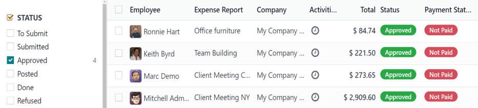
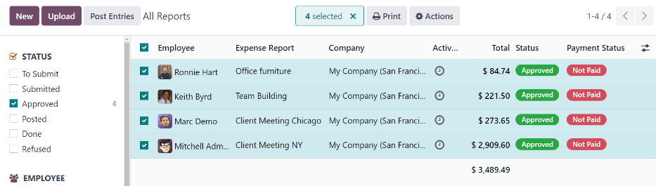

# Ghi sổ chi phí

Once an expense report is [approved](approve_expenses.md), the next step is to post
the expense report to the proper accounting journal.

#### IMPORTANT
To post expense reports to an accounting journal, the user **must** have the following
[access rights](../../general/users/access_rights.md):

- Accounting: *Accountant* or *Adviser*
- Expenses: *Manager*

Only expense reports with an *Approved* status can post the expenses to a journal. To view all
expense reports, navigate to Expenses app ‣ Expense Reports. Next, to view
**only** approved expense reports that need to be posted, adjust the filters on the left side, so
only the Approved checkbox is ticked.

#### NOTE
The default All Reports dashboard displays all expense reports, except reports with a
status of Refused.

Expense reports can be posted to accounting journals in two ways: [individually](#expenses-individual-reports) or [in bulk](#expenses-multiple-reports).

## Post individual reports

To post an individual report, navigate to Expenses app ‣ Expense Reports, and
click on an individual report with a Status of Approved, to view the report
form. In this view, several options are presented: Post Journal Entries,
Report In Next Payslip, Refuse, or Reset to Draft.

Click Post Journal Entries to post the report.

The accounting journal the expenses are posted to is listed in the Journal field of the
expense report.

After posting the expenses to an accounting journal, a Journal Entry smart button
appears at the top of the screen. Click the Journal Entry smart button, and the details
for the journal entry appear, with a status of Posted.

## Post multiple reports

To post multiple expense reports at once, navigate to Expenses app ‣ Expense
Reports to view a list of expense reports. Next, select the reports to approve by ticking the
checkbox next to each report being approved.

#### NOTE
Only expense reports with a status of Approved are able to post the expenses to an
accounting journal. If an expense report is selected that **cannot** be posted, such as an
unapproved report, or the report has already been posted to a journal, the Post
Entries button is **not** visible.

Next, click the Post Entries button.

