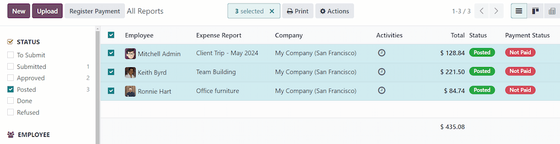
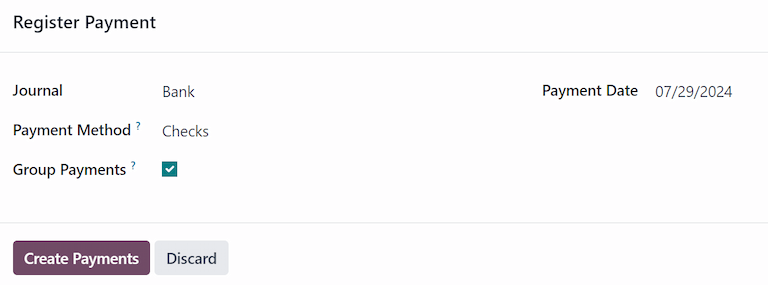
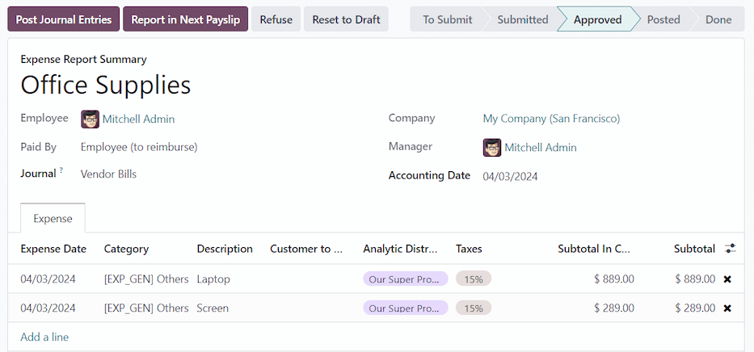

# Reimburse employees

After an expense report is [posted to an accounting journal](post_expenses.md), the
next step is to reimburse the employee. Just like approving and posting expenses, employees can be
reimbursed in two ways: with cash, check, or direct deposit ([individually](#expenses-reimburse-single) or [in bulk](#expenses-reimburse-bulk)), or [reimbursed in a
payslip](#expenses-reimburse-payslip).

## Cài đặt

Reimbursements can be paid via paycheck, check, cash, or bank transfer. To set up payment options,
first configure the various settings by navigating to Expenses app ‣
Configuration ‣ Settings.

To reimburse employees for expenses [in their paychecks](#expenses-reimburse-payslip), tick the
checkbox beside the Reimburse in Payslip option in the Expenses section.

Next, set how payments are made in the Accounting section. Click the drop-down menu
under Payment Methods, and select the desired payment option. Default options include
paying by Manual (Cash), Checks (Bank), NACHA (Bank), and
others. Leaving this field blank allows for **all** available payment options to be used.

When all desired configurations are complete, click Save to activate the settings.

## Reimburse individually

To reimburse an individual expense report, first navigate to Expenses app ‣
Expense Reports. All expense reports are presented in a default list view. Click on the expense
report being reimbursed to view the report details.

#### IMPORTANT
**Only** expense reports with a status of Posted can be reimbursed.

Click the Register Payment button in the top-left corner of the expense report, and a
Register Payment pop-up window appears. Enter the following information in the pop-up
window:

- Journal: Select the accounting journal to post the payment to using the drop-down
  menu. The default options are Bank or Cash.
- Payment Method: Select how the payment is made using the drop-down menu. If
  Cash is selected for the Journal, the only option available is
  Manual. If Bank is selected for the Journal, the default
  options are Manual or Checks.
- Recipient Bank Account: Select the employee's bank account the payment is being sent
  to. If the employee has a bank account on file in the [Private Information tab](../../hr/employees/new_employee.md#employees-private-info) of their employee form in the **Employees** app, that bank account
  populates this field, by default.
- Amount: The total amount being reimbursed populates this field, by default. The
  currency, located to the right of the field, can be modified using the drop-down menu.
- Payment Date: Enter the date the payments are issued in this field. The current date
  populates this field, by default.
- Memo: The text entered in the [Expense Report Summary](expense_reports.md) field of the expense report populates this field, by default.

When the fields of the pop-up window are completed, click the Create Payment button to
register the payment, and reimburse the employee.

## Reimburse in bulk

To reimburse multiple expense reports at once, navigate to Expenses app ‣ Expense
Reports to view all expense reports in a list view. Next, adjust the STATUS filters on
the left side to only present expense reports with a status of Posted.

Tick the checkbox next to the Employee column title to select all the reports in the
list. Once ticked, the number of selected expense reports appears at the top of the page
((#) Selected). Additionally, a Register Payment button also appears in the
upper-left corner.

Click the Register Payment button, and a Register Payment pop-up window
appears. Enter the following information in the pop-up window:

- Journal: Select the accounting journal the payment should be posted to, using the
  drop-down menu. The default options are Bank or Cash.
- Payment Method: Select how the payment is made using the drop-down menu. If
  Cash is selected for the Journal, the only option available is
  Manual. If Bank is selected for the Journal, the default
  options are Manual or Checks.
- Group Payments: When multiple expense reports are selected for the same employee, this
  option appears. Tick the checkbox to have only one payment made, rather than issuing multiple
  payments to the same employee.
- Payment Date: Enter the date the payments are issued. The current date populates this
  field, by default.

When the fields on the pop-up window are completed, click the Create Payments button to
register the payments, and reimburse the employees.

## Report in next payslip

If the  *Reimburse in Payslip* option is activated on the *Settings* page, payments can be added to
their next payslip, instead of issued manually.

#### IMPORTANT
Reimbursing expenses on payslips can **only** be done individually, on an expense report with a
status of *Approved*. Once an expense report has a status of *Posted*, the option to reimburse in
the following payslip does **not** appear.

Đi đến Ứng dụng Chi phí ‣ Báo cáo chi phí, và nhấp vào báo cáo chi phí cụ thể sẽ được hoàn trả trong kỳ lương tiếp theo. Nhấp vào nút thông minh Báo cáo trong phiếu lương tiếp theo, và các khoản chi phí sẽ được thêm vào phiếu lương kế tiếp xuất cho nhân viên đó. Ngoài ra, một tin nhắn sẽ được ghi lại trong phần cửa sổ trò chuyện cho biết chi phí đã được thêm vào phiếu lương tiếp theo.

The status for the expense report remains Approved. The status only changes to
Posted (and then Done), when the paycheck is processed.

#### SEE ALSO
Refer to the [Payslips](../../hr/payroll/payslips.md) documentation for more information about
processing paychecks.
