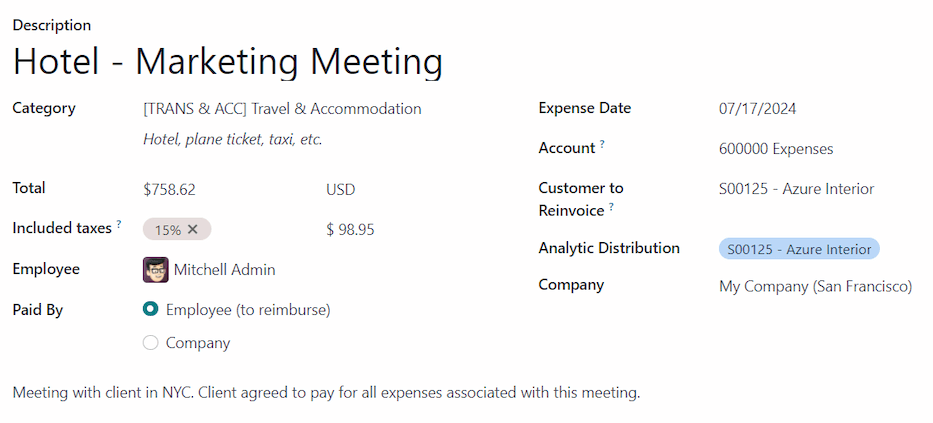
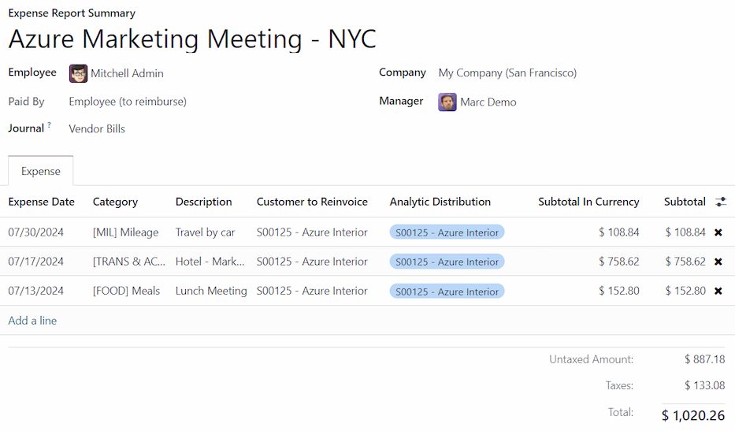
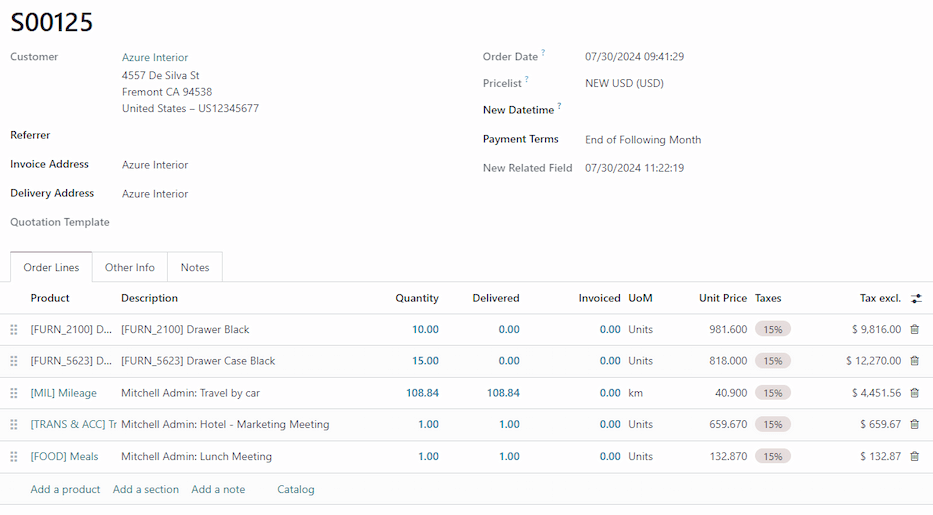

# Re-invoice expenses

If expenses are tracked on customer projects, they can be automatically charged back to the
customer. This is done by [creating an expense](#expenses-reinvoice-create), referencing the
sales order the expense is added to, and then [creating an expense report](#expenses-reinvoice-report).

Next, managers [approve the expense report](#expenses-reinvoice-approve), before the accounting
department [posts the journal entries](#expenses-reinvoice-approve).

Finally, once the expense report is posted to a journal, the expenses appears on the specified
. The  is then [invoiced](#expenses-reinvoice),
thus charging the customer for the expenses.

#### IMPORTANT
Approving expenses, posting expenses to accounting, and reinvoicing expenses on  is **only** possible for users with the appropriate [access rights](applications/general/users/access_rights.md).

#### SEE ALSO
This document provides lower-level instructions for the creation, submission, approval, and
posting of expenses. For fully-detailed instructions for any of these steps, refer to the
following documentation:

- [Ghi nhận chi phí](applications/finance/expenses/log_expenses.md)
- [Báo cáo chi phí](applications/finance/expenses/expense_reports.md)
- [Approving expenses](applications/finance/expenses/approve_expenses.md)
- [Posting expenses in accounting](applications/finance/expenses/post_expenses.md)

## Thiết lập

First, specify the invoicing policy for each expense category. Navigate to Expenses
app ‣ Configuration ‣ Expense Categories. Click on an expense category to view the expense
category form. Under the INVOICING section, click the radio button next to the desired
selection for Re-Invoice Expenses:

- No: The expense category cannot be re-invoiced.
- At cost: The expense category invoices expenses at the cost set on the expense
  category form.
- Sales price: The expense category invoices at the sales price set on the expense form.

## Tạo một chi phí

First, when [creating a new expense](applications/finance/expenses/log_expenses.md), the correct information needs
to be entered to re-invoice the expense to a customer. Using the drop-down menu, select the
 to add the expense to in the Customer to Reinvoice field.

Next, select the Analytic Distribution the expense is posted to. Multiple accounts can
be selected, if desired.

Để thêm một Phân bổ phân tích khác, nhấp vào dòng để hiển thị cửa sổ bật lên Phân tích. Nhấp vào Thêm một dòng, sau đó chọn Phân bổ phân tích mong muốn từ trường thả xuống. Nếu chọn nhiều hơn một Phân bổ phân tích, các trường Phần trăm **phải** được chỉnh sửa. Theo mặc định, cả hai trường đều được điền sẵn với `100%`. Điều chỉnh phần trăm cho tất cả các trường, sao cho tổng của tất cả tài khoản được chọn bằng `100%`.

## Create an expense report

After the expenses are created, the expense report must be [created](applications/finance/expenses/expense_reports.md#expenses-create-report)
and [submitted](applications/finance/expenses/expense_reports.md#expenses-submit), in the same manner as all other expenses.

Once the expense report is submitted, a <i class="fa fa-money"></i> Sales Orders smart button
appears at the top-center of both the expense report, and each individual expense record being
reinvoiced.

#### IMPORTANT
Selecting the proper  in the Customer to Reinvoice field is
**critical**, since this is how expenses are automatically invoiced after an expense report is
approved.

The Customer to Reinvoice field can be modified *only* until an expense report is
**approved**. After an expense report is approved, the Customer to Reinvoice field is
no longer able to be modified.

## Approve and post expenses

Before [approving an expense report](applications/finance/expenses/approve_expenses.md), ensure the
Analytic Distribution section is populated for every expense line.

If an Analytic Distribution entry is missing, assign the correct accounts from the
drop-down menu, then click Approve.

#### NOTE
The Approve button **only** appears after an expense report has been [submitted](applications/finance/expenses/expense_reports.md#expenses-submit).

The accounting department is typically responsible for [posting journal entries](applications/finance/expenses/post_expenses.md). To post expenses to an accounting journal, click Post
Journal Entries. Once an expense report is approved, it can then be posted.

The  is **only** updated *after* the journal entries are posted. Once the
journal entries are posted, the expenses now appear on the referenced .

## Invoice expenses

After the expense report has been approved, and the journal entries have been posted, the  is updated, and the customer can be invoiced.

Select the expense report, and click the <i class="fa fa-money"></i> Sales Orders smart button to
open the . The expenses to be re-invoiced now appear on the .

#### NOTE
More than one  can be referenced on an expense report. If more than one
 is referenced, clicking the Sales Orders smart button opens
a list displaying all the  associated with that expense report. Click on
a  to open the individual  details.

The expenses are listed in the  Order Lines tab.

Tiếp theo, nhấp Tạo hóa đơn, một cửa sổ bật lên Tạo hóa đơn sẽ xuất hiện. Chọn loại hóa đơn là Hóa đơn thường xuyên, Khoản trả trước (theo phần trăm) hoặc Khoản trả trước (số tiền cố định). Sau đó, nhấp Tạo hóa đơn nháp. Thao tác này tạo hóa đơn nháp cho khách hàng. Nhấp Xác nhận để xác nhận hóa đơn, và khách hàng sẽ được tính phí cho các khoản chi phí.
