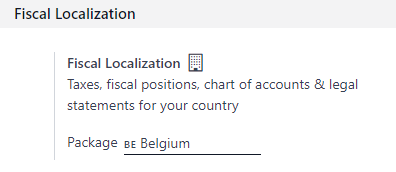

# Fiscal localizations

## Fiscal localization packages

**Fiscal Localization Packages** are country-specific modules that install pre-configured taxes,
fiscal positions, chart of accounts, and legal statements on your database. Some additional
features, such as the configuration of specific certificates, are also added to your Accounting app,
following your fiscal administration requirements.

#### NOTE
Odoo continuously adds new localizations and improves the existing packages.

### Cấu hình

Odoo automatically installs the appropriate package for your company, according to the country
selected at the creation of the database.

#### IMPORTANT
As long as you haven't posted any entry, you can still select another package.

To select a fiscal localization package for your company, go to Accounting ‣
Configuration ‣ Settings ‣ Fiscal Localization, select the appropriate package from the list
and save.

### Sử dụng

These packages require you to fine-tune your chart of accounts according to your needs, activate the
taxes you use, and configure your country-specific statements and certifications.

#### SEE ALSO
- [Hệ thống tài khoản](applications/finance/accounting/get_started/chart_of_accounts.md)
- [Thuế](applications/finance/accounting/taxes.md)

## List of supported countries

Odoo Accounting can be used in many countries out of the box by installing the appropriate module.
Here is a list of all [fiscal localization package](#fiscal-localizations-packages) that are
available on Odoo.

- Algeria - Kế toán
- [Argentina - Accounting](applications/finance/fiscal_localizations/argentina.md)
- [Australian - Accounting](applications/finance/fiscal_localizations/australia.md)
- [Austria - Accounting](applications/finance/fiscal_localizations/austria.md)
- [Belgium - Accounting](applications/finance/fiscal_localizations/belgium.md)
- Bolivia - Kế toán
- [Brazilian - Accounting](applications/finance/fiscal_localizations/brazil.md)
- [Canada - Accounting](applications/finance/fiscal_localizations/canada.md)
- [Chile - Accounting](applications/finance/fiscal_localizations/chile.md)
- Trung Quốc - Kế toán
- [Colombia - Accounting](applications/finance/fiscal_localizations/colombia.md)
- Costa Rica - Kế toán
- Croatia - Kế toán (RRIF 2012)
- Cộng hoà Séc - Kế toán
- [Denmark - Accounting](applications/finance/fiscal_localizations/denmark.md)
- Cộng hòa Dominica - Kế toán
- [Ecuadorian - Accounting](applications/finance/fiscal_localizations/ecuador.md)
- [Egypt - Accounting](applications/finance/fiscal_localizations/egypt.md)
- Ethiopia - Kế toán
- Bản địa hóa dành cho Phần Lan
- [France - Accounting](applications/finance/fiscal_localizations/france.md)
- Chung - Kế toán
- [Đức](applications/finance/fiscal_localizations/germany.md)
  - Đức SKR03 - Kế toán
  - Đức SKR04 - Kế toán
- Hy Lạp - Kế toán
- Guatemala - Kế toán
- Honduras - Kế toán
- [Hong Kong - Accounting](applications/finance/fiscal_localizations/hong_kong.md)
- Kế toán - Hungarian
- [Indian - Accounting](applications/finance/fiscal_localizations/india.md)
- [Indonesian - Accounting](applications/finance/fiscal_localizations/indonesia.md)
- Kế toán - Ireland
- Israel - Kế toán
- [Italy - Accounting](applications/finance/fiscal_localizations/italy.md)
- Nhật bản - Kế toán
- [Jordan - Accounting](applications/finance/fiscal_localizations/jordan.md)
- [Kenya - Accounting](applications/finance/fiscal_localizations/kenya.md)
- Lithuania - Kế toán
- [Luxembourg - Accounting](applications/finance/fiscal_localizations/luxembourg.md)
- [Malaysia - Accounting](applications/finance/fiscal_localizations/malaysia.md)
- Maroc - Accounting
- [Mexico - Accounting](applications/finance/fiscal_localizations/mexico.md)
- Kế toán - Mongolia
- [Netherlands - Accounting](applications/finance/fiscal_localizations/netherlands.md)
- New Zealand - Kế toán
- Na Uy - Kế toán
- OHADA - Kế toán
- Pakistan - Kế toán
- Panama - Kế toán
- [Peru - Accounting](applications/finance/fiscal_localizations/peru.md)
- [Philippines - Accounting](applications/finance/fiscal_localizations/philippines.md)
- Ba Lan - Kế toán
- Bồ Đào Nha - Kế toán
- [Romania - Accounting](applications/finance/fiscal_localizations/romania.md)
- [Saudi Arabia - Accounting](applications/finance/fiscal_localizations/saudi_arabia.md)
- [Singapore - Accounting](applications/finance/fiscal_localizations/singapore.md)
- Slovak - Kế toán
- Slovenia - Kế toán
- Kế toán - Nam Phi
- [Spain - Accounting (PGCE 2008)](applications/finance/fiscal_localizations/spain.md)
- Thụy Điển - Kế toán
- [Switzerland - Accounting](applications/finance/fiscal_localizations/switzerland.md)
- Đài Loan - Kế toán
- [Thailand - Accounting](applications/finance/fiscal_localizations/thailand.md)
- Thổ Nhĩ Kỳ - Kế toán
- [United Arab Emirates - Accounting](applications/finance/fiscal_localizations/united_arab_emirates.md)
- [UK - Accounting](applications/finance/fiscal_localizations/united_kingdom.md)
- Kế toán - Ukraine
- [United States - Accounting](applications/finance/fiscal_localizations/united_states.md)
- [Uruguay - Accounting](applications/finance/fiscal_localizations/uruguay.md)
- Venezuela - Kế toán
- [Vietnam - Accounting](applications/finance/fiscal_localizations/vietnam.md)

* [Argentina](applications/finance/fiscal_localizations/argentina.md)
* [Úc](applications/finance/fiscal_localizations/australia.md)
* [Áo](applications/finance/fiscal_localizations/austria.md)
* [Bỉ](applications/finance/fiscal_localizations/belgium.md)
* [Brazil](applications/finance/fiscal_localizations/brazil.md)
* [Canada](applications/finance/fiscal_localizations/canada.md)
* [Chile](applications/finance/fiscal_localizations/chile.md)
* [Colombia](applications/finance/fiscal_localizations/colombia.md)
* [Đan Mạch](applications/finance/fiscal_localizations/denmark.md)
* [Ecuador](applications/finance/fiscal_localizations/ecuador.md)
* [Ai Cập](applications/finance/fiscal_localizations/egypt.md)
* [Pháp](applications/finance/fiscal_localizations/france.md)
* [Đức](applications/finance/fiscal_localizations/germany.md)
* [Hồng Kông](applications/finance/fiscal_localizations/hong_kong.md)
* [Ấn Độ](applications/finance/fiscal_localizations/india.md)
* [Indonesia](applications/finance/fiscal_localizations/indonesia.md)
* [Ý](applications/finance/fiscal_localizations/italy.md)
* [Jordan](applications/finance/fiscal_localizations/jordan.md)
* [Kenya](applications/finance/fiscal_localizations/kenya.md)
* [Luxembourg](applications/finance/fiscal_localizations/luxembourg.md)
* [Malaysia](applications/finance/fiscal_localizations/malaysia.md)
* [Mexico](applications/finance/fiscal_localizations/mexico.md)
* [Hà Lan](applications/finance/fiscal_localizations/netherlands.md)
* [Romania](applications/finance/fiscal_localizations/romania.md)
* [Pê-ru](applications/finance/fiscal_localizations/peru.md)
* [Philippines](applications/finance/fiscal_localizations/philippines.md)
* [Ả Rập Xê Út](applications/finance/fiscal_localizations/saudi_arabia.md)
* [Singapore](applications/finance/fiscal_localizations/singapore.md)
* [Tây Ban Nha](applications/finance/fiscal_localizations/spain.md)
* [Thụy Sĩ](applications/finance/fiscal_localizations/switzerland.md)
* [Thái Lan](applications/finance/fiscal_localizations/thailand.md)
* [Việt Nam](applications/finance/fiscal_localizations/vietnam.md)
* [Các Tiểu Vương Quốc A-rập Thống Nhất](applications/finance/fiscal_localizations/united_arab_emirates.md)
* [Vương Quốc Anh](applications/finance/fiscal_localizations/united_kingdom.md)
* [Hợp chủng quốc Hoa Kỳ](applications/finance/fiscal_localizations/united_states.md)
* [Uruguay](applications/finance/fiscal_localizations/uruguay.md)
