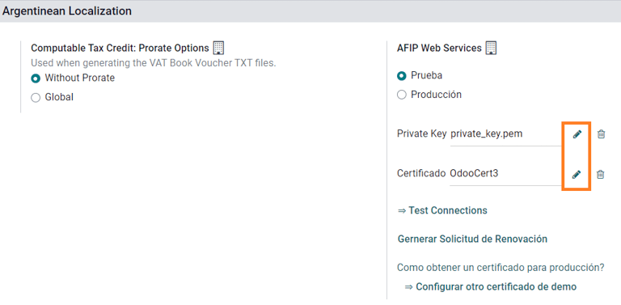
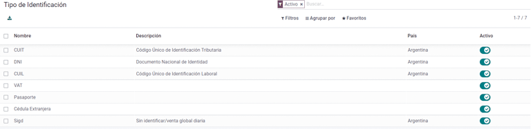
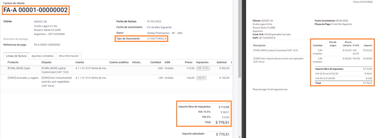
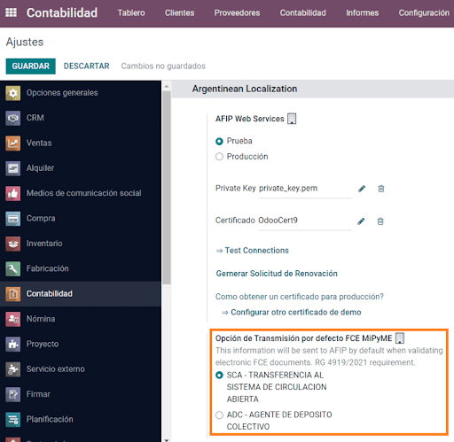
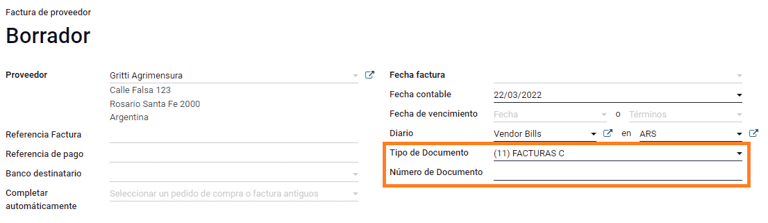
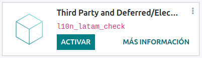

# Argentina

## Webinar

Below you can find videos with a general description of the localization, and how to configure it.

* [Webinar - Localización de Argentina](https://www.youtube.com/watch?v=_H1HbU-wKVg).
* [eCommerce - Localización de Argentina](https://www.youtube.com/watch?v=5gUi2WWfRuI).

#### SEE ALSO

[Smart Tutorial - Localización de Argentina](https://www.odoo.com/slides/smart-tutorial-localizacion-de-argentina-130)

## Cấu hình

### Modules installation

[Install](../../general/apps_modules.md#general-install) the following modules to get all the features of the Argentinean\
localization:

| Tên                                                                                       | Tên kỹ thuật           | Mô tả                                                                                                                                                                                                                          |
| ----------------------------------------------------------------------------------------- | ---------------------- | ------------------------------------------------------------------------------------------------------------------------------------------------------------------------------------------------------------------------------ |
| Argentina - Kế toán                                                                       | `l10n_ar`              | 
Default <a href="../fiscal_localizations.md#fiscal-localizations-packages">fiscal localization package</a>, which represents the minimal configuration to operate in Argentina under the regulations and guidelines.
 |
| Báo cáo kế toán của Argentina                                                             | `l10n_ar_reports`      | VAT Book report and VAT summary report.                                                                                                                                                                                        |
| Hóa đơn điện tử của Argentina                                                             | `l10n_ar_edi`          | 
Includes all technical and functional requirements to generate electronic invoices via web service, based on the AFIP regulations.
                                                                                   |
| [Thương mại điện tử của Argentina](argentina.md#argentina-ecommerce-electronic-invoicing) | `l10n_ar_website_sale` | 
(optional) Allows the user to see Identification Type and AFIP Responsibility in the eCommerce checkout form in order to create electronic invoices.
                                                                 |

### Cấu hình công ty của bạn

Once the localization modules are installed, the first step is to set up the company's data. In\
addition to the basic information, a key field to fill in is the AFIP Responsibility\
Type, which represents the fiscal obligation and structure of the company.

### Hệ thống tài khoản

In Accounting, there are three different Chart of Accounts packages to choose from.\
They are based on a company's AFIP responsibility type, and consider the difference between\
companies that do not require as many accounts as the companies that have more complex fiscal\
requirements:

* Monotributista (227 tài khoản);
* IVA Exento (290 accounts);
* Responsable Inscripto (298 Accounts).

### Configure master data

#### Electronic Invoice Credentials

**Môi trường**

The AFIP infrastructure is replicated in two separate environments, **testing** and **production**.

Testing is provided so that the companies can test their databases until they are ready to move\
into the **Production** environment. As these two environments are completely isolated from each\
other, the digital certificates of one instance are not valid in the other one.

To select a database environment, go to Accounting ‣ Settings ‣ Argentinean\
Localization and choose either Prueba (Testing) or Produccion (Production).

**AFIP certificates**

The electronic invoice and other AFIP services work with Web Services (WS) provided by\
the AFIP.

In order to enable communication with the AFIP, the first step is to request a Digital\
Certificate if you do not have one already.

1. Generate Certificate Sign Request (Odoo). When this option is selected, a file with\
   extension `.csr` (certificate signing request) is generated to be used in the AFIP portal to\
   request the certificate.
2. Generate Certificate (AFIP). Access the AFIP portal and follow the instructions\
   described in [this document](https://drive.google.com/file/d/17OKX2lNWd1bjUt3NxfqcCKBkBh-Xlpo-/view) to get a certificate.
3. Upload Certificate and Private Key (Odoo). Once the certificate is generated, upload\
   it to Odoo using the Pencil icon next to the field Certificado and select\
   the corresponding file.

#### Đối tác

**Identification type and VAT**

As part of the Argentinean localization, document types defined by the AFIP are now available in the**Partner form**. Information is essential for most transactions. There are six\
Identification Types available by default, as well as 32 inactive types.

#### NOTE

The complete list of Identification Types defined by the AFIP is included in Odoo,\
but only the common ones are active.

**AFIP responsibility type**

In Argentina, the document type and corresponding transactions associated with customers and\
vendors is defined by the AFIP Responsibility type. This field should be defined in the **Partner**\
**form**.

#### Thuế

As part of the localization module, the taxes are created automatically with their related\
financial account and configuration, e.g., 73 taxes for Responsable Inscripto.

**Taxes types**

Argentina has several tax types, the most common ones are:

* VAT: this is the regular VAT and can have various percentages;
* Perception: advance payment of a tax that is applied on invoices;
* Retention: advance payment of a tax that is applied on payments.

**Special taxes**

Some Argentinean taxes are not commonly used for all companies, and those less common options are\
labeled as inactive in Odoo by default. Before creating a new tax, be sure to check if that tax is\
not already included as inactive.

#### Document types

In some Latin American countries, like Argentina, some accounting transactions such as invoices and\
vendor bills are classified by document types defined by the governmental fiscal authorities. In\
Argentina, the [AFIP](https://www.afip.gob.ar/) is the governmental fiscal authority that\
defines such transactions.

The document type is an essential piece of information that needs to be clearly displayed in\
printed reports, invoices, and journal entries that list account moves.

Each document type can have a unique sequence per journal where it is assigned. As part of the\
localization, the document type includes the country in which the document is applicable (this data\
is created automatically when the localization module is installed).

The information required for the Document Types is included by default so the user does\
not need to fill anything on this view:

#### NOTE

There are several Document Types types that are inactive by default, but can be\
activated as needed.

**Letters**

For Argentina, the Document Types include a letter that helps indicate the type of\
transaction or operation. For example, when an invoice is related to a(n):

* B2B transaction, a document type A must be used;
* B2C transaction, a document type B must be used;
* Exportation Transaction, a document type E must be used.

The documents included in the localization already have the proper letter associated with each\
Document Type, so there is no further configuration necessary.

**Sử dụng trên hoá đơn**

The Document Type on each transaction will be determined by:

* The journal entry related to the invoice (if the journal uses documents);
* The onditions applied based on the type of issuer and receiver (e.g., the type of fiscal regime of\
  the buyer and the type of fiscal regime of the vendor).

### Sổ nhật ký

In the Argentinean localization, the journal can have a different approach depending on its usage\
and internal type. To configure journals, go to Accounting ‣ Configuration ‣\
Journals.

For sales and purchase journals, it's possible to activate the option Use Documents,\
which enables a list of Document Types that can be related to the invoices and vendor\
bills. For more detail on invoices, please refer to the section [2.3 document types](argentina.md#document-types).

If the sales or purchase journals do not have the Use Documents option activated, they\
will not be able to generate fiscal invoices, meaning, their use case will be mostly limited to\
monitoring account moves related to internal control processes.

#### AFIP information (also known as AFIP Point of Sale)

The AFIP POS System is a field only visible for the **Sales** journals and defines the\
type of AFIP POS that will be used to manage the transactions for which the journal is created.

The AFIP POS defines the following:

1. the sequences of document types related to the web service;
2. the structure and data of the electronic invoice file.

**Web services**

**Web services** help generate invoices for different purposes. Below are a few options to choose\
from:

* wsfev1: Electronic Invoice: is the most common service, which is used to generate\
  invoices for document types A, B, C, M with no detail per item;
* wsbfev1: Electronic Fiscal Bond: is for those who invoice capital goods and wish to\
  access the benefit of the Electronic Tax Bonds granted by the Ministry of Economy. For more\
  details go to: [Fiscal Bond](https://www.argentina.gob.ar/acceder-un-bono-por-fabricar-bienes-de-capital);
* wsfexv1: Electronic Exportation Invoice: is used to generate invoices for\
  international customers and transactions that involve exportation processes, the document type\
  related is type "E".

Here are some useful fields to know when working with web services:

* AFIP POS Number: is the number configured in the AFIP to identify the operations\
  related to this AFIP POS;
* Địa chỉ POS AFIP: là trường liên quan đến địa chỉ thương mại đã đăng ký cho POS, thường là địa chỉ giống với công ty. Ví dụ, nếu một công ty có nhiều cửa hàng (vị trí thuế) thì AFIP yêu cầu công ty có một POS AFIP cho mỗi vị trí. Địa chỉ này sẽ được in trong báo cáo hóa đơn.
* Unified Book: when the AFIP POS System is Preimpresa, then the document types\
  (applicable to the journal) with the same letter will share the same sequence. For example:
  * Hoá đơn: FA-A 0001-00000002;
  * Credit Note: NC-A 0001-00000003;
  * Debit Note: ND-A 0001-00000004.

#### Trình tự

For the first invoice, Odoo synchronizes with the AFIP automatically and displays the last sequence\
used.

#### NOTE

When creating Purchase Journals, it's possible to define whether they are related to\
document types or not. In the case where the option to use documents is selected, there would be\
no need to manually associate the document type sequences, since the document number is provided\
by the vendor.

## Usage and testing

### Hóa đơn

The information below applies to invoice creation once the partners and journals are created and\
properly configured.

#### Document type assignation

When the partner is selected, the Document Type field will be filled in automatically\
based on the AFIP document type:

* **Invoice for a customer IVA Responsable Inscripto, prefix A** is the type of document that shows\
  all the taxes in detail along with the customer's information.
* **Invoice for an end customer, prefix B** is the type of document that does not detail the taxes,\
  since the taxes are included in the total amount.
* **Exportation Invoice, prefix E** is the type of document used when exporting goods that shows\
  the incoterm.

Even though some invoices use the same journal, the prefix and sequence are given by the\
Document Type field.

The most common Document Type will be defined automatically for the different\
combinations of AFIP responsibility type but it can be updated manually by the user before\
confirming the invoice.

#### Electronic invoice elements

Khi sử dụng hóa đơn điện tử, nếu tất cả thông tin đều chính xác thì hóa đơn sẽ được ghi sổ theo cách thông thường, trừ khi có lỗi cần được xử lý. Khi có thông báo lỗi xuất hiện, chúng sẽ chỉ rõ vấn đề cần quan tâm cùng với giải pháp được đề xuất. Nếu lỗi vẫn chưa được khắc phục, hóa đơn sẽ giữ nguyên trạng thái nháp cho đến khi sự cố được giải quyết.

Once the invoice is posted, the information related to the AFIP validation and status is displayed\
in the AFIP tab, including:

* AFIP Autorisation: CAE number;
* Expiration Date: deadline to deliver the invoice to the customers (normally 10 days\
  after the CAE is generated);
* Result: indicates if the invoice has been Aceptado en AFIP and/or\
  Aceptado con Observaciones.

#### Invoice taxes

Based on the AFIP Responsibility type, the VAT tax can apply differently on the PDF\
report:

* A. Tax excluded: in this case the taxed amount needs to be clearly identified in the\
  report. This condition applies when the customer has the following AFIP Responsibility type of**Responsable Inscripto**;
*   B. Tax amount included: this means that the taxed amount is included as part of the\
    product price, subtotal, and totals. This condition applies when the customer has the following\
    AFIP Responsibility types:

    * IVA Sujeto Exento;
    * Consumidor Final;
    * Responsable Monotributo;
    * IVA liberado.

    

#### Trường hợp vận dụng đặc biệt

**Hoá đơn cho dịch vụ**

For electronic invoices that include Services, the AFIP requires to report the service\
starting and ending date, this information can be filled in the tab Other Info.

If the dates are not selected manually before the invoice is validated, the values will be filled\
automatically with the first and last day of the invoice's month.

**Exportation invoices**

Invoices related to Exportation Transactions require that a journal uses the AFIP POS\
System **Expo Voucher - Web Service** so that the proper document type(s) can be associated.

When the customer selected in the invoice is configured with an AFIP responsibility type\
Cliente / Proveedor del Exterior - Ley N° 19.640, Odoo automatically\
assigns the:

* Journal related to the exportation Web Service;
* Exportation document type;
* Fiscal position: Compras/Ventas al exterior;
* Concepto AFIP: Products / Definitive export of goods;
* Exempt Taxes.

#### NOTE

The Exportation Documents require Incoterms to be enabled and configured, which can be found in\
Other Info ‣ Accounting.

**Fiscal bond**

The Electronic Fiscal Bond is used for those who invoice capital goods and wish to\
access the benefit of the Electronic Tax Bonds granted by the Ministry of Economy.

For these transactions, it is important to consider the following requirements:

* Currency (according to the parameter table) and invoice quotation;
* Thuế;
* Khu vực;
* Detail each item;
  * Code according to the Common Nomenclator of Mercosur (NCM);
  * Complete description;
  * Unit Net Price;
  * Số lượng;
  * Đơn vị tính;
  * Thêm;
  * VAT rate.

**Electronic credit invoice MiPyme (FCE)**

Đối với các hóa đơn của SME, có một số loại tài liệu được phân loại là **MiPyME**, còn được gọi là **Hóa đơn tín dụng điện tử** (hay **FCE** trong tiếng Tây Ban Nha). Phân loại này nhằm phát triển một cơ chế giúp cải thiện điều kiện tài chính cho các doanh nghiệp vừa và nhỏ, cho phép họ nâng cao năng suất thông qua việc thu hồi sớm các khoản tín dụng và phải thu đã phát hành cho khách hàng và/hoặc nhà cung cấp của mình.

For these transactions it's important to consider the following requirements:

* specific document types (201, 202, 206, etc);
* the emitter should be eligible by the AFIP to MiPyME transactions;
* the amount should be bigger than 100,000 ARS;
* A bank account type CBU must be related to the emisor, otherwise the invoice cannot be validated,\
  having an error message such as the following.

To set up the Transmission Mode, go to settings and select either SDC or\
ADC.

To change the Transmission Mode for a specific invoice, go to the Other Info\
tab and change it before confirming.

#### NOTE

Changing the Transmission Mode will not change the mode selected in\
Settings.

When creating a Credit/Debit note related to a FCE document:

* use the Credit and Debit Note buttons, so all the information from the invoice is\
  transferred to the new Credit and Debit Note;
* the document letter should be the same as than the originator document (either A or B);
* the same currency as the source document must be used. When using a secondary currency there is\
  an exchange difference if the currency rate is different between the emission day and the payment\
  date. It is possible to create a credit/debit note to decrease/increase the amount to pay in ARS.

When creating a Credit Note we can have two scenarios:

1. the FCE is rejected so the Credit Note should have the field FCE, is\
   Cancellation? as _True_; or;
2. the Credit Note, is created to annulate the FCE document, in this case the field\
   FCE, is Cancellation? must be _empty_ (false).

#### Invoice printed report

The PDF Report related to electronic invoices that have been validated by the AFIP\
includes a barcode at the bottom of the format which represents the CAE number. The expiration date\
is also displayed as it is a legal requirement.

#### Troubleshooting and auditing

For auditing and troubleshooting purposes, it is possible to obtain detailed information of an\
invoice number that has been previously sent to the AFIP. To retrieve this information, activate the[developer mode](../../general/developer_mode.md#developer-mode), then go to the Accounting menu and click on\
the button Consult Invoice button in AFIP.

 

It is also possible to retrieve the last number used in AFIP for a specific document type and POS\
Number as a reference for any possible issues on the sequence synchronization between Odoo and\
AFIP.

### Vendor bills

Based on the purchase journal selected for the vendor bill, the Document Type is now a\
required field. This value is auto-populated based on the AFIP Responsibility type of Issuer and\
Customer, but the value can be changed if necessary.

The Document Number field needs to be registered manually and the format will be\
validated automatically. However, in case the format is invalid, a user error will be displayed\
indicating the correct format that is expected.

The vendor bill number is structured in the same way as the customer invoices, excepted that the\
document sequence is entered by the user using the following format: _Document Prefix - Letter -_\
_Document Number_.

#### Validate vendor bill number in AFIP

As most companies have internal controls to verify that the vendor bill is related to an AFIP valid\
document, an automatic validation can be set in Accounting ‣ Settings ‣\
Argentinean Localization ‣ Validate document in the AFIP, considering the following levels:

* Not available: the verification is not done (this is the default value);
* Available: the verification is done. In case the number is not valid, it only displays\
  a warning but still allows the vendor bill to be posted;
* Required: the verification is done, and it does not allow the user to post the vendor\
  bill if the document number is not valid.

**Validate vendor bills in Odoo**

With the vendor validation settings enabled, a new button shows up on the vendor bills inside of\
Odoo, labeled Verify on AFIP, which is located next to the AFIP\
Authorization code field.

In case the vendor bill cannot be validated in AFIP, a value of Rejected will be\
displayed on the dashboard and the details of the invalidation will be added to the chatter.

#### Trường hợp vận dụng đặc biệt

**Untaxed concepts**

There are some transactions that include items that are not a part of the VAT base amount, such as\
fuel and gasoline invoices.

The vendor bill will be registered using one item for each product that is part of the VAT base\
amount, and an additional item to register the amount of the exempt concept.

**Perception taxes**

Hóa đơn mua hàng sẽ được ghi nhận bằng cách sử dụng một dòng cho mỗi sản phẩm thuộc phần cơ sở tính thuế VAT, và thuế tạm thu có thể được thêm vào bất kỳ dòng sản phẩm nào. Do đó, sẽ có một nhóm thuế dành cho thuế GTGT và một nhóm khác dành cho thuế tạm thu. Giá trị mặc định của thuế tạm thu luôn là 0,10.

To edit the VAT perception and set the correct amount, you should use the Pencil icon\
that is the next to the Perception amount. After the VAT perception amount has been set,\
the invoice can then be validated.

### Check management

To install the _Third Party and Deferred/Electronic Checks Management_ module, go to\
Apps and search for the module by its technical name `l10n_latam_check` and click\
the Activate button.

This module enables the required configuration for journals and payments to:

* Create, manage, and control your different types of checks
* Optimize the management of _own checks_ and _third party checks_
* Have an easy and effective way to manage expiration dates from your own and third party checks

Once all the configurations are made for the Argentinian electronic invoice flow, it is also needed\
to complete certain configurations for the own checks and the third party checks flows.

#### Own checks

Configure the bank journal used to create your own checks by going to Accounting ‣\
Configuration ‣ Journals, selecting the bank journal, and opening the Outgoing\
Payments tab.

* Checks should be available as a Payment Method. If not, click\
  Add a line and type `Checks` under Payment Method to add them
* Enable the Use electronic and deferred checks setting.

#### NOTE

This last configuration **disables** the printing ability but enables to:

* Enter check numbers manually
* Adds a field to allocate the payment date of the check

**Management of own checks**

Own checks can be created directly from the vendor bill. For this process, click on the\
Register Payment button.

On the payment registration modal, select the bank journal from which the payment is to be made and\
set the Check Cash-In Date, and the Amount.

#### NOTE

To manage current checks, the Check Cash-In Date field must be left blank or filled\
in with the current date. To manage deferred checks, the Check Cash-In Date must be\
set in the future.

To manage your existing own checks, navigate to Accounting ‣ Vendors ‣ Own\
Checks. This window shows critical information such as the dates when checks need to be paid, the\
total quantity of checks, and the total amount paid in checks.

Điều quan trọng cần lưu ý là danh sách này được lọc trước để chỉ hiển thị các séc _chưa được đối chiếu_ với sao kê ngân hàng – tức là chưa bị ghi nợ từ ngân hàng – điều này có thể được xác minh bằng trường Đã khớp với sao kê ngân hàng. Nếu bạn muốn xem tất cả các séc của mình, hãy xóa bộ lọc Chưa khớp ngân hàng bằng cách nhấp vào biểu tượng X.

**Cancel an own check**

To cancel an own check created in Odoo, navigate to Accounting ‣ Vendors ‣ Own\
Checks and select the check to be canceled, then click on the Void Check button. This\
will break the reconciliation with the vendor bills and the bank statements and leave the check in a**canceled** state.

#### Third party checks

In order to register payments using third party checks, two specific journals need to be configured.\
To do so, navigate to Accounting ‣ Configuration ‣ Journals and create two new\
journals:

* `Third Party Checks`
* `Rejected Third Party Checks`

#### NOTE

You can manually create more journals if you have multiple points of sale and need journals for\
those.

To create the _Third Party Checks_ journal, click the New button and configure the\
following:

* Type `Third Party Checks` as the Journal Name
* Select Cash as Type
* In the Journal Entries tab, set Cash Account: to `1.1.1.02.010 Cheques de Terceros`, input a Short Code of your choice, and select a Currency

The available payment methods are listed in the _payments_ tabs:

* For new incoming third party checks, go to Incoming Payments tab ‣ Add a line\
  and select New Third Party Checks. This method is used to create _new_ third party\
  checks.
* For incoming and outgoing existing third party checks, go to Incoming Payments tab\
  ‣ Add a line and select Existing Third Party Checks. Repeat the same step for the\
  Outgoing Payments tab. This method is used to receive and/or pay vendor bills using\
  already _existing_ checks, as well as for internal transfers.

The _Rejected Third Party Checks_ journal also needs to be created and/or configured. This journal\
is used to manage rejected third party checks and can be utilized to send checks rejected at the\
moment of collection or when coming from vendors when rejected.

To create the _Rejected Third Party Checks_ journal, click the New button and configure\
the following:

* Type `Rejected Third Party Checks` as the Journal Name
* Select Cash as Type
* In the Journal Entries tab, set Cash Account: to `1.1.1.01.002 Rejected Third Party Checks`, input a Short Code of your choice, and select a\
  Currency

Use the same payment methods as the _Third Party Checks_ journal.

**New third party checks**

To register a _new_ third party check for a customer invoice, click the Register Payment\
button. In the pop-up window, you must select Third Party Checks as journal for the\
payment registration.

Select New Third Party Checks as Payment Method, and fill in the\
Check Number, Payment Date, and Check Bank. Optionally, you can\
manually add the Check Issuer Vat, but this is automatically filled by the customer's\
VAT number related to the invoice.

**Existing third party checks**

To pay a vendor bill with an _existing_ check, click the Register Payment button. In the\
pop-up window, you must select Third Party Checks as journal for the payment\
registration.

Select Existing Third Party Checks as Payment Method, and select a check\
from the Check field. The field shows all **available existing checks** to be used as\
payment for vendor bills.

When an **existing third party check** is used, you can review the operations related to it. For\
example, you can see if a third party check made to pay a customer invoice was later used as an\
existing third party check to pay a vendor bill.

To do so, either go to Accounting ‣ Customers ‣ Third Party Checks or\
Accounting ‣ Vendors ‣ Own Checks depending on the case, and click on a check.\
In the Check Current Journal field, click on => Check Operations to bring up\
the check's history and movements.

The menu also displays critical information related to these operations, such as:

* The Payment Type, allowing to classify whether it is a payment _sent_ to a vendor or a\
  payment _received_ from a customer
* The Journal in which the check is currently registered
* The **partner** associated with the operation (either customer or vendor).

### Ecommerce electronic invoicing

[Install](../../general/apps_modules.md#general-install) the _Argentinian eCommerce_ (`l10n_ar_website_sale`) module to\
enable the following features and configurations:

* Clients being able to create online accounts for eCommerce purposes.
* Support for required fiscal fields in the eCommerce application.
* Receive payments for sale orders online.
* Generate electronic documents from the eCommerce application.

#### Cấu hình

Once all of the configurations are made for the Argentinian [electronic invoice](argentina.md#argentina-configure-your-company) flow, it is also necessary to complete certain configurations to\
integrate the eCommerce flow.

**Client account registration**

To configure your website for client accounts, follow the instructions in the [checkout](../../websites/ecommerce/checkout.md) documentation.

**Automatic invoice**

Configure your website to generate electronic documents in the sales process by navigating to\
Website ‣ Configuration ‣ Settings and activating the Automatic\
Invoice feature in the Invoicing section to automatically generate the required\
electronic documents when the online payment is confirmed.

Since an online payment needs to be confirmed for the Automatic Invoice feature to\
generate the document, a [payment provider](../payment_providers.md) **must** be configured for\
the related website.

**Sản phẩm**

To allow your products to be invoiced when an online payment is confirmed, navigate to the desired\
product from Website ‣ eCommerce ‣ Products. In the General\
Information tab, set the Invoicing Policy to Ordered quantities and define\
the desired Customer Taxes.

#### Invoicing flow for eCommerce

Once the configurations mentioned above are all set, clients can complete the following required\
steps in the _Argentinian eCommerce_ flow to input fiscal fields in the checkout process.

Fiscal fields are available for input in the checkout process once the Country field is\
set as `Argentina`. Inputting the fiscal data enables the purchase to conclude in the corresponding\
electronic document.

When the client makes a successful purchase and payment, the necessary invoice is generated with\
the corresponding layout and fiscal stamps stated in the [Invoice printed report](argentina.md#argentina-invoice-printed-report).

#### SEE ALSO

[Client account creation](../../websites/ecommerce/checkout.md)

### Liquidity product direct sales

Liquidity product direct sales are used for sales involving third parties. For such\
sales, the seller and the proprietary company of the goods can each register their corresponding\
sales and purchases.

#### NOTE

[Install](../../general/apps_modules.md#general-install) the _Argentinian Electronic Invoicing_ module (`l10n_ar_edi`) to\
use this feature.

#### Cấu hình

**Purchase journal**

A purchase journal is needed to generate an electronic vendor bill with a document type _Liquidity_\
_Product_. This journal needs to be synchronized with the AFIP as it will be used to generate the\
liquidity product electronic document.

To modify the existing purchase journal or create a new one, navigate to Accounting\
‣ Configuration ‣ Journals. Then, select the existing purchase journal or click the\
New button, and fill in the following required information:

* Type: select Purchase.
* Use Documents: check this field to to be able select the electronic document type.
* Is AFIP POS: check this field to be able to generate electronic documents.
* AFIP POS System: select Electronic Invoice - Web Service from the\
  drop-down menu in order to send the electronic document to AFIP via web service.
* AFIP POS Number: is the number configured in the AFIP to identify the operations\
  related to this AFIP POS.
* Địa chỉ POS AFIP: là trường liên quan đến địa chỉ thương mại đã đăng ký cho POS, thường là địa chỉ giống với công ty. Ví dụ, nếu một công ty có nhiều cửa hàng (vị trí thuế) thì AFIP yêu cầu công ty có một POS AFIP cho mỗi vị trí. Địa chỉ này sẽ được in trong báo cáo hóa đơn.

**Sales journal**

A sales journal is needed to register the invoice when a product is sold to a third party that will\
then sell the same product. This journal will not be synced with AFIP as the invoice will not be\
electronic.

To modify the existing sales journal or create a new one, navigate to\
Accounting ‣ Configuration ‣ Journals. Then, selecting the sales journal or\
click the New button, and fill in the following required information:

* Type: select Sales.
* Use Documents: check this field on the journal to select the electronic document type\
  (in this case the electronic invoice).

#### Invoicing flow

Once the configurations are all set, the _Liquidity Product Vendor Bill_ will be generated by the\
company that is selling the product on behalf of another party. For example, a distributor of a\
specific product.

## Báo cáo

As part of the localization installation, financial reporting for Argentina is available in the\
Accounting dashboard. To access these reports, navigate to Accounting\
‣ Reporting ‣ Argentinean Statements.

To access the VAT book report, go to Accounting ‣ Reporting ‣ Tax Report, click\
the (book), and select Argentinean VAT book (AR).

#### NOTE

The VAT book report can be exported as a `.zip` file by selecting it in the dropdown menu in the\
top-left corner.

### VAT summary

This pivot table is designed to check the monthly VAT totals. This report is for internal use and is\
not sent to the AFIP.

### IIBB - Sales by jurisdiction

This pivot table allows you to validate the gross income in each jurisdiction. It serves as an\
affidavit for the corresponding taxes due but is not submitted to the AFIP.

### IIBB - Purchases by jurisdiction

This pivot table allows you to validate the gross purchases in each jurisdiction. It serves as an\
affidavit for the corresponding taxes due but is not submitted to the AFIP.

