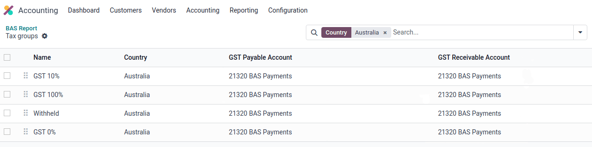
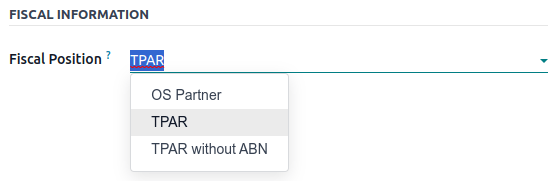
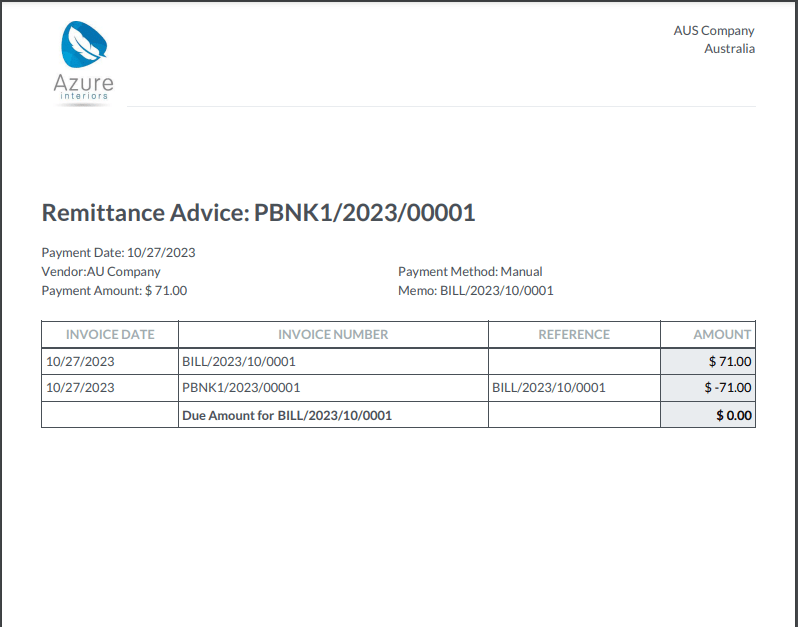
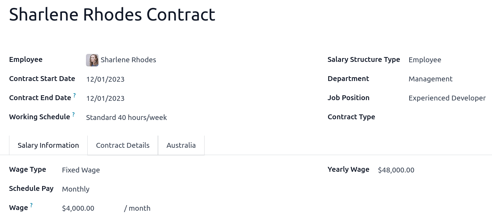
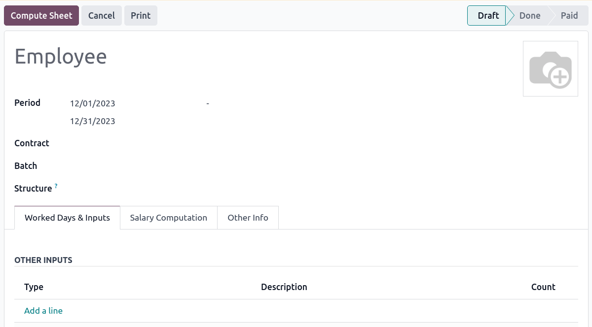
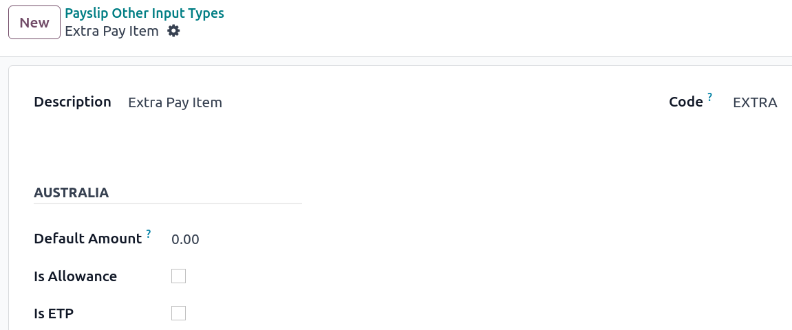
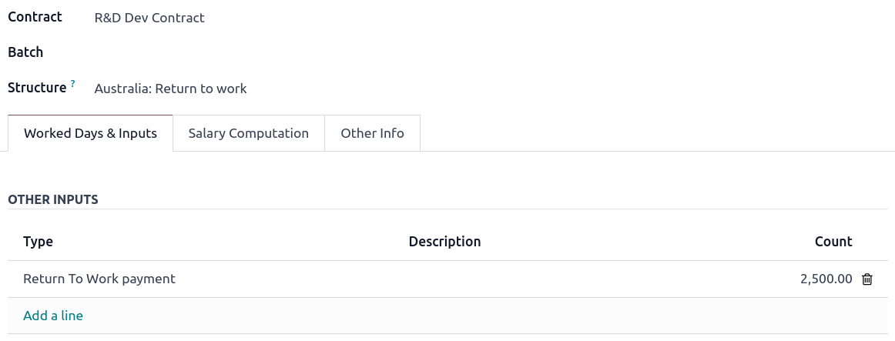
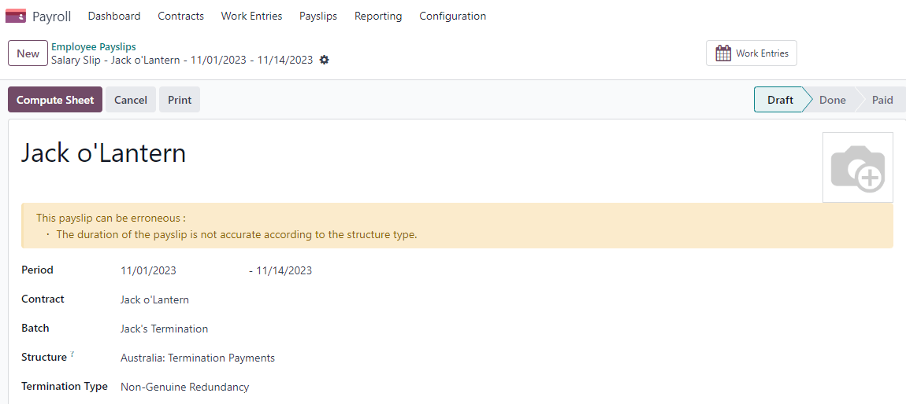
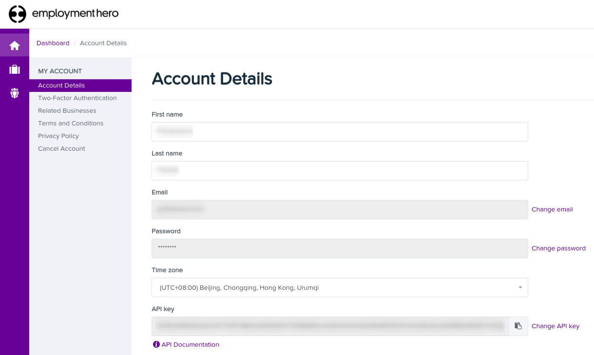
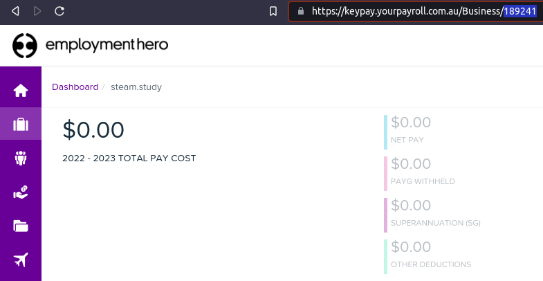

# Úc

## Cấu hình

| Tên phân hệ                        | Module Key                         | Mô tả                                                                                                                                                                                         |
|------------------------------------|------------------------------------|-----------------------------------------------------------------------------------------------------------------------------------------------------------------------------------------------|
| Úc - Kế toán                       | `l10n_au`                          | Installed by default when the Accounting Fiscal Localization package is set to Australia. This module also installs the ABA credit transfer and the Remittance Advice report module.  |
| Báo cáo của Úc - Kế toán           | `l10n_au_reports`                  | Includes the Taxable Payments Annual Reports (TPAR) and the BAS report.                                                                                                                   |
| Úc - Bảng lương                    | `l10n_au_hr_payroll`               | Payroll localisation for Australia.                                                                                                                                                           |
| Úc - Bảng lương với Kế toán        | `l10n_au_hr_payroll_account`       | Installs the link between Australian payroll and accounting. The module also installs the modules: Australian - Accounting; Australian Reports - Accounting; and Australia - Payroll. |
| Accounting Customer Statements     | `l10n_account_customer_statements` | Allows the management and sending of monthly customer statements from the partner ledger and the contact form. Also used in New Zealand.                                                  |
| Employment Hero Australian Payroll | `l10n_au_keypay`                   | Synchronises all pay runs from Employment Hero with Odoo’s journal entries.                                                                                                                   |

## Hệ thống tài khoản

The Australian chart of accounts is included in the **Australia - Accounting** module. Go to
Accounting ‣ Configuration ‣ Chart of Accounts to access it.

#### SEE ALSO
[Hệ thống tài khoản](../accounting/get_started/chart_of_accounts.md)

## Thuế và GST

The default Australian taxes impact the [BAS Report](#australia-bas), which can be accessed
through Accounting ‣ Reporting ‣ BAS Report.

In Australia, the standard **Goods and Services Tax** (GST) rate is 10%, but different rates and
exemptions exist for specific categories of goods and services.

### Thay thế thuế

Within the Australian localisation package, tax names encompass the tax rate as an integral part of
their naming convention.

Despite the high amount of taxes in Odoo, these taxes are pretty similar (mostly 0% and 10%), with
different tax grid variations for:

- Hàng hóa
- Dịch vụ
- TPAR
- TPAR without ABN

#### SEE ALSO
[Thuế](../accounting/taxes.md)

Taxes including a **TPAR** mention impact not only the **BAS** report but also the **TPAR** report.
Businesses from certain industries need to report payments made to subcontractors from relevant
services during the financial year. Odoo combines the use of taxes and fiscal positions to report
these payments on the **TPAR** report. Taxes with the mention **TPAR without ABN** are used to
record amounts withheld from subcontractors without an **ABN** for the **ATO**.

#### SEE ALSO
[TPAR](#australia-tpar)

Here are the taxes for Australia in Odoo 17.

| GST Name             | Mô tả                                            | GST Scope   | GST Type   |
|----------------------|--------------------------------------------------|-------------|------------|
| 10%                  | GST Purchases                                    |             | Mua hàng   |
| 10% INC              | GST Inclusive Purchases                          |             | Mua hàng   |
| 10% C                | Capital Purchases                                |             | Mua hàng   |
| 0% C                 | Zero Rated Purch                                 |             | Mua hàng   |
| 100% T EX            | Purchase (Taxable Imports) - Tax Paid Separately |             | Mua hàng   |
| 10% I                | Purchases for Input Taxed Sales                  |             | Mua hàng   |
| 10% P                | Purchases for Private use or not deductible      |             | Mua hàng   |
| 100% EX              | GST Only on Imports                              |             | Mua hàng   |
| 10% Adj              | Điều chỉnh thuế (Mua hàng)                       |             | Mua hàng   |
| 10%                  | GST Sales                                        |             | Bán hàng   |
| 10% INC              | GST Inclusive Sales                              |             | Bán hàng   |
| 0% EX                | Zero Rated (Export) Sales                        |             | Bán hàng   |
| 0% EXEMPT            | Exempt Sales                                     |             | Bán hàng   |
| 0% I                 | Input Taxed Sales                                |             | Bán hàng   |
| 10% Adj              | Điều chỉnh thuế (Bán hàng)                       |             | Bán hàng   |
| 10% TPAR             | GST Purchases                                    | Dịch vụ     | Mua hàng   |
| 10% TPAR NO ABN      | GST Purchases                                    | Dịch vụ     | Mua hàng   |
| 10% INC TPAR         | GST Inclusive Purchases                          | Dịch vụ     | Mua hàng   |
| 10% INC TPAR N ABN   | GST Inclusive Purchases                          | Dịch vụ     | Mua hàng   |
| 10% C TPAR           | Capital Purchases                                | Dịch vụ     | Mua hàng   |
| 10% C TPAR N ABN     | Capital Purchases                                | Dịch vụ     | Mua hàng   |
| 0% C TPAR            | Zero Rated Purch TPAR                            | Dịch vụ     | Mua hàng   |
| 0% C TPAR N ABN      | Zero Rated Purch TPAR without ABN                | Dịch vụ     | Mua hàng   |
| 100% T EX TPAR       | Purchase (Taxable Imports) - Tax Paid Separately | Dịch vụ     | Mua hàng   |
| 100% T EX TPAR N ABN | Purchase (Taxable Imports) - Tax Paid Separately | Dịch vụ     | Mua hàng   |
| 10% I TPAR           | Purchases for Input Taxed Sales                  | Dịch vụ     | Mua hàng   |
| 100% I TPAR N ABN    | Purchases for Input Taxed Sales                  | Dịch vụ     | Mua hàng   |
| 10% P TPAR           | Purchases for Private use or not deductible      | Dịch vụ     | Mua hàng   |
| 10% P TPAR N ABN     | Purchases for Private use or not deductible      | Dịch vụ     | Mua hàng   |
| 100% EX TPAR         | GST Only on Imports                              | Dịch vụ     | Mua hàng   |
| 100% EX TPAR N ABN   | GST Only on Imports                              | Dịch vụ     | Mua hàng   |
| 10% Adj TPAR         | Điều chỉnh thuế (Mua hàng)                       | Dịch vụ     | Mua hàng   |
| 10% Adj TPAR N ABN   | Điều chỉnh thuế (Mua hàng)                       | Dịch vụ     | Mua hàng   |
| 47% WH               | Tax Withheld for Partners without ABN            | Dịch vụ     | Mua hàng   |

## BAS report

The **Business Activity Statement (BAS)** report is a critical tax reporting requirement for
businesses registered for **Goods and Services Tax (GST)** in Australia. The **BAS** is used to
report and remit various taxes to the **Australian Taxation Office (ATO)**. With the Odoo **BAS**
feature, businesses can report on the following:

- Goods and Services Tax (GST)
- PAYG tax withheld

The taxes for GST are collected from the **tax grid**, which is pre-configured in the system. The
**tax grid** can also be manually set up for any additional special GST. Once the tax for each
account is set up, the system automatically slots journal items into the correct tax category. This
ensures the **BAS** report is accurate and reflective of the business's financial activities.

In addition, the **BAS** report includes the **PAYG** tax withheld components (**W1** to **W5**,
then **summary, section 4**). This integration ensures that all payroll-related withholding taxes
are accurately captured and reflected within the report.

The module incorporates built-in rules that facilitate the automatic calculation of taxes for types
**W1** to **W5**. For a detailed walkthrough and more information on the calculation process for
these taxes, please refer to the Payroll app documentation.

#### SEE ALSO
[Payroll](#australia-payroll)

### Closing the BAS report

When it is time to file the tax return with the **ATO**, click Closing entry. The tax
return period can be configured in configuration ‣ Settings ‣ Tax Return
Periodicity. Also, the start date of the tax return period can be defined through the **period
button** (marked by a calendar icon 📅).

#### SEE ALSO
[Year-end closing](../accounting/reporting/year_end.md)

#### NOTE
Odoo uses the *calendar quarter* rather than the Australian FY quarter, which means **July to
September is Q3 in Odoo**.

Before closing the entry for the first time, the default **GST payable account** and **GST
receivable account** need to be set. A notification pops up and redirects the user to tax group
configurations.

Once the **GST payable** and **GST receivable** accounts are set up, the **BAS** report generates an
accurate journal closing entry automatically, which balances out the GST balance with the GST
clearing account.

The balance between **GST receivable** and **payable** is set against the tax clearing account
defined on the tax group. The amount to be paid to or received from the **ATO** can be reconciled
against a bank statement.

#### IMPORTANT
The **BAS** report is not directly submitted to the **ATO**. Odoo helps you automatically compute
the necessary values in each section, with the possibility to audit them to better understand the
history behind these numbers. Businesses can copy these values and enter them on the [ATO’s
portal](https://www.ato.gov.au/newsrooms/small-business-newsroom/lodging-your-next-bas).

## TPAR report

Odoo allows businesses to report payments made to contractors or subcontractors during the financial
year. This is done by generating a . If you are unsure
your business needs this report, refer to the documentation provided by the [ATO](https://www.ato.gov.au/businesses-and-organisations/preparing-lodging-and-paying/reports-and-returns/taxable-payments-annual-report).
You can find this report in Accounting ‣ Reporting ‣ Taxable Payments Annual
Reports (TPAR).

### Cấu hình

Under Accounting ‣ Customers or Accounting ‣ Vendors, select a
your contractor and set a Fiscal Position under the Sales & Purchase tab.

Upon billing a contact with a fiscal position set to TPAR or
TPAR without ABN, the report is automatically generated in Accounting
‣ Reporting ‣ Taxable Payments Annual Reports (TPAR).

The report includes the **ABN**, **Total GST**, **Gross Paid**, and **Tax Withheld** from their
**TPAR** subcontractors.

- **Total GST**: the total tax paid
- **Gross Paid amounts**: shows after registering a payment for those bills
- **Tax Withheld**: shown if the subcontractor is registered with a fiscal position set to
  TPAR without ABN

The **TPAR** report can be exported to PDF, XLSX, and TPAR formats.

## Customer statements

Customer statements allow customers to see their financial transactions with the company over a
certain period, and overdue statement details. These statements can be sent out to customers
by email.

There are **two** ways for customers to download these statements.

1. **From the contact form:** Customer statements are under Customers ‣
   Customers. Select a customer, click the **gear icon (⚙)**, and then
   Print Customer Statements. This prints out the statement from the beginning of the
   month to today's date.
2. **From the partner ledger:** This option allows for more flexibility in selecting a statement's
   start and end date. You can access it by going to Accounting ‣ Reporting ‣
   Partner Ledger. From here, specify a date range in the **calendar menu (📅)** for the statement,
   hover over a partner, and click the Customer Statements tab.

## Remittance advice

A remittance advice is a document used as proof of payment to a business. In Odoo, it can be
accessed by going to Accounting ‣ Vendors ‣ Payments, selecting the payment(s), and
clicking Print ‣ Payment Receipt.

## E-Invoicing via Peppol

Odoo is compliant with Australia's and New Zealand's [PEPPOL requirements](https://peppol.org/learn-more/country-profiles/australia/).
You can find and set up **electronic invoicing** settings per partner under
Accounting ‣ Customers or Accounting ‣ Vendors, select a
partner, and click the Accounting tab.

#### IMPORTANT
Validating an invoice or credit note for a partner on the PEPPOL network will download a
compliant XML file that can be manually uploaded to your PEPPOL network.

## ABA files for batch payments

### Đầu trang

An ABA file is a digital format developed by the [Australian Bankers' Association](https://www.ausbanking.org.au/).
It is designed for business customers to facilitate bulk payment processing by uploading a single
file from their business management software.

The main advantage of using ABA files is to improve payment and matching efficiency. This is
achieved by consolidating numerous payments into one file for batch processing, which can be
submitted to all Australian banks.

### Cấu hình

#### Cài đặt

To enable **batch payments**, go to Accounting ‣ Configuration ‣ Setting ‣
Batch Payment and enable Allow Batch Payments.

#### Bank journal

Then, go to Accounting ‣ Configuration ‣ Journals and select the
Bank journal type. In the Journal Entries tab, enter the
Account Number and click Create and edit. In the pop-up window, fill in the
following fields:

- Ngân hàng
- Account Holder Name
- BSB
- Chủ tài khoản

#### IMPORTANT
The Send Money field must be **enabled**.

#### NOTE
The Currency field is optional.

Go back to the Journal Entries tab and fill in the following fields related to the ABA:

- BSB: This field is auto-formatted from the bank account
- Financial Institution Code: The official 3-letter abbreviation of the financial
  institution (e.g., WBC for Westpac)
- Supplying User Name: 6-digit number provided by your bank. Contact or check your bank
  website if you need to know.
- Include Self-Balancing Transactions: Selecting this option adds an additional
  : "self-balancing" transaction to the end of the ABA file, which some financial institutions
    require when generating ABA files. Check with your bank to see if you need this option.

Then, go to the Outgoing Payments tab on the same Bank type journal. Click
Add a line and select ABA Credit Transfer as the **payment method**.

#### Partners’ bank accounts

Go to Accounting ‣ Customers ‣ Customers or Accounting ‣
Vendors ‣ Vendors and select a partner for whom you want to add banking information. Once
selected, click the Accounting tab, and under the Bank Accounts section,
click Add a line to fill in:

- Account Number of that partner
- Ngân hàng
- Account Holder Name
- BSB
- Accounter Holder
- Send Money defines the bank account as *trusted*, which is essential for ABA files and
  must be enabled if to be used.

### Generate an ABA file

To generate an **ABA** file, Create a vendor bill (manually or from a purchase order).
Confirm the bill and ensure the vendor’s banking information is set up correctly before
registering a payment..

Next, click Register Payment in the pop-up window: select the Bank journal,
select ABA Credit Transfer as Payment Method, and select the right
Recipient Bank Account.

Once payments are confirmed, they appear in Accounting ‣ Vendors ‣ Payments.
Tick the box of the payments to be included in the batch, then click Create Batch.
Verify all information is correct and finally Validate. Once validated, the ABA file
becomes available in the **chatter** on the right.

After uploading it to your bank’s portal, an ABA transaction line will appear in your bank feed at
the following bank feed iteration. You will need to reconcile it against the **batch payment** made
in Odoo.

#### SEE ALSO
[Batch Payment](../accounting/payments/batch.md)

## Buy Now, Pay Later solutions

Buy Now, Pay Later solutions are popular payment methods for eShops in Australia. Some of these
solutions are available via the [Stripe](https://stripe.com/en-au/payments/payment-methods) and
[AsiaPay](https://www.asiapay.com.au/payment.html#option) payment providers.

#### SEE ALSO
- [AsiaPay Payment Provider](../payment_providers/asiapay.md)
- [Stripe Payment Provider](../payment_providers/stripe.md)

## POS terminals for Australia

If you wish to have a direct connection between Odoo and your PoS terminal in Australia, you *must*
have a **Stripe** terminal. Odoo supports the **EFTPOS** payment solution in Australia.

#### NOTE
You do not need a Stripe payment terminal to use Odoo as your main PoS system. The only drawback
of not using Stripe is that cashiers must manually enter the final payment amount on the
terminal.

#### SEE ALSO
- [Stripe Odoo Payment Provider](../payment_providers/stripe.md)
- [Stripe Odoo Payment Terminal](../../sales/point_of_sale/payment_methods/terminals/stripe.md)
- [Stripe Dashboard](https://dashboard.stripe.com/dashboard)
- [Stripe Terminal](https://stripe.com/docs/terminal)

## Bảng lương

#### IMPORTANT
Odoo is currently not compliant with STP Phase 2.

### Create your employees

To create an **employee form** and fill in mandatory information, go to the **Employees** app and
click Create. In the HR Settings tab, you can input the mandatory
information:

1. TFN Status: if the employee provides a TFN, make sure to add it to the “TFN” field
2. Non-resident: if the employee is a foreign resident
3. Tax-free Threshold: if the employee is below or above the threshold
4. HELP / STSL: for all types of study and training support loans (e.g. HELP, VSL, SSL…)
5. Medicare levy Deduction
6. Medicare levy Exemption
7. Withholding for Extra Pay
8. ...

### Manage Australian contracts

Once the employee form has been created, ensure the contract is enabled by clicking the
Contracts smart button or by going to Employees ‣ Employees ‣
Contracts.

#### NOTE
Only one contract can be active simultaneously per employee, but an employee can be assigned
consecutive contracts during their employment.

Contractual information related to Australia can be found in the following **three** places:

1. Before assigning a salary amount, pay frequency, and other important details to a contract,
   defining the **salary structure**, **start date**, and **work entry** source is important. In
   Australia, a "Salary Structure" is employed to specify the tax schedule applicable to that
   contract, as defined by the Australian Taxation Office (ATO). Most contracts will fall under the
   following **three structures**:
   > - **Regular (Schedule 1)**: the great majority of Australian employees will fall in this
   >   category; hence, this structure is assigned by default to all contracts.
   > - **Working holiday makers (Schedule 15)**. When employing working holiday makers (WHMs), other
   >   taxes apply. For detailed information on these specific tax implications, refer to the
   >   documentation provided by the **ATO**.
   > - **No TFN**. Choose this structure if the employee hasn’t provided a **TFN** for over **28**
   >   days.

#### IMPORTANT
The structures **Horticulture/Shearing (Schedule 2)** and **Artists and Performers (Schedule 3)**
are only partially complete, and proper tests should be performed before using them to pay
employees in your production database. Send your feedback to [au-feedback@mail.odoo.com](mailto:au-feedback@mail.odoo.com).

The field Work Entry Source is also significant and defines how **working hours** and
**days** are accounted for in the employee’s payslip.

- Working Schedule: work entries are automatically generated based on the employee’s
  working schedule, starting from the contract's start date.. For example, let’s assume that an
  employee works 38 hours a week, and their contract’s begins on January 1st. Today is January 16th,
  and the user generates a pay run from January 14th to 20th. The working hours on the payslip will
  be automatically calculated to be 38 hours (5 \* 7.36 hours) if no leave is taken.
- Attendances: The default working schedule is ignored, and work entries are only
  generated after clocking in and out of the attendance app.
- Planning: The default working schedule is ignored, and work entries are generated from
  planning shifts only.

  #### IMPORTANT
  Additional configurations are necessary to ensure that Odoo’s payslips automatically compute
  various **penalty rates** as defined by an **award (overtime rate, public holiday rate, etc)**.
  To create these configurations, create new work-entry types for each penalty rate and then
  assign a penalty rate in % to each. Once this one-time configuration is done, work entries can
  be manually imported for each period, and Odoo will separate the pay items and rates on the
  employee’s payslip.

  #### IMPORTANT
  Timesheets do not impact work entries in Odoo.
- The Salary Information tab contains a few essential fields impacting the frequency of
  pay runs and the management of payslip rules in Odoo.
  > - Wage Type: Select the Fixed Wage pay type for full-time and part-time
  >   employees. For casual workers and other Hourly Wage type. For employees being paid
  >   hourly, make sure to define the correct **casual loading**.
  > - Schedule Pay: In Australia, only the following pay run frequencies are accepted:
  >   **daily, weekly, bi-weekly (or fortnightly), monthly, and quarterly**.
  > - Wage (/period): Assign a wage to the contract according to their pay frequency.
  >   On payslips, the corresponding annual and hourly rates will be automatically computed.

  #### NOTE
  For hourly workers, please note that the hourly wage should exclude casual loading.
- The Australia tab. Most of the fields in this tab are used for **Single Touch
  Payroll** (or **STP**) reporting, which requires a thorough understanding of several details from
  an employee’s contract. Review the information on this tab before moving forward with pay runs.
  This includes the following **four** fields which impact payslip computations:
  > - Withholding Variation: use this field in case the employee’s withholding must be
  >   varied upward or downward according to their circumstances. E.g., if employee X benefits from a
  >   25% withholding variation, their percentage of tax withheld will vary from whatever amount
  >   they were supposed to pay according to their salary structure and situation to a fixed 25%.
  > - Leave Loading: if the employee benefits from a regular leave loading, the value
  >   set in the field Leave Loading Rate (e.g., 17.5%) is added to any amount earned
  >   when taking annual or long service leaves.
  > - Salary Sacrifice Superannuation: any amount added to this field is deducted, per
  >   pay frequency, from the employee’s basic salary before the computation of the gross salary.
  >   Then, this amount is added to the super guarantee line of their payslip. E.g., if employee Y
  >   earns 5,000 AUD per month and sacrifices 300 AUD to superannuation, their gross salary will be
  >   4,700 AUD, and 300 AUD will be added on top of their normal super contributions.
  > - Salary Sacrifice Other: any amount added to this field is deducted, per pay
  >   frequency, from the employee’s basic salary before the computation of the gross salary.

Once all important information has been entered, ensure the transition of the contract's status from
"New" to "Running" to facilitate its use in pay runs.

### Assign superannuation accounts

Upon receipt of superannuation details from a new employee, ensure the creation of a new account in
Payroll ‣ Configuration ‣ Super Accounts to link it to the employee. Input the
Super Fund, Member Since date, and TFN number of the employee.

Suppose the employee uses a superannuation fund that does not exist in the database yet. In that
case Odoo creates a new one and centralises basic information about this fund, such as its **ABN**,
**address**, type (**APRA** or **SMSF**), **USI**, and **ESA**. Super funds can be created or
imported in Payroll ‣ Configuration ‣ Super Funds.

#### IMPORTANT
Odoo is currently not **SuperStream-compliant**.

### Create pay runs with payslips

Odoo can create pay runs in **two** ways: via **batch** or via **individual** payslips.

#### Create a batch of payslips

When preparing to generate employees’ draft payslips (e.g., at the end of every week, fortnight, or
month), navigate to Payroll ‣ Payslips ‣ Batches and click New.
Fill in the necessary info, click Generate Payslips, select the
Salary Structure, Department, Employees, and
Generate. This method allows the creation of multiple payslips corresponding to each
employee in a single batch.

1. Give the batch a name. (E.g., `2024 – Weekly W1`)
2. Choose the pay run's start and end date. (E.g., 01/01/2024 to 07/01/2024)
3. Click on Generate. A pop-up window asks to confirm which employees should be included
   in the batch. By default, all active employees are included. You can leave
   Salary Structure field blank as Odoo automatically selects the structure linked to
   each employee’s contract.
4. The batch creates as many payslips as there are employees. There is no limit to the number of
   payslips created in a batch.
5. Verify important information on each payslip. After payslips from a batch have been generated,
   there is no need to manually compute payslip lines; Odoo does it for you.

#### Create an individual payslip

In cases where the pay run does not fall into the category of regular payslips, the option exists to
create a pay run dedicated to a single employee. Go to Payroll ‣ Payslips ‣ All
Payslips and click New. Employ this method when processing **one-time payments** for
employees, including **return-to-work** payments (**ATO Schedule 4**), **employment termination**
payments (**ATO Schedule 7 and 11**), and **commissions and bonuses** (**ATO Schedule 5**). When
generating an individual payslip, make sure to proceed with the following steps:

1. Select an Employee; their Contract will be filled out automatically
2. Add a pay Period
3. Select a salary Structure (e.g., return-to-work payment)
4. Unlike payslips generated from a batch, the payroll user must click the Compute Sheet
   button to generate payslip lines

#### Understand payslip features

The same features apply no matter how payslips are created (individually or via batch).

Depending on how work entries are created, the Worked Days & Inputs table
automatically shows the number of days and hours the employee worked during the payslip period next
to the corresponding total gross amount.

#### NOTE
There is one line per work entry type, meaning **paid** and **unpaid time-off**, in addition to
custom **hourly penalty rates** (overtime, public holidays, etc.) which are automatically added
to the table.

In the Other Inputs section, You can add entries such as **allowances** and **extra
pay** items in the Other Inputs section.

- To incorporate various **allowances** into an employee's payslip, create **allowances** in
  Payroll ‣ Configuration ‣ Other Input Types. Once created, tick the
  Is an Allowance checkbox for the involved allowances.

  #### IMPORTANT
  Withholding for allowances is not computed automatically. The payroll user has to use the field
  Withholding for allowance under the other inputs table to manually add the total
  amount to be withheld across all allowances on that payslip.
- **Extra pay** items are other inputs added to the **payslip’s gross** and, as a result, to the
  **withholding amount**. An example lies in regular sales commissions, taxed at the same rate as
  the regular salary (unlike discretionary bonuses, which fall under the ATO’s Schedule 5 and its
  corresponding salary structure). To configure such a custom pay item, go to
  Payroll ‣ Configuration ‣ Other Input Types and create a new entry with the
  code **EXTRA**.

In the Salary Computation tab, the payroll user can verify whether all the pay rules
have been computed correctly as per employee, contract and salary structure. Here are a few
guidelines to better understand the data.

1. **Basic salary:** amount from which tax-deductible lines can be subtracted
2. **Gross salary:** amount subject to the taxes defined by the salary structure
3. **Withholding:** tax amount to be paid to the **ATO**
4. **Net salary:** amount to be paid to the employee’s bank account
5. **Superannuation Guarantee:** amount to be provisioned for quarterly payments to the employee’s
   super account
6. **Allowances & Extra pay items:** these lines will show if other inputs are added to the payslip.
7. **Other lines:** depending on the employee and contract specifics (Medicare, child support,
   salary, sacrifice, etc.)

When satisfied with the payslip, click Create Draft entry to generate a draft accounting
journal entry that the accountant can review. Note that in the case of a payslip batch, this
accounting entry will sum up balances from all payslips.

### Pay employees

After a batch or a payslip’s journal entry has been posted, the company can pay their employees. The
user can choose between **two** different **payment methods**.

- Pay the employee in batch via **ABA** files. This is **only** possible from the **payslip batch**
  level. Ensure the batch’s journal entry has been posted to generate the **ABA** file. From the
  batch form view, click Create ABA File and choose the desired bank journal. The newly
  generated **ABA** file becomes available for download in the field ABA File. It is
  possible to re-generate the ABA file after applying corrections to existing payslips.

  #### NOTE
  It is always possible to include an individual payslip into an existing batch in an **ABA**
  file.

  #### IMPORTANT
  An ABA file can only be generated if both the company’s bank account and each employee’s bank
  account have been properly [configured](#australia-aba).
- From the employee's payslip (Payroll ‣ Payslips), once the payslip's journal
  entry has been posted, click Register Payment. The process is the same as
  [paying vendor bills](../accounting/payments.md): select the desired bank journal and payment
  method, then later reconcile the payment with the corresponding bank statement.

#### One-time payments

Certain payments, such as **Return-to-Work** payments and **Employment Termination Payments**
**(ETP)**, are processed only once and require a slightly different approach.

##### Return-to-Work payments

A **Return-to-Work** payment is a payment made to an employee to resume working. To process one,
create an individual payslip, select the employee, and modify its **regular structure** to
Australia: Return to work. Then, add the **gross amount** of that payment in the
Other Inputs section and compute the payslip. Odoo automatically computes the **PAYG
withholding**, the **net amount**, and the **super guarantee** corresponding to that payment.

##### Termination payments

Before proceeding with the employee’s ETP, make sure that a **Contract End Date** has been set on
that employee’s contract so that Odoo can automatically compute the final prorated salary of that
employee for the current month.

First, create the final salary for that employee this month. To do so, create an individual payslip.
If the contract end date is set correctly, Odoo will automatically compute the prorated salary up to
the final payslip date.

Create a second individual payslip and include it in the same batch. Change the salary structure on
that payslip to Australia: Termination Payments. Before computing the sheet, it is
important to provide the payslip with termination details .

- Genuine or Non-Genuine Redundancy. This choice impacts the amounts and
  caps defined per **ETP** type.
- **ETP types**: see the full list of termination payment types in
  Other Input Types by filtering by `ETP Type is Set`.

Add the relevant **ETP type** in the Other Inputs table of the payslip, then compute the
payslip. Odoo computes the **gross ETP**, the **withholding**, the **unused leaves**, and the **net
salary** according to the rules defined on the **ETP**, the **employee**, and their **contract**.
Once payment for both payslips is ready to be processed, an **ABA** file can be created directly
from the batch.

## Employment Hero cho Bảng lương của Úc

If your business is already up and running with [Employment Hero](https://employmenthero.com/),
you can use our connector as an alternative payroll solution.

The Employment Hero module synchronises payslip accounting entries (e.g., expenses, social charges,
liabilities, taxes) automatically from Employment Hero to Odoo. Payroll administration is still done
in Employment Hero. We only record the **journal entries** in Odoo.

#### IMPORTANT
KeyPay was rebranded as **Employment Hero** in March 2023.

### Cấu hình

1. [Activate](../../general/apps_modules.md#general-install) the Employment Hero Australian Payroll module
   (`l10n_au_keypay`).
2. Configure the **Employment Hero API** by going to Accounting ‣ Configuration
   ‣ Settings. More fields become visible after clicking on Enable Employment Hero
   Integration.
   
   - You can find the API Key in the My Account section of the Employment Hero platform.
     
   - The **Payroll URL** is pre-filled with `https://keypay.yourpayroll.com.au`.

     #### WARNING
     Do not change the **pre-filled Payroll URL**
   - You can find the **Business ID** in the Employment Hero URL. (i.e., `189241`)
     
   - You can choose any Odoo journal to post the payslip entries.
3. Configure the tax by going to Accounting ‣ Configuration ‣ Taxes. Create the
   necessary taxes for the Employment Hero payslip entries. Fill in the tax code from
   **Employment Hero** in the Matching Employment Hero Tax field.

### How does the API work?

The API syncs the journal entries from Employment Hero to Odoo and leaves them in draft mode. The
reference includes the Employment Hero payslip entry ID in brackets for the user to easily retrieve
the same record in Employment Hero and Odoo.

By default, the synchronisation happens once per week. You can fetch the records manually by going
to Accounting ‣ Configuration ‣ Settings and, in the Enable
Employment Hero Integration option, click on Fetch Payruns Manually.

Employment Hero payslip entries also work based on double-entry bookkeeping.

The accounts used by Employment Hero are defined in the section Payroll settings.

For the API to work, you need to create the same accounts as the default accounts of your Employment
Hero business (**same name and same code**) in Odoo. You also need to choose the correct account
types in Odoo to generate accurate financial reports.
