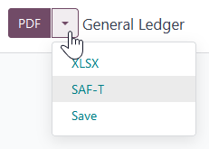

# Áo

## Cấu hình

[Install](../../general/apps_modules.md#general-install) the following modules to get all the features of the Austrian
localization.

| Tên                          | Tên kỹ thuật      | Mô tả                                                                                            |
|------------------------------|-------------------|--------------------------------------------------------------------------------------------------|
| Áo - Kế toán                 | `l10n_at`         | Default [fiscal localization package](../fiscal_localizations.md#fiscal-localizations-packages). |
| Austria - Accounting Reports | `l10n_at_reports` | Adds localized versions of financial reports                                                     |
| Xuất SAF-T của Áo            | `l10n_at_saft`    | Adds the SAF-T export.                                                                           |

## Báo cáo tài chính

The following localized reports are available:

> - Balance sheet according to [§ 224 UGB](https://www.ris.bka.gv.at/NormDokument.wxe?Abfrage=Bundesnormen&Gesetzesnummer=10001702&Artikel=&Paragraf=224&Anlage=&Uebergangsrecht=)
> - Profit and loss according to [§ 231 UGB](https://www.ris.bka.gv.at/NormDokument.wxe?Abfrage=Bundesnormen&Gesetzesnummer=10001702&Artikel=&Paragraf=231&Anlage=&Uebergangsrecht=) (Gesamtkostenverfahren)

#### SEE ALSO
[Accounting reporting documentation](../accounting/reporting.md)

## SAF-T (Standard Audit File for Tax)

The Austrian tax office may request a SAF-T. The Austrian SAF-T Export module allows exporting the
report in XML format.

### Cấu hình

This section explains how to configure the database to ensure all the information required by the
SAF-T is available. If anything is missing, a warning message listing which information is needed
will be displayed during the export.

#### Thông tin công ty

Open the database Settings. Under the Companies section, click
Update Info and ensure the following fields are correctly filled in:

- Address, by providing at least the following information:
  - Đường
  - Thành phố
  - ZIP
  - Quốc gia
- Điện thoại
- Company ID by providing your company's tax ID
- Tax ID by providing, if you have one, your  (including the country prefix)

##### Contact person

At least one **contact person** must be linked to your company in the Contacts app, and:

> - Ensure the contact type is set to Individual.
> - Select your company in the Company name field.
> - Provide at least one phone number using the Phone or Mobile field.

#### Customer and supplier information

Using the Contacts app, fill in the Address of any partner that appears in
your invoices, vendor bills, or payments.

For partners that are companies, fill in the VAT number (including the country prefix) in the
Tax ID field.

#### Accounting settings

Go to Accounting ‣ Configuration ‣ Settings. Under the Austrian
localization section, fill in the following fields:

- ÖNACE-Code
- Profit Assessment Method

#### SEE ALSO
[ÖNACE information on the Austrian Economic Chambers website](https://www.wko.at/service/zahlen-daten-fakten/oenace.html)

#### Chart of accounts mapping

The Austrian SAF-T specifications define a chart of accounts (COA). All relevant accounts for the
SAF-T export must be annotated with a fitting account from this COA.

The needed mapping information is supplied by adding tags to the accounts. For example, adding the
`1000` tag to an account maps it (virtually) to the SAF-T COA account with the code `1000`. Any
number can be used as long as there is an account in the SAF-T COA with that code.

The Austria - Accounting module adds a tag for each SAF-T COA account. Furthermore, it
automatically maps many accounts from the default Austrian COA.

You can try exporting the SAF-T report to check if there are unmapped accounts (or mapped to
multiple SAF-T accounts). A warning will be displayed if there is any issue with your configuration
or the mapping. Clicking View Problematic Accounts lets you view them.

#### SEE ALSO
[Chart of accounts documentation](../accounting/get_started/chart_of_accounts.md)

### Exporting the SAF-T report

To export the SAF-T report, go to Accounting ‣ Reports ‣ General Ledger. Click
the right side of the PDF button and select SAF-T.

