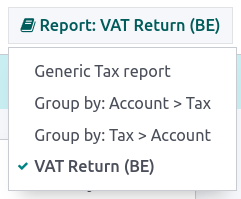
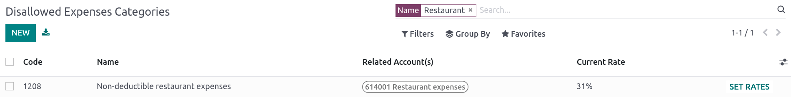
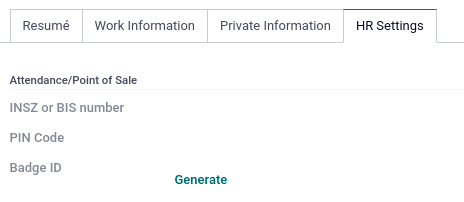

# Bỉ

## Cấu hình

Install the 🇧🇪 Belgium [fiscal localization package](../fiscal_localizations.md#fiscal-localizations-packages) to get all the default accounting features of the Belgian
localization, following the  rules.

## Hệ thống tài khoản

You can reach the Chart of accounts by going to Accounting ‣
Configuration ‣ Accounting: Chart of Accounts.

The Belgian chart of accounts includes pre-configured accounts as described in the . To add a new account, click New. A new line appears. Fill
it in, click Save, and then Setup to configure it further.

#### SEE ALSO
[Hệ thống tài khoản](../accounting/get_started/chart_of_accounts.md)

## Thuế

Default Belgian taxes are created automatically when the Belgium - Accounting and
the Belgium - Accounting Reports modules are installed. Each tax impacts the Belgian
Tax Report, available by going to Accounting ‣ Reporting ‣
Statements Reports: Tax Report.

Ở Bỉ, thuế suất GTGT tiêu chuẩn là **21%**, nhưng có mức thuế suất thấp hơn đối với một số loại hàng hóa và dịch vụ. Mức thuế suất trung gian là **12%** được áp dụng cho nhà ở xã hội và thực phẩm phục vụ tại nhà hàng, trong khi mức thuế suất giảm là **6%** được áp dụng cho hầu hết các mặt hàng cơ bản, chẳng hạn như thực phẩm, nguồn nước, sách và thuốc men. Mức thuế suất **0%** được áp dụng cho một số hàng hóa và dịch vụ đặc biệt, chẳng hạn như một số ấn phẩm hàng ngày và hàng tuần, cũng như hàng hóa tái chế.

### Non-deductible taxes

In Belgium, some taxes are not fully deductible, such as taxes on the maintenance of cars. This
means a part of these taxes is considered as an expense.

In Odoo, you can configure non-deductible taxes by creating tax rules for these taxes and linking
them to the corresponding accounts. This way, the system automatically calculates the taxes and
allocates them to the appropriate accounts.

To configure a new non-deductible tax, go to Accounting ‣ Configuration ‣
Accounting: Taxes, and click New:

1. Add a line and select Base in the Based On column;
2. Add a line, then select on tax in the Based on column and
   enter the **non-deductible** percentage in the % column;
3. On the of tax line, select the Tax Grid(s) related to your tax;
4. Add a line with the **deductible** percentage in the % column;
5. Set of tax in Based On;
6. Select 411000 VAT recoverable as account, and select the related tax grid.

Once you have created a non-deductible tax, you can apply it to your transactions by selecting the
appropriate tax during the encoding of bills and credit notes. The system automatically calculates
the tax amount and allocates it to the corresponding accounts based on the tax rules configured.

#### SEE ALSO
- [Thuế](../accounting/taxes.md)
- [Tax return (VAT declaration)](../accounting/reporting/tax_returns.md)

## Báo cáo

Here is the list of Belgian-specific reports available:

- Balance sheet;
- Lãi & lỗ
- Tax report;
- Partner VAT Listing;
- EC Sales List;
- Intrastat.

You can access Belgian-specific versions of reports by clicking on the **book** icon when on a
report and selecting its Belgian version: **(BE)**.

#### SEE ALSO
[Báo cáo](../accounting/reporting.md)

### Báo cáo chi phí không được phép

**Disallowed expenses** are expenses that can be deducted from your accounting result but not from
your fiscal result.

Báo cáo **chi phí không được phép** có sẵn khi truy cập Kế toán ‣ Báo cáo ‣ Quản lý: Chi phí không được phép. Báo cáo này cung cấp kết quả tài chính theo thời gian thực và các thay đổi định kỳ. Báo cáo được tạo dựa trên **danh mục chi phí không được phép** mà bạn có thể truy cập tại Kế toán ‣ Cấu hình ‣ Quản lý: Danh mục chi phí không được phép. Một số danh mục đã tồn tại sẵn theo mặc định nhưng chưa có tỷ lệ nào. Nhấp vào Đặt tỷ lệ để cập nhật một danh mục cụ thể.

Để liên kết danh mục chi phí không được phép với một tài khoản cụ thể, truy cập Kế toán ‣ Cấu hình ‣ Kế toán: Hệ thống tài khoản. Tìm tài khoản mong muốn và nhấp Thiết lập. Thêm Danh mục chi phí không được phép vào trường Chi phí không được phép. Từ giờ, khi tạo chi phí với tài khoản này, phần chi phí không được phép sẽ tự động tính theo tỷ lệ đã định trong Danh mục chi phí không được phép.

Let's take an example reflecting **restaurant** and **car expenses**.

#### Restaurant expenses

In Belgium, 31% of **restaurant** expenses are non-deductible. Create a new **disallowed expenses
category** and set both Related Account(s) and Current Rate.

#### Car expenses: vehicle split

Tại Bỉ, tỷ lệ khấu trừ thay đổi tùy theo từng xe và do đó cần được chỉ định cho từng xe. Để thực hiện, mở Đội xe và chọn một xe. Trong tab Thông tin thuế, đi đến phần Tỷ lệ chi phí không được phép và nhấp vào Thêm dòng. Thêm Ngày bắt đầu và %. Các số tiền sẽ được ghi vào cùng một tài khoản cho tất cả chi phí xe.

When you create a bill for car expenses, you can link each expense to a specific car by filling the
Vehicle column, so the right percentage is applied.

The vehicle split option available in the disallowed expenses report allows you to see
the rate and disallowed amount for each car.

## Fee form 281.50 and form 325

### Mẫu phí 281.50

Hàng năm, một **biểu mẫu phí 281.50** phải được báo cáo cho cơ quan thuế. Để thực hiện, thẻ `281.50` phải được thêm vào **biểu mẫu liên hệ** của các thực thể chịu **phí 281.50**. Để thêm thẻ, mở Liên hệ, chọn cá nhân hoặc công ty bạn muốn tạo **biểu mẫu phí 281.50**, và thêm thẻ `281.50` vào trường Thẻ.

#### NOTE
Make sure the **street, zip code, country**, and **VAT number** are also informed on the
**Contact form**.

Then, depending on the nature of the expense, add the corresponding `281.50` tag on the impact
accounts. To do so, go to Accounting ‣ Configuration ‣ Accounting: Chart of
Accounts, and click on Setup to add the corresponding `281.50` tag on the impacted
accounts, i.e., 281.50 - Commissions, depending on the nature of the expense.

### Mẫu 325

You can create a **325 form** by going to Accounting ‣ Reporting ‣ Belgium:
Create 325 form. A new page pops up: select the right options and click Generate 325
form. To open an already generated **325 form**, go to Accounting ‣ Reporting ‣
Belgium: Open 325 forms.

## CODA and SODA statements

### CODA

**CODA** is an electronic XML format used to import Belgian bank statements. You can download CODA
files from your bank and import them directly into Odoo by clicking Import file from
your Bank journal on your dashboard.

#### SEE ALSO
[Import bank files](../accounting/bank/transactions.md#transactions-import)

### SODA

**SODA** is an electronic XML format used to import accounting entries related to salaries. SODA
files can be imported into the journal you use to record salaries by going to your Accounting
**dashboard** and clicking Upload in the related journal card form.

Once your **SODA** files are imported, the entries are created automatically in your salary journal.

### CodaBox

**CodaBox** is a service that allows Belgian companies and accounting firms to access bank
information and statements. Odoo provides a way to import such statements automatically.

#### Cấu hình

To configure and use Codabox, first [install](../../general/apps_modules.md#general-install) the CodaBox module.

##### Configure the Connection

For companies

#### IMPORTANT
Make sure the [company settings](../../general/companies.md) are correctly
configured, i.e., the country is set to Belgium and the Tax ID or
Company ID field is filled.

1. Go to Accounting ‣ Configuration ‣ Settings, then go to the
   CodaBox & SODA section.
2. Click on Manage Connection to open the connection wizard, which shows the
   Company VAT/ID number that will be used for the connection.
3. If this is your **first connection**, click on Create connection.
   The wizard confirms that the connection has been created on **Odoo's side**. Follow the
   steps to validate the connection on **CodaBox's side** too.

   If this is **not your first connection**, the Password provided by
   Odoo during the first connection will be requested to create a new connection.
   > #### NOTE
   > This Password is unique to Odoo and must be stored securely
   > on your side.

For accounting firms

#### NOTE
Accounting firms must manage their clients on separate databases and configure them
individually to avoid mixing up their data. The connection must be made by an accounting
firm with valid CodaBox Connect credentials.
In the following instructions, we will refer to your client's company as *Company* and to
your accounting firm as *Accounting Firm*.

#### IMPORTANT
Make sure the [company settings](../../general/companies.md) are correctly
configured, i.e., the country is set to Belgium, the Tax ID or
Company ID and Accounting Firm fields are filled, as well as the
Tax ID of the Accounting Firm.

1. Go to Accounting ‣ Configuration ‣ Settings, then go to the
   CodaBox & SODA section.
2. Click on Manage Connection to open the connection wizard, which shows the
   Accounting Firm VAT number and the Company VAT/ID number that will
   be used for the connection.
3. If this is your **first connection**, click on Create connection. The wizard
   confirms that the connection has been created on **Odoo's side**. Follow the steps to
   validate the connection on **CodaBox's side**, too.

   If this is **not your first connection**, the Accounting Firm Password provided
   by Odoo during the first connection will be requested to create a new connection.
   > #### NOTE
   > This Accounting Firm Password is unique to Odoo and must be stored
   > securely on your side.

The Status should have now switched to Connected.

##### Cấu hình sổ nhật ký

Dành cho tệp CODA

1. [Create a new bank journal](../accounting/bank.md).
2. Set the right IBAN in the Account Number field.
3. Select CodaBox synchronization as the Bank Feed.

Dành cho tệp SODA

1. Create a new miscellaneous journal.
2. Go to Accounting ‣ Configuration ‣ Settings, then go to the
   CodaBox section.
3. Select the journal you just created in the SODA journal field.

#### Đồng bộ

Once the connection is established, Odoo can be synchronized with CodaBox.

Dành cho tệp CODA

CODA files are automatically imported from CodaBox every 12 hours. You do
not have to do anything. However, if you wish, it can also be done manually,
by clicking on Fetch from CodaBox in the Accounting Dashboard.

Dành cho tệp SODA

SODA files are automatically imported from CodaBox once a day as a draft. You do not have to
do anything. However, if you wish, it can also be done manually by clicking on
Fetch from CodaBox in the Accounting Dashboard.

By default, if an account in the SODA file is not mapped to an account in Odoo, the Suspense
Account (499000) is used, and a note is added to the created journal entry.

#### NOTE
You can access the mapping between the SODA and Odoo accounts by going to
Accounting ‣ Configuration ‣ Settings and clicking on the
Open SODA Mapping button in the CodaBox section.

#### Potential issues

* **CodaBox is not configured. Please check your configuration.**

  Either the Company VAT or the Accounting Firm VAT is not set.
* **No connection exists with these accounting firms and company VAT numbers.**
  **Please check your configuration.**
  > This can happen when checking the connection status, and the Accounting Firm VAT and
  > Company VAT combination still needs to be registered. This may happen if you have
  > changed the Company VAT after the connection was established. For security reasons,
  > you have to [recreate a connection](#belgium-codabox-configuration-connection)
  > for this Company VAT.
* **It seems that your CodaBox connection is not valid anymore. Please connect again.**
  > This can happen if you revoke Odoo's access to your CodaBox account or still need to complete
  > the configuration process. In this case, you must revoke the connection and create a new one.
* **The provided password is not valid for this accounting firm.**
  **You must reuse the password you received from Odoo during your first connection.**
  > Mật khẩu bạn cung cấp khác với mật khẩu bạn nhận được từ Odoo trong lần kết nối đầu tiên. Bạn phải sử dụng mật khẩu đã nhận từ Odoo trong lần kết nối đầu tiên để tạo kết nối mới cho công ty kế toán này. Nếu mất mật khẩu, trước tiên bạn phải thu hồi kết nối Odoo từ phía CodaBox (tức là trên cổng thông tin myCodaBox của bạn). Sau đó, bạn có thể thu hồi kết nối từ phía Odoo và [tạo kết nối mới](#belgium-codabox-configuration-connection).
* **It seems that the company or accounting firm VAT number you provided is not valid.**
  **Please check your configuration.**
  > Either the Company VAT or the Accounting Firm VAT is not in a valid
  > Belgian format.
* **It seems that the accounting firm VAT number you provided does not exist in CodaBox.**
  **Please check your configuration.**
  > The Accounting Firm VAT number you provided is not registered in CodaBox.
  > You may not have a valid CodaBox license linked to this VAT number.
* **It seems you have already created a connection to CodaBox with this accounting firm.**
  **To create a new connection, you must first revoke the old one on myCodaBox portal.**
  > You must go to your myCodaBox portal and revoke Odoo's access to your CodaBox account.
  > Then, you can [create a new connection](#belgium-codabox-configuration-connection)
  > on Odoo's side.

## Hóa đơn điện tử

Odoo supports the **Peppol BIS Billing 3.0 (UBL)** electronic invoicing format. To enable it for a
customer, go to Accounting ‣ Customers ‣ Customers, open their contact form,
and under the Accounting tab, select the Peppol BIS Billing 3.0 format.

#### SEE ALSO
[Electronic invoicing (EDI)](../accounting/customer_invoices/electronic_invoicing.md)

## Cash discount

In Belgium, if an early payment discount is offered on an invoice, the tax is calculated based on
the discounted total amount, whether the customer benefits from the discount or not.

To apply the right tax amount and report it correctly in your VAT return, set the tax reduction as
Always (upon invoice).

#### SEE ALSO
[Cash discounts and tax reduction](../accounting/customer_invoices/cash_discounts.md)

## Fiscal certification: POS restaurant

In Belgium, the owner of a cooking business such as a restaurant or food truck is required by law to
use a government-certified **Cash Register System** for their receipts. This applies if their yearly
earnings (excluding VAT, drinks, and take-away food) exceed 25,000 euros.

This government-certified system entails the use of a [certified POS system](#belgium-certified-pos), along with a device called a [Fiscal Data Module](#belgium-fdm) (or
**black box**) and a [VAT Signing Card](#belgium-vat).

#### IMPORTANT
Do not forget to register as *foodservice industry manager* on the [Federal Public Service
Finance registration form](https://www.systemedecaisseenregistreuse.be/fr/enregistrement).

### Hệ thống POS được chứng nhận

The Odoo POS system is certified for the major versions of databases hosted on **Odoo Online**,
**Odoo.sh**, and **On-Premise**. Please refer to the following table to ensure that your POS system
is certified.

|           | Odoo Online   | Odoo.sh   | On-Premise   |
|-----------|---------------|-----------|--------------|
| Odoo 18.0 | Certified     | Certified | Certified    |
| Odoo 17.0 | Certified     | Certified | Certified    |
| Odoo 16.0 | Certified     | Certified | Certified    |
| Odoo 15.0 | Certified     | Certified | Certified    |
| Odoo 14.0 | Certified     | Certified | Certified    |

#### SEE ALSO
[Phiên bản được hỗ trợ](../../../administration/supported_versions.md)

A [certified POS system](https://www.systemedecaisseenregistreuse.be/systemes-certifies) must
adhere to rigorous government regulations, which means it operates differently from a non-certified
POS.

- On a certified POS, you cannot:
  - Set up and use the **global discounts** feature (the `pos_discount` module is blacklisted and
    cannot be activated).
  - Set up and use the **loyalty programs** feature (the `pos_loyalty` module is blacklisted and
    cannot be activated).
  - Reprint receipts (the `pos_reprint` module is blacklisted and cannot be activated).
  - Modify prices in order lines.
  - Modify or delete order lines in POS orders.
  - Sell products without a valid VAT number.
  - Use a POS that is not connected to an IoT box.
- The [cash rounding](../../sales/point_of_sale/pricing/cash_rounding.md) feature must be
  activated and set to a Rounding Precision of `0,05` and a Rounding Method
  set as Half-Up.
- Taxes must be set as included in the price. To set it up, go to Point of Sale ‣
  Configuration ‣ Settings, and from the Accounting section, open the
  Default Sales Tax form by clicking the arrow next to the default sales tax field.
  There, click Advanced Options and enable Included in Price.
- At the start of a POS session, users must click Work in to clock in. Doing so allows
  the registration of POS orders. If users are not clocked in, they cannot make POS orders.
  Likewise, they must click Work Out to clock out at the end of the session.

#### WARNING
If you configure a POS to work with a , you cannot use it again
without it.

### Fiscal Data Module (FDM)

An FDM, or **black box**, is a government-certified device that works together with the Point of
Sale application and saves your POS orders information. Concretely, a **hash** ()
is generated for each POS order and added to its receipt. This allows the government to verify that
all revenue is declared.

#### WARNING
Only the FDM from **Boîtenoire.be** with the [FDM certificate number BMC04](https://www.systemedecaisseenregistreuse.be/fr/systemes-certifies#FDM%20certifiés) is
supported by Odoo. [Contact the manufacturer (GCV BMC)](https://www.boîtenoire.be/contact) to
order one.

#### Cấu hình

Before setting up your database to work with an FDM, ensure you have the following hardware:

- a **Boîtenoire.be** (certificate number BMC04) FDM;
- an RS-232 serial null modem cable per FDM;
- an RS-232 serial-to-USB adapter per FDM;
- an [IoT Box](#belgium-iotbox) (one IoT box per FDM); and
- máy in biên lai.

##### Black box module

As a pre-requisite, [activate](../../general/apps_modules.md#general-install) the `Belgian Registered Cash Register` module
(technical name: `pos_blackbox_be`).

Sau khi phân hệ được kích hoạt, hãy thêm mã số thuế GTGT của bạn vào thông tin công ty. Để thiết lập, đi đến Cài đặt ‣ Công ty ‣ Cập nhật thông tin và điền vào trường Thuế GTGT. Sau đó, nhập số đăng ký quốc gia cho mọi nhân viên vận hành hệ thống POS. Để thực hiện, hãy vào ứng dụng Nhân viên và mở biểu mẫu nhân viên. Tại đó, vào Tab Cài đặt HR ‣ Chấm công/Điểm bán hàng và điền vào trường Số INSZ hoặc BIS.

#### WARNING
You must configure the  directly in the production database.
Utilizing it in a testing environment may result in incorrect data being stored within the FDM.

##### Hộp IoT

In order to use an , you need a registered IoT Box. To register your
IoT box, you must contact us through our [support contact form](https://www.odoo.com/help) and
provide the following information:

- mã số thuế GTGT của bạn,
- your company's name, address, and legal structure; and
- the Mac address of your IoT Box.

Once your IoT box is certified, [connect](../../general/iot/connect.md) it to your database. To
verify that the IoT Box recognizes the FDM, go to the IoT homepage and scroll down the
IOT Device section, which should display the FDM.

Then, add the IoT to your POS. To do so, go to Point of Sale ‣ Configuration ‣
Point of Sale, select your POS, scroll down to the Connected Device section, and enable
IoT Box. Lastly, add the FMD in the Fiscal Data Module field.

#### NOTE
To be able to use an FDM, you must at least connect one Receipt Printer.

### VAT signing card

When you open a POS session and make your initial transaction, you are prompted to enter the PIN
provided with your . The card is delivered by the  upon [registration](https://www.systemedecaisseenregistreuse.be/fr/enregistrement).
