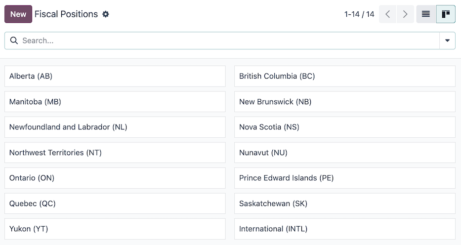
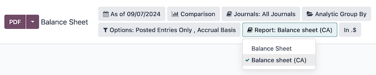
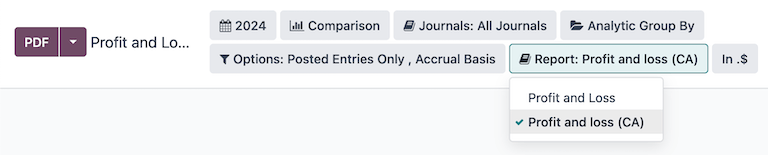

# Canada

The Odoo Canada localization package provides tailored features and configurations for Canadian
businesses.

A series of videos on the subject of Accounting are available through Odoo's eLearning platform.
These videos cover how to start from scratch, set up configurations, complete common workflows, and
provide in-depth looks at some specific use cases.

#### SEE ALSO
- [Odoo Tutorials: Accounting & Invoicing](https://www.odoo.com/slides/accounting-and-invoicing-19)
- [Odoo SmartClass: Accounting](https://www.odoo.com/slides/smartclass-accounting-121)

## Cấu hình

Below are the available modules in Odoo for accounting use in Canada.

### Modules installation

[Install](../../general/apps_modules.md#general-install) the following modules to get all the features of the Canadian
localization:

| Tên                         | Tên kỹ thuật             | Mô tả                                                                                                                                                                                                                                                                                                                                                                                                                                                                                                                                                                                             |
|-----------------------------|--------------------------|---------------------------------------------------------------------------------------------------------------------------------------------------------------------------------------------------------------------------------------------------------------------------------------------------------------------------------------------------------------------------------------------------------------------------------------------------------------------------------------------------------------------------------------------------------------------------------------------------|
| Canada - Kế toán            | `l10n_ca`                | Base accounting module for Canadian localization.                                                                                                                                                                                                                                                                                                                                                                                                                                                                                                                                                 |
| Canada - Accounting Reports | `l10n_ca_reports`        | Adds Canadian accounting reports.                                                                                                                                                                                                                                                                                                                                                                                                                                                                                                                                                                 |
| Canadian Checks Layout      | `l10n_ca_check_printing` | Enables the printing of payments on pre-printed check paper. Supports the three most common check formats and works natively with the linked checks from [checkdepot.net](https://checkdepot.net/collections/computer-checks/Odoo).  - [Check on top: Quicken / QuickBooks standard](https://checkdepot.net/collections/computer-checks/odoo+top-check) - [Check on middle: Peachtree standard](https://checkdepot.net/collections/computer-checks/odoo+middle-check) - [Check on bottom: ADP standard](https://checkdepot.net/collections/computer-checks/odoo+Bottom-Check) |

## Hệ thống tài khoản

The [chart of accounts (COA)](../accounting/get_started/chart_of_accounts.md) for the Canadian
localization, in Odoo, has accounts grouped into seven main categories, with corresponding numeric
values that prefix individual journal entries:

- **Receivable**: the balance of money (or credit) due to the business for goods or services
  delivered or used, but not yet paid for by customers.  is indicated by the journal code
  labeled (or beginning) with 1.
- **Payable**: the business's short-term obligations owed to its creditors or suppliers, which have
  not yet been paid.  is indicated by the journal code labeled (or beginning) with
  2.
- **Equity**: the amount of money that would be returned to a company's shareholders if all of the
  assets were liquidated and all of the company's debt was paid off in the case of liquidation.
  Equity is indicated by the journal code labeled (or beginning) with 3 or
  9.
- **Assets**: items listed on the balance sheet that contains economic value or have the ability to
  generate cash flows in the future, such as a piece of machinery, a financial security, or a
  patent. Assets are indicated by the journal code labeled (or beginning) with 1.
- **Liability**: refers to a company's financial debts or obligations that arise during the course
  of business operations. Liabilities are indicated by the journal code labeled (or beginning) with
  2.
- **Income**: synonymous with *net income*, this is the profit a company retains after paying off
  all relevant expenses from sales revenue earned. Income is indicated by the journal code labeled
  (or beginning) with 4 or 6.
- **Expenses**: the cost of operations that a company incurs to generate revenue. Expenses are
  indicated by the journal code labeled (or beginning) with a 6.

#### SEE ALSO
- [Hệ thống tài khoản](../accounting/get_started/chart_of_accounts.md)
- [Accounting cheat sheet](../accounting/get_started/cheat_sheet.md)

## Fiscal positions

Canadian tax rates and taxable items vary by province and territory. Default fiscal positions are
automatically created when the Odoo **Accounting** application is installed. To manage or configure
additional fiscal positions, navigate to Accounting ‣ Configuration ‣ Fiscal
Positions.

The following fiscal positions are available by default:

- Alberta (AB)
- British Columbia (BC)
- Manitoba (MB)
- New Brunswick (NB)
- Newfoundland and Labrador (NL)
- Nova Scotia (NS)
- Lãnh thổ Tây Bắc (NT)
- Nunavut (NU)
- Ontario (ON)
- Prince Edward Islands (PE)
- Quebec (QC)
- Saskatchewan (SK)
- Yukon (YT)
- Quốc tế (INTL)

#### NOTE
When considering what taxes to be applied, it is the province where the delivery occurs that
matters. Therefore, delivery is the responsibility of the vendor and is accounted for at the
customer location.

#### SEE ALSO
[Fiscal positions (tax and account mapping)](../accounting/taxes/fiscal_positions.md)

## Thuế

In Canada, tax rates and what is considered taxable vary by province and territory. Default *Sales*
and *Purchases* taxes are created automatically when the Odoo **Accounting** application is
installed. To manage existing or configure additional taxes, navigate to Accounting
‣ Configuration ‣ Taxes.

### AvaTax

**Avalara AvaTax** is a cloud-based tax calculation and compliance software that integrates with
Odoo for several localizations, including Canada. Integrating AvaTax with Odoo provides real-time
and region-specific tax calculations when items are sold, purchased, and invoiced in the database.

#### IMPORTANT
AvaTax is available for integration with databases/companies that have locations in Canada and/or
the United States. Reference the [Fiscal country](../accounting/taxes/avatax.md#avatax-fiscal-country) documentation for more information.

#### SEE ALSO
Refer to the documentation articles below to integrate and configure an AvaTax account with an
Odoo database:

- [Tích hợp AvaTax](../accounting/taxes/avatax.md)
- [Avalara management portal](../accounting/taxes/avatax/avalara_portal.md)
- [Calculate taxes with AvaTax](../accounting/taxes/avatax/avatax_use.md)
- Avalara's support documents: [About AvaTax](https://community.avalara.com/support/s/document-item?language=en_US&bundleId=dqa1657870670369_dqa1657870670369&topicId=About_AvaTax.html&_LANG=enus)

## Báo cáo

A number of [report selections](../accounting/reporting.md) are readily available for the
Canadian localization, under the Accounting app ‣ Reporting drop-down menu:

- [Balance Sheet](../accounting/reporting.md#accounting-reporting-balance-sheet): a "snapshot" of a company's financial
  position at a specific point in time, which contains an overview of a company's assets,
  liabilities, and equity.

  Be sure to select the Balance sheet (CA) option from the <i class="fa fa-book"></i>
  Report filter.
  
- [Profit & Loss](../accounting/reporting.md#accounting-reporting-balance-sheet): otherwise known as a *P&L statement* or
  *income statement*, provides a summary of a company's revenues, expenses, and profits/losses over
  a given period of time.

  Be sure to select the Profit and loss (CA) option from the <i class="fa fa-book"></i>
  Report filter.
  
- Cash Flow Statement: shows how much cash and cash equivalents a company has received
  and spent in a given period.
- [Executive Summary](../accounting/reporting.md#accounting-reporting-executive-summary): an overview report that covers
  the key performance indicators of a company's financial position, such as revenue, profit, and
  debt.
- [Báo cáo thuế](../accounting/reporting.md#accounting-reporting-tax-report): một biểu mẫu chính thức được nộp cho cơ quan thuế, báo cáo thu nhập, chi phí và các thông tin thuế liên quan khác. Báo cáo thuế cho phép người nộp thuế tính toán nghĩa vụ thuế của mình, lên lịch thanh toán thuế hoặc yêu cầu hoàn thuế nếu đã nộp thừa. Trong Odoo, báo cáo thuế có thể được lập theo tháng, hai tháng một lần, hàng quý, 4 tháng một lần, nửa năm một lần hoặc hàng năm.

#### SEE ALSO
- [Báo cáo kế toán](../accounting/reporting.md)
- [Tìm kiếm, lọc, và nhóm bản ghi](../../essentials/search.md)

## Cash discount

Cash discounts can be configured from Accounting app ‣ Payment Terms. Each
payment term can be set up with a cash discount and reduced tax.

#### SEE ALSO
[Cash discounts and tax reduction](../accounting/customer_invoices/cash_discounts.md)

## Writing checks

The Canadian localization allows users to print checks for vendor payments. Be sure the *Canadian
Checks Layout* (`l10n_ca_check_printing`) module for the CA localization is [installed](../../general/apps_modules.md#general-install).

To enable check printing from Odoo, navigate to Accounting ‣ Configuration ‣
Settings and find the Vendor Payments section. From here, tick the Checks
checkbox to reveal several fields for check configuration.

Select a Check Layout from the drop-down menu:

- Print Check (Top) - CA
- Print Check (Middle) - CA
- Print Check (Bottom) - CA

Next, choose whether or not to enable the Multi-Pages Check Stub checkbox.

Optionally set a Check Top Margin, Check Left Margin, or Check
Right Margin if required.

Tick the Print Date Label checkbox if a date label is required.

Once all check configurations are complete, Save the settings.

#### SEE ALSO
[Pay by checks](../accounting/payments/pay_checks.md)

## Receive pre-authorized debits

Pre-authorized debits are a method for receiving payments from customers, where the customer
authorizes the business to withdraw funds from their bank account on a recurring basis. This
functionality is commonly used for subscriptions, recurring invoices, and other regular payments.

In the Odoo Canadian localization, pre-authorized debits are facilitated through an
[integration with Stripe](../payment_providers/stripe.md).

#### SEE ALSO
- [Setting up payment providers](../payment_providers.md)
- [Stripe's pre-authorized debit payments documentation](https://docs.stripe.com/payments/acss-debit)
