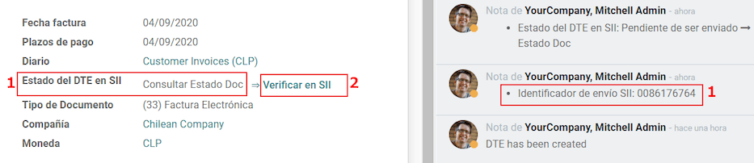
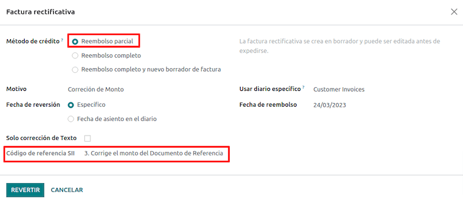
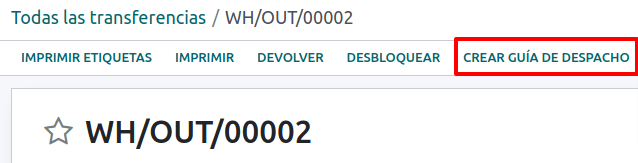
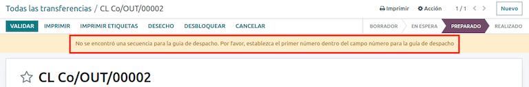
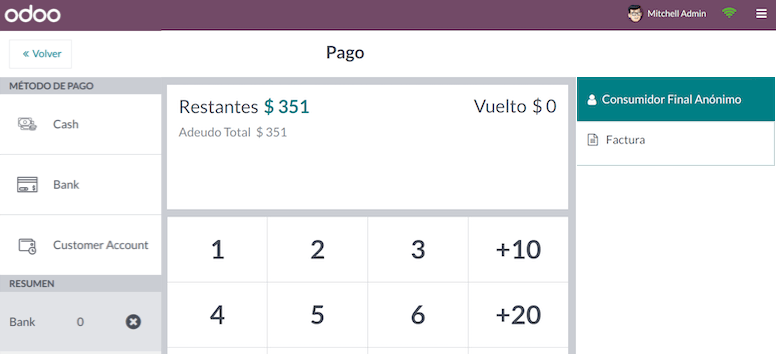
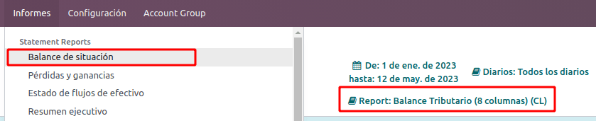

# Chile

#### SEE ALSO
- [Chilean localization app tour](https://www.youtube.com/watch?v=3qYkgbmBYHw)
- [Chilean localization smart tutorial](https://www.odoo.com/slides/smart-tutorial-localizacion-de-chile-131)

## Mô đun

[Install](../../general/apps_modules.md#general-install) the following modules to utilize all the features of the Chilean
localization.

| Tên                                   | Tên kỹ thuật          | Mô tả                                                                                                                                         |
|---------------------------------------|-----------------------|-----------------------------------------------------------------------------------------------------------------------------------------------|
| Chile - Kế toán                       | `l10n_cl`             | Adds the minimal accounting features required for a company to operate in Chile under the  regulations and guidelines.                    |
| Chile - Accounting Reports            | `l10n_cl_reports`     | Adds the *Propuesta F29* and *Balance Tributario (8 columnas)* reports.                                                                       |
| Chile - Hoá đơn điện tử               | `l10n_cl_edi`         | Includes all technical and functional requirements to generate and receive electronic invoices online based on the  regulations.          |
| Chile - Electronic Receipt            | `l10n_cl_boletas`     | Includes all technical and functional requirements to generate and receive electronic invoices digitally based on the  regulations.       |
| Electronic Exports of Goods for Chile | `l10n_cl_edi_exports` | Includes technical and functional requirements to generate electronic invoices for exporting goods based on the  and customs regulations. |
| Chile - E-Invoicing Delivery Guide    | `l10n_cl_edi_stock`   | Includes all technical and functional requirements to generate delivery guides via web service based on the  regulations.                 |

#### NOTE
- Odoo automatically installs the appropriate package for the company according to the country
  selected at the creation of the database.
- The *Chile - E-Invoicing Delivery Guide* module depends on the *Inventory* application.

#### IMPORTANT
All features are only available if the company already completed the [SII Sistema de Facturación
de Mercado](https://www.sii.cl/factura_electronica/factura_mercado/proceso_certificacion.htm)
certification process.

## Thông tin công ty

Navigate to Settings ‣ Companies: Update Info and ensure the following company
information is up-to-date and correctly filled in:

- Tên công ty
- Địa chỉ:
  - Đường
  - Thành phố
  - Tỉnh/TP
  - ZIP
  - Quốc gia
- Tax ID: enter the identification number for the selected [Taxpayer Type](#chile-fiscal-info).
- Activity Names: select up to four activity codes.
- Company Activity Description: enter a short description of the company's activity.

## Accounting settings

Next, navigate to Accounting ‣ Configuration ‣ Settings ‣ Chilean
Localization and follow the instructions to configure the:

- [Thông tin tài chính](#chile-fiscal-info)
- [Electronic invoice data](#chile-electronic-invoice)
- [DTE incoming email server](#chile-dte-email)
- [Chứng thư chữ ký](#chile-certificate)

### Fiscal information

Configure the following Tax payer information:

- Taxpayer Type by selecting the taxpayer type that applies:
  - VAT Affected (1st Category): for invoices that charge taxes to customers
  - Fees Receipt Issuer (2nd Category): for suppliers who issue fees receipt (Boleta)
  - End consumer: only issues receipts
  - Người nước ngoài
- SII Office: select your company's 
  regional office

### Electronic invoice data

Select your SII Web Services environment:

- SII - Test: for test databases using test  obtained from the . In this mode,
  the direct connection flows can be tested, with the files being sent to the .
- SII - Production: for production databases.
- SII - Demo Mode: files are created and accepted automatically in demo mode but are
  **not** sent to the . For this reason, rejection
  errors or *Accepted with Objections* will not appear in this mode. Every internal validation can
  be tested in demo mode. Avoid selecting this option in a production database.

Then, enter the Legal Electronic Invoicing Data:

- SII Resolution N°
- SII Resolution Date

## DTE incoming email server

The  Email Box Electronic Invoicing can
be defined to receive your customers' claim and acceptance emails. Enabling this option from
Accounting ‣ Configuration ‣ Settings ‣ Chilean Localization is necessary if
you want to use *Email Box Electronic Invoicing* as the  incoming email server.

#### IMPORTANT
In order to receive your SII documents, it's necessary to set up your own email server. More
information on how to do this can be found in this documentation:
[Communication in Odoo by email](../../general/email_communication/)

Begin by clicking Configure DTE Incoming Email, then click New to add a
server and fill in the following fields:

- Name: give the server a name.
- Server Type: select the server type used.
  - Máy chủ IMAP
  - Máy chủ POP
  - Local Server: uses a local script to fetch emails and create new records. The
    script can be found in the Configuration section with this option selected.
  - Gmail OAuth Authentication: requires your Gmail API credentials to be configured in
    the general settings. A direct link to the configuration can be found in the Login
    Information section.
- Máy chủ DTE: bật tùy chọn này. Khi chọn tùy chọn này, tài khoản email này sẽ được dùng để nhận hóa đơn điện tử từ nhà cung cấp và thông báo từ  về các hóa đơn điện tử đã phát hành. Trong trường hợp này, email này phải khớp với cả hai email đã khai báo trên trang  tại mục: *ACTUALIZACION DE DATOS DEL CONTRIBUYENTE*, *Mail Contacto SII* và *Mail Contacto Empresas*.

In the Server & Login tab (for IMAP and POP servers):

- Server Name: enter the hostname or IP of the server.
- Port: enter the server port.
- SSL/TLS: enable this option if connections are encrypted using the SSL/TLS protocol.
- Username: enter the server login username.
- Password: enter the server login password.

### Chứng chỉ

A digital certificate in `.pfx` format is required to generate the electronic invoice signature. To
add one, click Configure Signature Certificates under the Signature
Certificates section. Then, click New to configure the certificate:

- Certificate Key: click Upload your file and select the `.pfx` file.
- Certificate Passkey: enter the file's passphrase.
- Subject Serial Number: depending on the certificate format, the field might not be
  automatically populated. In that case, enter the certificate's legal representative .
- Certificate Owner: select one if you need to restrict the certificate for a specific
  user. Leave the field empty to share it with all billing users.

## Nhiều loại tiền tệ

The official currency rate is provided by [Chilean mindicador.cl](https://mindicador.cl). Navigate
to Accounting ‣ Configuration ‣ Settings ‣ Currencies: Automatic Currency
Rates to set an Interval for when the rate is automatically updated, or to select
another Service.

## Partner information

Configuring partner contacts is also required to send 
electronic invoices. Open the Contacts app to do so and fill in the following
fields on a new or existing contact form.

- Tên
- Email
- Identification Number
- Taxpayer Type
- Activity Description

In the Electronic Invoicing tab:

- DTE Email: enter the sender's email address for the partner.
- Delivery Guide Price: select which price the delivery guide displays, if any.

#### NOTE
The DTE Email is the email used for sending electronic documents and must be set in
the contact that will be part of an electronic document.

## Document types

Accounting documents are categorized by -defined
document types.

Document types are created automatically upon installation of the localization module, and can be
managed by navigating to Accounting ‣ Configuration ‣ Document Types.

#### NOTE
Several document types are inactive by default but can be activated by toggling the
Active option.

### Sử dụng trên hoá đơn

The document type on each transaction is determined by:

- The journal related to the invoice, identifying if the journal uses documents.
- The condition applied based on the type of issuer and recipient (e.g., the buyer or vendor's
  fiscal regime).

## Sổ nhật ký

*Sales journals* in Odoo usually represent a business unit or location.

For retail stores it is common to have one journal per .

The *purchase* transactions can be managed with a single journal, but sometimes companies use more
than one journal in order to handle some accounting transactions that are not related to vendor
bills. This configuration can easily be set by using the following model.

### Create a sales journal

To create a sales journal, navigate to Accounting ‣ Configuration ‣ Journals.
Then, click the New button, and fill in the following required information:

- Type: select Sale from the drop-down menu for customer invoice journals.
- Point of sale type: if the sales journal will be used for electronic documents, the
  option Online must be selected. Otherwise, if the journal is used for invoices
  imported from a previous system or if you are using the  portal *Facturación MiPyme*, you can use the option Manual.
- Use Documents: check this field if the journal will use document types. This field is
  only applicable to purchase and sales journals that can be related to the different sets of
  document types available in Chile. By default, all the sales journals created will use documents.

Next, from the Jounal Entries tab, define the Default Income Account and
Dedicated Credit Note Squence in the Accounting Information section.
Configuring these fields is required for one of the debit notes [use cases](#chile-use-cases).

## CAF

A *folio authorization code* (CAF) is required for each document type that will be issued
electronically. The  is a file the  provides to the issuer with the folios/sequences authorized for the electronic
invoice documents.

Your company can request multiple folios and obtain several 
linked to different folio ranges. These  are shared within
all journals, so you only need one active  per document type,
and it will be applied to all journals.

Please refer to the [SII documentation](https://palena.sii.cl/dte/mn_timbraje.html) to check the
details on how to acquire the  files.

#### IMPORTANT
The  required by the  are different from production to test (certification mode). Make sure you have the
correct  set depending on your environment.

### Upload CAF files

Sau khi đã lấy các tệp  từ cổng thông tin , bạn cần tải chúng lên cơ sở dữ liệu bằng cách đi đến Kế toán ‣ Cấu hình: SII Chile ‣ CAFs. Sau đó, nhấp vào Mới để bắt đầu cấu hình. Trên biểu mẫu , tải lên tệp  của bạn bằng cách nhấp vào nút Tải lên tệp và sau đó nhấp Lưu.

Once uploaded, the status changes to In Use. At this moment, when a transaction is used
for this document type, the invoice number takes the first folio in the sequence.

#### IMPORTANT
The document types have to be active before uploading the 
files. In case some folios have been used in the previous system, the next valid folio has to be
set when the first transaction is created.

## Hệ thống tài khoản

The chart of accounts is installed by default as part of the data set included in the localization
module. The accounts are mapped automatically in:

- Thuế
- Default Account Payable
- Default Account Receivable
- Tài khoản chuyển
- Tỷ giá hối đoái

#### SEE ALSO
[Hệ thống tài khoản](../accounting/get_started/chart_of_accounts.md)

## Thuế

As part of the localization module, taxes are created automatically with their related financial
account and configuration. These taxes can be managed from Accounting ‣
Configuration ‣ Taxes.

Chile has several tax types, the most common ones are:

- **VAT**: the regular VAT can have several rates.
- **ILA**: the tax for alcoholic drinks.

#### SEE ALSO
[Thuế](../accounting/taxes/)

## Usage and testing

### Electronic invoice workflow

In the Chilean localization, the electronic invoice workflow includes customer invoice issuance and
vendor bill reception. The following diagram explains how information is shared to the , customers, and vendors.

### Customer invoice emission

After the partners and journals are created and configured, the invoices are created in the standard
way. For Chile, one of the differences is the document type that is automatically selected based on
the taxpayer. The document type can be changed manually if needed on the invoice by navigating to
Accounting ‣ Customers ‣ Invoices.

#### IMPORTANT
Documents type 33 electronic invoice must have at least one item with tax, otherwise
the  rejects the document validation.

#### Validation and DTE status

Once all invoice information is filled, either manually or automatically when generated from a sales
order, validate the invoice. After the invoice is posted:

- The  file is created automatically and recorded
  in the chatter.
- The  
  status is set as Pending to be sent.
  

The  status is updated automatically by Odoo with a
scheduled action that runs every day at night, if the response from the  is needed immediately, you can do it manually as well by following the
 status workflow:

1. Bước đầu tiên là gửi  đến . Việc này có thể được thực hiện thủ công bằng cách nhấp vào nút Enviar Ahora. Hành động này sẽ tạo một SII Tack number cho hóa đơn, được sử dụng để kiểm tra thông tin chi tiết do  gửi qua email. Sau đó, trạng thái DTE sẽ được cập nhật thành Yêu cầu trạng thái.
2. Once the  response is received, Odoo updates the
   DTE status. To do it manually, click on the button Verify on SII. The
   result can either be Accepted, Accepted With Objection or
   Rejected.
   

   #### IMPORTANT
   There are intermediate statuses in the  before
   acceptance or rejection. It's recommended to **NOT** continuously click Verify in
   SII for smooth processing.
   
3. The final response from the  can take on one of these
   values:
   - Accepted: indicates the invoice information is correct, our document is now
     fiscally valid and it's automatically sent to the customer.
   - Accepted with objections: indicates the invoice information is correct, but a minor
     issue was identified, nevertheless the document is now fiscally valid and it's automatically
     sent to the customer.
   - Rejected: indicates the invoice information is incorrect and must be corrected.
     Details are sent to emails you registered in the .
     If it is properly configured in Odoo, the details are also retrieved in the chatter once the
     email server is processed.

     If the invoice is rejected please follow these steps:
     1. Change the document to Draft.
     2. Make the required corrections based on the message received from the  in the chatter.
     3. Post the invoice again.

     

#### Crossed references

Khi hóa đơn được tạo từ một tài liệu tài chính khác, thông tin liên quan đến tài liệu gốc phải được ghi nhận trong tab Tham chiếu chéo. Tab này thường được sử dụng cho giấy báo có hoặc nợ, nhưng trong một số trường hợp, nó cũng có thể được sử dụng cho hóa đơn bán hàng. Đối với giấy báo có và nợ, Odoo sẽ tự động thiết lập thông tin này.

#### Báo cáo hoá đơn PDF

Once the invoice is accepted and validated by the  and
the PDF is printed, it includes the fiscal elements that indicate that the document is fiscally
valid.

#### IMPORTANT
If you are hosted in Odoo SH or On-Premise, you should manually install the [pdf417gen](https://pypi.org/project/pdf417gen/) library. Use the following command to install it:
**pip install pdf417gen**.

#### Commercial validation

Once the invoice has been sent to the customer:

1. DTE Partner Status changes to Sent.
2. The customer must send a reception confirmation email.
3. Subsequently, if commercial terms and invoice data are correct, an acceptance confirmation is
   sent; otherwise, a claim is sent.
4. The field DTE Acceptance Status is updated automatically.

#### Processed for claimed invoices

Once the invoice has been accepted by the , **it can not
be cancelled in Odoo**. In case you get a claim for your customer, the correct way to proceed is
with a credit note to either cancel the invoice or correct it. Please refer to the
[Giấy báo có](#chile-credit-notes) section for more details.

#### Common errors

There are multiple reasons behind a rejection from the ,
but these are some of the common errors you might have and how to solve them:

- **Error:** `RECHAZO- DTE Sin Comuna Origen`
   
  **Hint:** make sure the company address is properly filled including the state and city.
   
- **Error:** `en Monto - IVA debe declararse`
   
  **Hint:** the invoice lines should include one VAT tax, make sure you add one on each invoice
  line.
   
- **Error:** `Rut No Autorizado a Firmar`
   
  **Hint:** the  entered is not allowed to invoice
  electronically, make sure the company  is correct and is valid
  in the  to invoice electronically.
   
- **Error:** `Fecha/Número Resolucion Invalido RECHAZO- CAF Vencido : (Firma_DTE[AAAA-MM-DD] -
  CAF[AAAA-MM-DD]) &gt; 6 meses`
   
  **Hint:** try to add a new CAF related to this document as the one you're using is expired.
   
- **Error:** `Element '{http://www.sii.cl/SiiDte%7DRutReceptor': This element is not expected.
  Expected is ( {http://www.sii.cl/SiiDte%7DRutEnvia ).`
   
  **Hint:** Make sure the field Document Type and VAT are set in the
  customer and in the main company.
   
- **Error:** `Usuario sin permiso de envio.`
   
  **Gợi ý:** lỗi này cho biết rằng rất có thể công ty của bạn chưa vượt qua [Quy trình chứng nhận](https://www.sii.cl/factura_electronica/factura_mercado/proceso_certificacion.htm) trong  - Sistema de Facturación de Mercado. Nếu đúng như vậy, vui lòng liên hệ với Chuyên viên Quản lý Tài khoản của bạn hoặc Đội ngũ Hỗ trợ Khách hàng vì chứng nhận này không phải là một phần của dịch vụ Odoo, nhưng chúng tôi có thể cung cấp cho bạn một số giải pháp thay thế. Nếu bạn đã vượt qua quy trình chứng nhận, lỗi này sẽ xuất hiện khi người dùng khác với chủ sở hữu chứng chỉ đang cố gắng gửi các tệp  đến .
   
- **Lỗi:** `CARATULA`
   
  **Hint:** there are just five reasons why this error could show up and all of them are related
  to the *Caratula* section of the XML:
   
  > - The company's  number is incorrect or missing.
  > - The certificate owner  number is incorrect or missing.
  > - The   number
  >   (this should be correct by default) is incorrect or missing.
  > - The resolution date is incorrect or missing.
  > - The resolution number is incorrect or missing.

### Giấy báo có

Khi cần hủy bỏ hoặc điều chỉnh một hóa đơn đã được xác nhận, bắt buộc phải tạo một giấy báo có. Lưu ý quan trọng rằng tệp  là bắt buộc đối với giấy báo có, được xác định là Loại tài liệu 61 trong hệ thống . Vui lòng tham khảo mục [Hướng dẫn CAF](#chile-caf-documentation) để biết thêm thông tin về quy trình tải  cho từng loại tài liệu.

#### Trường hợp vận dụng

##### Cancel referenced document

In case you need to cancel or invalidate an invoice, navigate to Accounting ‣
Customers ‣ Invoices and select the desired invoice. Then, use the button Add Credit
Note and select Full Refund, in this case the  reference code is automatically set to Anula Documento de referencia.

##### Correct referenced document

If a correction in the invoice information is required, for example the street name on the original
invoice is wrong, then use the button Add Credit Note, select Partial Refund
and select the option Only Text Correction. In this case the SII Reference
Code field is automatically set to Corrects Referenced Document Text.

Odoo creates a credit note with the corrected text in an invoice and Price `0.00`.

#### IMPORTANT
Make sure to define the Default Credit Account in the sales journal specifically for
this use case.

##### Corrects referenced document amount

When a correction on the amounts is required, use the button Add Credit note and select
Partial Refund. In this case the SII Reference Code is automatically set to
Corrige el monto del Documento de Referencia.

### Giấy báo nợ

In Chilean localization, debit notes, in addition to credit notes, can be created using the
Add Debit Note button, with two main use cases.

#### Trường hợp vận dụng

##### Add debt on invoices

The primary use case for debit notes is to increase the value of an existing invoice. To do so,
select option 3. Corrige el monto del Documento de Referencia for the
Reference Code SII field.

In this case Odoo automatically includes the Source Invoice in the Cross
Reference tab.

##### Huỷ giấy báo có

In Chile, debits notes are used to cancel a valid credit note. To do this, click the Add
Debit Note button and select the 1: Anula Documentos de referencia option for the
Reference Code SII field.

### Vendor bills

As part of the Chilean localization, you can configure your incoming email server to match the one
you have registered in the  in order to:

- Automatically receive the vendor bills  and
  create the vendor bill based on this information.
- Automatically send the reception acknowledgement to your vendor.
- Accept or claim the document and send this status to your vendor.

#### Reception

As soon as the vendor email with the attached  is
received:

1. The vendor bill maps all the information included in the XML.
2. An email is sent to the vendor with the reception acknowledgement.
3. The DTE Status is set as Acuse de Recibido Enviado.

#### Acceptation

If all the commercial information is correct on your vendor bill, then you can accept the document
using the Aceptar Documento button. Once this is done, the DTE Acceptation
Status changes to Accepted and an email of acceptance is sent to the vendor.

#### Nhận

In case there is a commercial issue or the information is not correct on your vendor bill, you can
claim the document before validating it, using the Claim button. Once this is done, the
DTE Acceptation Status changes to Claim and a rejection email is sent to the
vendor.

If you claim a vendor bill, the status changes from Draft to Cancel
automatically. Considering this as best practice, all the claimed documents should be canceled as
they won't be valid for your accounting records.

### Electronic purchase invoice

The *electronic purchase invoice* is a feature included in the `l10n_cl_edi` module.

Once all configurations have been made for [electronic invoices](#chile-electronic-invoice)
(e.g., uploading a valid company certificate, setting up master data, etc.), the electronic
purchase invoices need their own . Please refer to the
[CAF documentation](#chile-caf-documentation) to check the details on how to acquire the
 for electronic purchase invoices.

Electronic purchase invoices are useful when vendors are not obligated to expedite an electronic
vendor bill for your purchase. Still, your obligations require a document to be sent to the
 as proof of purchase.

#### Cấu hình

To generate an electronic purchase invoice from a vendor bill, the bill must be created in a
purchase journal with the *Use Documents* feature enabled. It is possible to modify an existing
purchase journal or create a new one in the following process.

To modify the existing purchase journal, or create a new purchase journal, navigate to
Accounting ‣ Configuration ‣ Journals. Then, click the New button,
and fill in the following required information:

- Type: select Purchase from the drop-down menu for vendor bill journals.
- Use Documents: check this field so the journal can generate electronic documents (in
  this case the electronic purchase invoice).

#### Generate an electronic purchase invoice

To generate this type of document, it is necessary to create a vendor bill in Odoo. To do so,
navigate to Accounting ‣ Vendors ‣ Bills, and click the New button.

When all of the electronic purchase invoice information is filled, select the option (46)
Electronic Purchase Invoice in the Document Type field:

After the vendor bill is posted:

- The  file (Electronic Tax Document) is
  automatically created and added to the chatter.
- The DTE SII Status is set as Pending to be sent.

Odoo automatically updates the *DTE Status* every night using a scheduled action. To get a response
from the  immediately, click the Send now to
SII button.

### Delivery guide

To install the Delivery Guide module, go to Apps and search for `Chile
(l10n_cl)`. Then click Install on the module Chile - E-Invoicing Delivery
Guide.

#### NOTE
Chile - E-Invoicing Delivery Guide has a dependency with Chile -
Facturación Electrónica. Odoo will install the dependency automatically when the
Delivery Guide module is installed.

The *Delivery Guide* module includes the ability to send the  to  and the stamp in PDF reports for
deliveries.

Once all configurations have been made for [electronic invoices](#chile-electronic-invoice)
(e.g., uploading a valid company certificate, setting up master data, etc.), delivery guides need
their own . Please refer to the [CAF documentation](#chile-caf-documentation) to check the details on how to acquire the  for electronic Delivery Guides.

Verify the following important information in the Price for the Delivery Guide
configuration:

- From Sales Order: delivery guide takes the product price from the sales order and
  shows it on the document.
- From Product Template: Odoo takes the price configured in the product template and
  shows it on the document.
- No show price: no price is shown in the delivery guide.

Electronic delivery guides are used to move stock from one place to another and they can represent
sales, sampling, consignment, internal transfers, and basically any product move.

#### Delivery guide from a sales process

#### WARNING
A delivery guide should **not** be longer than one page or contain more than 60 product lines.

When a sales order is created and confirmed, a delivery order is generated. After validating the
delivery order, the option to create a delivery guide is activated.

#### WARNING
When clicking on Create Delivery Guide for the first time, a warning message pops up,
stating the following:

`No se encontró una secuencia para la guía de despacho. Por favor, establezca el primer número
dentro del campo número para la guía de despacho`

Thông báo này yêu cầu người dùng chỉ định số thứ tự tiếp theo mà Odoo sẽ dùng để tạo hướng dẫn giao hàng (VD: số  khả dụng tiếp theo), và chỉ xuất hiện khi tạo hướng dẫn giao hàng lần đầu trong Odoo. Sau khi tài liệu đầu tiên được tạo thành công, Odoo sẽ tự động lấy số tiếp theo khả dụng trong file  để tạo các hướng dẫn giao hàng sau.

After the delivery guide is created:

- The  file (Electronic Tax Document) is
  automatically created and added to the chatter.
- The DTE SII Status is set as Pending to be sent.

The DTE Status is automatically updated by Odoo with a scheduled action that runs every
night. To get a response from the  immediately, press
the Send now to SII button.

Once the delivery guide is sent, it may then be printed by clicking on the Print Delivery
Guide button.

Delivery guide will have fiscal elements that indicate that the document is fiscally valid when
printed (if hosted in *Odoo SH* or on *On-premise* remember to manually add the
pdf417gen library mentioned in the [Invoice PDF report section](#chile-electronic-invoice-pdf-report)).

### Electronic receipt

To install the Electronic Receipt module, go to Apps and search for
`Chile (l10n_cl)`. Then click Install on the module Chile - Electronic
Receipt.

#### NOTE
Chile - Electronic Receipt has a dependency with Chile - Facturación
Electrónica. Odoo will install the dependency automatically when the E-invoicing
Delivery Guide module is installed.

Once all configurations have been made for [electronic invoices](#chile-electronic-invoice)
(e.g., uploading a valid company certificate, setting up master data, etc.), electronic receipts
need their own . Please refer to the [CAF documentation](#chile-caf-documentation) to check the details on how to acquire the  for electronic receipts.

Biên lai điện tử hữu ích khi khách hàng không cần hóa đơn điện tử. Theo mặc định, có một đối tác trong cơ sở dữ liệu tên Người tiêu dùng cuối cùng ẩn danh với  chung `66666666-6` và loại người nộp thuế là Người tiêu dùng cuối cùng. Đối tác này có thể được sử dụng cho biên lai điện tử hoặc có thể tạo bản ghi mới cho cùng mục đích.

Mặc dù biên lai điện tử thường được sử dụng cho người tiêu dùng cuối cùng với  chung, nhưng cũng có thể áp dụng cho các đối tác cụ thể. Sau khi tạo và cấu hình đối tác cùng sổ nhật ký, biên lai điện tử được tạo theo cách tiêu chuẩn như hóa đơn điện tử, nhưng cần chọn loại tài liệu (39) Biên lai điện tử trong biểu mẫu hóa đơn:

#### Validation and DTE status

When all of the electronic receipt information is filled, manually (or automatically) proceed to
validate the receipt from the sales order. By default, Electronic Invoice is selected as
the Document Type, however in order to validate the receipt correctly, make sure to edit
the Document Type and change to Electronic Receipt.

After the receipt is posted:

- The  file (Electronic Tax Document) is created
  automatically and added to the chatter.
- The DTE SII Status is set as Pending to be sent.

The DTE Status is automatically updated by Odoo with a scheduled action that runs every
day at night. To get a response from the  immediately,
press the Send now to SII button.

Please refer to the [DTE Workflow](#chile-electronic-invoice-validation) for electronic
invoices as the workflow for electronic receipt follows the same process.

### Electronic export of goods

To install the Electronic Exports of Goods module, go to Apps and
search for `Chile (l10n_cl)`. Then click Install on the module Electronic
Exports of Goods for Chile.

#### NOTE
Chile - Electronic Exports of Goods for Chile has a dependency with Chile
- Facturación Electrónica.

Once all configurations have been made for [electronic invoices](#chile-electronic-invoice)
(e.g., uploading a valid company certificate, setting up master data, etc.), electronic exports of
goods need their own . Please refer to the [CAF
documentation](#chile-caf-documentation) to check the details on how to acquire the  for electronic receipts.

Electronic invoices for the export of goods are tax documents that are used not only for the
 but are also used with customs and contain the
information required by it.

#### Contact configurations

#### Chilean customs

When creating an electronic exports of goods invoice, these new fields in the Other Info
tab are required to comply with Chilean regulations.

#### Báo cáo PDF

Once the invoice is accepted and validated by the  and
the PDF is printed, it includes the fiscal elements that indicate that the document is fiscally
valid and a new section needed for customs.

### eCommerce electronic invoicing

To install the Chilean eCommerce module, go to Apps, search for the
module by its technical name \`l10n_cl_edi_website_sale, and click the Activate button.

This module enables the features and configurations to:

- Generate electronic documents from the *eCommerce* application
- Support for required fiscal fields in the *eCommerce* application
- Effectively let the final client decide the electronic document to be generated for their
  purchase

Once all of the configurations are made for the Chilean [electronic invoice](#chile-electronic-invoice) flow, the following configurations are required for the eCommerce flow
to be integrated.

To configure your website to generate electronic documents during the sale process, go to
Website ‣ Configuration ‣ Settings ‣ Invoicing and activate the
Automatic Invoice feature. Activating this feature allows electronic documents to be
automatically generated when an online payment is confirmed.

Since an online payment needs to be confirmed for the *automatic invoice* feature to generate the
document, a payment provider must be configured for the related website.

#### NOTE
Review the [Thanh toán online](../payment_providers/) documentation for information on which payment providers
are supported in Odoo, and how to configure them.

It is also recommended to configure your products so they are able to be invoiced when an online
payment is confirmed. To do so, go to Website ‣ eCommerce ‣ Products and select
the product template of the desired product. Then, set the Invoicing Policy to
Ordered quantities.

#### Chu trình lập hóa đơn

Clients from Chile will be able to select if they need an **invoice** or a **ballot** for their
purchase with an extra step added during the checkout process.

If the customer selects the Electronic Invoice option, fiscal fields are required to be
filled out, including the Activity Description, the Identification Number
and their DTE Email.

If the client selects the Electronic Receipts option, they will be directed to the next
step, and the electronic document will be generated for the *Consumidor Final Anónimo* contact.

Clients from countries other than Chile, will have their electronic receipts automatically generated
for them by Odoo.

#### NOTE
If a purchase through eCommerce requires an export, the customer will need to contact your
company to generate an electronic export invoice (*document type 110*), which can be done from
the *Accounting* app.

### Point of Sale electronic invoicing

To install the Chilean Module for Point of Sale, go to the Apps
application on the main Odoo dashboard, search for the module by its technical name
`l10n_cl_edi_pos`, and click the Activate button.

This module enables the following features and configurations to:

- Generate electronic documents from the *Point of Sale* application
- Support the required fiscal fields for contacts created in the *Point of Sale* application
- Effectively lets the final client decide the type of electronic document to be generated for their
  purchase
- Print QR or 5-digit codes in tickets to access to electronic invoices

To configure contacts with the required fiscal information, review the [partner information](#chile-partner-information) section, or directly modify a contact. Navigate to
Point of Sale ‣ Session ‣ Customers ‣ Details, and edit any of the following
fields:

- Tên
- Email
- Identification Type
- Tax Payer Type
- Type Giro
- Email DTE
- RUT

To configure the products, navigate to Point of Sale ‣ Products ‣ Products and
select a product record. In the Sales tab of the product form, it is necessary to mark
the product as Available for POS, this makes the product available for sale in the
*Point of Sale* app.

Optionally, the following features are available for configuration in the Point of
Sale ‣ Configuration ‣ Settings ‣ Bills & Receipts section:

- Use QR code on ticket: this feature enables a QR code to be printed on the user's
  receipt so they can easily request an invoice after their purchase
- Generate a code on ticket: this feature enables a 5-digit code to be generated on the
  receipt, allowing the user to request an invoice through the customer portal

#### Chu trình lập hóa đơn

The following sections cover the invoicing flows for the *Point of Sale* application.

##### Electronic receipts: anonymous end user

When making a purchase as an anonymous user that does not request an electronic invoice, Odoo
automatically selects Consumidor Final Anónimo as the contact for the order and
generates the electronic receipt.

#### NOTE
If the client requests a credit note due to a return of their purchase, the credit note should be
made using the *Accounting* app. See the [credit notes and refunds](../accounting/customer_invoices/credit_notes.md) documentation for detailed instructions.

##### Electronic receipts: specific customer

When specific user makes a purchase that does not request an electronic invoice, Odoo automatically
selects the contact for the order as the Consumidor Final Anónimo, and allows you to
select or create the required customer contact with their fiscal information for the receipt.

#### NOTE
If the client requests a credit note because of a return of this type of purchase, the credit
note and return process can be managed directly from the  session.

##### Hóa đơn điện tử

When clients request an electronic invoice, it is possible to select or create the required contact
with their fiscal information. When the payment is being made, select the option Invoice
to generate the document.

#### NOTE
For both the electronic receipts and invoices, if the product is not affected by taxes, Odoo
detects this and generates the correct type of document for tax-exempt sales.

##### Trả hàng

For electronic receipts (not generated for the *Consumidor Final Anónimo*) and electronic invoices,
it is possible to manage the process to return products sold in a  order
by selecting the Refund button.

Orders can be searched by the order status or by contact, and be selected for the refund to be based
on the client's original order.

When the return payment is validated, Odoo generates the necessary credit note, referencing the
original receipt or invoice, partially or fully canceling the document.

#### SEE ALSO
[Smart tutorial - Electronic invoicing for point of sale](https://www.youtube.com/watch?v=B2XuWmtlmno&t=360s).

## Báo cáo tài chính

### Balance tributario de 8 columnas

This report presents the accounts in detail (with their respective balances), classifying them
according to their origin and determining the level of profit or loss that the business had within
the evaluated period of time.

You can find this report in Accounting ‣ Reporting ‣ Balance Sheet and
selecting in the Report field the option Chilean Fiscal Balance (8 Columns)
(CL).

### Propuesta F29

The form *F29* is a new system that the  enabled to
taxpayers, and that replaces the *Purchase and Sales Books*. This report is integrated by Purchase
Register (CR) and the Sales Register (RV). Its purpose is to support the transactions related to
VAT, improving its control and declaration.

#### IMPORTANT
The *Propuesta F29 (CL)* report in Odoo covers the basic legal requirements as a first proposal
for your final tax declaration.

This record is supplied by the electronic tax documents (DTE's) that have been received by the
.

You can find this report in Accounting ‣ Reporting ‣ Tax Reports and selecting
the Report option Propuesta F29 (CL).

It is possible to set the  and the
Proportional Factor for the fiscal year from the Accounting ‣
Configuration ‣ Settings.

Or manually in the reports by clicking on the ✏️ (pencil) icon.

